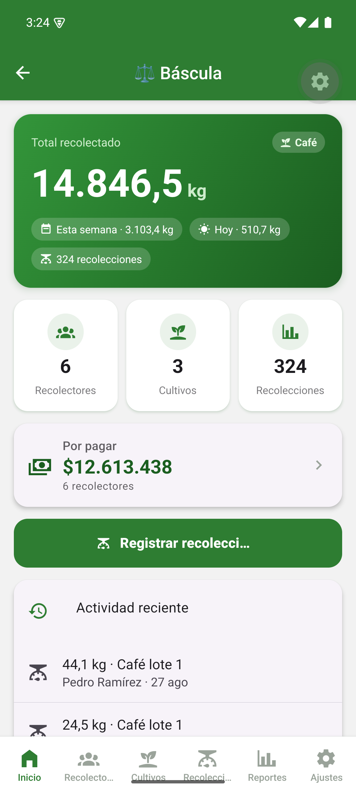
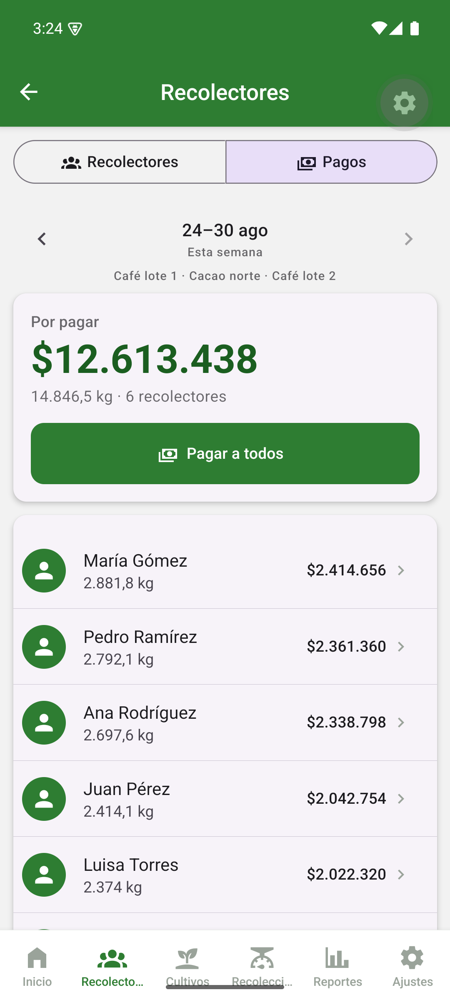
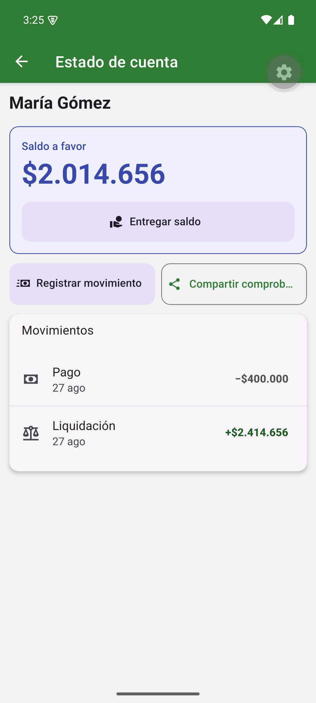
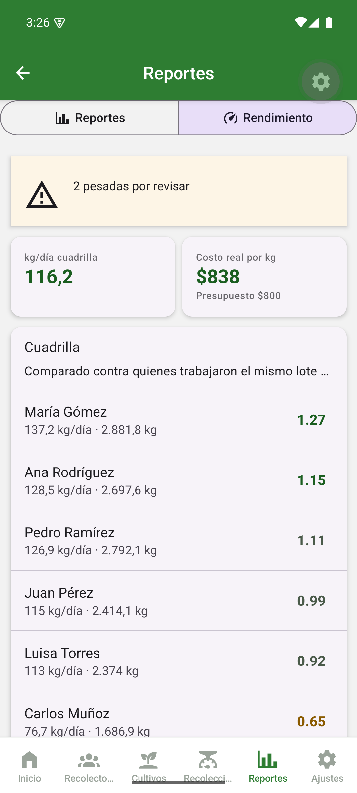
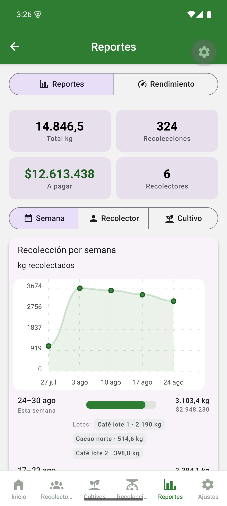
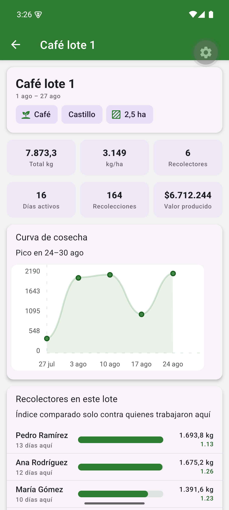

# ⚖️ Báscula

**Harvest control and payroll for farms.** Track how much each worker harvests by plot and by week, settle and pay them — in full or in part, with the rest kept as their credit balance — and see who is really performing, all from your phone, offline.

A modern rebuild of the original app (React Native 0.49 / Realm, 2017) on **Expo SDK 57 + TypeScript + SQLite**. Runs on iOS and Android.

<p align="center">
  
  
  
  
</p>
<p align="center">
  
  
</p>

---

## ✨ Features

- **📊 Dashboard** with total harvest, this-week and today totals, quick links and recent activity.
- **👥 Workers** with photo (gallery or camera), document and RFID tag/card.
- **🌱 Crops by type** — Coffee, Cacao, Plantain, Avocado, Orange, Sugarcane… Each type brings its **default units** (unit of measure + yield unit).
- **⚖️ Fast pickup registration**: pick a worker, a plot and the weight.
- **📈 Reports with charts** grouped by **week**, **worker** or **crop**:
  - Week → line chart + **breakdown of which plots were harvested each week**.
  - Worker / Crop → bar chart.
  - Each row shows kg **and its cost**; a **payout** total applying the weekly costs.
- **👤 Per-worker detail** (tap a person): total, kg/day, active days, what they are owed, performance by week and by crop, plus history.
- **💰 Configurable costs**: a general cost per unit + **weekly overrides** that supersede it.

### 💵 Payments

- **Settle and pay** a week, in full or in part. Whatever the worker leaves behind becomes their **credit balance** — money they keep with the farm.
- **Pay everyone** in one go, with a 15-second **undo** for the whole run.
- **Advances** and typed **deductions** (meals, lodging, tools, store, or a concept you name), netted against the next settlement.
- **Account statement** per worker: credit balance and every movement, from a ledger where nothing is edited or deleted — a mistake is cancelled by its opposite.
- **Receipt** in plain text to share over WhatsApp, broken down week by week so the worker can check their own weights.
- Settlements can be **voided**; their lines are kept for the record and their pickups go back to pending.

### 📊 Performance

- **Comparative index**: each worker against whoever worked the **same plot the same day** — the only fair baseline, since a ripe plot yields more. Needs at least three mates that day, and says so when it cannot compare.
- **kg/day**, **kg/hectare** per plot, harvest curve and peak week.
- **Real cost per unit** from the ledger — the price frozen at settlement plus adjustments — not weight × today's price.
- **Price vs. output**: whether raising the rate actually bought more harvest.
- **Pickups to review**: impossible weights, double registrations, a typed extra zero, dates in the future. Explainable rules, no model. Each one can be corrected or discarded.
- **🌐 Multi-language**: English · Español · Português (switches live from Settings).
- **🗑️ Safe delete**: workers are removed with **confirmation** and **soft-delete**, keeping their harvest history.
- **🧪 Demo data**: one button seeds workers, crops and 4 weeks of pickups to try the app.

## 🛠️ Stack

| Area | Technology |
|------|------------|
| Framework | [Expo](https://expo.dev) SDK 57 · React Native · TypeScript |
| Navigation | React Navigation (bottom-tabs + native-stack) |
| UI | react-native-paper (Material 3) · @expo/vector-icons |
| Database | expo-sqlite (local, offline) |
| Charts | react-native-chart-kit · react-native-svg |
| Photos | expo-image-picker |

## 🚀 Development

Requirements: Node 18+, the **Expo Go** app on a simulator or device.

```bash
npm install
npx expo start        # then press i (iOS) or a (Android), or scan the QR with Expo Go
```

On first run the local database and a default configuration (Coffee) are created. Go to **Settings → Demo data → Load demo** to fill the app with sample data.

## 🗂️ Structure

```
App.tsx                  Navigation (tabs + stack), theme and i18n provider
src/
  db.ts                  SQLite data layer: pickups, settlements, ledger,
                         balances, reports, performance and review rules
  i18n.tsx               Translations EN / ES / PT, language context, and the
                         money/date formatters
  receipt.ts             Plain-text payment receipt
  cropTypes.ts           Crop-type presets and their units
  types.ts               Navigation route types
  screens/
    Home.tsx             Dashboard, with what is pending to pay
    People.tsx           Workers list + Payments switch
    PeopleAdd.tsx        Add a worker with photo
    WorkerDetail.tsx     Per-worker performance
    PaymentsPanel.tsx    Weekly payments: totals, pay everyone, credit balances
    PayWorker.tsx        Settle and pay one worker, in full or in part
    Account.tsx          Account statement and ledger movements
    Adjust.tsx           Advances and deductions
    Crops.tsx            Crops list
    CropAdd.tsx          Add a crop (pick type → default units)
    CropDetail.tsx       Per-plot detail: yield, curve, who worked it
    RegisterPickup.tsx   Pickup registration
    Reports.tsx          Reports with charts + Performance switch
    PerformancePanel.tsx Comparative index, plots, real cost, review
    Settings.tsx         Crop type, units, weekly costs, language, demo
```

## 🧭 Data model

- **people** — workers (with `deletedAt` for soft-delete).
- **crops** — plots/crops (type, variety, area; also soft-deleted).
- **pickups** — each weigh-in: worker + crop + weight + date.
- **config** — active crop, unit, yield unit, general cost, language.
- **cost_overrides** — a specific cost per unit for a given week.
- **settlements** / **settlement_items** — the settlement document and its
  lines, with the price frozen at the moment of settling. A unique index over
  the live lines is what stops a pickup being paid twice.
- **ledger** — the single source of truth for balances. Every movement is an
  event (earning, payment, advance, deduction, adjustment, reversal) with a
  sign: positive means the farm owes the worker, so a positive balance is
  their credit. Rows are never edited or deleted.

Money is stored as **integer cents**; a balance that carries over for months
would drift with floating point.

Weeks are keyed by their **Monday** (`YYYY-MM-DD`). The obvious `%Y-W%W` label
splits a week straddling new year into two, and cannot be rendered as a date
range. Days and weeks are derived in **local time**: a pickup logged at 19:30
in Colombia is stored as the next day in UTC.

## 📌 Notes

- All data is stored **locally** on the device (SQLite) and the app works **offline**.
- Schema migrations are versioned with `PRAGMA user_version`; `initDb` is
  guarded so a failed migration can never leave the app unable to start.
- Integration with a **Bluetooth (BLE) scale** is planned as a second stage (requires an Expo development build).

## 📄 License

MIT
