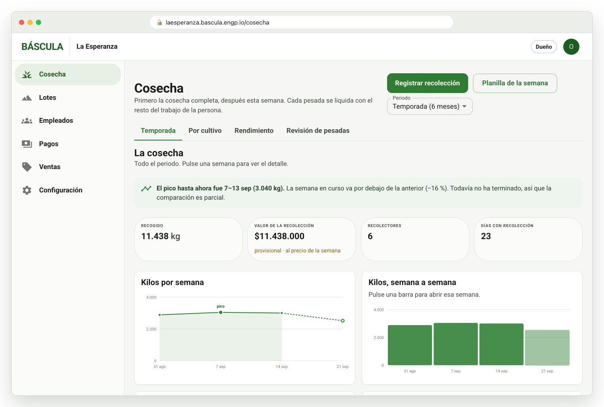
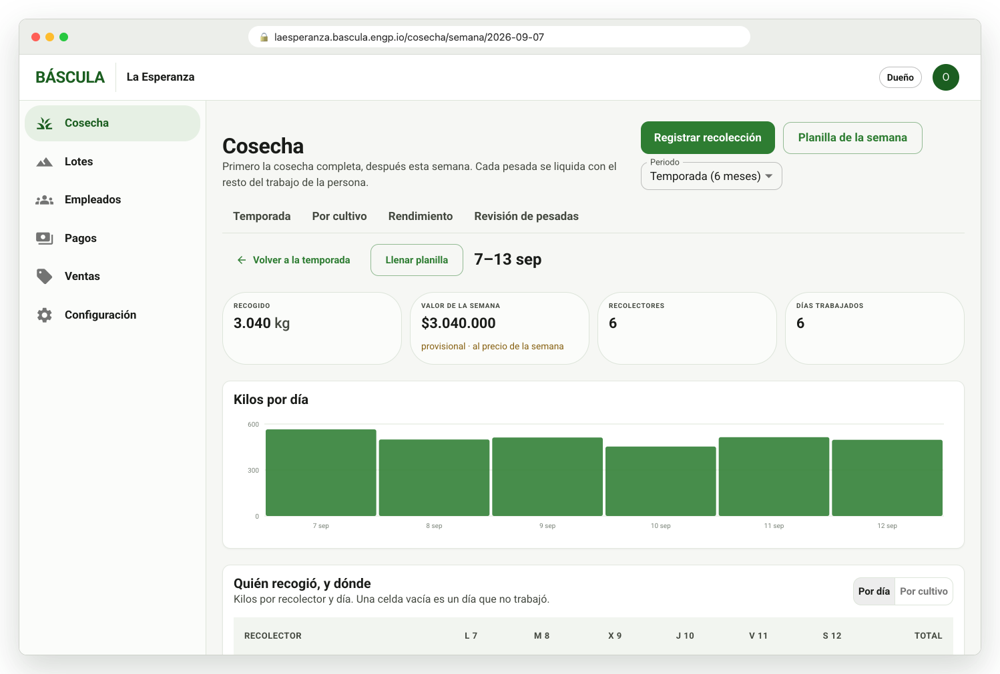
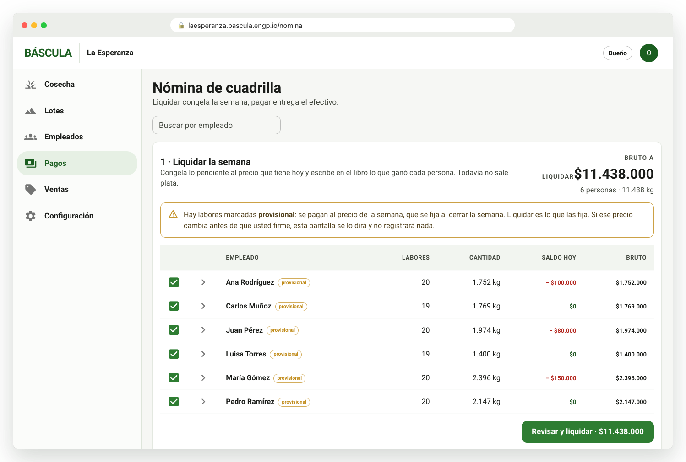
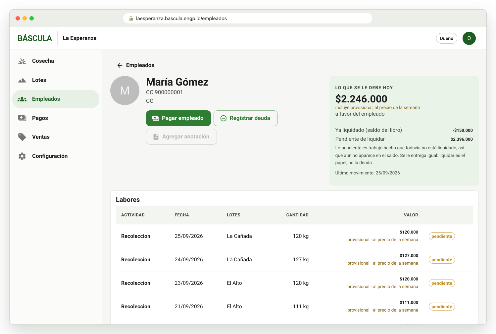
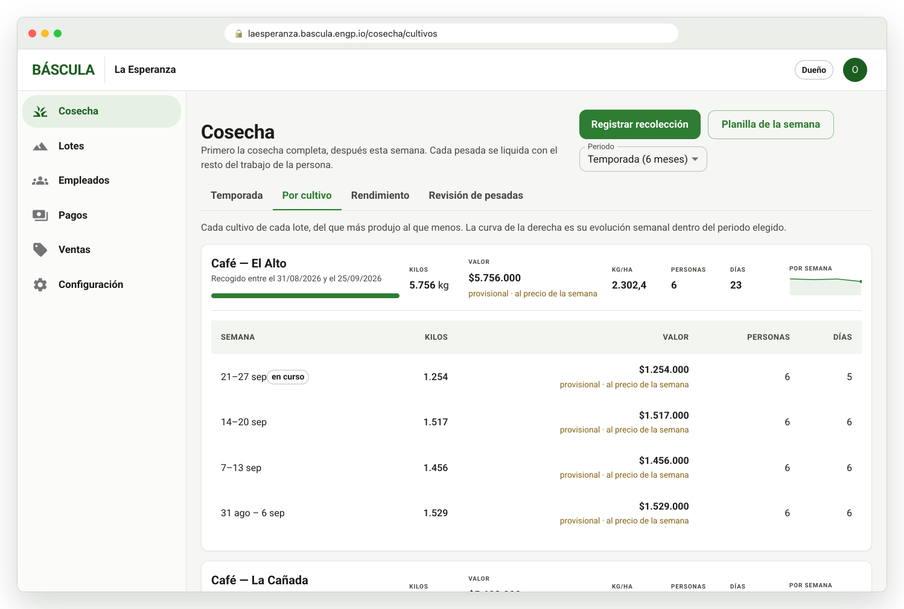

# ⚖️ Báscula

**Harvest weighing, payroll and profitability for coffee farms, as a web app.**
Open it in the browser on a phone or a computer at your farm's address
(`{finca}.bascula.engp.io`). There is nothing to install, and it can be added to
the phone's home screen. The person at the scale records each weighing on the
phone, even with no signal: weighings wait on the device and upload on their
own. The office reviews the harvest, settles, and pays from the same address.

Live at **[bascula.engp.io](https://bascula.engp.io)**. The interface is in
plain Spanish, built for people around fifty who don't live in software.

<p align="center">
  
</p>
<p align="center">
  
  
  
  
</p>

<sub>Screens use demo data. More in [`docs/screenshots`](docs/screenshots/README.md).</sub>

## Features

The day-to-day flows (weigh-in at the scale, planilla from paper, the
harvest dashboard, paying per kilo) are described in
[`docs/use-cases.md`](docs/use-cases.md).

- **A simple harvest home.** `/cosecha` shows this week in big figures (kilos,
  value, pickers, kilos per day) and two big buttons: «Registrar la semana» and
  «Registrar una recolección». The detailed reports sit behind «Ver más
  detalles».
- **Weighing at the scale.** A phone-first screen with a person, the lot as a
  big button, Hoy / Ayer / Otro día, and the kilos. It asks before saving an
  implausible weight, and «Deshacer» undoes the last one. It works without
  signal: the queue shows «N pesadas por subir» and uploads on its own. Each
  weighing carries a client-minted id, so a resend is never counted twice.
- **Weekly sheet** («Registrar la semana») for recording a whole crew and a
  week at once: a grid with totals on a computer, one day at a time with big
  boxes on a phone, and a confirmation before saving.
- **Harvest reports.** Season curve, week detail (kilos per picker and day or
  per crop), yield per lot and crop, a comparative performance index, and a
  review of suspicious weighings.
- **Money.** Weekly price per kilo, settlements that freeze the price, and
  paying one worker or the whole crew. Advances, deductions and adjustments go
  in an append-only ledger. Printed receipts and payroll sheets; receipts can
  also go by WhatsApp.
- **Farm administration.** Workers (with a camera photo), lots with a map
  point, activities and work units, inventory, sales, expenses, users and
  roles (owner, administrator, weigher).
- **CSV export** of weighings, money movements and balances. A **demo-data**
  button fills an empty farm to try the product.
- **Multi-tenant**: every farm gets its own subdomain. A super-admin
  provisions and suspends farms.
- **An MCP server** exposes the API as read-only tools for ChatGPT, Claude and
  other assistants, limited to what the user's role may see
  ([details](services/api/README.md#mcp--the-api-as-tools-for-an-assistant)).

## Architecture

```
 Phone / computer browser
   └─ apps/web          React + TypeScript + MUI, installable PWA
        │                service worker (app shell) + IndexedDB (offline weighings)
        │ HTTPS, same origin: {finca}.bascula.engp.io/v1/…
   services/api          Go (chi, pgx, goose), multi-tenant REST + MCP
        │
   PostgreSQL 17 + PostGIS   row-level security per farm (CloudNativePG)

 All of it on Kubernetes: Gateway API (Cilium) behind a Cloudflare tunnel,
 Argo CD from the gitops repo.
```

| Piece | What it is |
|---|---|
| [`apps/web`](apps/web) | The web app (PWA): weighing (works offline), reports, workers, payroll, payments, administration, super-admin |
| [`services/api`](services/api) | Go API: multi-tenant, row-level security, reports, uploads, MCP |
| [`packages/shared`](packages/shared) | Domain rules (money, weeks, enums) and the golden money cases the API is tested against |
| [`manifests`](manifests) | Kustomize for dev and production |

## Development

Requirements: Node 24+, Go 1.26, Docker (for Postgres).

```bash
npm install                              # every workspace, from the root
npm --workspace apps/web run dev         # http://localhost:5173, against an in-browser mock API
npm test                                 # packages/shared
npm run typecheck
npm --workspace apps/web test            # web unit tests (Vitest + MSW)
```

The web app starts on mock data by default (`VITE_USE_MOCKS=true` in
`apps/web/.env.development`) and says so on screen. Log in with
`oscar@laesperanza.co` / `esperanza`. To run it against the real API:

```bash
cd services/api
make up && make migrate   # Postgres + PostGIS on :5433
make dev                  # the API on :8099 (the web dev server proxies /v1 to it)
make test                 # Go suite against that Postgres
```

Then set `VITE_USE_MOCKS=false` and restart `npm run dev`. See
[`apps/web/README.md`](apps/web/README.md) and
[`services/api/README.md`](services/api/README.md).

## CI and deploy

- **CI** (`.github/workflows/ci.yml`) runs on every PR:
  - the migration order check;
  - the shared money rules;
  - web lint, tests and build;
  - typecheck;
  - the Go suite against PostGIS.
- **CD** (`cd.yml`) runs on each merge to `master`:
  - builds the images and tags a release;
  - deploys to **dev** (`bascula.int.dev.engp.io`) automatically;
  - deploys to **production** (`bascula.engp.io`) only after manual approval in
    the GitHub `production` environment.

  Details in [`manifests/README.md`](manifests/README.md).

## Legacy phone app

Báscula started as an offline-first Expo app. It was removed once the web app
covered it, offline weighing included, and its code is in the git history. The
server keeps `/v1/sync/*` and `/v1/import/season` so phones that still have it
installed can upload their season. Documents from that era are in
[`docs/archive`](docs/archive/README.md).

## Design notes

- [Use cases](docs/casos-de-uso.md): the owner's specification of the full scope.
- [API and auth design](docs/arquitectura-api.md): Go layout, REST contract,
  roles, and the cross-tenant worker registry.
- [Data model](docs/modelo-datos.md): the PostgreSQL schema and row-level security.
- [Owner decisions](docs/decisiones.md): the calls the team couldn't make on
  its own, with what each one costs.
- Diagrams: [system](docs/diagramas/sistema.md) · [web app](docs/diagramas/web.md)
- [Adversarial audits](docs/auditorias.md): what held, what broke, and what is still open.
- [Usability review](docs/usability.md)
- [Archive](docs/archive/README.md): sync protocol, the simplification
  proposal, the sprint 1 plan, and the mobile diagrams.

## 📄 License

MIT
