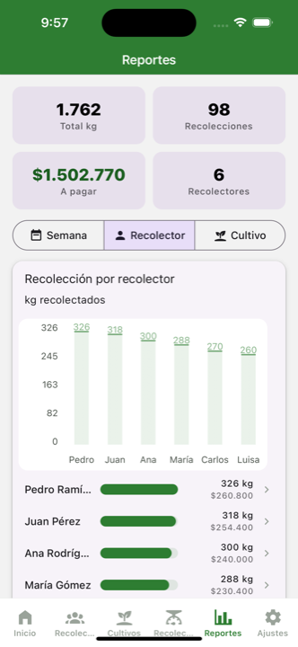
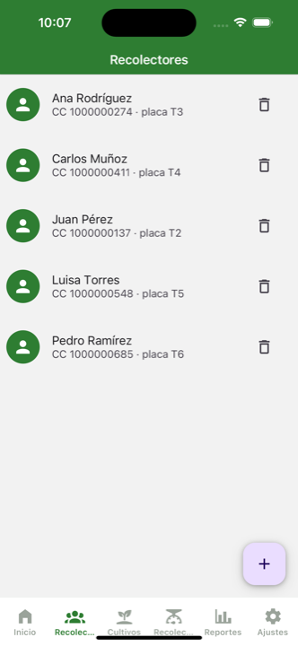

# ⚖️ Báscula

**Harvest (pickup) control for farms.** Track how much each worker harvests, by plot and by week, compute their pay from the cost per unit, and see reports with charts — all from your phone, offline.

A modern rebuild of the original app (React Native 0.49 / Realm, 2017) on **Expo SDK 57 + TypeScript + SQLite**. Runs on iOS and Android.

<p align="center">
  
  
  
  
</p>

---

## ✨ Features

- **📊 Dashboard** with total harvest, this-week and today totals, quick links and recent activity.
- **👥 Workers** with photo (gallery or camera), document and RFID tag/card.
- **🌱 Crops by type** — Coffee, Cacao, Plantain, Avocado, Orange, Sugarcane… Each type brings its **default units** (unit of measure + yield unit).
- **⚖️ Fast pickup registration**: pick a worker, a plot and the weight.
- **📈 Reports with charts** grouped by **week**, **worker** or **crop**:
  - Week → line chart + **breakdown of which plots were harvested each week**.
  - Worker / Crop → bar chart.
  - Each row shows kg **and its cost**; a **payout** total applying the weekly costs.
- **👤 Per-worker detail** (tap a person): total, average, active days, payout, performance by week and by crop, plus history.
- **💰 Configurable costs**: a general cost per unit + **weekly overrides** that supersede it.
- **🌐 Multi-language**: English · Español · Português (switches live from Settings).
- **🗑️ Safe delete**: workers are removed with **confirmation** and **soft-delete**, keeping their harvest history.
- **🧪 Demo data**: one button seeds workers, crops and 4 weeks of pickups to try the app.

## 🛠️ Stack

| Area | Technology |
|------|------------|
| Framework | [Expo](https://expo.dev) SDK 57 · React Native · TypeScript |
| Navigation | React Navigation (bottom-tabs + native-stack) |
| UI | react-native-paper (Material 3) · @expo/vector-icons |
| Database | expo-sqlite (local, offline) |
| Charts | react-native-chart-kit · react-native-svg |
| Photos | expo-image-picker |

## 🚀 Development

Requirements: Node 18+, the **Expo Go** app on a simulator or device.

```bash
npm install
npx expo start        # then press i (iOS) or a (Android), or scan the QR with Expo Go
```

On first run the local database and a default configuration (Coffee) are created. Go to **Settings → Demo data → Load demo** to fill the app with sample data.

## 🗂️ Structure

```
App.tsx                  Navigation (tabs + stack), theme and i18n provider
src/
  db.ts                  SQLite data layer (workers, crops, pickups, config, costs, reports)
  i18n.tsx               Translations EN / ES / PT + language context
  cropTypes.ts           Crop-type presets and their units
  types.ts               Navigation route types
  screens/
    Home.tsx             Dashboard
    People.tsx           Workers list (+ delete with confirmation)
    PeopleAdd.tsx        Add a worker with photo
    WorkerDetail.tsx     Detailed per-worker performance
    Crops.tsx            Crops list
    CropAdd.tsx          Add a crop (pick type → default units)
    RegisterPickup.tsx   Pickup registration
    Reports.tsx          Reports with charts (week / worker / crop)
    Settings.tsx         Crop type, units, weekly costs, language, demo
```

## 🧭 Data model

- **people** — workers (with `deletedAt` for soft-delete).
- **crops** — plots/crops (type, variety, area).
- **pickups** — each weigh-in: worker + crop + weight + date.
- **config** — active crop, unit, yield unit, general cost, language.
- **cost_overrides** — a specific cost per unit for a given week.

## 📌 Notes

- All data is stored **locally** on the device (SQLite) and the app works **offline**.
- Integration with a **Bluetooth (BLE) scale** is planned as a second stage (requires an Expo development build).

## 📄 License

MIT
