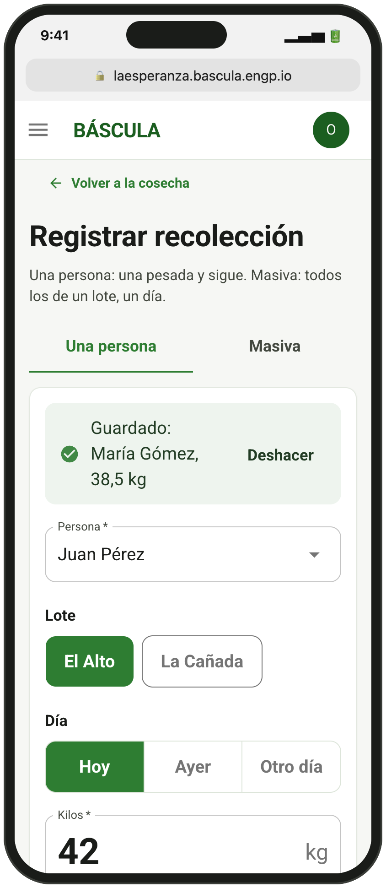
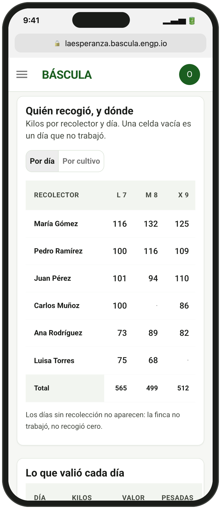
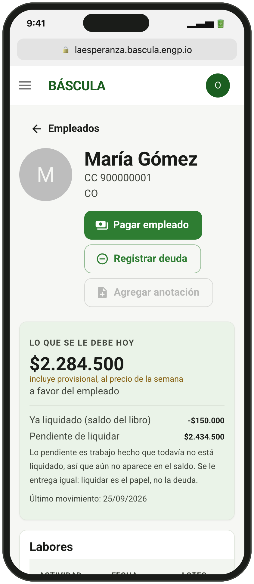
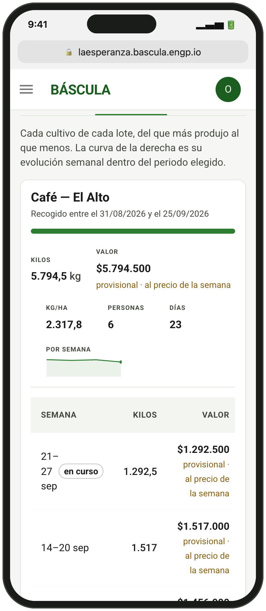

# ⚖️ Báscula

**Harvest control and payroll for farms.** A web app opened from the browser on
a phone or a computer: nothing to install, and it can be added to the phone's
home screen. The person at the scale records each weighing on the phone, even
with no signal (weighings wait on the device and upload on their own); the
office reviews, settles and pays from the same web address. Coffee, cacao and
whatever else gets picked by the kilo.

<p align="center">
  
</p>
<p align="center">
  
  
  
  
</p>

Screens use demo data. More in [`docs/screenshots`](docs/screenshots/README.md).

| Piece | What it is | State |
|---|---|---|
| [`apps/web`](apps/web) | React PWA: weighing (offline-capable), harvest reports, workers, payroll, payments, farm administration and super-admin | **Working** |
| [`services/api`](services/api) | Go + PostgreSQL, multi-tenant, sync endpoint, [MCP server](services/api/README.md#mcp--the-api-as-tools-for-an-assistant) | **Working** |
| [`packages/shared`](packages/shared) | The ledger contract shared by the clients | **Working** |
| [`apps/mobile`](apps/mobile) | The original Expo app | **Being retired**: replaced by the web app; kept until farms that keep data only on the phone have uploaded their season |

## Getting started

```bash
npm install          # installs every workspace
npm run android      # or: npm run ios
npm test             # 75 tests, no build step
npm run typecheck
```

Requirements: Node 18+ and the **Expo Go** app on a simulator or device. The
mobile app works standalone and offline — none of the planned services are
needed to use it.

## Design notes

- [Use cases](docs/casos-de-uso.md) — the owner's own specification of the
  full scope: plots, employees, activities, work records, inventory, sales and
  expenses. The mobile app covers a small part of it today.
- [API and auth design](docs/arquitectura-api.md) — Go layout, REST contract,
  roles and the cross-tenant worker registry.
- [Data model](docs/modelo-datos.md) — the PostgreSQL schema, row-level
  security, and how today's SQLite tables migrate into it.
- [Sprint 1 plan](docs/plan-sprint-1.md)
- [Sync protocol](docs/sincronizacion.md) — how the phone and the server
  reconcile, conflict by conflict, and who owns the lock that stops a picker
  being paid twice.
- [Owner decisions](docs/decisiones.md) — the calls the team could not make on
  its own, with what each one costs.
- Diagrams: [mobile app](docs/diagramas/movil.md) ·
  [system](docs/diagramas/sistema.md) · [web app](docs/diagramas/web.md)
- [Sync and roles](docs/sync-and-roles.md) — how records travel from a phone
  with no signal to the server, what happens when two phones settle the same
  week, and what each role can do.
- [Adversarial audits](docs/auditorias.md) — the scoreboard for both audits:
  what held, what broke, and what is still open.
- [The simplification the owner proposed](docs/simplificacion.md) — what it
  would cost to take the money off the phone, counted rather than guessed.

## 📄 License

MIT
