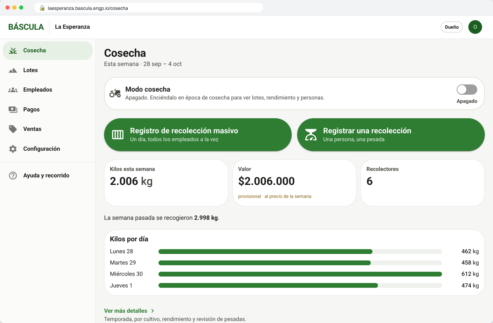
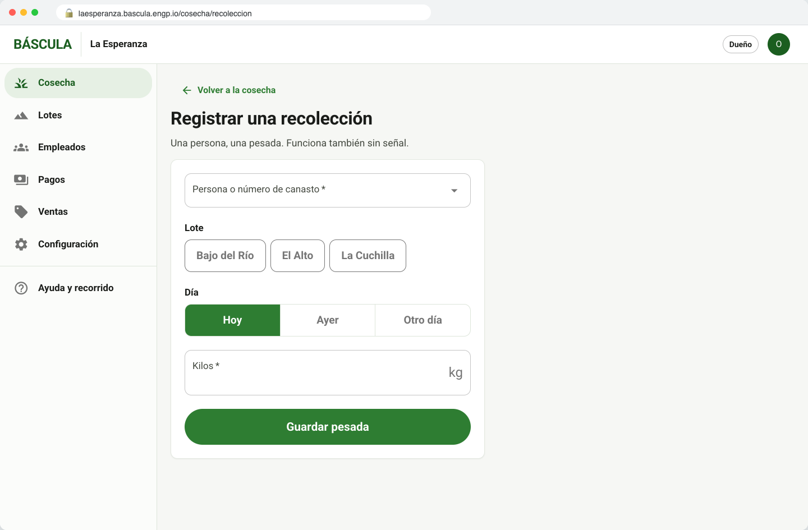
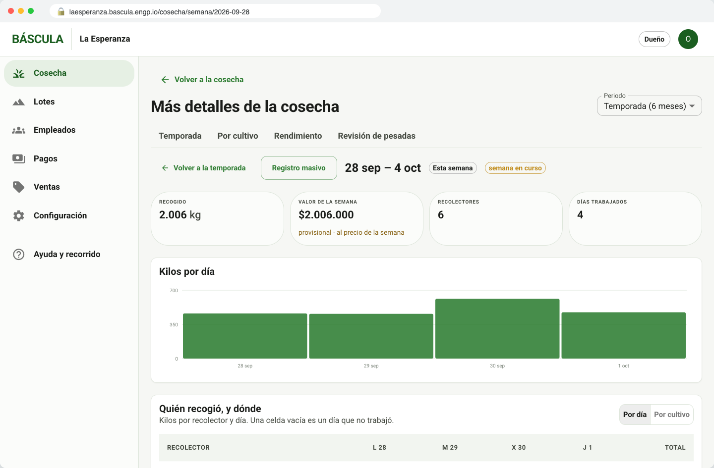
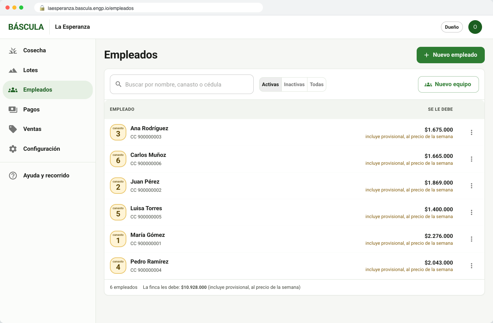
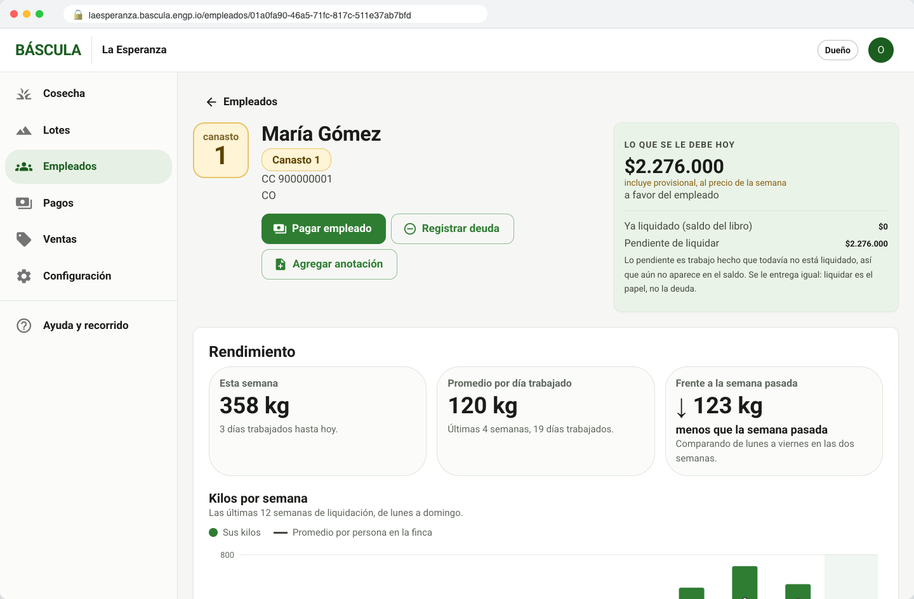
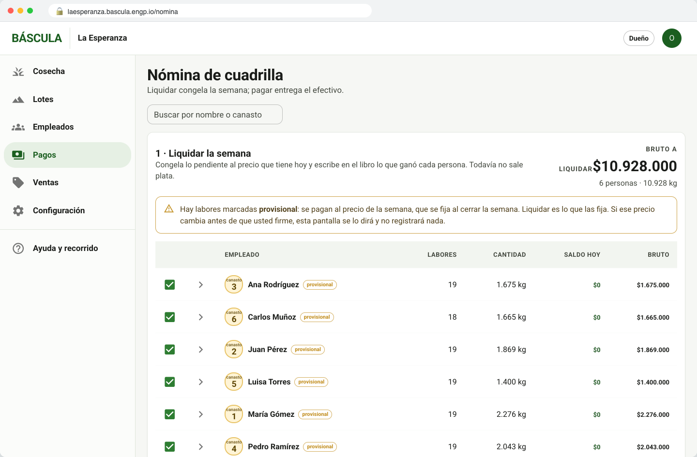
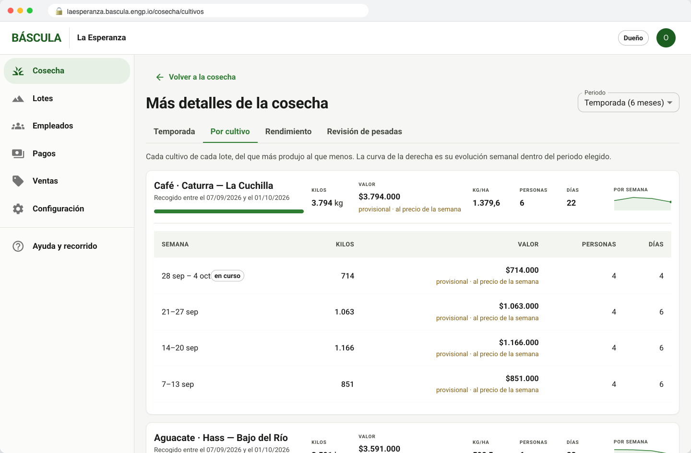
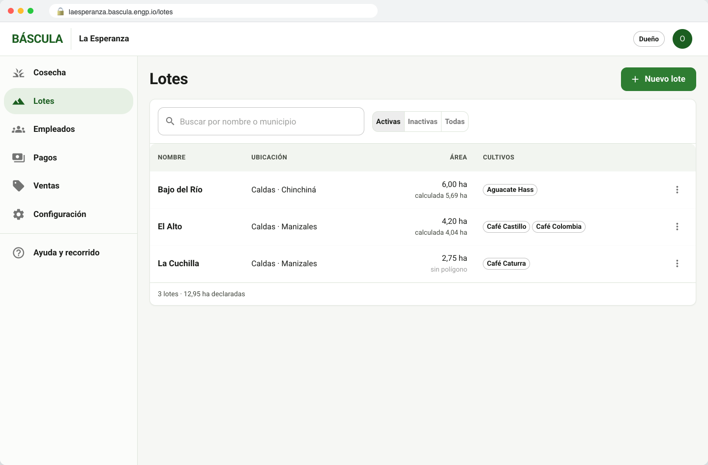

# ⚖️ Báscula

**Harvest weighing, payroll and profitability for coffee farms, as a web app.**
Open it in the browser on a phone or a computer at your farm's address
(`{finca}.bascula.engp.io`). There is nothing to install, and it can be added to
the phone's home screen. The person at the scale records each weighing on the
phone, even with no signal: weighings wait on the device and upload on their
own. The office reviews the harvest, settles, and pays from the same address.

Live at **[bascula.engp.io](https://bascula.engp.io)**. The interface is in
plain Spanish, built for people around fifty who don't live in software.

<p align="center">
  
</p>
<p align="center">
  
  
  
  
  
  
  
</p>

<sub>Screens use demo data. More in [`docs/screenshots`](docs/screenshots/README.md).</sub>

## Features

Harvest registration (weigh-ins, bulk planilla, several lots a day, editing
and voiding) is specified, with activity diagrams and the gaps against the
current code, in
[`docs/use-cases/harvest-registration.md`](docs/use-cases/harvest-registration.md)
(in English; exact Spanish UI labels are retained with English glosses).
The Employees module (archiving, work records, account statement, settlement
history, WhatsApp contact) is specified the same way in
[`docs/use-cases/employees.md`](docs/use-cases/employees.md).
Teams («Equipos»: a pair or family paid as one account, counted as people in
the statistics) are in [`docs/use-cases/teams.md`](docs/use-cases/teams.md).
Basket numbers («Número de canasto»: required, unique among active workers,
shown big on every picking and paying screen) are in
[`docs/use-cases/basket-numbers.md`](docs/use-cases/basket-numbers.md).

- **A simple harvest home.** `/cosecha` shows this week in big figures (kilos,
  value, pickers, kilos per day) and two big buttons: «Registro de recolección masivo» (Bulk harvest registration) and «Registrar una recolección» (Register a harvest). The detailed reports sit behind «Ver más detalles» (See more details).
- **Weighing at the scale.** A phone-first screen with a person, the lot as a
  big button, «Hoy» (Today) / «Ayer» (Yesterday) / «Otro día» (Another day), and the kilos. It asks before saving an
  implausible weight, and «Deshacer» (Undo) undoes the last one. It works without
  signal: the queue shows «N pesadas por subir» (N weighings to upload) and uploads on its own. Each
  weighing carries a client-minted id, so a resend is never counted twice.
- **Bulk registration for one day** («Registro de recolección masivo» (Bulk harvest registration)) for the
  whole crew at once: pick the day (today by default, one tap for any day of
  the week) and the lot, then type the kilos in one big box per employee. Each
  row shows what that person already has that day («2 pesadas · 38 kg» (2 weighings · 38 kg)); every
  filled box adds a NEW weighing and nothing is replaced, because people come
  to the scale several times a day. It confirms before saving and then lists
  exactly what was added.
- **Harvest reports.** Season curve, week detail (kilos per picker and day or
  per crop), yield per lot and crop, a comparative performance index, and a
  review of suspicious weighings.
- **Money.** Weekly price per kilo, settlements that freeze the price, and
  paying one worker or the whole crew. Advances, deductions and adjustments go
  in an append-only ledger. Printed receipts and payroll sheets; receipts can
  also go by WhatsApp.
- **Farm administration.** Workers (with a camera photo), lots with a map
  point, activities and work units, inventory, sales, expenses, users and
  roles (owner, administrator, weigher).
- **CSV export** of weighings, money movements and balances. A **demo-data**
  button fills an empty farm to try the product.
- **Multi-tenant**: every farm gets its own subdomain. A super-admin
  provisions and suspends farms.
- **An MCP server** exposes the API as tools for ChatGPT, Claude and other
  assistants — reads and writes, limited to what the user's role may do, with
  an explicit two-step confirmation on anything that moves money
  ([details](services/api/README.md#mcp--the-api-as-tools-for-an-assistant),
  [MCP docs](docs/mcp/README.md), live tool reference at
  [bascula.engp.io/mcp/docs](https://bascula.engp.io/mcp/docs)).

## Architecture

```
 Phone / computer browser
   └─ apps/web          React + TypeScript + MUI, installable PWA
        │                service worker (app shell) + IndexedDB (offline weighings)
        │ HTTPS, same origin: {finca}.bascula.engp.io/v1/…
   services/api          Go (chi, pgx, goose), multi-tenant REST + MCP
        │
   PostgreSQL 17 + PostGIS   row-level security per farm (CloudNativePG)

 All of it on Kubernetes: Gateway API (Cilium) behind a Cloudflare tunnel,
 Argo CD from the gitops repo.
```

| Piece | What it is |
|---|---|
| [`apps/web`](apps/web) | The web app (PWA): weighing (works offline), reports, workers, payroll, payments, administration, super-admin |
| [`services/api`](services/api) | Go API: multi-tenant, row-level security, reports, uploads, MCP |
| [`packages/shared`](packages/shared) | Domain rules (money, weeks, enums) and the golden money cases the API is tested against |
| [`manifests`](manifests) | Kustomize for dev and production |

## Development

Requirements: Node 24+, Go 1.26, Docker (for Postgres).

```bash
npm install                              # every workspace, from the root
npm --workspace apps/web run dev         # http://localhost:5173, against an in-browser mock API
npm test                                 # packages/shared
npm run typecheck
npm --workspace apps/web test            # web unit tests (Vitest + MSW)
```

The web app starts on mock data by default (`VITE_USE_MOCKS=true` in
`apps/web/.env.development`) and says so on screen. Log in with
`oscar@laesperanza.co` / `esperanza`. To run it against the real API:

```bash
cd services/api
make up && make migrate   # Postgres + PostGIS on :5433
make dev                  # the API on :8099 (the web dev server proxies /v1 to it)
make test                 # Go suite against that Postgres
```

**Database diagram.** [`docs/database.md`](docs/database.md) is a Mermaid ER
diagram generated from the migrations. A PR that adds or changes a migration
must include it regenerated: run `make db-diagram` (needs Docker; it uses a
throwaway Postgres, not your local one) and commit the result. CI fails when it
is out of date. Rules for migrations:
[`services/api/migrations/README.md`](services/api/migrations/README.md) and
[`CONTRIBUTING.md`](CONTRIBUTING.md).

Then set `VITE_USE_MOCKS=false` and restart `npm run dev`. See
[`apps/web/README.md`](apps/web/README.md) and
[`services/api/README.md`](services/api/README.md).

## CI and deploy

- **CI** (`.github/workflows/ci.yml`) runs on every PR. A path filter picks
  the suites the change can affect; everything runs in parallel:
  - the migration order check and the shared money rules (always);
  - web lint, tests and build, and typecheck (web changes);
  - the Go suite against PostGIS and the database diagram check
    (`docs/database.md`, `make db-diagram`) (API changes);
  - the api and web images, pushed to Harbor as `src-<source key>`.
- **CD** (`cd.yml`) runs on each merge to `master`:
  - promotes the images the PR built to the release tag (no rebuild; CI runs
    again only if the PR's run does not cover the merged sources);
  - deploys to **dev** (`bascula.int.dev.engp.io`) automatically;
  - deploys to **production** (`bascula.engp.io`) only after manual approval in
    the GitHub `production` environment. The same step bumps the tenants'
    `targetRevision` (gitops `applications/bascula-tenants.yaml`), so every
    dedicated farm (`{slug}.bascula.engp.io`) moves to the release and runs its
    migrations too.

  How long each part takes, and the (off) auto-approval option:
  [`docs/deploy-speed.md`](docs/deploy-speed.md).
  Details in [`manifests/README.md`](manifests/README.md).

## Legacy phone app

Báscula started as an offline-first Expo app. It was removed once the web app
covered it, offline weighing included, and its code is in the git history. The
server keeps `/v1/sync/*` and `/v1/import/season` so phones that still have it
installed can upload their season. Documents from that era are in
[`docs/archive`](docs/archive/README.md).

## Design notes

- [Use cases](docs/use-cases.md): the owner's specification of the full scope.
- [API and auth design](docs/api-architecture.md): Go layout, REST contract,
  roles, and the cross-tenant worker registry.
- [Data model](docs/data-model.md): the PostgreSQL schema and row-level security.
- [Database diagram](docs/database.md): generated from the migrations, always current.
- [MCP server](docs/mcp/README.md): endpoints, auth, roles and tools for AI
  assistants; guides to [connect ChatGPT](docs/mcp/connect-chatgpt.md) and
  [Claude](docs/mcp/connect-claude.md), the [OAuth reference](docs/mcp/oauth.md)
  and [troubleshooting](docs/mcp/troubleshooting.md).
- [Data protection](docs/data-protection.md): Ley 1581 mapping, roles,
  retention and worker rights.
- [Owner decisions](docs/decisions.md): the calls the team couldn't make on
  its own, with what each one costs.
- Diagrams: [system](docs/diagrams/system.md) · [web app](docs/diagrams/web.md)
- [Adversarial audits](docs/audits.md): what held, what broke, and what is still open.
- [Usability review](docs/usability.md)
- [Archive](docs/archive/README.md): sync protocol, the simplification
  proposal, the sprint 1 plan, and the mobile diagrams.

## 📄 License

MIT
