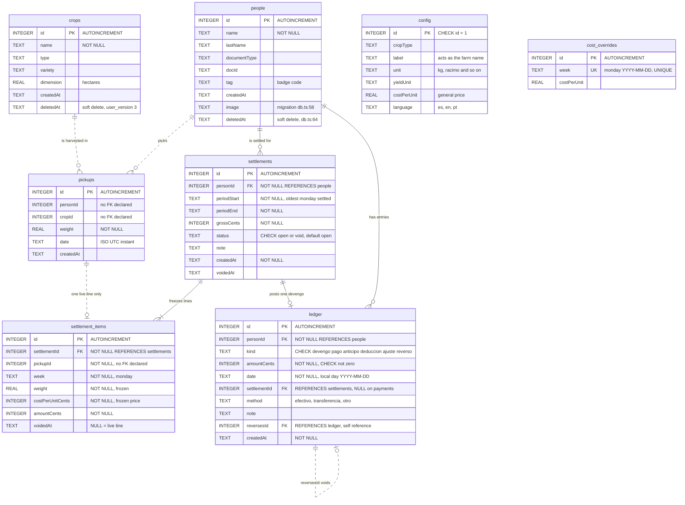
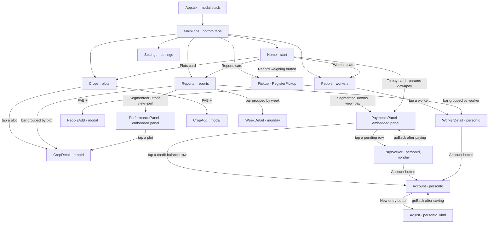
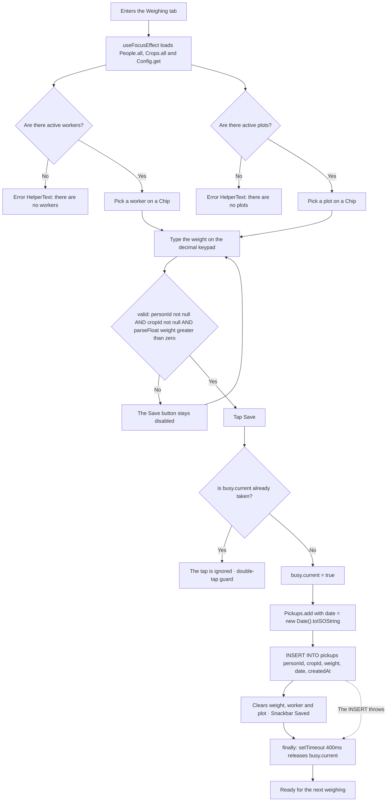
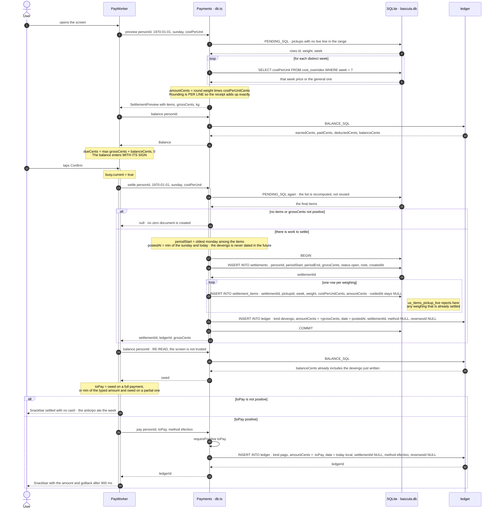
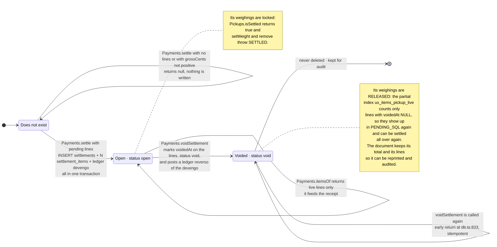

# Báscula mobile — architecture diagrams

Engineering documentation for the **`apps/mobile`** app exactly as it stands today
on branch `feat/api-web-multitenant`: Expo / React Native + TypeScript over local
SQLite, no network, no accounts and no server. Everything below is taken from the
code; every claim cites `file:line`.

The app is single-farm and single-phone. The SQLite file `bascula.db` — opened at
`db.ts:52` — is the only copy of the season.

**Contents**

1. [Current data model](#1-current-data-model-er)
2. [Class and module diagram](#2-class-and-module-diagram)
3. [Navigation map](#3-navigation-map)
4. [Activity: recording a weighing](#4-activity-recording-a-weighing)
5. [Activity: settle and pay](#5-activity-settle-and-pay)
6. [Sequence diagram: settlement](#6-sequence-diagram-settlement)
7. [State machine of a settlement](#7-state-machine-of-a-settlement)
8. [The event book](#8-the-event-book)
9. [Technical debt and known limits](#9-technical-debt-and-known-limits)

---

## 1. Current data model (ER)

The schema lives in `apps/mobile/src/schema.ts`, deliberately kept apart from
`expo-sqlite` so the test suite can run the **same** SQL under `node:sqlite`
(`schema.ts:1-3`, `ledger.test.ts:44-47`).

It is created in two blocks: `BASE_SCHEMA` (`schema.ts:5-31`) and
`PAYMENTS_SCHEMA` (`schema.ts:33-84`), plus the columns added by migration in
`db.ts:56-73` and `db.ts:106-170`.

### Schema version

`SCHEMA_VERSION = 4` (`db.ts:89`). An up-to-date file has `PRAGMA
user_version = 4`.

| `user_version` | What it introduced | Where |
|---|---|---|
| 0 → 1 | `BASE_SCHEMA` only. No numbered migration; the columns `people.image`, `people.deletedAt` and `config.language` are added with a failure-tolerant `ALTER TABLE` on every start. | `db.ts:56-73` |
| 2 | The full `PAYMENTS_SCHEMA`: `settlements`, `settlement_items`, `ledger`. It also re-pins `cost_overrides.week` from the `"2026-W34"` label to the **Monday** `YYYY-MM-DD`, resolving the clash of two legacy labels that fall on the same Monday. | `db.ts:111-141` |
| 3 | `crops.deletedAt` — soft delete of plots so no weighings are left orphaned. | `db.ts:143-151` |
| 4 | `settlement_items.voidedAt`. Voiding a settlement no longer deletes its lines: they are marked, and the double-payment lock moves from `ux_items_pickup` to **`ux_items_pickup_live`**, a **partial** unique index that counts only the live lines. | `db.ts:153-169`, `schema.ts:60-61` |



> The relationships drawn with a dotted line (`..`) have **no declared
> `FOREIGN KEY`** in the DDL, even though `PRAGMA foreign_keys = ON` is active
> (`schema.ts:7`). `pickups.personId`, `pickups.cropId` and
> `settlement_items.pickupId` are loose integers: that is why every query does a
> `LEFT JOIN` and `COALESCE(..., '?')`.

### The indexes and constraints that do the work

| Object | Definition | What it guarantees |
|---|---|---|
| `ux_items_pickup_live` | `UNIQUE ON settlement_items(pickupId) WHERE voidedAt IS NULL` (`schema.ts:60-61`) | **The double-payment lock.** A weighing belongs to at most one live settlement. Voided lines stay on the record but release their weighing. |
| `ux_ledger_reverses` | `UNIQUE ON ledger(reversesId) WHERE reversesId IS NOT NULL` (`schema.ts:82-83`) | An entry is reversed once and only once. |
| The sign `CHECK` on `ledger` | `schema.ts:76-78` | `devengo` always positive; `pago`, `anticipo` and `deduccion` always negative; `ajuste` and `reverso` free-signed. The sign convention is enforced by the database, not by the code. |
| `CHECK (amountCents <> 0)` | `schema.ts:69` | Zero entries do not exist. That is why `settle` returns `null` instead of creating a $0 document (`db.ts:783`). |
| `ix_ledger_person` | `ledger(personId, date DESC, id DESC)` (`schema.ts:80`) | The order in which `Payments.history` reads the account. |

### Derived keys

Two SQL functions generate every time-based grouping (`schema.ts:87-90`):

- `DAY_OF(col)` → `date(col,'localtime')` — **local** calendar day.
- `WEEK_OF(col)` → `date(col,'localtime','-6 days','weekday 1')` — the **Monday**
  of the week, as `YYYY-MM-DD`.

---

## 2. Class and module diagram

**Rewritten in sprint 8.** What this section used to describe — a 1,488-line
`db.ts` that opened `bascula.db` at module level and exported fifteen namespace
objects — stopped existing three sprints ago. `db.ts` is now 100 lines of wiring:
it opens the single connection, builds a `Repository` and re-exports the same
names the screens have always imported. All the logic lives in
`data/sqliteRepository.ts`, which **receives** an adapter instead of opening a
connection — which is exactly what §9.2 of this very document was asking for —
and that is why there are now tests for `settle`, `pay`, `void`, `undo` and for
every migration where there were none.

The shape is still the same: there are no classes with inheritance anywhere.
`Repository` is an interface of namespace objects, and what the diagram calls
classes are modules, ports and contracts — the stereotype on each box says so.


> `csv.ts` and `harvest.ts` still know nothing about the database: the screens
> hand them rows that have already been read.

### The real direction of the dependencies

What matters is still what is **not** there, and the list is shorter than it used
to be because the reason it was long got fixed:

- **`schema.ts` imports nothing.** It is still pure SQL, and now it is run both by
  the suites that open a `DatabaseSync(":memory:")` by hand
  (`ledger.test.ts`, `review.test.ts`, `week.test.ts`, `performance.test.ts`) and
  by the ones that go through the real repository.
- **`sqliteRepository.ts` opens no connection.** It receives one as a
  `SqlDatabase`, a port of five methods. `db.ts` hands it `expo-sqlite`;
  `nodeSqlite.ts` hands it `node:sqlite`. That single inversion is what turned the
  eight `schema.ts` suites into `repository.test.ts`, `migration.test.ts`,
  `sync.test.ts` and `seasonImport.test.ts`, which exercise **the same code the
  phone runs**.
- **The only arrow that goes up from a pure module to the database is still
  `receipt.ts → db.ts`**, and only for `fromCents` and two types.
- **The sync engine knows nothing about HTTP.** `engine.ts` speaks
  `SyncTransport`, and the two implementations — the feed and the REST stopgap —
  are interchangeable. That cut paid for itself the moment the server shipped
  `/v1/sync/*`: one new file and not one line in the engine, the outbox, the cards
  or the screens.
- **`packages/shared` is the boundary with the server.** Money, the day, the week
  and the closed sets live there because a divergence between the phone, the API
  and the web costs money. The SQL is deliberately **not** there: what is shared
  is the behaviour, pinned down by the golden cases.

### Who consumes what

| Data module | Screens |
|---|---|
| `Reports`, `Pickups.recent`, `Payments.pendingAll` | `Home.tsx` |
| `People`, `Payments.*` | `People.tsx`, `PaymentsPanel.tsx`, `Account.tsx`, `PayWorker.tsx`, `Adjust.tsx` |
| `Pickups.add` | `RegisterPickup.tsx` |
| `Pickups.setWeight` / `Pickups.remove` | `PerformancePanel.tsx` |
| `Performance`, `Anomalies` | `PerformancePanel.tsx` |
| `WorkerReports` + `Payments.fullBalance` | `WorkerDetail.tsx` |
| `CropReports` + `harvest.ts` | `CropDetail.tsx` |
| `WeekReports` | `WeekDetail.tsx`, `PaymentsPanel.tsx` |
| `Config`, `Overrides`, `Export`, `Demo` + `csv.ts` | `Settings.tsx` |
| `receiptHtml.payrollHtml` | `PaymentsPanel.tsx` |
| `receiptHtml.receiptHtml` + `receipt.buildReceipt` | `Account.tsx` |
| `Sync` + `SyncProvider` + `explain.ts` | `SyncStatus.tsx`, `SyncSetup.tsx`, `SeasonImport.tsx`, `SyncChip.tsx` |

---

## 3. Navigation map

`App.tsx` mounts a `NativeStackNavigator` with `MainTabs` inside it
(`App.tsx:114-161`). There are **six tabs** and **eight stack screens**, plus
**two embedded panels** that are not routes: `PaymentsPanel` and
`PerformancePanel` are mounted as components inside another screen, behind a
`SegmentedButtons`.

`PaymentsPanel` lives inside `People` rather than being a seventh tab for a reason
spelled out in `People.tsx:27-28`: at 360dp a seventh item drops each tab below
the 48dp touch target.



References: `App.tsx:100-157` (route registration), `types.ts:4-24`
(parameters), `Home.tsx:86,92,98,103,128`, `People.tsx:53`, `Crops.tsx:27,43`,
`Reports.tsx:119,235-238`, `PerformancePanel.tsx:166`, `PayWorker.tsx:242`,
`WorkerDetail.tsx:85`, `Account.tsx:216`, `PaymentsPanel.tsx:316,348`.

---

## 4. Activity: recording a weighing

Screen `RegisterPickup.tsx`. It is the hottest path in the app: the one walked
with gloves on, standing up, next to the scale.



### What you need to know about this flow

- **Validation lives in the screen, not in the data layer.**
  `valid` (`RegisterPickup.tsx:26`) is the only barrier: `Pickups.add`
  (`db.ts:249-253`) inserts whatever it is given, without checking sign or
  finiteness. Compare with `Pickups.setWeight` (`db.ts:233-242`), which does
  validate `Number.isFinite(weight) && weight > 0` and throws `BADWEIGHT`.
- **The `busy` lock is a `useRef`, not state** (`RegisterPickup.tsx:30`).
  It is released with a 400 ms `setTimeout` inside a `finally` because the screen
  is a tab and **never unmounts**: a stuck flag would leave the button dead until
  the app is restarted (`RegisterPickup.tsx:47-52`).
  The comment at `RegisterPickup.tsx:28-29` says it outright: the anomaly rule
  that detects two identical weighings within three minutes exists, and it is
  better not to create them.
- **`date` is stored as a UTC instant** (`RegisterPickup.tsx:40`). Every
  aggregation converts it afterwards with `'localtime'`
  (`DAY_OF` / `WEEK_OF`, `schema.ts:87-90`).
- There is no confirmation and no intermediate screen: saving is a single tap, and
  a later correction is made from the performance panel
  (`PerformancePanel.tsx:307-347`), which is where `Pickups.setWeight` and
  `Pickups.remove` can throw `SETTLED` if the weighing has already been settled.

---

## 5. Activity: settle and pay

There are **two paths** out of the payments panel, and both run the same logical
sequence — *settle first, then pay whatever the balance says* — with different
nuances.

```mermaid
flowchart TD
    START["Workers tab · Payments segment · PaymentsPanel"]
    START --> LOAD["load: Payments.pendingAll with upTo = the Sunday of the week + Payments.balances"]
    LOAD --> LOCK1["LOCK 1 · pendingAll excludes every weighing with a live line in settlement_items"]
    LOCK1 --> SHOW["Shows the pending rows, the net total and the credit balances card"]

    SHOW --> NET["netOf row = max pending amount + balance, 0 · the balance enters WITH ITS SIGN"]

    NET --> CHOICE{"What does the user do"}

    CHOICE -->|"Taps a row"| IND["PayWorker · personId + monday"]
    CHOICE -->|"Pay everybody"| BULK["Dialog with a checkbox per worker"]
    CHOICE -->|"Print payroll sheet"| ROLL["printPayroll"]
    CHOICE -->|"Taps a credit balance"| ACC["Account · personId"]

    IND --> IP["Payments.preview from 1970-01-01 to the Sunday"]
    IP --> IDUE["dueCents = max grossCents + creditCents, 0"]
    IDUE --> IMODE{"Full or partial payment?"}
    IMODE -->|Partial| ITYPE["Type an amount or use a quick chip"]
    IMODE -->|Full| ICONF
    ITYPE --> ICONF["Tap Confirm"]
    ICONF --> IBUSY{"is busy.current taken?"}
    IBUSY -->|Yes| IIGN["It is ignored"]
    IBUSY -->|No| SETTLE

    BULK --> BRUN["runBulk: walks the selected workers one by one"]
    BRUN --> SETTLE

    SETTLE["Payments.settle personId, 1970-01-01, sunday, costPerUnit"]
    SETTLE --> S0{"Are there pending lines AND grossCents greater than zero?"}
    S0 -->|No| SNULL["Returns null · no zero document is created"]
    S0 -->|Yes| STX["TRANSACTION: INSERT settlements + N settlement_items + 1 ledger devengo"]
    STX --> LOCK2["LOCK 2 · ux_items_pickup_live rejects the INSERT if the weighing already has a live line"]

    LOCK2 --> BAL["owed = Payments.balance personId .balanceCents · RE-READ FROM THE LEDGER"]
    BAL --> SALDO["THIS IS WHERE THE CREDIT BALANCE IS COMPUTED: the sum of the whole ledger, with anticipos already subtracted"]

    SALDO --> TOPAY{"is toPay greater than zero?"}
    TOPAY -->|No| NOCASH["Settled but no cash: the anticipo ate the week · Snackbar"]
    TOPAY -->|Yes| PAY["Payments.pay personId, toPay · INSERT ledger kind pago with negative amountCents"]

    PAY --> AFTER["If anything is left over, it stays as the worker credit balance"]
    AFTER --> IND2{"Individual or bulk path?"}
    IND2 -->|Individual| BACK["goBack after 900 ms"]
    IND2 -->|Bulk| UNDO["Stores lastRun with the payment and settlement ids · 15 s Snackbar with Undo"]

    UNDO --> UACT{"Taps Undo?"}
    UACT -->|Yes| URUN["Payments.undoRun: reverses every payment and voids every settlement"]
    UACT -->|No| DONE

    SNULL --> DONE["Back to the panel · load reloads"]
    NOCASH --> DONE
    BACK --> DONE
    URUN --> DONE

    ROLL --> RH["Payments.balances + Payments.history per person, filtering pagos dated on or after the Monday"]
    RH --> RKG["WeekReports.byWorker for the real kilos of the week"]
    RKG --> RPDF["payrollHtml · Print.printAsync · payroll sheet PDF with one signature line per worker"]

    ACC --> APDF["Account: picks the most recent open settlement"]
    APDF --> AITEMS["Payments.itemsOf · LIVE LINES ONLY, a receipt does not document voided work"]
    AITEMS --> AOUT{"Print or share?"}
    AOUT -->|Print| APRINT["receiptHtml · Print.printAsync · receipt PDF with a signature line"]
    AOUT -->|Share| ATXT["buildReceipt · plain text · Share.share to WhatsApp"]
```



### Where each thing lives

**The double-payment lock acts at two levels, and they are different:**

1. **Read filter** — `PENDING_SQL` (`schema.ts:112-119`) and
   `Payments.pendingAll` (`db.ts:1045`) exclude with
   `pk.id NOT IN (SELECT pickupId FROM settlement_items WHERE voidedAt IS NULL)`.
   That is what makes an already-settled weighing simply not show up.
2. **Write constraint** — the partial unique index
   `ux_items_pickup_live` (`schema.ts:60-61`). This is the real guarantee: even if
   the filter failed, the `INSERT INTO settlement_items` inside the `settle`
   transaction (`db.ts:800-811`) would blow up and the whole transaction would roll
   back.

There is a third lock, in the interface: the `useRef busy` at `PayWorker.tsx:92`
and `Adjust.tsx:51`, against a double tap with gloves on.

**Where the credit balance is computed:** in no column at all. It is **derived**
with `BALANCE_SQL` over the ledger every time it is asked for. In the payment flow
it shows up three times:

- `PayWorker.tsx:59` and `:68` — to *display* `dueCents = max(gross + credit, 0)`.
  The comment at `PayWorker.tsx:64-67` explains why the balance enters **with its
  sign**: a negative balance is an `anticipo` already handed over and it has to
  reduce the payment; clamping it to zero would give the advance away every week
  and the debt would never be worked off.
- `PayWorker.tsx:101` and `PaymentsPanel.tsx:154` — to *decide how much to pay*,
  **re-read after settling**. The comment at `PayWorker.tsx:98-99` is the rule:
  "settle first so the `devengo` is on the books, then pay whatever the ledger
  says is owed, never the amount the screen was showing".
- `PaymentsPanel.tsx:107` — `netOf`, so the panel total promises exactly the cash
  that is going to leave the box.

**The PDF** comes out of two different places, and neither of them is in
`PayWorker`:

- `Account.printReceipt` (`Account.tsx:95-126`) → `receiptHtml`
  (`receiptHtml.ts:43`) → `Print.printAsync`. This is one person's receipt.
  It is only enabled if `hasSettlement` (`Account.tsx:58`, `:237`).
- `PaymentsPanel.printPayroll` (`PaymentsPanel.tsx:204-248`) → `payrollHtml`
  (`receiptHtml.ts:181`) → `Print.printAsync`. This is the week's payroll sheet,
  with one signature line per row.
- On top of that, `Account.share` (`Account.tsx:130-164`) builds the **plain
  text** version with `buildReceipt` (`receipt.ts:23`) and sends it through
  `Share.share`. The comment at `receipt.ts:17-22` justifies the decision: text
  and not PDF because it arrives readable inside the chat itself, survives any
  phone, and needs no viewer and no storage permission.

**Fault tolerance in the bulk payment:** `runBulk` (`PaymentsPanel.tsx:137-178`)
wraps each worker in its own `try/catch`; one failure does not take down everybody
else's payroll. The `settlementId` is noted in `settlements[]` **before**
attempting the payment (`PaymentsPanel.tsx:159-162`), because `settle` has already
committed and the settlement has to stay undoable even if `pay` throws.

---

## 6. Sequence diagram: settlement

The full individual path, from `PayWorker.confirm` (`PayWorker.tsx:94-122`) down
to the ledger. The writes are annotated row by row.



### Summary of the writes in a settlement with payment

| Table | Rows | Key values |
|---|---|---|
| `settlements` | **1** | `status = 'open'`, `periodStart` = the oldest Monday among the items (not the `from` that was passed in), `periodEnd` = the `to` that was passed in, `grossCents` = the sum of the lines |
| `settlement_items` | **N**, one per weighing | `pickupId`, `week`, `weight` and `costPerUnitCents` **frozen**; `amountCents` rounded per line; `voidedAt = NULL` |
| `ledger` | **1** `devengo` | `amountCents = +grossCents`, `date = min(to, today)`, `settlementId` pointing at the document |
| `ledger` | **1** `pago` | `amountCents = -toPay`, `date = today`, `method = 'efectivo'`, **`settlementId = NULL`** |

The `pago` is **not linked to the settlement** (`db.ts:874`). That is a design
decision with consequences: see point 3 of section 9.

Voiding it later writes one more row:

| Table | Effect of `voidSettlement` |
|---|---|
| `settlement_items` | `UPDATE ... SET voidedAt = now WHERE settlementId = ?` — every line, live or not |
| `settlements` | `UPDATE ... SET status = 'void', voidedAt = now` |
| `ledger` | **1** `reverso` with `amountCents = -devengo.amountCents` — negative — , `reversesId` = the id of the `devengo`, `settlementId` preserved |

---

## 7. State machine of a settlement

`settlements.status` only accepts two values by `CHECK`: `'open'` and `'void'`
(`schema.ts:40`). There is no «paid» state: the payment does not live in the
document, it lives in the ledger.



### The transitions that do **not** exist

- **There is no `void → open`.** Voiding is final. Redoing the work means creating
  a new settlement, which will pick up the same weighings, now released.
- **An open settlement cannot be edited.** There is no `UPDATE` on `settlements`
  outside of voiding, nor on `settlement_items` except for `voidedAt`. The amount
  and the price are frozen at the moment of settling.
- **It cannot be deleted.** There is no `DELETE FROM settlements` anywhere in
  `db.ts` except `Demo.clear` (`db.ts:484`).
- **A settled weighing cannot be corrected.** `Pickups.setWeight` and
  `Pickups.remove` check `isSettled` first and throw `SETTLED`
  (`db.ts:234,245`). The comment at `db.ts:223-226` gives the reason: its price is
  frozen and money has already been paid against it, so correcting it would
  silently change money that has already changed hands. The settlement has to be
  voided first, and that is the user's decision, not a side effect of an edit.
  The interface closes the loop: `PerformancePanel` shows the message
  `perf.settled` (`PerformancePanel.tsx:321,339`) and `Account` offers to void by
  tapping the `devengo` (`Account.tsx:253-257`).

### How the interface prevents voiding twice

`Account.tsx:65-67` builds the `voided` set out of the `reversesId` values in the
history. A `devengo` that already has a `reverso` is struck through
(`styles.voidedRow`, `Account.tsx:258`) and stops being tappable. Without that —
since a voided settlement keeps its `devengo` in the history alongside its
`reverso` — the same one could be «voided» over and over, reporting success every
time.

---

## 8. The event book

### Why the ledger is append-only

`ledger` is an accounting journal, not mutable state. In the whole of `db.ts`
**there is not a single `UPDATE ledger` or `DELETE FROM ledger`** outside
`Demo.clear`. A mistake is not corrected by editing the row: it is cancelled with
its opposite (`db.ts:925`). That is the reason `kind = 'reverso'` and the
self-referencing `reversesId` exist.

Three practical consequences, all of them visible in the code:

1. **The history the worker sees is the whole truth.**
   `Account.tsx:249-273` paints the ledger as it is, `reverso` entries included,
   with the original struck through. A payment made wrong stays in the list with
   its cancellation next to it; it does not disappear.
2. **Nothing can be paid twice without leaving a trace.** The
   `UNIQUE ON ledger(reversesId)` (`schema.ts:82-83`) plus the check in
   `Payments.reverse` (`db.ts:932-936`) stop the same entry being reversed twice.
3. **The balance is never stored.** There is no balance column in any table. It is
   recomputed by summing the journal, so it is impossible for the balance and its
   entries to contradict each other.

### The sign table by `kind`

The convention is **positive = the farm owes the worker**. A positive balance is
the worker's savings held by the farm
(`db.ts:629-631`, `schema.ts:92-95`).

| `kind` | Sign of `amountCents` | Enforced by | Meaning | Who writes it |
|---|---|---|---|---|
| `devengo` | **> 0** required | `CHECK` `schema.ts:76` | The settled work the farm acknowledges owing | `Payments.settle`, `db.ts:813-822` |
| `pago` | **< 0** required | `CHECK` `schema.ts:77` | Cash handed to the worker | `Payments.pay`, `db.ts:863-879` |
| `anticipo` | **< 0** required | `CHECK` `schema.ts:77` | Money advanced before settling | `Payments.advance`, `db.ts:881-893` |
| `deduccion` | **< 0** required | `CHECK` `schema.ts:77` | A deduction for food, lodging, tools, the store or anything else | `Payments.deduct`, `db.ts:895-907` |
| `ajuste` | **free** | `CHECK` `schema.ts:78` | A correction that can go either way | `Payments.adjust`, `db.ts:910-923` |
| `reverso` | **free**, opposite to the original | `CHECK` `schema.ts:78` | The cancellation of another entry; `reversesId` points at the one it voids | `Payments.reverse` and `Payments.voidSettlement`, `db.ts:848-857`, `db.ts:937-946` |

The methods take the amount as a **positive** number and the data layer applies
the sign: `pay`, `advance` and `deduct` negate what they receive after it has gone
through `requirePositive` (`db.ts:726-729`). The comment at `db.ts:862` says it:
"amounts arrive positive; the sign is ours".

The subtle part is in `reverso`: because it can go either way, the breakdown tells
entries apart **by sign, not by type**. Reversing a `devengo` is negative and
comes off what was earned; reversing a `pago` is positive and comes off what was
paid (`schema.ts:92-95`).

### How the balance is derived — `BALANCE_SQL`

```sql
  SELECT ? AS personId,
         COALESCE(SUM(CASE WHEN kind = 'devengo' THEN amountCents
                           WHEN kind = 'reverso' AND amountCents < 0 THEN amountCents END),0)
           AS earnedCents,
         COALESCE(-SUM(CASE WHEN kind IN ('pago','anticipo') THEN amountCents
                            WHEN kind = 'reverso' AND amountCents > 0 THEN amountCents END),0)
           AS paidCents,
         COALESCE(-SUM(CASE WHEN kind = 'deduccion' THEN amountCents END),0) AS deductedCents,
         COALESCE(SUM(amountCents),0) AS balanceCents,
         MAX(date) AS lastMovementAt
    FROM ledger WHERE personId = ?
```

`schema.ts:97-109`. It is invoked from `Payments.balance` with the `personId`
passed in **twice**: once for the literal column and once for the `WHERE`
(`db.ts:967`).

What to read in that query:

- **`balanceCents` is simply `SUM(amountCents)`.** Everything else —
  `earnedCents`, `paidCents`, `deductedCents` — is a breakdown for the interface.
  The balance is the raw sum of the journal, and that is why it cannot drift out
  of line with its entries.
- `paidCents` and `deductedCents` are **negated** as they are aggregated, because
  the rows are stored negative and the interface wants to show magnitudes.
- The `reverso` rows are split by sign between `earnedCents` and `paidCents`, as
  explained above.
- The `ajuste` rows **appear in no breakdown at all**, but they do appear in
  `balanceCents`. That is consistent with an adjustment being neither work nor
  cash.

`Payments.balances()` (`db.ts:982-1000`) does the same thing for the whole farm in
one go, with a `LEFT JOIN` from `people` — soft-deleted workers included: "money
never hides just because somebody dropped off the active list"
(`db.ts:980-981`). It filters with
`HAVING balanceCents <> 0 OR earnedCents <> 0`.

`Payments.farmTotals()` (`db.ts:1071-1082`) aggregates one level further: it sums
the positive balances as `owedCents`, the negative ones as `overpaidCents`, and
counts how many workers have savings.

**Everything in `INTEGER` cents.** `REAL` would end up in balances that drag on
for months (`db.ts:628-630`). `toCents` / `fromCents` at `db.ts:694-695`.

---

## 9. Technical debt and known limits

**Rewritten in sprint 8, and that is the important part.** This section had turned
into the phone team's work list, and it described a 1,488-line `db.ts` that
stopped existing three sprints ago: it was lying about the one thing it was good
for. Every line number in the previous version pointed at a deleted file.

What is left below was read against today's code, point by point. The numbering of
the original — 9.1 to 9.16 — is kept because other documents and several code
comments cite it; what changes is the status of each one.

### What is already closed

| # | Was | How it was closed |
|---|---|---|
| **9.1** | `undoRun` opened a transaction inside another one and the *Undo* button never worked | The body of voiding lives in `voidSettlementHere`, **without** a transaction of its own; `voidSettlement` and `undoRun` compose it. With tests: `repository.test.ts` undoes a whole payroll run. |
| **9.2** | The connection was a module-level `openDatabaseSync`, so nothing in `db.ts` could be tested | `createSqliteRepository(db)` receives a five-method `SqlDatabase` port. `db.ts` hands it expo-sqlite, `nodeSqlite.ts` hands it `node:sqlite`, and the suites exercise the same code the phone runs. |
| **9.3** | Payments did not point at their settlement and the receipt **guessed** by filtering on date | `payments.pay` accepts a `settlementId` and `PAID_AGAINST_SQL` queries it. It stopped being a guess. |
| **9.4** | The balance was implemented twice, and only one of them was covered by tests | `BALANCE_COLUMNS(alias)` in `schema.ts`. There were **three**, not two: `BALANCE_SQL`, the list on the payroll screen and the `seasonExport` summary — the figure `POST /v1/import/season` reconciles to the cent before writing a year of payroll. A test compares the two doors. |
| **9.5** | Harvested value was implemented twice, one of them with an N+1 | `HARVEST_VALUE_EXPR` / `HARVEST_VALUE_SQL(where)`. `totalPayout` and `workerReports.payout` stopped grouping by week in a JavaScript loop with one query per week. A test pins that the five doors give the same figure. |
| **9.7** | Nothing could be synced: local keys, no metadata, no `farmId`, no soft delete on `pickups` | UUIDv7 on every table that travels, an outbox driven by triggers, `farmId` in `config` with a guard, `pickups.deletedAt` and the `pickups_live` view. §3 of `sincronizacion.md` runs on top of this. |
| **9.8** | The time zone was the phone's, and changing it recategorised weeks that had already been settled | The farm decides: `adoptTimezone` takes it from the handshake, `localDay` and `week` are materialised, and `dayInZone`/`weekInZone` live in `packages/shared`. |
| **9.10** | `setWeight` validated the weight and `add` validated nothing | One single guard, both doors. |
| **9.11** | Soft delete was applied inconsistently | Closed in sprint 8 with **the server's rule**: "people with a position, not active people". The home counters count the active list; the rankings filter nobody out — if they did, they would stop adding up to the farm total shown right above them — and they carry `active` so the row can say so. `reports.byCrop` and `weekCrops` **did** filter, so the crops tab did not agree with the pickers tab: two tabs on the same card contradicting each other. |
| **9.13** | The settle → re-read balance → pay sequence was written twice inside React | `payments.runPayroll` and `payments.undoRun`. The screens present. |

### 9.6 What does not scale — much reduced, not closed

Gone: `pickups` has indexes (`ix_pickups_date`, `ix_pickups_dup`), the five
anomaly rules have a time window and a `LIMIT`, the payroll sheet stopped doing 2N
queries, and the `costForWeek` N+1 disappeared along with 9.5.

Still there:

- **`payments.history` truncates silently.** `LIMIT 200` by default. Over a long
  season a worker's history stops being fully visible and nothing says so.
- **The anomaly window is a product decision dressed up as a technical limit.**
  Whatever falls outside the window is never reviewed.

### 9.9 Incomplete referential integrity — open, and this time assessed

Unchanged: `pickups.personId`, `pickups.cropId` and `settlement_items.pickupId`
have no `FOREIGN KEY` (`schema.ts`), even though `PRAGMA foreign_keys` is active
and does protect `settlements.personId`, `ledger.personId`,
`settlement_items.settlementId` and `ledger.settlementId`.

**It was deliberately not fixed, and it is worth writing down why.** SQLite has no
`ALTER TABLE ADD FOREIGN KEY`: adding one requires the twelve-step detour — create
the new table, copy, drop, rename — over `pickups`, which is the fastest-growing
table, on the phone that holds the only copy of a farm's season, in the middle of
the harvest. The risk of that migration is greater than the risk of the defect it
fixes.

What there is in the meantime: every read goes through `LEFT JOIN` + `COALESCE`,
so an orphan shows up as `'Unknown'` instead of vanishing, and `applyPull` counts
the orphans that arrive from the feed. When to do it: out of harvest season, with
the season already uploaded to the server (§8), which is when a second copy
exists.

### 9.12 The settlement range — CLOSED

Closed: `EPOCH_START` and `endOfWeek` exist once, in `packages/shared`, instead of
being duplicated across the two payment screens; and `periodStart` is **no
longer** the range that was asked for but the one the lines actually cover.

Open: `settlements.periodEnd` stores the `to` **untrimmed**, so it can end up
dated in the future while the `devengo` is trimmed to today. The earlier reading
was that this is a defect of the phone. Checked against the API, it is not
entirely:

- The server does **exactly the same thing**: `store.Settle` writes
  `PeriodEnd: to`, the range that was asked for.
- `openapi.yaml` documents the meaning of `periodStart` — "the period actually
  covered, not the window the caller asked about" — and says **nothing** about
  `periodEnd`.
- The migration only checks `period_end >= period_start`.

That is: both sides write the same thing into that column, and `POST
/v1/import/season` puts both into the same table. Trimming it only on the phone
would fix nothing; it would create a divergence in a money column.

**Answered (sprint 9): `periodEnd` is the range that was ASKED FOR.** The two
columns do not mean the same thing, and the asymmetry is intentional:

| Column | Meaning | Who writes it that way |
|---|---|---|
| `periodStart` | the period **actually covered** — the Monday of the oldest week with lines, not the `from` that was asked about | phone (`sqliteRepository.ts:1321`) and server (`openapi.yaml` already documents it) |
| `periodEnd` | the range **ASKED FOR** — the `to` that was received, untrimmed | phone (`sqliteRepository.ts:1328`) and server (`store.Settle`, `PeriodEnd: to`) |

That is why `periodEnd` can end up dated in the future while the `devengo` is
trimmed to today: **it is not a defect, it is the definition.** It is written down
in the code, next to the table, in `apps/mobile/src/schema.ts` above
`PAYMENTS_SCHEMA`, which is where whoever is about to touch it will read it.

What is missing and **is not ours**: `openapi.yaml` documents the meaning of
`periodStart` and still says nothing about `periodEnd`. It is one line in
`services/api`, and it has to be handed to whoever owns the API so they write it
there — without it, the next person opens this same question all over again.

### 9.14 API surface with no consumer and no interface — open

- `payments.farmTotals()` — no screen calls it.
- `payments.itemsOfAll()` — nobody calls it, even though it exists so that voided
  lines can be audited.
- `payments.adjust()` — `kind = 'ajuste'` is in the `CHECK`, in the breakdown and
  in the account icon, but **there is no screen that creates one**:
  `Adjust.tsx` only writes `anticipo` and `deduccion`.
- `payments.reverse()` — only reachable from `undoRun`. It is no longer broken
  (9.1), but there is still no way to reverse a single entry.

`people.byTag` is off this list now: `PeopleAdd` uses it to warn about a duplicate
badge.

### 9.15 Operational risks — reduced

Closed: `Demo.clear` and `Demo.seed` require typing the farm name — `seed` starts
by wiping, so guarding only the scarier-looking button left the hole exactly where
it was; the stale comment about the week key disappeared along with the file that
held it; and there is now a way for the data to get out that is not a hand-shared
CSV: `POST /v1/import/season` uploads the whole season and reconciles it to the
cent before writing anything.

Still there:

- **A farm that has not yet made the move described in §8 has no automatic
  backup.** Lose the phone and you lose the record.
- **Concurrency**: on a phone with synchronous JavaScript no race is possible; in
  the multi-user API it is, and the real safety net there is the
  `ux_items_pickup_live` index. That is not debt on this side.

### 9.17 What the sync screen still cannot tell you

New, from sprint 8. `explain.ts` covers every code `protocol.ts` names and a test
enforces it, so no error reaches the user as a raw string. What is missing is not
errors, it is **states**:

- **`AppliedCounts` reaches no screen.** The engine counts
  `workers`, `crops`, `pickups`, `prices`, `settlements`, `ledger`, `orphans`,
  `frozen`, `skippedPending` and `reactivated`, and not one of those figures is
  shown. A pass that pulled down four thousand changes looks exactly like one that
  pulled down none.
- **`orphans` no longer means one single thing**, and that is why it cannot be
  shown as it is. It mixes "a row arrived whose parent has not arrived yet" —
  which resolves itself on the next pass — with "the line of a `jornal` that this
  phone cannot hang off any weighing" — which is permanent and correct (§2.2).
  Splitting them is work, not a label.
- **The backoff wait is invisible.** `sync_state.retryAt` and `attempts` are
  stored and never shown; `engine.idleReport("BACKOFF")` never reaches
  `saveState`, so the `sync.errBackoff` branch of `explain.ts` is not reachable
  from the screen. The *Sync* button forces the pass, so nobody gets stuck — but
  the screen cannot say "it is not stopped, it is waiting".
- **`behind` goes stale within the pass itself.** It is the handshake's answer at
  the **start**; after draining twenty pages the screen is still showing the old
  number. On a phone that has been without signal for weeks that reads as no
  progress at all.

Closed in sprint 8: `CURSOR_TOO_OLD` is no longer silent. `feedTransport` still
resolves it on its own — re-reading from scratch is the only correct answer and
there is nothing to ask about — but now it **says so**: `PullResult.bootstrapped`
bubbles up to a card explaining that the phone is pulling the season down again
and that nothing was lost. Without that, the `behind` of the next handshake jumps
from eleven to the whole season, and a counter that appears to have gone backwards
is how somebody concludes the phone lost the harvest.

### 9.18 The dry run of the move — measured, with a ceiling that is not ours

Sprint 9. The season import was rehearsed against a database the size of the real
season. **The figures are measured, not estimated** (`seasonImport.test.ts`,
"a season of 18,000 weighings"):

| | |
|---|---|
| Season | 18,000 weighings · 7,501 entries · 18,000 lines · **48,022 rows** |
| Packing (`seasonExport`) | ~60 ms |
| Verifying (`verifySeasonExport`) | ~40 ms |
| Serialising | ~30 ms |
| **Body** | **11.7 MB** — exactly the figure in `simplificacion.md` §4 |

What was checked, and what adds up:

- **The balances reconcile to the cent.** The phone verifies its own balances
  *before* sending and refuses to go out if they do not reconcile; one cent of
  difference aborts the whole import, and the server rejects it again on its own
  account (`reconcileImport`). Both sides are tested.
- **If it fails, the phone is left exactly as it was.** `seasonExport` is a pure
  read and the only local write is `import_runs`, which is not a synced table. The
  tests compare a fingerprint of the SQLite file before and after a send of 18,000
  weighings, a rejection on balance, and a timeout: identical in all three.
- **Retrying is safe.** Three attempts back to back leave exactly one season.

**The phone's timeout was on the edge, and it was raised.**
`SEASON_IMPORT_TIMEOUT_MS` was 15 min. 11.7 MB / 13 kB/s = 900 s = **15 min 0 s**:
the timeout and the upload were the same number, zero margin, and a link 1% worse
than assumed aborted the move. Worse, the test was named "handles 12 MB" and only
checked 11.7. It is now **25 min** (~19.5 MB on that link) and the test asks for
12 MB with 50% margin. Note that the 25 s ceiling from debt 4 of sprint 5 **was
already resolved**: the request asks for its own timeout and there is a test that
proves it end to end.

**But the ceiling that decides is not ours, and it is not on this side of the
repository.** `services/api/cmd/api/main.go` brings the server up with
`ReadTimeout: 30 * time.Second` and `WriteTimeout: 60 * time.Second`, with no
per-route exception. `ReadTimeout` is the deadline for reading **the entire
body**: 11.7 MB over a farm's link takes ~15 minutes and the server cuts the
connection after 30 seconds. The phone's 25 minutes never get used at all. The
size limit is fine (`maxImportBytes = 64 MB`).

**It is a server change and it has to be made before Tuesday.** We do not touch
it: it is `services/api`. Without it, the move only works if the farm uploads at
more than ~400 kB/s sustained, which is exactly what `simplificacion.md` §4 says
cannot be taken for granted. On top of that, if TLS terminates behind a proxy that
is not in this repository, its `client_max_body_size` and its
`proxy_read_timeout` are a third, unverified ceiling.

Closed along the way: the screen offered the import to `admin`, and the server
allows it **only to `owner`** (`ActionImportSeason: {Roles: owners}`, and `owners`
is `[]domain.Role{domain.RoleOwner}`). An administrator would upload the whole
season and read a 403 at the end. Now the screen says no before the upload.

### 9.19 Crew payroll still has no lock — open, and we are NOT closing it

`PayWorker.tsx` requires a fresh `pull` before settling (§6.1). `PaymentsPanel`
calls `Payments.runPayroll` **without checking anything**: no `useSync`, no
`ensureFresh`, no outbox. The rule protects the path of one worker and leaves the
path of thirty wide open. It is the pending half of the P0 in
`simplificacion.md` §4.

**It was left open on purpose and it has to be decided with the owner, not in the
code.** Putting the §6.1 guard on it is not "two conditionals": today the farm
**can** run the crew's payroll with no signal, and the guard takes that away from
them. That is exactly the kind of capability this sprint is forbidden to withdraw
while the web cannot pay a crew. The question for the owner is one line: **does
the farm run Saturday's payroll with no signal, or always with signal?** If always
with signal, the guard is free and it should go in right now. If sometimes with no
signal, putting it in now leaves the farm with no way to pay, and it has to wait
for the web.

### 9.16 What is ready to reuse

- **The whole of `schema.ts`.** It runs under `node:sqlite` in the suites as it is.
- **`packages/shared`** already is exactly this, done: money, the day, the week,
  the closed sets and the uuids, with the golden cases pinning down the behaviour
  that cannot diverge.
- **`csv.ts`, `receiptHtml.ts`, `receipt.ts`, `strings.ts`** — pure, no React and
  no database, with tests of their own.
- **`protocol.ts`**: the sync contract knows nothing about HTTP. Swapping the REST
  stopgap for the real feed cost one file and not one line in the engine, the
  outbox, the cards or the screens, which is the property it was separated for.
- **The shape of the ledger.** The six `kind` values cover a coffee pick, a
  `jornal` and a pruning contract equally well.
- **The lock**: `UNIQUE(payable_id) WHERE voided_at IS NULL` is the same partial
  index with a different column name.

---

*Sections 2 and 9 regenerated in sprint 8 by reading `apps/mobile/src/db.ts`
(100 lines), `data/repository.ts`, `data/sqliteRepository.ts`,
`data/syncStore.ts`, `schema.ts`, `sync/` and the 20 screens in
`apps/mobile/src/screens/`, against `services/api` and `docs/sincronizacion.md`.*

*The rest of the document — §1 the data model, §3 navigation, §4 to §7 the flows
and the state machine, §8 the event book — was **not** touched. The refactor did
not invalidate it: the tables, the screens, the sequence of a settlement and the
ledger signs are the same. What moved was the code that runs them, and that is
what sections 2 and 9 were describing. The line numbers left in those other
sections point, as before, at the files the screens import.*
