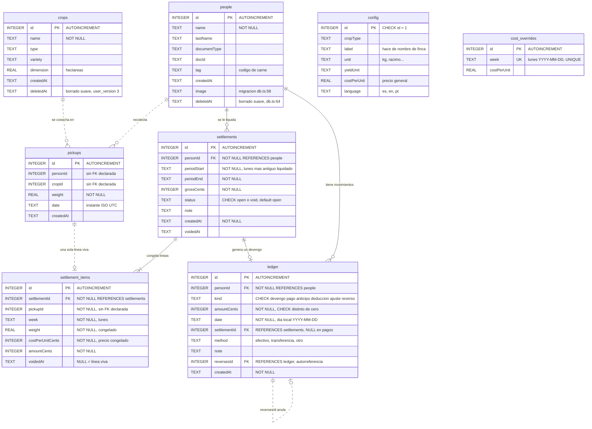
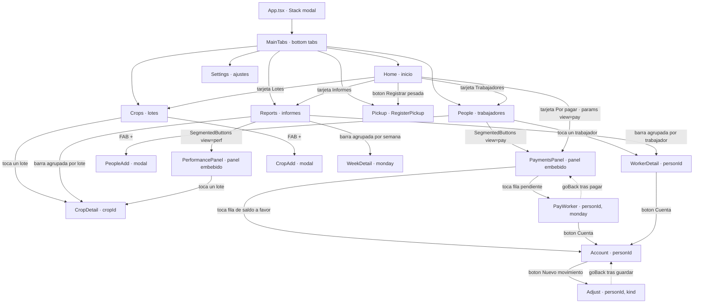
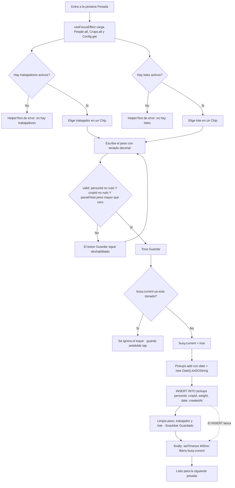
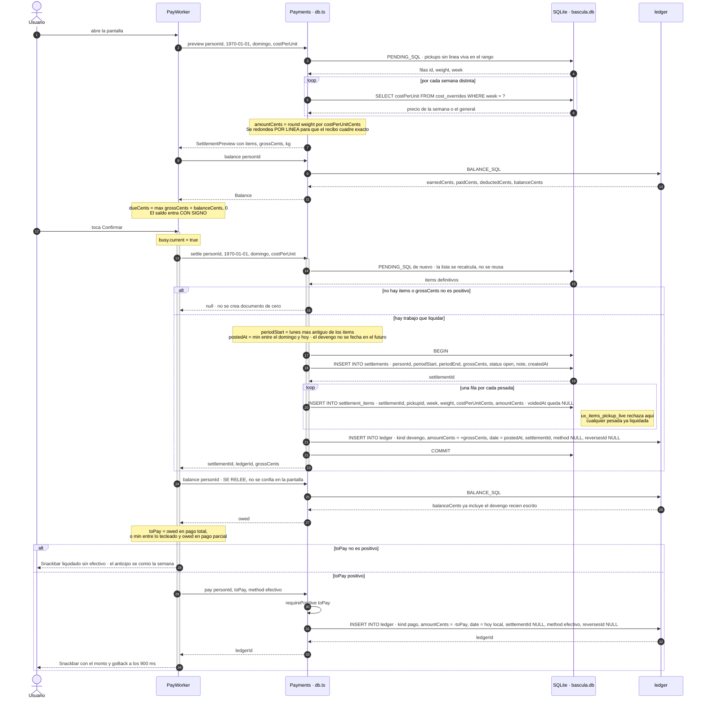
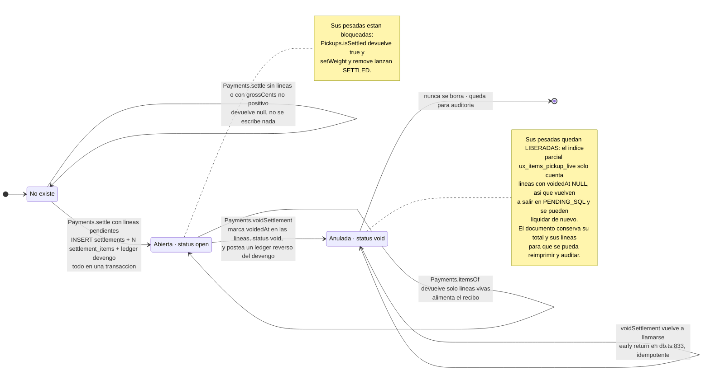

# Báscula móvil — diagramas de arquitectura

Documentación de ingeniería de la app **`apps/mobile`** tal como está hoy en la
rama `feat/api-web-multitenant`: Expo / React Native + TypeScript sobre SQLite
local, sin red, sin cuentas y sin servidor. Todo lo que sigue está tomado del
código; cada afirmación cita `archivo:línea`.

La app es de una sola finca y un solo teléfono. El fichero SQLite `bascula.db`
—abierto en `db.ts:52`— es la única copia de la temporada.

**Índice**

1. [Modelo de datos actual](#1-modelo-de-datos-actual-er)
2. [Diagrama de clases y módulos](#2-diagrama-de-clases-y-modulos)
3. [Mapa de navegación](#3-mapa-de-navegacion)
4. [Actividad: registrar una pesada](#4-actividad-registrar-una-pesada)
5. [Actividad: liquidar y pagar](#5-actividad-liquidar-y-pagar)
6. [Secuencia: liquidación](#6-secuencia-liquidacion)
7. [Máquina de estados de una liquidación](#7-maquina-de-estados-de-una-liquidacion)
8. [El libro de eventos](#8-el-libro-de-eventos)
9. [Deuda técnica y límites conocidos](#9-deuda-tecnica-y-limites-conocidos)

---

## 1. Modelo de datos actual (ER)

El esquema vive en `apps/mobile/src/schema.ts`, separado de `expo-sqlite` a
propósito para que la suite de pruebas pueda ejecutar el **mismo** SQL bajo
`node:sqlite` (`schema.ts:1-3`, `ledger.test.ts:44-47`).

Se crea en dos bloques: `BASE_SCHEMA` (`schema.ts:5-31`) y `PAYMENTS_SCHEMA`
(`schema.ts:33-84`), más las columnas añadidas por migración en
`db.ts:56-73` y `db.ts:106-170`.

### Versión del esquema

`SCHEMA_VERSION = 4` (`db.ts:89`). Un fichero al día tiene `PRAGMA
user_version = 4`.

| `user_version` | Qué introdujo | Dónde |
|---|---|---|
| 0 → 1 | Sólo `BASE_SCHEMA`. Sin migración numerada; las columnas `people.image`, `people.deletedAt` y `config.language` se añaden con `ALTER TABLE` tolerante a fallo en cada arranque. | `db.ts:56-73` |
| 2 | `PAYMENTS_SCHEMA` completo: `settlements`, `settlement_items`, `ledger`. Además re-clava `cost_overrides.week` de la etiqueta `"2026-W34"` al **lunes** `YYYY-MM-DD`, resolviendo el choque de dos etiquetas heredadas que caen en el mismo lunes. | `db.ts:111-141` |
| 3 | `crops.deletedAt` — borrado suave de lotes para no dejar pesadas huérfanas. | `db.ts:143-151` |
| 4 | `settlement_items.voidedAt`. Anular una liquidación deja de borrar sus líneas: se marcan, y el candado anti doble pago pasa de `ux_items_pickup` a **`ux_items_pickup_live`**, un índice único **parcial** que sólo cuenta las líneas vivas. | `db.ts:153-169`, `schema.ts:60-61` |



> Las relaciones dibujadas con línea punteada (`..`) **no tienen `FOREIGN KEY`
> declarada** en el DDL, aunque `PRAGMA foreign_keys = ON` está activo
> (`schema.ts:7`). `pickups.personId`, `pickups.cropId` y
> `settlement_items.pickupId` son enteros sueltos: por eso todas las consultas
> hacen `LEFT JOIN` y `COALESCE(..., '?')`.

### Índices y restricciones que hacen el trabajo

| Objeto | Definición | Qué garantiza |
|---|---|---|
| `ux_items_pickup_live` | `UNIQUE ON settlement_items(pickupId) WHERE voidedAt IS NULL` (`schema.ts:60-61`) | **El candado anti doble pago.** Una pesada pertenece como máximo a una liquidación viva. Las líneas anuladas quedan para el registro pero liberan su pesada. |
| `ux_ledger_reverses` | `UNIQUE ON ledger(reversesId) WHERE reversesId IS NOT NULL` (`schema.ts:82-83`) | Un movimiento se reversa una sola vez. |
| `CHECK` de signo en `ledger` | `schema.ts:76-78` | `devengo` siempre positivo; `pago`, `anticipo` y `deduccion` siempre negativos; `ajuste` y `reverso` con signo libre. La convención de signos está impuesta por la base, no por el código. |
| `CHECK (amountCents <> 0)` | `schema.ts:69` | No existen movimientos de cero. Por eso `settle` devuelve `null` en vez de crear un documento de $0 (`db.ts:783`). |
| `ix_ledger_person` | `ledger(personId, date DESC, id DESC)` (`schema.ts:80`) | El orden en que `Payments.history` lee la cuenta. |

### Claves derivadas

Dos funciones SQL generan todas las agrupaciones temporales (`schema.ts:87-90`):

- `DAY_OF(col)` → `date(col,'localtime')` — día calendario **local**.
- `WEEK_OF(col)` → `date(col,'localtime','-6 days','weekday 1')` — **lunes** de
  la semana, como `YYYY-MM-DD`.

---

## 2. Diagrama de clases / módulos

`db.ts` no exporta clases sino **objetos-namespace** con métodos. El diagrama
los representa como clases con `<<module>>`; no hay instanciación ni herencia
en ninguna parte del código.

```mermaid
classDiagram
    direction LR

    class schema_ts {
        <<sql>>
        BASE_SCHEMA
        PAYMENTS_SCHEMA
        BALANCE_SQL
        PENDING_SQL
        INDEX_SQL
        RULE_IMPOSSIBLE_SQL
        RULE_DUPLICATE_SQL
        RULE_DIGIT_SQL
        RULE_OUTLIER_SQL
        RULE_FUTURE_SQL
        EXPORT_PICKUPS_SQL
        EXPORT_LEDGER_SQL
        EXPORT_BALANCES_SQL
        WEEK_BY_DAY_SQL
        WEEK_BY_WORKER_SQL
        WEEK_GRID_SQL
        WEEK_GRID_DAY_SQL
        WEEK_PLOTS_SQL
        DAY_OF(col) string
        WEEK_OF(col) string
    }

    class db_ts {
        <<module>>
        -db SQLiteDatabase
        +initDb() void
        -migrate() void
        -mondayOfLegacyWeek(label) string
        -now() string
        +today() string
        +toCents(amount) number
        +fromCents(cents) number
        +costForWeek(week, general) number
        +totalPayout(general) number
        +reportBy(g, general) Row
        +weekCrops() List~WeekCrop~
        -pendingItems(personId, from, to, general) List~PendingItem~
        -addEntry(entry) number
        -requirePositive(cents) void
    }

    class People {
        <<object>>
        +all() List~Person~
        +byId(id) Person
        +byTag(tag) Person
        +add(p) RunResult
        +remove(id) RunResult
    }

    class Crops {
        <<object>>
        +all() List~Crop~
        +byId(id) Crop
        +add(c) RunResult
        +remove(id) RunResult
    }

    class Pickups {
        <<object>>
        +isSettled(id) boolean
        +setWeight(id, weight) void
        +remove(id) void
        +add(p) RunResult
        +recent() List~RecentRow~
    }

    class Payments {
        <<object>>
        +preview(personId, from, to, general) SettlementPreview
        +settle(personId, from, to, general, note) SettleResult
        +voidSettlement(settlementId, note) void
        +pay(personId, amountCents, opts) number
        +advance(personId, amountCents, note) number
        +deduct(personId, amountCents, note) number
        +adjust(personId, signedCents, note) number
        +reverse(ledgerId, note) number
        +undoRun(paymentIds, settlementIds, note) void
        +balance(personId) Balance
        +balances() List~BalanceRow~
        +history(personId, limit) List~LedgerEntry~
        +settlements(personId) List~Settlement~
        +itemsOf(settlementId) List~SettlementItem~
        +itemsOfAll(settlementId) List~SettlementItem~
        +pendingAll(general, upTo) List~PendingRow~
        +farmTotals() FarmTotals
    }

    class Performance {
        <<object>>
        +crew(sinceDays) List~WorkerPerf~
        +plots(sinceDays) List~PlotPerf~
        +priceResponse(general, weeks) List~PriceRow~
        +realCost(general) RealCost
    }

    class Anomalies {
        <<object>>
        +all(maxWeight) List~Anomaly~
    }

    class Reports {
        <<object>>
        +totals() Totals
        +today() DayTotal
        +thisWeek() WeekTotal
        +byWeek() List~Bar~
        +byWorker(general) List~Bar~
        +byCrop(general) List~Bar~
    }

    class WorkerReports {
        <<object>>
        +stats(personId) WorkerStats
        +byWeek(personId) List~Bar~
        +byCrop(personId) List~Bar~
        +recent(personId) List~RecentRow~
        +payout(personId, general) number
    }

    class CropReports {
        <<object>>
        +stats(cropId) CropStats
        +byWeek(cropId) List~Bar~
        +byWorker(cropId, sinceDays) List~CropWorker~
        +recent(cropId) List~RecentRow~
        +value(cropId, general) number
    }

    class WeekReports {
        <<object>>
        +byDay(monday) List~DayRow~
        +byWorker(monday) List~WorkerRow~
        +grid(monday) List~GridCell~
        +gridByDay(monday) List~GridCell~
        +plots(monday) List~PlotRow~
    }

    class Config {
        <<object>>
        +get() CropConfig
        +save(c) RunResult
    }

    class Prefs {
        <<object>>
        +getLang() AppLang
        +setLang(l) RunResult
    }

    class Overrides {
        <<object>>
        +all() List~CostOverride~
        +set(week, costPerUnit) RunResult
        +remove(id) RunResult
    }

    class Export {
        <<object>>
        +pickups() List~Row~
        +ledger() List~Row~
        +balances() List~Row~
    }

    class Demo {
        <<object>>
        +clear() void
        +seed() void
    }

    class format_ts {
        <<pure>>
        +formatMoney(amount, lang) string
        +formatNumber(value, lang) string
        +formatDay(value, lang) string
        +formatWeekRange(mondayISO, lang, now) string
        +mondayOf(date) string
        +weekNumber(mondayISO) number
        +parseDay(iso) Date
        +addDays(d, n) Date
    }

    class harvest_ts {
        <<pure>>
        +readHarvest(weeks, currentMonday, dropThreshold) HarvestShape
    }

    class csv_ts {
        <<pure>>
        +csvField(value) string
        +csvRow(values) string
        +csvDocument(header, rows) string
    }

    class receiptHtml_ts {
        <<pure>>
        +receiptHtml(data, lang) string
        +payrollHtml(rows, opts, lang) string
        -esc(s) string
    }

    class receipt_ts {
        <<pure>>
        +buildReceipt(input, lang) string
    }

    class strings_ts {
        <<pure>>
        +translate(lang, key, vars) string
        +weekTag(mondayISO, lang, now) string
    }

    db_ts ..> schema_ts : importa 18 constantes SQL
    db_ts *-- People
    db_ts *-- Crops
    db_ts *-- Pickups
    db_ts *-- Payments
    db_ts *-- Performance
    db_ts *-- Anomalies
    db_ts *-- Reports
    db_ts *-- WorkerReports
    db_ts *-- CropReports
    db_ts *-- WeekReports
    db_ts *-- Config
    db_ts *-- Prefs
    db_ts *-- Overrides
    db_ts *-- Export
    db_ts *-- Demo

    Payments ..> schema_ts : BALANCE_SQL y PENDING_SQL
    Anomalies ..> schema_ts : las cinco RULE_
    Performance ..> schema_ts : INDEX_SQL
    WeekReports ..> schema_ts : WEEK_
    Export ..> schema_ts : EXPORT_

    receipt_ts ..> db_ts : fromCents, Balance, SettlementItem
    receipt_ts ..> format_ts : formato de dinero y fechas
    receipt_ts ..> strings_ts : translate
    receiptHtml_ts ..> format_ts : formato
    receiptHtml_ts ..> strings_ts : translate
```



> `csv_ts` y `harvest_ts` no aparecen conectados a propósito: **no importan
> nada** de la capa de datos. Las pantallas les pasan las filas ya leídas
> (`Settings.tsx:119`, `CropDetail.tsx:91`).

### Dirección real de las dependencias

Lo importante del diagrama es lo que **no** hay:

- `schema.ts` no importa nada. Es SQL puro y por eso es lo único de la capa de
  datos que las pruebas pueden ejecutar directamente
  (`ledger.test.ts`, `review.test.ts`, `week.test.ts`, `performance.test.ts`
  abren un `DatabaseSync(":memory:")` y le aplican `BASE_SCHEMA` +
  `PAYMENTS_SCHEMA`).
- `format.ts`, `harvest.ts`, `csv.ts`, `strings.ts` y `receiptHtml.ts` son
  **puros**: no importan `db.ts` ni React. `receiptHtml.ts` sólo depende de
  `format.ts` y `strings.ts` (`receiptHtml.ts:1-3`).
- La única flecha que sube desde un módulo puro hacia la base es
  `receipt.ts → db.ts` (`receipt.ts:3`), y sólo para `fromCents` y dos tipos.
- `harvest.ts` y `csv.ts` no conocen la base en absoluto: las pantallas les
  pasan los datos ya leídos (`CropDetail.tsx:91`, `Settings.tsx:119`).

### Quién consume qué

| Módulo de datos | Pantallas |
|---|---|
| `Reports`, `Pickups.recent`, `Payments.pendingAll` | `Home.tsx:25-45` |
| `People`, `Payments.*` | `People.tsx`, `PaymentsPanel.tsx`, `Account.tsx`, `PayWorker.tsx`, `Adjust.tsx` |
| `Pickups.add` | `RegisterPickup.tsx:36` |
| `Pickups.setWeight` / `Pickups.remove` | `PerformancePanel.tsx:314,331` |
| `Performance`, `Anomalies` | `PerformancePanel.tsx:62-66` |
| `WorkerReports` | `WorkerDetail.tsx:55-59` |
| `CropReports` + `harvest.ts` | `CropDetail.tsx:77-91` |
| `WeekReports` | `WeekDetail.tsx`, `PaymentsPanel.tsx:222` |
| `Config`, `Overrides`, `Export`, `Demo` + `csv.ts` | `Settings.tsx` |
| `receiptHtml.payrollHtml` | `PaymentsPanel.tsx:225-244` |
| `receiptHtml.receiptHtml` + `receipt.buildReceipt` | `Account.tsx:95-164` |

---

## 3. Mapa de navegación

`App.tsx` monta un `NativeStackNavigator` con `MainTabs` dentro
(`App.tsx:114-161`). Hay **seis pestañas** y **ocho pantallas de pila**, más
**dos paneles embebidos** que no son rutas: `PaymentsPanel` y
`PerformancePanel` se montan como componentes dentro de otra pantalla, tras un
`SegmentedButtons`.

`PaymentsPanel` vive dentro de `People` y no como séptima pestaña por una razón
explícita en `People.tsx:27-28`: a 360dp un séptimo ítem deja cada pestaña por
debajo del objetivo táctil de 48dp.



Referencias: `App.tsx:100-157` (registro de rutas), `types.ts:4-24`
(parámetros), `Home.tsx:86,92,98,103,128`, `People.tsx:53`, `Crops.tsx:27,43`,
`Reports.tsx:119,235-238`, `PerformancePanel.tsx:166`, `PayWorker.tsx:242`,
`WorkerDetail.tsx:85`, `Account.tsx:216`, `PaymentsPanel.tsx:316,348`.

---

## 4. Actividad: registrar una pesada

Pantalla `RegisterPickup.tsx`. Es el camino más caliente de la app: el que se
recorre con guantes, de pie, junto a la báscula.



### Lo que hay que saber de este flujo

- **La validación vive en la pantalla, no en la capa de datos.**
  `valid` (`RegisterPickup.tsx:26`) es la única barrera: `Pickups.add`
  (`db.ts:249-253`) inserta lo que le den, sin comprobar signo ni finitud.
  Compárese con `Pickups.setWeight` (`db.ts:233-242`), que sí valida
  `Number.isFinite(weight) && weight > 0` y lanza `BADWEIGHT`.
- **El candado `busy` es un `useRef`, no estado** (`RegisterPickup.tsx:30`).
  Se libera con un `setTimeout` de 400 ms dentro de un `finally` porque la
  pantalla es una pestaña y **nunca se desmonta**: una bandera atascada dejaría
  el botón muerto hasta reiniciar la app (`RegisterPickup.tsx:47-52`).
  El comentario de `RegisterPickup.tsx:28-29` lo dice explícito: existe la
  regla de anomalía que detecta dos pesadas idénticas en tres minutos, y es
  mejor no crearlas.
- **`date` se guarda como instante UTC** (`RegisterPickup.tsx:40`). Todas las
  agregaciones lo convierten después con `'localtime'`
  (`DAY_OF` / `WEEK_OF`, `schema.ts:87-90`).
- No hay confirmación ni pantalla intermedia: guardar es un solo toque y la
  corrección posterior se hace desde el panel de rendimiento
  (`PerformancePanel.tsx:307-347`), que es donde `Pickups.setWeight` y
  `Pickups.remove` pueden lanzar `SETTLED` si la pesada ya está liquidada.

---

## 5. Actividad: liquidar y pagar

Hay **dos caminos** desde el panel de pagos, y ambos ejecutan la misma
secuencia lógica —*liquidar primero, luego pagar lo que diga el saldo*— con
matices distintos.

```mermaid
flowchart TD
    START["Pestana Trabajadores · segmento Pagos · PaymentsPanel"]
    START --> LOAD["load: Payments.pendingAll con upTo = domingo de la semana + Payments.balances"]
    LOAD --> LOCK1["CANDADO 1 · pendingAll excluye toda pesada con linea viva en settlement_items"]
    LOCK1 --> SHOW["Muestra filas pendientes, el total neto y la tarjeta de saldos a favor"]

    SHOW --> NET["netOf fila = max monto pendiente + saldo, 0 · el saldo entra CON SIGNO"]

    NET --> CHOICE{"Que hace el usuario"}

    CHOICE -->|"Toca una fila"| IND["PayWorker · personId + monday"]
    CHOICE -->|"Pagar a todos"| BULK["Dialogo con checkbox por trabajador"]
    CHOICE -->|"Imprimir planilla"| ROLL["printPayroll"]
    CHOICE -->|"Toca un saldo a favor"| ACC["Account · personId"]

    IND --> IP["Payments.preview desde 1970-01-01 hasta el domingo"]
    IP --> IDUE["dueCents = max grossCents + creditCents, 0"]
    IDUE --> IMODE{"Pago total o parcial?"}
    IMODE -->|Parcial| ITYPE["Escribe monto o usa un chip rapido"]
    IMODE -->|Total| ICONF
    ITYPE --> ICONF["Toca Confirmar"]
    ICONF --> IBUSY{"busy.current tomado?"}
    IBUSY -->|Si| IIGN["Se ignora"]
    IBUSY -->|No| SETTLE

    BULK --> BRUN["runBulk: recorre los seleccionados uno a uno"]
    BRUN --> SETTLE

    SETTLE["Payments.settle personId, 1970-01-01, domingo, costPerUnit"]
    SETTLE --> S0{"Hay lineas pendientes Y grossCents mayor que cero?"}
    S0 -->|No| SNULL["Devuelve null · no se crea documento de cero"]
    S0 -->|Si| STX["TRANSACCION: INSERT settlements + N settlement_items + 1 ledger devengo"]
    STX --> LOCK2["CANDADO 2 · ux_items_pickup_live rechaza el INSERT si la pesada ya tiene linea viva"]

    LOCK2 --> BAL["owed = Payments.balance personId .balanceCents · SE RELEE DEL LEDGER"]
    BAL --> SALDO["AQUI SE CALCULA EL SALDO A FAVOR: la suma de todo el ledger, con anticipos ya restados"]

    SALDO --> TOPAY{"toPay mayor que cero?"}
    TOPAY -->|No| NOCASH["Liquidado pero sin efectivo: el anticipo se comio la semana · Snackbar"]
    TOPAY -->|Si| PAY["Payments.pay personId, toPay · INSERT ledger kind pago con amountCents negativo"]

    PAY --> AFTER["Si sobra, el resto queda como saldo a favor del trabajador"]
    AFTER --> IND2{"Camino individual o masivo?"}
    IND2 -->|Individual| BACK["goBack a los 900 ms"]
    IND2 -->|Masivo| UNDO["Guarda lastRun con los ids de pago y de liquidacion · Snackbar 15 s con Deshacer"]

    UNDO --> UACT{"Toca Deshacer?"}
    UACT -->|Si| URUN["Payments.undoRun: reversa cada pago y anula cada liquidacion"]
    UACT -->|No| DONE

    SNULL --> DONE["Vuelve al panel · load recarga"]
    NOCASH --> DONE
    BACK --> DONE
    URUN --> DONE

    ROLL --> RH["Payments.balances + Payments.history por persona filtrando pagos con date mayor o igual al lunes"]
    RH --> RKG["WeekReports.byWorker para los kilos reales de la semana"]
    RKG --> RPDF["payrollHtml · Print.printAsync · PDF de planilla con una firma por trabajador"]

    ACC --> APDF["Account: elige la liquidacion abierta mas reciente"]
    APDF --> AITEMS["Payments.itemsOf · SOLO lineas vivas, un recibo no documenta trabajo anulado"]
    AITEMS --> AOUT{"Imprimir o compartir?"}
    AOUT -->|Imprimir| APRINT["receiptHtml · Print.printAsync · PDF de recibo con firma"]
    AOUT -->|Compartir| ATXT["buildReceipt · texto plano · Share.share a WhatsApp"]
```



### Dónde está cada cosa

**El candado anti doble pago actúa en dos niveles, y son distintos:**

1. **Filtro de lectura** — `PENDING_SQL` (`schema.ts:112-119`) y
   `Payments.pendingAll` (`db.ts:1045`) excluyen con
   `pk.id NOT IN (SELECT pickupId FROM settlement_items WHERE voidedAt IS NULL)`.
   Es lo que hace que una pesada ya liquidada simplemente no aparezca.
2. **Restricción de escritura** — el índice único parcial
   `ux_items_pickup_live` (`schema.ts:60-61`). Es la garantía real: aunque el
   filtro fallara, el `INSERT INTO settlement_items` dentro de la transacción
   de `settle` (`db.ts:800-811`) reventaría y la transacción entera se
   revertiría.

Hay un tercer candado, de interfaz: el `useRef busy` en `PayWorker.tsx:92` y
`Adjust.tsx:51`, contra el doble toque con guantes.

**Dónde se calcula el saldo a favor:** en ninguna columna. Se **deriva** con
`BALANCE_SQL` sobre el ledger cada vez que se pregunta. En el flujo de pago
aparece tres veces:

- `PayWorker.tsx:59` y `:68` — para *mostrar* `dueCents = max(gross + credit, 0)`.
  El comentario de `PayWorker.tsx:64-67` explica por qué el saldo entra
  **con signo**: un saldo negativo es un anticipo ya entregado y debe reducir
  el pago; recortarlo a cero regalaría el anticipo cada semana y la deuda
  nunca se consumiría.
- `PayWorker.tsx:101` y `PaymentsPanel.tsx:154` — para *decidir cuánto pagar*,
  **releído después de liquidar**. El comentario de `PayWorker.tsx:98-99` es
  la regla: «liquida primero para que el devengo esté en los libros, luego
  paga lo que el ledger dice que se debe, nunca el monto que mostraba la
  pantalla».
- `PaymentsPanel.tsx:107` — `netOf`, para que el total del panel prometa
  exactamente el efectivo que va a salir de la caja.

**El PDF** sale por dos sitios distintos, y ninguno de los dos está en
`PayWorker`:

- `Account.printReceipt` (`Account.tsx:95-126`) → `receiptHtml`
  (`receiptHtml.ts:43`) → `Print.printAsync`. Es el recibo de una persona.
  Sólo se habilita si `hasSettlement` (`Account.tsx:58`, `:237`).
- `PaymentsPanel.printPayroll` (`PaymentsPanel.tsx:204-248`) → `payrollHtml`
  (`receiptHtml.ts:181`) → `Print.printAsync`. Es la planilla de nómina de la
  semana, con una firma por fila.
- Además, `Account.share` (`Account.tsx:130-164`) construye la versión en
  **texto plano** con `buildReceipt` (`receipt.ts:23`) y la manda por
  `Share.share`. El comentario de `receipt.ts:17-22` justifica la decisión:
  texto y no PDF porque llega legible en el propio chat, sobrevive a cualquier
  teléfono y no necesita visor ni permiso de almacenamiento.

**Tolerancia a fallos del pago masivo:** `runBulk` (`PaymentsPanel.tsx:137-178`)
envuelve cada trabajador en su propio `try/catch`; un fallo no tumba la nómina
del resto. El `settlementId` se apunta en `settlements[]` **antes** de intentar
el pago (`PaymentsPanel.tsx:159-162`), porque `settle` ya hizo commit y la
liquidación tiene que quedar deshacible aunque `pay` lance.

---

## 6. Diagrama de secuencia: liquidación

Camino individual completo, desde `PayWorker.confirm` (`PayWorker.tsx:94-122`)
hasta el ledger. Las escrituras están anotadas fila por fila.



### Resumen de escrituras de una liquidación con pago

| Tabla | Filas | Valores clave |
|---|---|---|
| `settlements` | **1** | `status = 'open'`, `periodStart` = lunes más antiguo de los items (no el `from` recibido), `periodEnd` = el `to` recibido, `grossCents` = suma de las líneas |
| `settlement_items` | **N**, una por pesada | `pickupId`, `week`, `weight` y `costPerUnitCents` **congelados**; `amountCents` redondeado por línea; `voidedAt = NULL` |
| `ledger` | **1** `devengo` | `amountCents = +grossCents`, `date = min(to, hoy)`, `settlementId` apuntando al documento |
| `ledger` | **1** `pago` | `amountCents = -toPay`, `date = hoy`, `method = 'efectivo'`, **`settlementId = NULL`** |

El `pago` **no queda enlazado a la liquidación** (`db.ts:874`). Es una decisión
de diseño con consecuencias: ver el punto 3 de la sección 9.

Anular después escribe una fila más:

| Tabla | Efecto de `voidSettlement` |
|---|---|
| `settlement_items` | `UPDATE ... SET voidedAt = now WHERE settlementId = ?` — todas las líneas, vivas o no |
| `settlements` | `UPDATE ... SET status = 'void', voidedAt = now` |
| `ledger` | **1** `reverso` con `amountCents = -devengo.amountCents` — negativo —, `reversesId` = id del devengo, `settlementId` conservado |

---

## 7. Máquina de estados de una liquidación

`settlements.status` sólo admite dos valores por `CHECK`: `'open'` y `'void'`
(`schema.ts:40`). No hay estado «pagada»: el pago no vive en el documento sino
en el ledger.



### Las transiciones que **no** existen

- **No hay `void → open`.** Anular es definitivo. Rehacer el trabajo significa
  crear una liquidación nueva, que tomará las mismas pesadas ya liberadas.
- **No se puede editar una liquidación abierta.** No hay ningún `UPDATE` sobre
  `settlements` fuera de la anulación, ni sobre `settlement_items` salvo el
  `voidedAt`. El monto y el precio quedan congelados en el momento de liquidar.
- **No se puede borrar.** Ningún `DELETE FROM settlements` en todo `db.ts`
  salvo `Demo.clear` (`db.ts:484`).
- **No se puede corregir una pesada liquidada.** `Pickups.setWeight` y
  `Pickups.remove` consultan `isSettled` primero y lanzan `SETTLED`
  (`db.ts:234,245`). El comentario de `db.ts:223-226` da la razón: su precio
  está congelado y ya se pagó sobre ella, así que corregirla cambiaría en
  silencio dinero que ya cambió de manos. Hay que anular la liquidación
  primero, y esa es una decisión del usuario, no un efecto secundario de una
  edición. La interfaz cierra el círculo: `PerformancePanel` muestra el mensaje
  `perf.settled` (`PerformancePanel.tsx:321,339`) y `Account` ofrece anular
  tocando el devengo (`Account.tsx:253-257`).

### Cómo la interfaz evita anular dos veces

`Account.tsx:65-67` construye el conjunto `voided` con los `reversesId` de la
historia. Un devengo que ya tiene reverso se tacha
(`styles.voidedRow`, `Account.tsx:258`) y deja de ser pulsable. Sin eso, como
la liquidación anulada conserva su devengo en la historia junto a su reverso,
la misma se podría «anular» una y otra vez, informando éxito cada vez.

---

## 8. El libro de eventos

### Por qué el ledger es append-only

`ledger` es un diario contable, no un estado mutable. En todo `db.ts` **no
existe un solo `UPDATE ledger` ni un `DELETE FROM ledger`** fuera de
`Demo.clear`. Un error no se corrige editando la fila: se cancela con su
opuesta (`db.ts:925`). Esa es la razón por la que existe el `kind = 'reverso'`
y el `reversesId` autorreferencial.

Tres consecuencias prácticas, todas visibles en el código:

1. **La historia que ve el trabajador es la verdad completa.**
   `Account.tsx:249-273` pinta el ledger tal cual, incluidos los reversos, con
   el original tachado. Un pago mal hecho queda en la lista con su cancelación
   al lado, no desaparece.
2. **Nada se puede pagar dos veces sin dejar rastro.** El
   `UNIQUE ON ledger(reversesId)` (`schema.ts:82-83`) más la comprobación de
   `Payments.reverse` (`db.ts:932-936`) impiden reversar dos veces el mismo
   movimiento.
3. **El saldo nunca se guarda.** No hay columna de saldo en ninguna tabla. Se
   recalcula sumando el diario, así que es imposible que el saldo y sus
   movimientos se contradigan.

### La tabla de signos por `kind`

La convención es **positivo = la finca le debe al trabajador**. Un saldo
positivo son los ahorros del trabajador en poder de la finca
(`db.ts:629-631`, `schema.ts:92-95`).

| `kind` | Signo de `amountCents` | Impuesto por | Significado | Quién lo escribe |
|---|---|---|---|---|
| `devengo` | **> 0** obligatorio | `CHECK` `schema.ts:76` | El trabajo liquidado que la finca reconoce deber | `Payments.settle`, `db.ts:813-822` |
| `pago` | **< 0** obligatorio | `CHECK` `schema.ts:77` | Efectivo entregado al trabajador | `Payments.pay`, `db.ts:863-879` |
| `anticipo` | **< 0** obligatorio | `CHECK` `schema.ts:77` | Dinero adelantado antes de liquidar | `Payments.advance`, `db.ts:881-893` |
| `deduccion` | **< 0** obligatorio | `CHECK` `schema.ts:77` | Descuento de comida, alojamiento, herramienta, tienda u otro | `Payments.deduct`, `db.ts:895-907` |
| `ajuste` | **libre** | `CHECK` `schema.ts:78` | Corrección que puede ir en cualquier dirección | `Payments.adjust`, `db.ts:910-923` |
| `reverso` | **libre**, opuesto al original | `CHECK` `schema.ts:78` | Cancelación de otro movimiento; `reversesId` apunta al que anula | `Payments.reverse` y `Payments.voidSettlement`, `db.ts:848-857`, `db.ts:937-946` |

Los métodos reciben el importe **en positivo** y el signo lo pone la capa de
datos: `pay`, `advance` y `deduct` niegan lo que reciben tras pasar por
`requirePositive` (`db.ts:726-729`). El comentario de `db.ts:862` lo dice:
«los montos llegan positivos; el signo es nuestro».

El truco fino está en `reverso`: como puede ir en cualquier dirección, el
desglose se distingue **por signo, no por tipo**. Reversar un devengo es
negativo y descuenta de lo ganado; reversar un pago es positivo y descuenta de
lo pagado (`schema.ts:92-95`).

### Cómo se deriva el saldo — `BALANCE_SQL`

```sql
  SELECT ? AS personId,
         COALESCE(SUM(CASE WHEN kind = 'devengo' THEN amountCents
                           WHEN kind = 'reverso' AND amountCents < 0 THEN amountCents END),0)
           AS earnedCents,
         COALESCE(-SUM(CASE WHEN kind IN ('pago','anticipo') THEN amountCents
                            WHEN kind = 'reverso' AND amountCents > 0 THEN amountCents END),0)
           AS paidCents,
         COALESCE(-SUM(CASE WHEN kind = 'deduccion' THEN amountCents END),0) AS deductedCents,
         COALESCE(SUM(amountCents),0) AS balanceCents,
         MAX(date) AS lastMovementAt
    FROM ledger WHERE personId = ?
```

`schema.ts:97-109`. Se invoca desde `Payments.balance` con el `personId`
pasado **dos veces**: una para la columna literal y otra para el `WHERE`
(`db.ts:967`).

Lo que hay que leer en esa consulta:

- **`balanceCents` es simplemente `SUM(amountCents)`.** Todo lo demás —
  `earnedCents`, `paidCents`, `deductedCents` — es desglose para la interfaz.
  El saldo es la suma cruda del diario, y por eso no puede desalinearse de sus
  movimientos.
- `paidCents` y `deductedCents` se **niegan** al agregarlos, porque las filas
  están guardadas en negativo y la interfaz quiere mostrar magnitudes.
- Los `reverso` se reparten por signo entre `earnedCents` y `paidCents`, como
  se explicó arriba.
- Los `ajuste` **no aparecen en ningún desglose**, pero sí en `balanceCents`.
  Es coherente con que un ajuste no es ni trabajo ni efectivo.

`Payments.balances()` (`db.ts:982-1000`) hace lo mismo para toda la finca de un
tirón, con `LEFT JOIN` desde `people` — incluidos los trabajadores borrados en
suave: «el dinero nunca se esconde sólo porque alguien salió de la lista
activa» (`db.ts:980-981`). Filtra con
`HAVING balanceCents <> 0 OR earnedCents <> 0`.

`Payments.farmTotals()` (`db.ts:1071-1082`) agrega un nivel más: suma los
saldos positivos como `owedCents`, los negativos como `overpaidCents` y cuenta
cuántos trabajadores tienen ahorros.

**Todo en centavos `INTEGER`.** `REAL` derivaría en saldos que se arrastran
meses (`db.ts:628-630`). `toCents` / `fromCents` en `db.ts:694-695`.

---

## 9. Deuda técnica y límites conocidos

Ordenados por lo que más duele. Los tres primeros son defectos, no decisiones.

### 9.1 Bug: `Payments.undoRun` no puede funcionar — transacción anidada

`undoRun` (`db.ts:953-964`) abre `db.withTransactionSync` y dentro llama a
`Payments.voidSettlement` (`db.ts:834`), **que abre otra**. Pero
`withTransactionSync` de expo-sqlite es literalmente
`BEGIN` / `task()` / `COMMIT`, con `ROLLBACK` en el `catch`, **sin savepoints**
(`node_modules/expo-sqlite/build/SQLiteDatabase.js:270-280`).

La traza es:

1. `undoRun` ejecuta `BEGIN`, reversa los pagos correctamente.
2. Llega a `voidSettlement`, que ejecuta `BEGIN` de nuevo → SQLite lanza
   *«cannot start a transaction within a transaction»*.
3. El `catch` **interno** ejecuta `ROLLBACK`, que revierte la transacción
   **externa** — incluidos los reversos de pago recién escritos — y relanza.
4. El `catch` externo intenta otro `ROLLBACK` sin transacción activa.

Resultado: el botón **Deshacer** del pago masivo
(`PaymentsPanel.tsx:183-201`) nunca funciona en el único caso en que se usa,
que es cuando hay liquidaciones que anular — o sea, siempre. La pantalla lo
absorbe mostrando `pay.error` y conservando `lastRun` para reintentar, y el
reintento vuelve a fallar igual. El comentario de `db.ts:949-952` describe
exactamente la garantía que el código no consigue dar.

Arreglo: extraer el cuerpo de `voidSettlement` a una función privada sin
transacción y que tanto el método público como `undoRun` la compongan; o usar
`SAVEPOINT` en lugar de `BEGIN` anidado.

**Está sin detectar porque no hay forma de probarlo:** las ocho suites de
pruebas ejercitan `schema.ts` bajo `node:sqlite`, nunca `db.ts`. Ninguna toca
`undoRun` ni `voidSettlement`.

### 9.2 La conexión es un singleton de módulo

`const db = SQLite.openDatabaseSync("bascula.db")` en `db.ts:52`, a nivel de
módulo, evaluado al importar. Consecuencias:

- No se puede inyectar otra conexión, ni abrir una en memoria, ni testear nada
  de `db.ts`. Por eso las pruebas tuvieron que quedarse en `schema.ts` y por
  eso el bug 9.1 sobrevivió.
- **`db.ts` no es reutilizable por la API.** Es lo único de la capa de datos
  que no se puede portar: `schema.ts` ya corre bajo `node:sqlite` tal cual.

Lo que hay que extraer para que la API reutilice esta lógica: convertir
`db.ts` en una fábrica que reciba un adaptador con `getAllSync`, `getFirstSync`,
`runSync`, `execSync` y `withTransactionSync`. Los objetos exportados quedan
igual; sólo cambia de dónde sale `db`.

### 9.3 Los pagos no apuntan a su liquidación

`Payments.pay` escribe `settlementId: null` (`db.ts:874`), igual que `advance`,
`deduct` y `adjust`. Sólo el `devengo` y el `reverso` llevan el vínculo.

Por eso el recibo tiene que **adivinar** qué se pagó, filtrando el ledger por
fecha: `r.kind === 'pago' && r.date >= settlement.periodStart`
(`Account.tsx:100-102` y `:138-141`) y `h.date >= monday` en la planilla
(`PaymentsPanel.tsx:211`). Como `periodStart` es el lunes de la semana más
antigua **sin liquidar** — que con semanas atrasadas puede irse meses atrás —,
el recibo puede sumar pagos que pertenecían a liquidaciones anteriores y
sobredeclarar lo entregado.

Arreglo barato y compatible: pasar `settlementId` en `Payments.pay` cuando el
pago nace de una liquidación. La columna ya existe y el índice `ix_ledger_sett`
también (`schema.ts:81`).

### 9.4 El saldo está implementado dos veces

`BALANCE_SQL` (`schema.ts:97-109`) y una copia manual dentro de
`Payments.balances` (`db.ts:987-995`). La tabla de signos por `kind` —lo más
delicado del sistema— vive duplicada, y sólo una de las dos copias está
cubierta por pruebas.

### 9.5 El valor cosechado también está implementado dos veces

- En **JS con N+1**: `totalPayout` (`db.ts:619-625`) y `WorkerReports.payout`
  (`db.ts:382-389`) agrupan por semana y llaman `costForWeek` fila a fila; cada
  llamada es un `SELECT` (`db.ts:468-474`).
- En **SQL de un tiro**: `Reports.byWorker` / `byCrop` (`db.ts:305,320`) y
  `CropReports.value` (`db.ts:1415-1423`) hacen
  `SUM(weight * COALESCE(o.costPerUnit, ?))` con `LEFT JOIN cost_overrides`.

El comentario de `db.ts:313-315` cuenta que ya divergieron una vez: «multiplicar
el total por el coste general en una pantalla y por los precios semanales en
otra hacía que el mismo lote valiera dos cantidades distintas». La segunda
implementación sigue viva.

### 9.6 Lo que no escala

| Punto | Coste | Dónde |
|---|---|---|
| `Anomalies.all()` | **cinco escaneos de `pickups` completa**, sin ventana temporal ni `LIMIT`, en el hilo de JS, en cada foco de la pantalla. `RULE_DUPLICATE_SQL` es un self-join. | `db.ts:1299-1339`, `PerformancePanel.tsx:65` |
| `printPayroll` | `Payments.history` + `People.byId` **por trabajador**: 2N consultas. | `PaymentsPanel.tsx:206-234` |
| `costForWeek` | Una consulta por semana, llamada desde bucles en `pendingItems`, `pendingAll`, `priceResponse`, `totalPayout` y `payout`. | `db.ts:468` |
| `Payments.history` | `LIMIT 200` por defecto, `LIMIT 50` en la planilla: **la historia se trunca en silencio**. Con una temporada larga la planilla dejará de ver pagos. | `db.ts:1002-1006`, `PaymentsPanel.tsx:209` |
| `Pickups.recent` | `ORDER BY pk.date DESC LIMIT 50` sin índice sobre `pickups(date)`. No hay **ningún** índice en `pickups`. | `db.ts:254-269`, `schema.ts:18-22` |

El comentario de `db.ts:1320-1327` documenta que una versión anterior de la
regla `outlier` tardaba **once segundos** con una temporada de datos; se
resolvió, pero el resto de las reglas conserva la forma de escaneo completo.

### 9.7 Nada de esto se puede sincronizar todavía

- **Todas las claves primarias son `INTEGER AUTOINCREMENT` locales.** Dos
  teléfonos generan los mismos ids para personas distintas. No hay UUID en
  ninguna tabla.
- **No hay metadatos de sincronización**: ni `updatedAt`, ni versión de fila,
  ni tabla de cambios pendientes. `createdAt` existe pero nunca se actualiza.
- **No hay `farmId` ni `tenantId` en ninguna tabla.** `config` es literalmente
  una fila única, `CHECK (id = 1)` (`schema.ts:24`). El esquema es
  monoinquilino por construcción.
- **`pickups` no tiene `deletedAt`**: se borra de verdad (`db.ts:246`), a
  diferencia de `people` y `crops`. Un borrado duro no se puede replicar hacia
  atrás.

`docs/arquitectura-api.md` ya asume UUIDv7 generados en el cliente; ese es el
salto que falta.

### 9.8 La zona horaria es la del teléfono, no la de la finca

`pickups.date` se guarda como instante UTC (`RegisterPickup.tsx:40`) y **todas**
las agregaciones lo reinterpretan con `'localtime'`, que en SQLite significa la
zona del dispositivo. Cambiar la zona del teléfono —o llevarlo de viaje—
recategoriza días y semanas históricas, incluidas las que ya se liquidaron. El
diseño de la API ya lo corrige exigiendo `farms.timezone` obligatoria.

Hay un parche parcial ya aplicado en `today()` (`db.ts:176-180`), que compone
la fecha local a mano en vez de cortar un ISO, precisamente porque un pago
hecho un domingo por la tarde en Bogotá salía fechado mañana.

### 9.9 Integridad referencial incompleta

`PRAGMA foreign_keys = ON` está activo (`schema.ts:7`), pero:

- `pickups.personId` y `pickups.cropId` **no tienen `FOREIGN KEY`**
  (`schema.ts:18-22`).
- `settlement_items.pickupId` tampoco (`schema.ts:51`).

De ahí que todas las consultas usen `LEFT JOIN` + `COALESCE(..., '?')` o
`'Unknown'`. Sólo `settlements.personId`, `ledger.personId`,
`settlement_items.settlementId` y `ledger.settlementId` están protegidas. El
comentario de `db.ts:480-481` en `Demo.clear` confirma que la restricción sí
muerde donde existe: hay que borrar los hijos primero.

### 9.10 Validación asimétrica de la pesada

`Pickups.setWeight` valida finitud y signo y lanza `BADWEIGHT` (`db.ts:235`).
`Pickups.add` no valida nada (`db.ts:249-253`). La única barrera al crear es
`valid` en la interfaz (`RegisterPickup.tsx:26`). Un peso absurdo entra sin
resistencia y sólo lo caza después la regla `impossible` con su umbral
configurable de 120 kg (`db.ts:1299`).

### 9.11 El borrado suave se aplica de forma inconsistente

| Consulta | ¿Filtra borrados? |
|---|---|
| `People.all`, `Crops.all` | Sí (`db.ts:186`, `db.ts:208`) |
| `Reports.totals` | **No** — `SELECT COUNT(*) FROM people` y `FROM crops` cuentan los borrados (`db.ts:283-284`), y ese número es el que enseña `Home` |
| `Reports.byWorker` | **No** filtra trabajadores borrados (`db.ts:303-311`) |
| `Reports.byCrop`, `weekCrops`, `Performance.plots` | Sí filtran lotes borrados (`db.ts:325`, `db.ts:337`, `db.ts:1226`) |
| `Payments.balances` | **No**, y a propósito: marca `inactive` en lugar de excluir (`db.ts:986`) |

La de `Payments.balances` es una decisión razonada; las otras parecen olvidos.

### 9.12 El rango de liquidación es ficticio

Ambas pantallas pasan `"1970-01-01"` como `from`:
`PayWorker.tsx:100` y `PaymentsPanel.tsx:146`. La constante mágica está
duplicada, igual que el helper `endOfWeek`, definido dos veces idéntico
(`PayWorker.tsx:30-31` y `PaymentsPanel.tsx:46-47`). En la práctica sólo
importa `to`, y `PENDING_SQL` sigue evaluando un `BETWEEN` que nunca excluye
nada.

Además, `settlements.periodEnd` guarda ese `to` **sin recortar**, así que puede
quedar fechado en el futuro, mientras el `devengo` sí se recorta a hoy
(`db.ts:790-791`, `db.ts:796`). El documento y su asiento pueden discrepar de
fecha.

### 9.13 La lógica de negocio del pago vive en los componentes

La secuencia *liquidar → releer saldo → pagar lo que diga el ledger* está
escrita **dos veces**, con matices distintos:

- `PayWorker.confirm` (`PayWorker.tsx:94-122`), con modos total/parcial.
- `PaymentsPanel.runBulk` (`PaymentsPanel.tsx:137-178`), con recuento de
  fallos y registro de `lastRun`.

Junto con el candado `busy`, el neteo del anticipo y la elección del método de
pago, todo eso es regla de negocio dentro de React. Para que la API lo reutilice
hay que extraer un `Payments.settleAndPay(personId, upTo, mode, amountCents)`
a `db.ts` y dejar en las pantallas sólo la presentación.

### 9.14 Superficie de API sin consumidor y sin interfaz

- `Payments.farmTotals` (`db.ts:1071`) — **ninguna pantalla la llama**.
- `Payments.itemsOfAll` (`db.ts:1023`) — ninguna pantalla la llama, pese a que
  su comentario dice que existe para poder auditar líneas anuladas.
- `Payments.adjust` (`db.ts:910`) — el `kind = 'ajuste'` está en el `CHECK`, en
  el desglose y en el icono de `Account.tsx:37`, pero **no hay pantalla que lo
  cree**. `Adjust.tsx` sólo escribe `anticipo` y `deduccion`.
- `Payments.reverse` (`db.ts:926`) — sólo se alcanza desde `undoRun`, que está
  roto (9.1). No hay forma de reversar un movimiento suelto desde la interfaz.
- `People.byTag` (`db.ts:190`) — la columna `tag` es el carné del trabajador y
  se muestra, pero nadie busca por ella. Es el gancho que quedó para un lector
  de código de barras.

### 9.15 Riesgos de operación

- **`Demo.clear` y `Demo.seed` están en el código de producción** y son
  alcanzables desde Ajustes (`Settings.tsx:347,359`). `Demo.clear` borra
  `ledger`, `settlement_items`, `settlements`, `pickups`, `crops`, `people` y
  `cost_overrides` de la finca real.
- **La única salida de datos es CSV compartido a mano** (`Settings.tsx:105-128`,
  tres ficheros: pesadas, movimientos y saldos). No hay copia de seguridad
  automática. El comentario de `csv.ts:3-6` lo dice sin rodeos: si el teléfono
  se pierde, se pierde el registro de lo que todos recogieron y de lo que la
  finca les debe.
- **Comentario obsoleto que induce a error**: `db.ts:447` documenta
  `week: string; // matches the byWeek() label, e.g. "2026-W33"`. Desde
  `user_version = 2` la clave es el lunes `YYYY-MM-DD`. Ya está señalado en
  `docs/arquitectura-api.md`.
- **Concurrencia**: `pendingItems` lee y después `settle` escribe, sin bloqueo
  entre las dos operaciones, y `withTransactionSync` emite un `BEGIN` diferido.
  En un teléfono con JavaScript síncrono no hay carrera posible; en la API
  multiusuario sí, y la única red real será el índice
  `ux_items_pickup_live`.

### 9.16 Lo que sí está listo para reutilizar

Como contrapeso, esto se puede portar a la API **sin tocar una línea**:

- **`schema.ts` entero.** Ya corre bajo `node:sqlite` en cuatro suites de
  pruebas. El SQL de dinero, las cinco reglas de anomalías, el índice
  comparativo y las consultas de semana están escritos en SQL estándar.
- **`format.ts`, `harvest.ts`, `csv.ts`, `strings.ts`, `receiptHtml.ts`** —
  puros, sin React y sin base de datos, con pruebas propias.
- **La forma del ledger.** `docs/arquitectura-api.md` ya concluye que los seis
  `kind` cubren igual una recolección de café, un jornal y un contrato de poda:
  lo que hay que generalizar es lo que alimenta al ledger, no el ledger.
- **El candado**: `UNIQUE(payable_id) WHERE voided_at IS NULL` es el mismo
  índice parcial con otro nombre de columna.

---

*Generado leyendo `apps/mobile/src/db.ts` (1488 líneas),
`apps/mobile/src/schema.ts` (287), `apps/mobile/App.tsx` y las 16 pantallas de
`apps/mobile/src/screens/`, contra `docs/casos-de-uso.md`.*
