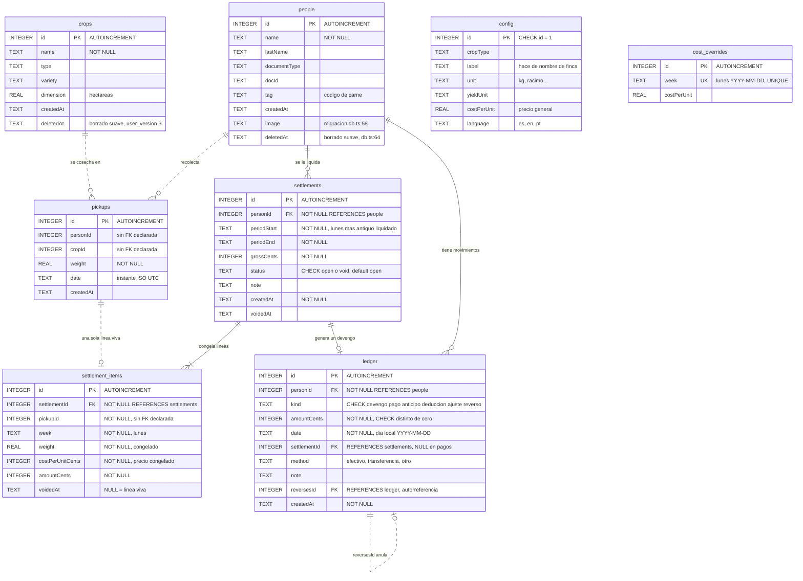
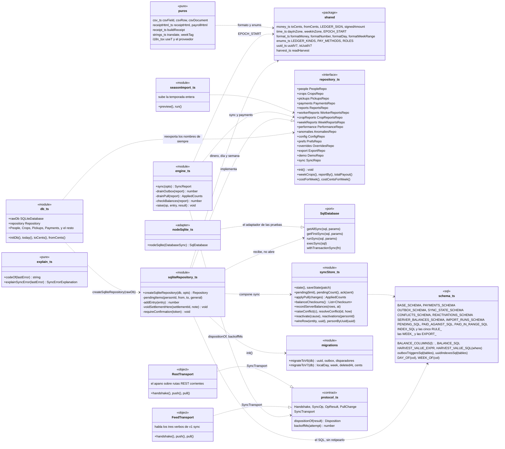
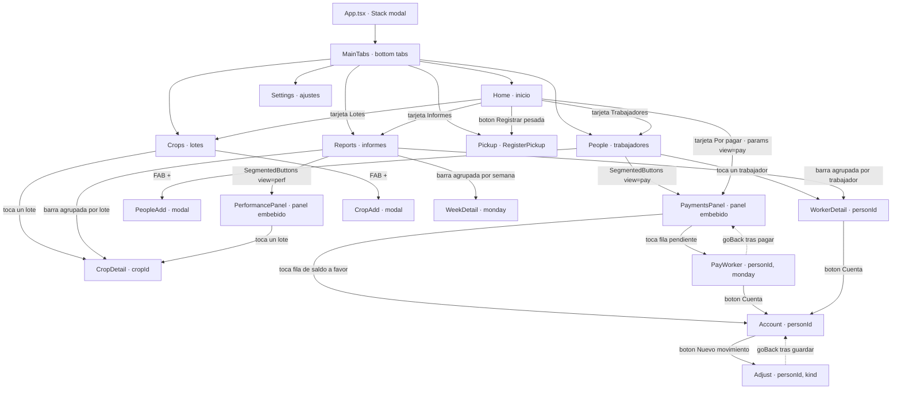
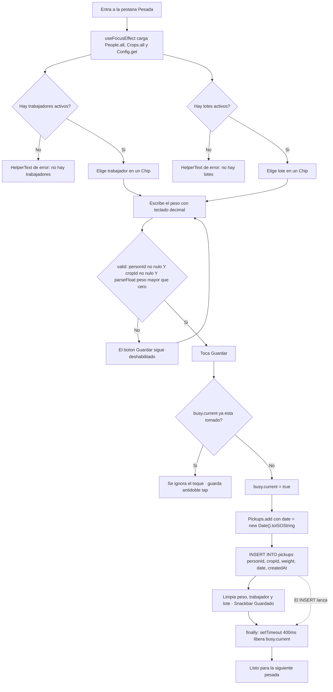
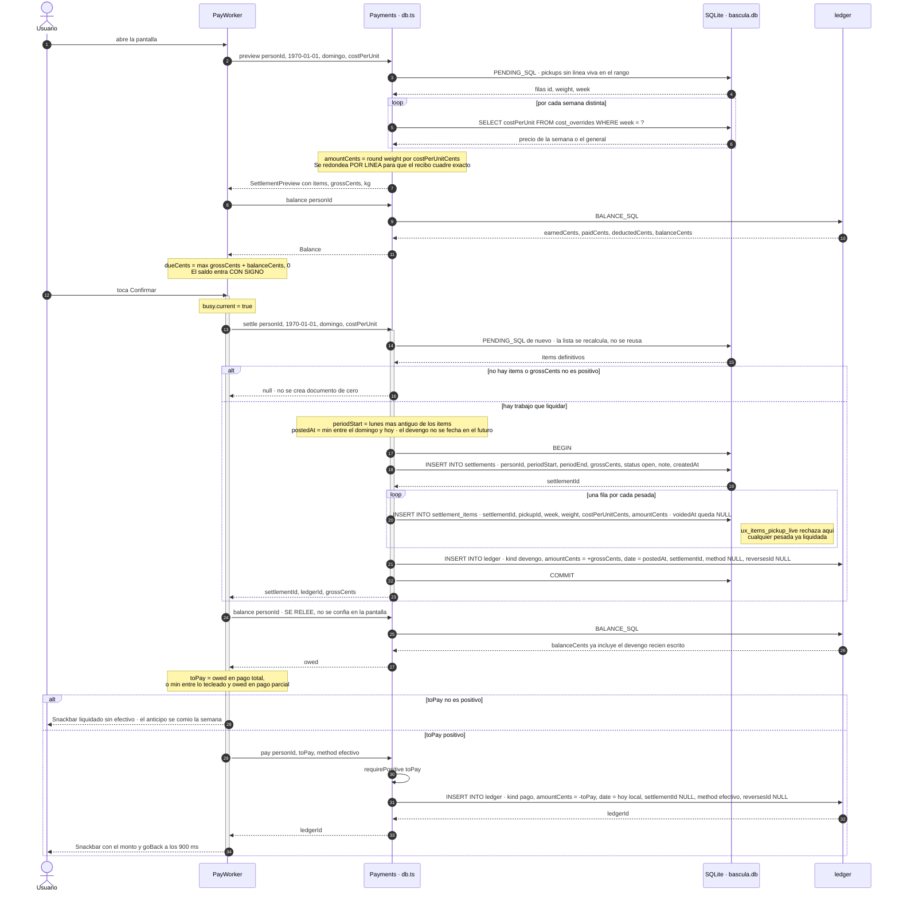
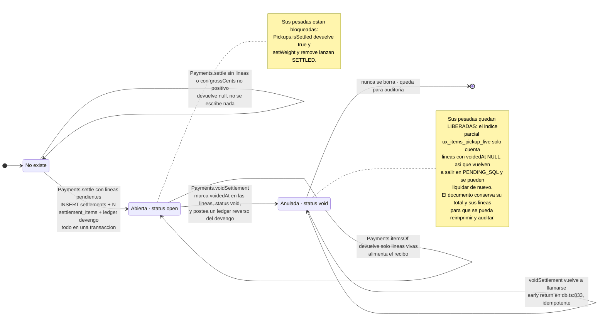

# Báscula móvil — diagramas de arquitectura

Documentación de ingeniería de la app **`apps/mobile`** tal como está hoy en la
rama `feat/api-web-multitenant`: Expo / React Native + TypeScript sobre SQLite
local, sin red, sin cuentas y sin servidor. Todo lo que sigue está tomado del
código; cada afirmación cita `archivo:línea`.

La app es de una sola finca y un solo teléfono. El fichero SQLite `bascula.db`
—abierto en `db.ts:52`— es la única copia de la temporada.

**Índice**

1. [Modelo de datos actual](#1-modelo-de-datos-actual-er)
2. [Diagrama de clases y módulos](#2-diagrama-de-clases-y-modulos)
3. [Mapa de navegación](#3-mapa-de-navegacion)
4. [Actividad: registrar una pesada](#4-actividad-registrar-una-pesada)
5. [Actividad: liquidar y pagar](#5-actividad-liquidar-y-pagar)
6. [Secuencia: liquidación](#6-secuencia-liquidacion)
7. [Máquina de estados de una liquidación](#7-maquina-de-estados-de-una-liquidacion)
8. [El libro de eventos](#8-el-libro-de-eventos)
9. [Deuda técnica y límites conocidos](#9-deuda-tecnica-y-limites-conocidos)

---

## 1. Modelo de datos actual (ER)

El esquema vive en `apps/mobile/src/schema.ts`, separado de `expo-sqlite` a
propósito para que la suite de pruebas pueda ejecutar el **mismo** SQL bajo
`node:sqlite` (`schema.ts:1-3`, `ledger.test.ts:44-47`).

Se crea en dos bloques: `BASE_SCHEMA` (`schema.ts:5-31`) y `PAYMENTS_SCHEMA`
(`schema.ts:33-84`), más las columnas añadidas por migración en
`db.ts:56-73` y `db.ts:106-170`.

### Versión del esquema

`SCHEMA_VERSION = 4` (`db.ts:89`). Un fichero al día tiene `PRAGMA
user_version = 4`.

| `user_version` | Qué introdujo | Dónde |
|---|---|---|
| 0 → 1 | Sólo `BASE_SCHEMA`. Sin migración numerada; las columnas `people.image`, `people.deletedAt` y `config.language` se añaden con `ALTER TABLE` tolerante a fallo en cada arranque. | `db.ts:56-73` |
| 2 | `PAYMENTS_SCHEMA` completo: `settlements`, `settlement_items`, `ledger`. Además re-clava `cost_overrides.week` de la etiqueta `"2026-W34"` al **lunes** `YYYY-MM-DD`, resolviendo el choque de dos etiquetas heredadas que caen en el mismo lunes. | `db.ts:111-141` |
| 3 | `crops.deletedAt` — borrado suave de lotes para no dejar pesadas huérfanas. | `db.ts:143-151` |
| 4 | `settlement_items.voidedAt`. Anular una liquidación deja de borrar sus líneas: se marcan, y el candado anti doble pago pasa de `ux_items_pickup` a **`ux_items_pickup_live`**, un índice único **parcial** que sólo cuenta las líneas vivas. | `db.ts:153-169`, `schema.ts:60-61` |



> Las relaciones dibujadas con línea punteada (`..`) **no tienen `FOREIGN KEY`
> declarada** en el DDL, aunque `PRAGMA foreign_keys = ON` está activo
> (`schema.ts:7`). `pickups.personId`, `pickups.cropId` y
> `settlement_items.pickupId` son enteros sueltos: por eso todas las consultas
> hacen `LEFT JOIN` y `COALESCE(..., '?')`.

### Índices y restricciones que hacen el trabajo

| Objeto | Definición | Qué garantiza |
|---|---|---|
| `ux_items_pickup_live` | `UNIQUE ON settlement_items(pickupId) WHERE voidedAt IS NULL` (`schema.ts:60-61`) | **El candado anti doble pago.** Una pesada pertenece como máximo a una liquidación viva. Las líneas anuladas quedan para el registro pero liberan su pesada. |
| `ux_ledger_reverses` | `UNIQUE ON ledger(reversesId) WHERE reversesId IS NOT NULL` (`schema.ts:82-83`) | Un movimiento se reversa una sola vez. |
| `CHECK` de signo en `ledger` | `schema.ts:76-78` | `devengo` siempre positivo; `pago`, `anticipo` y `deduccion` siempre negativos; `ajuste` y `reverso` con signo libre. La convención de signos está impuesta por la base, no por el código. |
| `CHECK (amountCents <> 0)` | `schema.ts:69` | No existen movimientos de cero. Por eso `settle` devuelve `null` en vez de crear un documento de $0 (`db.ts:783`). |
| `ix_ledger_person` | `ledger(personId, date DESC, id DESC)` (`schema.ts:80`) | El orden en que `Payments.history` lee la cuenta. |

### Claves derivadas

Dos funciones SQL generan todas las agrupaciones temporales (`schema.ts:87-90`):

- `DAY_OF(col)` → `date(col,'localtime')` — día calendario **local**.
- `WEEK_OF(col)` → `date(col,'localtime','-6 days','weekday 1')` — **lunes** de
  la semana, como `YYYY-MM-DD`.

---

## 2. Diagrama de clases / módulos

**Reescrito en el sprint 8.** Lo que describía esta sección —un `db.ts` de
1.488 líneas que abría `bascula.db` a nivel de módulo y exportaba quince
objetos-namespace— dejó de existir hace tres sprints. `db.ts` son hoy 100
líneas de cableado: abre la única conexión, construye un `Repository` y
reexporta los mismos nombres que las pantallas siempre importaron. Toda la
lógica está en `data/sqliteRepository.ts`, que **recibe** un adaptador en vez
de abrir una conexión —que es exactamente lo que pedía la §9.2 de este mismo
documento— y por eso hay pruebas de `settle`, `pay`, `void`, `undo` y de cada
migración donde no había ninguna.

La forma sigue siendo la misma: no hay clases con herencia en ninguna parte.
`Repository` es una interfaz de objetos-namespace, y lo que el diagrama llama
clases son módulos, puertos y contratos — el estereotipo de cada caja lo dice.



> `csv.ts` y `harvest.ts` siguen sin conocer la base: las pantallas les pasan
> las filas ya leídas.

### Dirección real de las dependencias

Lo importante sigue siendo lo que **no** hay, y la lista es más corta que
antes porque el motivo por el que era larga se arregló:

- **`schema.ts` no importa nada.** Sigue siendo SQL puro, y ahora lo ejecutan
  tanto las suites que abren un `DatabaseSync(":memory:")` a mano
  (`ledger.test.ts`, `review.test.ts`, `week.test.ts`, `performance.test.ts`)
  como las que pasan por el repositorio real.
- **`sqliteRepository.ts` no abre ninguna conexión.** La recibe como
  `SqlDatabase`, que es un puerto de cinco métodos. `db.ts` le pasa
  `expo-sqlite`; `nodeSqlite.ts` le pasa `node:sqlite`. Esa única inversión es
  lo que convirtió las ocho suites de `schema.ts` en `repository.test.ts`,
  `migration.test.ts`, `sync.test.ts` y `seasonImport.test.ts`, que ejercitan
  **el mismo código que corre el teléfono**.
- **La única flecha que sube de un módulo puro a la base sigue siendo
  `receipt.ts → db.ts`**, y sólo por `fromCents` y dos tipos.
- **El motor de sincronización no conoce HTTP.** `engine.ts` habla
  `SyncTransport`, y las dos implementaciones —el feed y el apaño REST— son
  intercambiables. Ese corte se pagó solo cuando el servidor estrenó
  `/v1/sync/*`: un fichero nuevo y ni una línea en el motor, en el buzón, en
  las tarjetas ni en las pantallas.
- **`packages/shared` es la frontera con el servidor.** El dinero, el día, la
  semana y los conjuntos cerrados viven ahí porque una divergencia entre el
  teléfono, la API y la web cuesta dinero. El SQL **no** está ahí a propósito:
  lo que se comparte es el comportamiento, fijado por los casos de oro.

### Quién consume qué

| Módulo de datos | Pantallas |
|---|---|
| `Reports`, `Pickups.recent`, `Payments.pendingAll` | `Home.tsx` |
| `People`, `Payments.*` | `People.tsx`, `PaymentsPanel.tsx`, `Account.tsx`, `PayWorker.tsx`, `Adjust.tsx` |
| `Pickups.add` | `RegisterPickup.tsx` |
| `Pickups.setWeight` / `Pickups.remove` | `PerformancePanel.tsx` |
| `Performance`, `Anomalies` | `PerformancePanel.tsx` |
| `WorkerReports` + `Payments.fullBalance` | `WorkerDetail.tsx` |
| `CropReports` + `harvest.ts` | `CropDetail.tsx` |
| `WeekReports` | `WeekDetail.tsx`, `PaymentsPanel.tsx` |
| `Config`, `Overrides`, `Export`, `Demo` + `csv.ts` | `Settings.tsx` |
| `receiptHtml.payrollHtml` | `PaymentsPanel.tsx` |
| `receiptHtml.receiptHtml` + `receipt.buildReceipt` | `Account.tsx` |
| `Sync` + `SyncProvider` + `explain.ts` | `SyncStatus.tsx`, `SyncSetup.tsx`, `SeasonImport.tsx`, `SyncChip.tsx` |

---

## 3. Mapa de navegación

`App.tsx` monta un `NativeStackNavigator` con `MainTabs` dentro
(`App.tsx:114-161`). Hay **seis pestañas** y **ocho pantallas de pila**, más
**dos paneles embebidos** que no son rutas: `PaymentsPanel` y
`PerformancePanel` se montan como componentes dentro de otra pantalla, tras un
`SegmentedButtons`.

`PaymentsPanel` vive dentro de `People` y no como séptima pestaña por una razón
explícita en `People.tsx:27-28`: a 360dp un séptimo ítem deja cada pestaña por
debajo del objetivo táctil de 48dp.



Referencias: `App.tsx:100-157` (registro de rutas), `types.ts:4-24`
(parámetros), `Home.tsx:86,92,98,103,128`, `People.tsx:53`, `Crops.tsx:27,43`,
`Reports.tsx:119,235-238`, `PerformancePanel.tsx:166`, `PayWorker.tsx:242`,
`WorkerDetail.tsx:85`, `Account.tsx:216`, `PaymentsPanel.tsx:316,348`.

---

## 4. Actividad: registrar una pesada

Pantalla `RegisterPickup.tsx`. Es el camino más caliente de la app: el que se
recorre con guantes, de pie, junto a la báscula.



### Lo que hay que saber de este flujo

- **La validación vive en la pantalla, no en la capa de datos.**
  `valid` (`RegisterPickup.tsx:26`) es la única barrera: `Pickups.add`
  (`db.ts:249-253`) inserta lo que le den, sin comprobar signo ni finitud.
  Compárese con `Pickups.setWeight` (`db.ts:233-242`), que sí valida
  `Number.isFinite(weight) && weight > 0` y lanza `BADWEIGHT`.
- **El candado `busy` es un `useRef`, no estado** (`RegisterPickup.tsx:30`).
  Se libera con un `setTimeout` de 400 ms dentro de un `finally` porque la
  pantalla es una pestaña y **nunca se desmonta**: una bandera atascada dejaría
  el botón muerto hasta reiniciar la app (`RegisterPickup.tsx:47-52`).
  El comentario de `RegisterPickup.tsx:28-29` lo dice explícito: existe la
  regla de anomalía que detecta dos pesadas idénticas en tres minutos, y es
  mejor no crearlas.
- **`date` se guarda como instante UTC** (`RegisterPickup.tsx:40`). Todas las
  agregaciones lo convierten después con `'localtime'`
  (`DAY_OF` / `WEEK_OF`, `schema.ts:87-90`).
- No hay confirmación ni pantalla intermedia: guardar es un solo toque y la
  corrección posterior se hace desde el panel de rendimiento
  (`PerformancePanel.tsx:307-347`), que es donde `Pickups.setWeight` y
  `Pickups.remove` pueden lanzar `SETTLED` si la pesada ya está liquidada.

---

## 5. Actividad: liquidar y pagar

Hay **dos caminos** desde el panel de pagos, y ambos ejecutan la misma
secuencia lógica —*liquidar primero, luego pagar lo que diga el saldo*— con
matices distintos.

```mermaid
flowchart TD
    START["Pestana Trabajadores · segmento Pagos · PaymentsPanel"]
    START --> LOAD["load: Payments.pendingAll con upTo = domingo de la semana + Payments.balances"]
    LOAD --> LOCK1["CANDADO 1 · pendingAll excluye toda pesada con linea viva en settlement_items"]
    LOCK1 --> SHOW["Muestra filas pendientes, el total neto y la tarjeta de saldos a favor"]

    SHOW --> NET["netOf fila = max monto pendiente + saldo, 0 · el saldo entra CON SIGNO"]

    NET --> CHOICE{"Que hace el usuario"}

    CHOICE -->|"Toca una fila"| IND["PayWorker · personId + monday"]
    CHOICE -->|"Pagar a todos"| BULK["Dialogo con checkbox por trabajador"]
    CHOICE -->|"Imprimir planilla"| ROLL["printPayroll"]
    CHOICE -->|"Toca un saldo a favor"| ACC["Account · personId"]

    IND --> IP["Payments.preview desde 1970-01-01 hasta el domingo"]
    IP --> IDUE["dueCents = max grossCents + creditCents, 0"]
    IDUE --> IMODE{"Pago total o parcial?"}
    IMODE -->|Parcial| ITYPE["Escribe monto o usa un chip rapido"]
    IMODE -->|Total| ICONF
    ITYPE --> ICONF["Toca Confirmar"]
    ICONF --> IBUSY{"busy.current tomado?"}
    IBUSY -->|Si| IIGN["Se ignora"]
    IBUSY -->|No| SETTLE

    BULK --> BRUN["runBulk: recorre los seleccionados uno a uno"]
    BRUN --> SETTLE

    SETTLE["Payments.settle personId, 1970-01-01, domingo, costPerUnit"]
    SETTLE --> S0{"Hay lineas pendientes Y grossCents mayor que cero?"}
    S0 -->|No| SNULL["Devuelve null · no se crea documento de cero"]
    S0 -->|Si| STX["TRANSACCION: INSERT settlements + N settlement_items + 1 ledger devengo"]
    STX --> LOCK2["CANDADO 2 · ux_items_pickup_live rechaza el INSERT si la pesada ya tiene linea viva"]

    LOCK2 --> BAL["owed = Payments.balance personId .balanceCents · SE RELEE DEL LEDGER"]
    BAL --> SALDO["AQUI SE CALCULA EL SALDO A FAVOR: la suma de todo el ledger, con anticipos ya restados"]

    SALDO --> TOPAY{"toPay mayor que cero?"}
    TOPAY -->|No| NOCASH["Liquidado pero sin efectivo: el anticipo se comio la semana · Snackbar"]
    TOPAY -->|Si| PAY["Payments.pay personId, toPay · INSERT ledger kind pago con amountCents negativo"]

    PAY --> AFTER["Si sobra, el resto queda como saldo a favor del trabajador"]
    AFTER --> IND2{"Camino individual o masivo?"}
    IND2 -->|Individual| BACK["goBack a los 900 ms"]
    IND2 -->|Masivo| UNDO["Guarda lastRun con los ids de pago y de liquidacion · Snackbar 15 s con Deshacer"]

    UNDO --> UACT{"Toca Deshacer?"}
    UACT -->|Si| URUN["Payments.undoRun: reversa cada pago y anula cada liquidacion"]
    UACT -->|No| DONE

    SNULL --> DONE["Vuelve al panel · load recarga"]
    NOCASH --> DONE
    BACK --> DONE
    URUN --> DONE

    ROLL --> RH["Payments.balances + Payments.history por persona filtrando pagos con date mayor o igual al lunes"]
    RH --> RKG["WeekReports.byWorker para los kilos reales de la semana"]
    RKG --> RPDF["payrollHtml · Print.printAsync · PDF de planilla con una firma por trabajador"]

    ACC --> APDF["Account: elige la liquidacion abierta mas reciente"]
    APDF --> AITEMS["Payments.itemsOf · SOLO lineas vivas, un recibo no documenta trabajo anulado"]
    AITEMS --> AOUT{"Imprimir o compartir?"}
    AOUT -->|Imprimir| APRINT["receiptHtml · Print.printAsync · PDF de recibo con firma"]
    AOUT -->|Compartir| ATXT["buildReceipt · texto plano · Share.share a WhatsApp"]
```



### Dónde está cada cosa

**El candado anti doble pago actúa en dos niveles, y son distintos:**

1. **Filtro de lectura** — `PENDING_SQL` (`schema.ts:112-119`) y
   `Payments.pendingAll` (`db.ts:1045`) excluyen con
   `pk.id NOT IN (SELECT pickupId FROM settlement_items WHERE voidedAt IS NULL)`.
   Es lo que hace que una pesada ya liquidada simplemente no aparezca.
2. **Restricción de escritura** — el índice único parcial
   `ux_items_pickup_live` (`schema.ts:60-61`). Es la garantía real: aunque el
   filtro fallara, el `INSERT INTO settlement_items` dentro de la transacción
   de `settle` (`db.ts:800-811`) reventaría y la transacción entera se
   revertiría.

Hay un tercer candado, de interfaz: el `useRef busy` en `PayWorker.tsx:92` y
`Adjust.tsx:51`, contra el doble toque con guantes.

**Dónde se calcula el saldo a favor:** en ninguna columna. Se **deriva** con
`BALANCE_SQL` sobre el ledger cada vez que se pregunta. En el flujo de pago
aparece tres veces:

- `PayWorker.tsx:59` y `:68` — para *mostrar* `dueCents = max(gross + credit, 0)`.
  El comentario de `PayWorker.tsx:64-67` explica por qué el saldo entra
  **con signo**: un saldo negativo es un anticipo ya entregado y debe reducir
  el pago; recortarlo a cero regalaría el anticipo cada semana y la deuda
  nunca se consumiría.
- `PayWorker.tsx:101` y `PaymentsPanel.tsx:154` — para *decidir cuánto pagar*,
  **releído después de liquidar**. El comentario de `PayWorker.tsx:98-99` es
  la regla: «liquida primero para que el devengo esté en los libros, luego
  paga lo que el ledger dice que se debe, nunca el monto que mostraba la
  pantalla».
- `PaymentsPanel.tsx:107` — `netOf`, para que el total del panel prometa
  exactamente el efectivo que va a salir de la caja.

**El PDF** sale por dos sitios distintos, y ninguno de los dos está en
`PayWorker`:

- `Account.printReceipt` (`Account.tsx:95-126`) → `receiptHtml`
  (`receiptHtml.ts:43`) → `Print.printAsync`. Es el recibo de una persona.
  Sólo se habilita si `hasSettlement` (`Account.tsx:58`, `:237`).
- `PaymentsPanel.printPayroll` (`PaymentsPanel.tsx:204-248`) → `payrollHtml`
  (`receiptHtml.ts:181`) → `Print.printAsync`. Es la planilla de nómina de la
  semana, con una firma por fila.
- Además, `Account.share` (`Account.tsx:130-164`) construye la versión en
  **texto plano** con `buildReceipt` (`receipt.ts:23`) y la manda por
  `Share.share`. El comentario de `receipt.ts:17-22` justifica la decisión:
  texto y no PDF porque llega legible en el propio chat, sobrevive a cualquier
  teléfono y no necesita visor ni permiso de almacenamiento.

**Tolerancia a fallos del pago masivo:** `runBulk` (`PaymentsPanel.tsx:137-178`)
envuelve cada trabajador en su propio `try/catch`; un fallo no tumba la nómina
del resto. El `settlementId` se apunta en `settlements[]` **antes** de intentar
el pago (`PaymentsPanel.tsx:159-162`), porque `settle` ya hizo commit y la
liquidación tiene que quedar deshacible aunque `pay` lance.

---

## 6. Diagrama de secuencia: liquidación

Camino individual completo, desde `PayWorker.confirm` (`PayWorker.tsx:94-122`)
hasta el ledger. Las escrituras están anotadas fila por fila.



### Resumen de escrituras de una liquidación con pago

| Tabla | Filas | Valores clave |
|---|---|---|
| `settlements` | **1** | `status = 'open'`, `periodStart` = lunes más antiguo de los items (no el `from` recibido), `periodEnd` = el `to` recibido, `grossCents` = suma de las líneas |
| `settlement_items` | **N**, una por pesada | `pickupId`, `week`, `weight` y `costPerUnitCents` **congelados**; `amountCents` redondeado por línea; `voidedAt = NULL` |
| `ledger` | **1** `devengo` | `amountCents = +grossCents`, `date = min(to, hoy)`, `settlementId` apuntando al documento |
| `ledger` | **1** `pago` | `amountCents = -toPay`, `date = hoy`, `method = 'efectivo'`, **`settlementId = NULL`** |

El `pago` **no queda enlazado a la liquidación** (`db.ts:874`). Es una decisión
de diseño con consecuencias: ver el punto 3 de la sección 9.

Anular después escribe una fila más:

| Tabla | Efecto de `voidSettlement` |
|---|---|
| `settlement_items` | `UPDATE ... SET voidedAt = now WHERE settlementId = ?` — todas las líneas, vivas o no |
| `settlements` | `UPDATE ... SET status = 'void', voidedAt = now` |
| `ledger` | **1** `reverso` con `amountCents = -devengo.amountCents` — negativo —, `reversesId` = id del devengo, `settlementId` conservado |

---

## 7. Máquina de estados de una liquidación

`settlements.status` sólo admite dos valores por `CHECK`: `'open'` y `'void'`
(`schema.ts:40`). No hay estado «pagada»: el pago no vive en el documento sino
en el ledger.



### Las transiciones que **no** existen

- **No hay `void → open`.** Anular es definitivo. Rehacer el trabajo significa
  crear una liquidación nueva, que tomará las mismas pesadas ya liberadas.
- **No se puede editar una liquidación abierta.** No hay ningún `UPDATE` sobre
  `settlements` fuera de la anulación, ni sobre `settlement_items` salvo el
  `voidedAt`. El monto y el precio quedan congelados en el momento de liquidar.
- **No se puede borrar.** Ningún `DELETE FROM settlements` en todo `db.ts`
  salvo `Demo.clear` (`db.ts:484`).
- **No se puede corregir una pesada liquidada.** `Pickups.setWeight` y
  `Pickups.remove` consultan `isSettled` primero y lanzan `SETTLED`
  (`db.ts:234,245`). El comentario de `db.ts:223-226` da la razón: su precio
  está congelado y ya se pagó sobre ella, así que corregirla cambiaría en
  silencio dinero que ya cambió de manos. Hay que anular la liquidación
  primero, y esa es una decisión del usuario, no un efecto secundario de una
  edición. La interfaz cierra el círculo: `PerformancePanel` muestra el mensaje
  `perf.settled` (`PerformancePanel.tsx:321,339`) y `Account` ofrece anular
  tocando el devengo (`Account.tsx:253-257`).

### Cómo la interfaz evita anular dos veces

`Account.tsx:65-67` construye el conjunto `voided` con los `reversesId` de la
historia. Un devengo que ya tiene reverso se tacha
(`styles.voidedRow`, `Account.tsx:258`) y deja de ser pulsable. Sin eso, como
la liquidación anulada conserva su devengo en la historia junto a su reverso,
la misma se podría «anular» una y otra vez, informando éxito cada vez.

---

## 8. El libro de eventos

### Por qué el ledger es append-only

`ledger` es un diario contable, no un estado mutable. En todo `db.ts` **no
existe un solo `UPDATE ledger` ni un `DELETE FROM ledger`** fuera de
`Demo.clear`. Un error no se corrige editando la fila: se cancela con su
opuesta (`db.ts:925`). Esa es la razón por la que existe el `kind = 'reverso'`
y el `reversesId` autorreferencial.

Tres consecuencias prácticas, todas visibles en el código:

1. **La historia que ve el trabajador es la verdad completa.**
   `Account.tsx:249-273` pinta el ledger tal cual, incluidos los reversos, con
   el original tachado. Un pago mal hecho queda en la lista con su cancelación
   al lado, no desaparece.
2. **Nada se puede pagar dos veces sin dejar rastro.** El
   `UNIQUE ON ledger(reversesId)` (`schema.ts:82-83`) más la comprobación de
   `Payments.reverse` (`db.ts:932-936`) impiden reversar dos veces el mismo
   movimiento.
3. **El saldo nunca se guarda.** No hay columna de saldo en ninguna tabla. Se
   recalcula sumando el diario, así que es imposible que el saldo y sus
   movimientos se contradigan.

### La tabla de signos por `kind`

La convención es **positivo = la finca le debe al trabajador**. Un saldo
positivo son los ahorros del trabajador en poder de la finca
(`db.ts:629-631`, `schema.ts:92-95`).

| `kind` | Signo de `amountCents` | Impuesto por | Significado | Quién lo escribe |
|---|---|---|---|---|
| `devengo` | **> 0** obligatorio | `CHECK` `schema.ts:76` | El trabajo liquidado que la finca reconoce deber | `Payments.settle`, `db.ts:813-822` |
| `pago` | **< 0** obligatorio | `CHECK` `schema.ts:77` | Efectivo entregado al trabajador | `Payments.pay`, `db.ts:863-879` |
| `anticipo` | **< 0** obligatorio | `CHECK` `schema.ts:77` | Dinero adelantado antes de liquidar | `Payments.advance`, `db.ts:881-893` |
| `deduccion` | **< 0** obligatorio | `CHECK` `schema.ts:77` | Descuento de comida, alojamiento, herramienta, tienda u otro | `Payments.deduct`, `db.ts:895-907` |
| `ajuste` | **libre** | `CHECK` `schema.ts:78` | Corrección que puede ir en cualquier dirección | `Payments.adjust`, `db.ts:910-923` |
| `reverso` | **libre**, opuesto al original | `CHECK` `schema.ts:78` | Cancelación de otro movimiento; `reversesId` apunta al que anula | `Payments.reverse` y `Payments.voidSettlement`, `db.ts:848-857`, `db.ts:937-946` |

Los métodos reciben el importe **en positivo** y el signo lo pone la capa de
datos: `pay`, `advance` y `deduct` niegan lo que reciben tras pasar por
`requirePositive` (`db.ts:726-729`). El comentario de `db.ts:862` lo dice:
«los montos llegan positivos; el signo es nuestro».

El truco fino está en `reverso`: como puede ir en cualquier dirección, el
desglose se distingue **por signo, no por tipo**. Reversar un devengo es
negativo y descuenta de lo ganado; reversar un pago es positivo y descuenta de
lo pagado (`schema.ts:92-95`).

### Cómo se deriva el saldo — `BALANCE_SQL`

```sql
  SELECT ? AS personId,
         COALESCE(SUM(CASE WHEN kind = 'devengo' THEN amountCents
                           WHEN kind = 'reverso' AND amountCents < 0 THEN amountCents END),0)
           AS earnedCents,
         COALESCE(-SUM(CASE WHEN kind IN ('pago','anticipo') THEN amountCents
                            WHEN kind = 'reverso' AND amountCents > 0 THEN amountCents END),0)
           AS paidCents,
         COALESCE(-SUM(CASE WHEN kind = 'deduccion' THEN amountCents END),0) AS deductedCents,
         COALESCE(SUM(amountCents),0) AS balanceCents,
         MAX(date) AS lastMovementAt
    FROM ledger WHERE personId = ?
```

`schema.ts:97-109`. Se invoca desde `Payments.balance` con el `personId`
pasado **dos veces**: una para la columna literal y otra para el `WHERE`
(`db.ts:967`).

Lo que hay que leer en esa consulta:

- **`balanceCents` es simplemente `SUM(amountCents)`.** Todo lo demás —
  `earnedCents`, `paidCents`, `deductedCents` — es desglose para la interfaz.
  El saldo es la suma cruda del diario, y por eso no puede desalinearse de sus
  movimientos.
- `paidCents` y `deductedCents` se **niegan** al agregarlos, porque las filas
  están guardadas en negativo y la interfaz quiere mostrar magnitudes.
- Los `reverso` se reparten por signo entre `earnedCents` y `paidCents`, como
  se explicó arriba.
- Los `ajuste` **no aparecen en ningún desglose**, pero sí en `balanceCents`.
  Es coherente con que un ajuste no es ni trabajo ni efectivo.

`Payments.balances()` (`db.ts:982-1000`) hace lo mismo para toda la finca de un
tirón, con `LEFT JOIN` desde `people` — incluidos los trabajadores borrados en
suave: «el dinero nunca se esconde sólo porque alguien salió de la lista
activa» (`db.ts:980-981`). Filtra con
`HAVING balanceCents <> 0 OR earnedCents <> 0`.

`Payments.farmTotals()` (`db.ts:1071-1082`) agrega un nivel más: suma los
saldos positivos como `owedCents`, los negativos como `overpaidCents` y cuenta
cuántos trabajadores tienen ahorros.

**Todo en centavos `INTEGER`.** `REAL` derivaría en saldos que se arrastran
meses (`db.ts:628-630`). `toCents` / `fromCents` en `db.ts:694-695`.

---

## 9. Deuda técnica y límites conocidos

**Reescrita en el sprint 8, y esa es la parte importante.** Esta sección se
convirtió en la lista de trabajo del equipo del teléfono, y describía un
`db.ts` de 1.488 líneas que dejó de existir hace tres sprints: mentía en lo
único para lo que servía. Todos los números de línea de la versión anterior
apuntaban a un fichero borrado.

Lo que queda abajo se leyó contra el código de hoy, punto por punto. Se
conservan los números de la numeración original —9.1 a 9.16— porque otros
documentos y varios comentarios del código los citan; lo que cambia es el
estado de cada uno.

### Lo que ya está cerrado

| # | Era | Cómo se cerró |
|---|---|---|
| **9.1** | `undoRun` abría una transacción dentro de otra y el botón *Deshacer* nunca funcionó | El cuerpo de anular vive en `voidSettlementHere`, **sin** transacción propia; `voidSettlement` y `undoRun` lo componen. Con pruebas: `repository.test.ts` deshace una nómina entera. |
| **9.2** | La conexión era un `openDatabaseSync` a nivel de módulo, así que nada de `db.ts` se podía probar | `createSqliteRepository(db)` recibe un puerto `SqlDatabase` de cinco métodos. `db.ts` le pasa expo-sqlite, `nodeSqlite.ts` le pasa `node:sqlite`, y las suites ejercitan el mismo código que corre el teléfono. |
| **9.3** | Los pagos no apuntaban a su liquidación y el recibo **adivinaba** filtrando por fecha | `payments.pay` acepta `settlementId` y `PAID_AGAINST_SQL` lo consulta. Dejó de ser una conjetura. |
| **9.4** | El saldo estaba implementado dos veces, y sólo una cubierta por pruebas | `BALANCE_COLUMNS(alias)` en `schema.ts`. **Eran tres**, no dos: `BALANCE_SQL`, la lista de la pantalla de nómina y el resumen del `seasonExport` —la cifra que `POST /v1/import/season` cuadra al centavo antes de escribir un año de nómina—. Una prueba compara las dos puertas. |
| **9.5** | El valor cosechado estaba implementado dos veces, una de ellas con N+1 | `HARVEST_VALUE_EXPR` / `HARVEST_VALUE_SQL(where)`. `totalPayout` y `workerReports.payout` dejaron de agrupar por semana en un bucle de JavaScript con una consulta por semana. Una prueba fija que las cinco puertas dan la misma cifra. |
| **9.7** | Nada se podía sincronizar: claves locales, sin metadatos, sin `farmId`, sin borrado suave en `pickups` | UUIDv7 en cada tabla que viaja, buzón con disparadores, `farmId` en `config` con guardia, `pickups.deletedAt` y la vista `pickups_live`. §3 de `sincronizacion.md` corre encima de esto. |
| **9.8** | La zona horaria era la del teléfono, y cambiarla recategorizaba semanas ya liquidadas | La finca manda: `adoptTimezone` la toma del handshake, `localDay` y `week` están materializados, y `dayInZone`/`weekInZone` viven en `packages/shared`. |
| **9.10** | `setWeight` validaba el peso y `add` no validaba nada | Una sola guardia, las dos puertas. |
| **9.11** | El borrado suave se aplicaba de forma inconsistente | Cerrado en el sprint 8 con **la regla del servidor**: «gente con posición, no gente activa». Los conteos de portada cuentan la lista activa; los rankings no filtran a nadie —si filtraran dejarían de sumar el total de la finca que se enseña justo encima— y traen `active` para que la fila lo diga. `reports.byCrop` y `weekCrops` **sí** filtraban, así que la pestaña de cultivos no cuadraba con la de recolectores: dos pestañas de una misma tarjeta contradiciéndose. |
| **9.13** | La secuencia liquidar → releer saldo → pagar estaba escrita dos veces dentro de React | `payments.runPayroll` y `payments.undoRun`. Las pantallas presentan. |

### 9.6 Lo que no escala — muy reducido, no cerrado

Ya no está: `pickups` tiene índices (`ix_pickups_date`, `ix_pickups_dup`), las
cinco reglas de anomalías tienen ventana temporal y `LIMIT`, la planilla dejó
de hacer 2N consultas, y el N+1 de `costForWeek` desapareció con la 9.5.

Sigue estando:

- **`payments.history` trunca en silencio.** `LIMIT 200` por defecto. Con una
  temporada larga la historia de un trabajador deja de verse entera y nada lo
  dice.
- **La ventana de anomalías es una decisión de producto disfrazada de límite
  técnico.** Lo que cae fuera de la ventana no se revisa nunca.

### 9.9 Integridad referencial incompleta — abierta, y esta vez evaluada

Sigue igual: `pickups.personId`, `pickups.cropId` y `settlement_items.pickupId`
no tienen `FOREIGN KEY` (`schema.ts`), aunque `PRAGMA foreign_keys` está
activo y sí protege `settlements.personId`, `ledger.personId`,
`settlement_items.settlementId` y `ledger.settlementId`.

**No se arregló a propósito, y conviene que quede escrito por qué.** SQLite no
tiene `ALTER TABLE ADD FOREIGN KEY`: añadirla exige el rodeo de doce pasos
—crear la tabla nueva, copiar, borrar, renombrar— sobre `pickups`, que es la
tabla que más crece, en el teléfono que guarda la única copia de la temporada
de una finca, en plena cosecha. El riesgo de esa migración es mayor que el del
defecto que corrige.

Lo que sí hay entretanto: cada lectura pasa por `LEFT JOIN` + `COALESCE`, así
que un huérfano se ve como `'Unknown'` en vez de desaparecer, y `applyPull`
cuenta los huérfanos que llegan del feed. Cuándo hacerlo: fuera de cosecha, con
la temporada ya subida al servidor (§8), que es cuando existe una segunda
copia.

### 9.12 El rango de liquidación — medio cerrada, y la otra mitad es una pregunta de contrato

Cerrado: `EPOCH_START` y `endOfWeek` están una sola vez, en
`packages/shared`, en vez de duplicados en las dos pantallas de pago; y
`periodStart` ya **no** es el rango pedido sino el que las líneas cubren de
verdad.

Abierto: `settlements.periodEnd` guarda el `to` **sin recortar**, así que puede
quedar fechado en el futuro mientras el `devengo` sí se recorta a hoy. La
lectura anterior era que esto es un defecto del teléfono. Comprobado contra la
API, no lo es del todo:

- El servidor hace **exactamente lo mismo**: `store.Settle` escribe
  `PeriodEnd: to`, el rango pedido.
- `openapi.yaml` documenta el significado de `periodStart` —«el período
  realmente cubierto, no la ventana sobre la que preguntó el llamador»— y **no
  dice nada** del de `periodEnd`.
- La migración sólo comprueba `period_end >= period_start`.

Es decir: los dos lados escriben lo mismo en esa columna, y `POST
/v1/import/season` mete los dos en la misma tabla. Recortarlo sólo en el
teléfono no arreglaría nada; crearía una divergencia en una columna de dinero.
**Es una pregunta para quien lleva la API: ¿`periodEnd` es el rango pedido o el
cubierto?** Hasta que se responda, el teléfono hace lo que hace el servidor,
que es la única propiedad que aquí importa.

### 9.14 Superficie de API sin consumidor y sin interfaz — abierta

- `payments.farmTotals()` — ninguna pantalla la llama.
- `payments.itemsOfAll()` — ninguna la llama, pese a existir para poder
  auditar líneas anuladas.
- `payments.adjust()` — el `kind = 'ajuste'` está en el `CHECK`, en el desglose
  y en el icono de la cuenta, pero **no hay pantalla que lo cree**:
  `Adjust.tsx` sólo escribe `anticipo` y `deduccion`.
- `payments.reverse()` — sólo se alcanza desde `undoRun`. Ya no está roto
  (9.1), pero sigue sin haber forma de reversar un movimiento suelto.

Ya no está en la lista `people.byTag`, que `PeopleAdd` usa para avisar de un
carné repetido.

### 9.15 Riesgos de operación — reducidos

Cerrados: `Demo.clear` y `Demo.seed` exigen teclear el nombre de la finca
—`seed` empieza por borrar, así que guardar sólo el botón que da más miedo
dejaba el agujero donde estaba—; el comentario obsoleto sobre la clave de
semana desapareció con el fichero que lo contenía; y ya hay una salida de
datos que no es un CSV compartido a mano: `POST /v1/import/season` sube la
temporada entera y la cuadra al centavo antes de escribir nada.

Sigue estando:

- **Una finca que todavía no ha hecho la mudanza del §8 no tiene copia de
  seguridad automática.** Si se pierde el teléfono, se pierde el registro.
- **Concurrencia**: en un teléfono con JavaScript síncrono no hay carrera
  posible; en la API multiusuario sí, y la red real es el índice
  `ux_items_pickup_live`. No es deuda de este lado.

### 9.17 Lo que la pantalla de sincronización todavía no sabe contar

Nuevo, del sprint 8. `explain.ts` cubre cada código que `protocol.ts` nombra y
una prueba lo obliga, así que ningún error llega como cadena cruda. Lo que
falta no son errores, son **estados**:

- **`AppliedCounts` no llega a ninguna pantalla.** El motor cuenta
  `workers`, `crops`, `pickups`, `prices`, `settlements`, `ledger`, `orphans`,
  `frozen`, `skippedPending` y `reactivated`, y ninguna de esas cifras se
  enseña. Una pasada que bajó cuatro mil cambios se ve igual que una que no
  bajó ninguno.
- **`orphans` ya no significa una sola cosa**, y por eso no se puede enseñar
  tal cual. Mezcla «llegó una fila cuyo padre todavía no ha llegado» —que se
  resuelve solo en la siguiente pasada— con «la línea de un jornal que este
  teléfono no puede colgar de ninguna pesada» —que es permanente y correcta
  (§2.2)—. Separarlas es trabajo, no una etiqueta.
- **La espera del backoff es invisible.** `sync_state.retryAt` y `attempts` se
  guardan y no se enseñan nunca; `engine.idleReport("BACKOFF")` no llega a
  `saveState`, así que la rama `sync.errBackoff` de `explain.ts` no es
  alcanzable desde la pantalla. El botón *Sincronizar* fuerza la pasada, así
  que nadie se queda bloqueado — pero la pantalla no sabe decir «no está
  parado, está esperando».
- **`behind` envejece dentro de la propia pasada.** Es la respuesta del
  handshake al **empezar**; después de drenar veinte páginas la pantalla sigue
  enseñando el número de antes. En un teléfono que lleva semanas sin señal eso
  se lee como que no avanza.

Cerrado en el sprint 8: `CURSOR_TOO_OLD` ya no es silencioso. `feedTransport`
lo sigue resolviendo solo —releer desde cero es la única respuesta correcta y
no hay nada que preguntar—, pero ahora lo **dice**: `PullResult.bootstrapped`
sube hasta una tarjeta que explica que el teléfono está bajando la temporada
otra vez y que no se perdió nada. Sin eso, el `behind` del siguiente handshake
salta de once a la temporada entera y un contador que parece haber ido para
atrás es como alguien concluye que el teléfono perdió la cosecha.

### 9.16 Lo que sí está listo para reutilizar

- **`schema.ts` entero.** Corre bajo `node:sqlite` en las suites tal cual.
- **`packages/shared`** ya es esto mismo, hecho: el dinero, el día, la semana,
  los conjuntos cerrados y los uuid, con los casos de oro fijando el
  comportamiento que no puede divergir.
- **`csv.ts`, `receiptHtml.ts`, `receipt.ts`, `strings.ts`** — puros, sin React
  y sin base de datos, con pruebas propias.
- **`protocol.ts`**: el contrato del sync no conoce HTTP. Cambiar el apaño REST
  por el feed real costó un fichero y ni una línea en el motor, en el buzón, en
  las tarjetas ni en las pantallas, que es la propiedad para la que se separó.
- **La forma del ledger.** Los seis `kind` cubren igual una recolección de
  café, un jornal y un contrato de poda.
- **El candado**: `UNIQUE(payable_id) WHERE voided_at IS NULL` es el mismo
  índice parcial con otro nombre de columna.

---

*Secciones 2 y 9 regeneradas en el sprint 8 leyendo `apps/mobile/src/db.ts`
(100 líneas), `data/repository.ts`, `data/sqliteRepository.ts`,
`data/syncStore.ts`, `schema.ts`, `sync/` y las 20 pantallas de
`apps/mobile/src/screens/`, contra `services/api` y `docs/sincronizacion.md`.*

*El resto del documento —§1 modelo de datos, §3 navegación, §4 a §7 los flujos
y la máquina de estados, §8 el libro de eventos— **no** se tocó. La
refactorización no lo invalidó: las tablas, las pantallas, la secuencia de una
liquidación y los signos del ledger son los mismos. Lo que cambió de sitio fue
el código que los ejecuta, y eso es lo que decían las secciones 2 y 9. Los
números de línea que quedan en esas otras secciones apuntan, como antes, a los
ficheros que las pantallas importan.*
