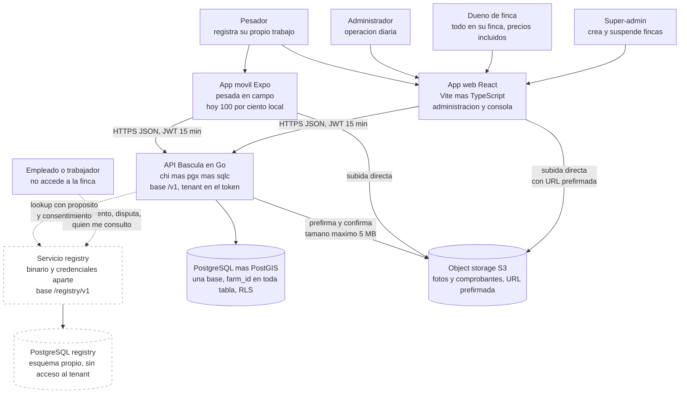
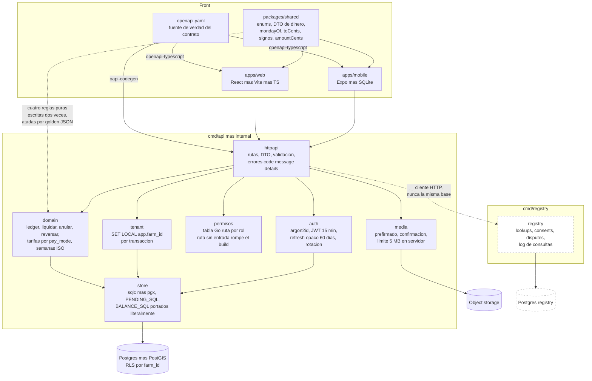
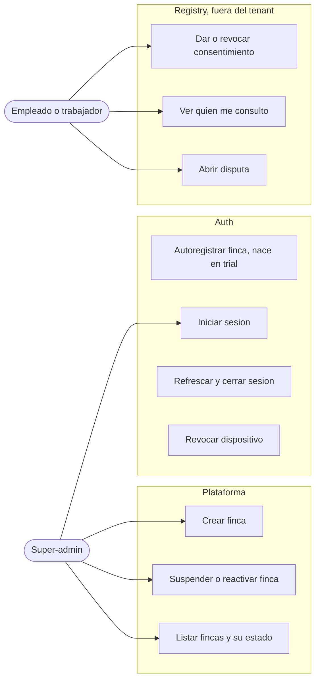
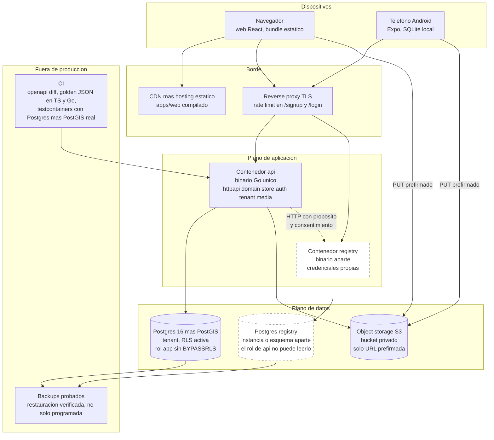

# Báscula — Vista de sistema

Diagramas del sistema nuevo: **API en Go** y **app web en React**, multitenant, para
fincas cafeteras.

Fuentes de verdad de este documento, en este orden:

1. `docs/casos-de-uso.md` — alcance (RSP-001 … RSP-033), escrito por el dueño.
2. `docs/arquitectura-api.md` — diseño de API, auth, PostGIS, `work_records`, `registry`.
3. `docs/plan-sprint-1.md` — el recorte de la primera entrega.
4. `docs/sync-and-roles.md` — roles y notas de sync.
5. `apps/mobile/src/schema.ts` y `db.ts` — el dominio contable que hay que preservar.

Los diagramas describen el **modelo objetivo** (los 33 casos). Lo que entra en el
Sprint 1 va marcado; lo que espera, también. Donde los casos de uso y el diseño
chocan, el choque está escrito en §7, no resuelto a la brava.

Invariantes que ningún diagrama puede contradecir: centavos `int64`; ledger
append-only que se corrige con `reverso`; semana = **fecha ISO del lunes**; fechas
de negocio en `farms.timezone`; IDs `UUIDv7` generados en el cliente; **eliminar
nunca borra** (`deleted_at` / `status='inactive'`).

---

## 1. Diagrama de contexto



**Cómo leer las líneas punteadas.** Todo lo punteado **no entra en el Sprint 1**:
`registry` es un producto distinto con riesgo legal propio (`arquitectura-api.md` §3)
y el empleado no tiene sesión en ninguna finca — su única relación con el sistema es
frente a `registry`, que es exactamente lo que lo hace defendible.

**El empleado no es un rol de finca.** Los cuatro roles con sesión son super-admin,
dueño, administrador y pesador (`sync-and-roles.md`, `arquitectura-api.md` §6). El
empleado aparece como actor porque RSP-009 le da tres derechos que sí se construyen:
leer quién lo consultó, dar o revocar consentimiento y abrir una disputa.

---

## 2. Diagrama de componentes

Layout plano en `internal/`, tal como quedó decidido: `httpapi`, `domain`, `store`,
`auth`, `tenant`, `media`, `registry`. Sin microservicios: **un binario**, más
`registry` compilable aparte desde el día 1.



Tres reglas que el diagrama codifica y que son de aceptación en cualquier PR:

- **`httpapi` nunca habla con `store`.** Todo lo que decide dinero pasa por `domain`,
  que es el único paquete con los `golden/*.json` encima.
- **`registry` no comparte conexión, credenciales ni esquema con el tenant.** La flecha
  es HTTP, no una llamada a función. Si algún día alguien la convierte en un `import`,
  el aislamiento se acabó.
- **El orden del middleware es `Auth → Tenant → Require(action)`.** Invertirlo pone un
  chequeo de permiso antes de saber de qué finca es la transacción.

---

## 3. Casos de uso UML

Mermaid no tiene diagrama de casos de uso, así que va como `graph LR` agrupado por
módulo. Está partido en dos lienzos por legibilidad: el primero es la operación de la
finca, el segundo son los actores de perímetro.

### 3.1 Operación de la finca

```mermaid
graph LR
    dueno(["Dueno"])
    admin(["Administrador"])
    pesador(["Pesador"])

    subgraph M1["Parcelas"]
        r001["RSP-001 Registrar parcela"]
        r002["RSP-002 Modificar parcela"]
        r003["RSP-003 Eliminar parcela"]
    end
    subgraph M2["Empleados"]
        r004["RSP-004 Registrar empleado"]
        r005["RSP-005 Modificar empleado"]
        r006["RSP-006 Eliminar empleado"]
        r007["RSP-007 Ver perfil y saldo"]
        r008["RSP-008 Pagar empleado"]
        r009["RSP-009 Consultar historial cross-tenant"]
    end
    subgraph M3["Actividades"]
        r010["RSP-010 Listar actividades"]
        r011["RSP-011 Registrar actividad"]
        r012["RSP-012 Modificar actividad"]
        r013["RSP-013 Eliminar actividad"]
        rpre["Definir precios y precio semanal"]
    end
    subgraph M4["Labores"]
        r014["RSP-014 Listar labores"]
        r015["RSP-015 Registrar labor"]
        r016["RSP-016 Modificar labor"]
        r017["RSP-017 Eliminar labor"]
    end
    subgraph M5["Inventario"]
        r018["RSP-018 Listar productos"]
        r019["RSP-019 Registrar producto"]
        r020["RSP-020 Modificar producto"]
        r021["RSP-021 Eliminar producto"]
        r025["RSP-025 Registrar inventario y stickers"]
    end
    subgraph M6["Ventas"]
        r026["RSP-026 Listar ventas"]
        r027["RSP-027 Registrar venta"]
        r028["RSP-028 Modificar venta"]
        r029["RSP-029 Eliminar venta"]
    end
    subgraph M7["Gastos"]
        r030["RSP-030 Listar gastos"]
        r031["RSP-031 Registrar gasto"]
        r032["RSP-032 Modificar gasto"]
        r033["RSP-033 Eliminar gasto"]
    end
    subgraph M8["Configuracion"]
        c1["Modificar datos de la finca"]
        c2["Gestion de usuarios"]
    end

    dueno --> r001
    dueno --> r002
    dueno --> r003
    dueno --> r004
    dueno --> r005
    dueno --> r006
    dueno --> r007
    dueno --> r008
    dueno --> r009
    dueno --> r010
    dueno --> r011
    dueno --> r012
    dueno --> r013
    dueno --> rpre
    dueno --> r014
    dueno --> r015
    dueno --> r016
    dueno --> r017
    dueno --> r018
    dueno --> r019
    dueno --> r020
    dueno --> r021
    dueno --> r025
    dueno --> r026
    dueno --> r027
    dueno --> r028
    dueno --> r029
    dueno --> r030
    dueno --> r031
    dueno --> r032
    dueno --> r033
    dueno --> c1
    dueno --> c2

    admin --> r001
    admin --> r002
    admin --> r004
    admin --> r005
    admin --> r007
    admin --> r008
    admin --> r009
    admin --> r010
    admin --> r011
    admin --> r012
    admin --> r014
    admin --> r015
    admin --> r016
    admin --> r018
    admin --> r019
    admin --> r020
    admin --> r025
    admin --> r026
    admin --> r027
    admin --> r028
    admin --> r030
    admin --> r031
    admin --> r032

    pesador --> r015
    pesador --> r014
```



### 3.2 Perímetro: super-admin y empleado



### 3.3 Qué puede hacer cada rol, sin ambigüedad

| Capacidad | Super-admin | Dueño | Administrador | Pesador | Empleado |
|---|---|---|---|---|---|
| Crear y suspender fincas | Sí | No | No | No | No |
| Leer datos de una finca | **No** | Sí | Sí | Recortado | No |
| Alta, modificación en los 8 módulos | No | Sí | Sí | No | No |
| **Eliminar** cualquier cosa, RSP-003/006/013/017/021/029/033 | No | **Sí** | **No** | No | No |
| **Precios**: `default_rate_cents`, `week_prices`, `costPerUnitCents` | No | **Sí** | **No** | **No lo ve** | No |
| Liquidar, pagar, anticipo, deducción, reverso, RSP-008 | No | Sí | Sí | No | No |
| Perfil y saldo del empleado, RSP-007 | No | Sí | Sí | No | No |
| Registrar labor, RSP-015 | No | Sí | Sí | Solo `work_unit` | No |
| Listar labores, RSP-014 | No | Todas | Todas | Solo `created_by = sub` | No |
| Leer empleados | No | Completo | Completo | `id, name, lastName, tag` | No |
| RSP-009 lookup cross-tenant | **No** | Sí | Sí | **403** | No aplica |
| Gestión de usuarios de la finca | No | Sí | No | No | No |
| Consentimiento, disputa, log de consultas | No | No | No | No | Sí |

Dos filas de esa tabla no salen de los casos de uso sino de `sync-and-roles.md`, y hay
que decirlo: los casos de uso atribuyen **todo** al "Administrador de Finca", incluidos
eliminar y definir precios. El diseño se los quita y se los deja al dueño. Ver §7.4.

La defensa no es la tabla, es el código: los permisos viven en **una tabla Go**, un test
de contrato recorre las rutas y afirma `403` para el pesador en toda ruta de dinero,
personas o registry, y **una ruta nueva sin entrada en esa tabla hace fallar el build**.

---

## 4. Modelo de datos objetivo

Postgres único, multitenant por `farm_id` y RLS. Todo lo que se puede dar de baja lleva
`deleted_at` o `status`; **ninguna ruta ejecuta `DELETE`**. Dinero siempre en
`amount_cents int8`.

```mermaid
erDiagram
    FARMS ||--o{ MEMBERSHIPS : "tiene"
    USERS ||--o{ MEMBERSHIPS : "pertenece"
    USERS ||--o{ REFRESH_TOKENS : "abre sesion"
    FARMS ||--o{ PLOTS : "posee"
    FARMS ||--o{ WORKERS : "emplea"
    FARMS ||--o{ ACTIVITIES : "define"
    FARMS ||--o{ WEEK_PRICES : "fija"
    FARMS ||--o{ PRODUCTS : "cataloga"
    FARMS ||--o{ WAREHOUSES : "tiene"
    FARMS ||--o{ SALES : "vende"
    FARMS ||--o{ EXPENSES : "gasta"
    FARMS ||--o{ MEDIA : "almacena"
    FARMS ||--o{ AUDIT_LOG : "registra"

    CROP_TYPES ||--o{ VARIETIES : "agrupa"
    CROP_TYPES ||--o{ PLOT_CROPS : "clasifica"
    VARIETIES ||--o{ PLOT_CROPS : "detalla"
    PLOTS ||--o{ PLOT_CROPS : "siembra"

    ACTIVITY_CATEGORIES ||--o{ ACTIVITIES : "agrupa"
    UNITS ||--o{ ACTIVITIES : "mide"
    ACTIVITIES ||--o{ WORK_RECORDS : "se ejecuta en"
    ACTIVITIES ||--o{ WEEK_PRICES : "tarifa por semana"
    WORKERS ||--o{ WORK_RECORDS : "ejecuta"
    WORKERS ||--o{ SETTLEMENTS : "se le liquida"
    WORKERS ||--o{ LEDGER : "acumula"
    WORKERS ||--o{ WORKER_NOTES : "recibe"
    WORKERS ||--o| MEDIA : "foto"

    WORK_RECORDS ||--o{ WORK_RECORD_PLOTS : "cubre"
    PLOTS ||--o{ WORK_RECORD_PLOTS : "es trabajado en"
    PLOT_CROPS ||--o{ WORK_RECORD_PLOTS : "sobre el cultivo"
    WORK_RECORDS ||--o| SETTLEMENT_ITEMS : "pagable reclamado por"
    SETTLEMENTS ||--o{ SETTLEMENT_ITEMS : "congela"
    SETTLEMENTS ||--o{ LEDGER : "genera devengo"
    LEDGER ||--o| LEDGER : "reversa"

    PRODUCT_CATEGORIES ||--o{ PRODUCTS : "agrupa"
    UNITS ||--o{ PRODUCTS : "unidad de almacenamiento"
    PRODUCTS ||--o{ STOCK_MOVEMENTS : "entra y sale"
    WAREHOUSES ||--o{ STOCK_MOVEMENTS : "guarda"
    PLOT_CROPS ||--o{ STOCK_MOVEMENTS : "procede de"
    PRODUCTS ||--o{ SALES : "se vende"
    MEDIA ||--o| SALES : "comprobante"
    ACTIVITIES ||--o{ EXPENSES : "gasto de actividad"
    PLOT_CROPS ||--o{ EXPENSES : "gasto de lote y cultivo"

    FARMS {
        uuid id PK
        text name
        text timezone "obligatoria, define el dia de negocio"
        text country
        text city
        text address
        text phone
        numeric area_ha
        text status "trial active suspended"
        timestamptz created_at
        timestamptz deleted_at
    }
    USERS {
        uuid id PK
        citext email UK
        text name
        text password_hash "argon2id"
        bool is_super_admin "fuera de todo tenant"
        timestamptz created_at
        timestamptz deleted_at
    }
    MEMBERSHIPS {
        uuid id PK
        uuid farm_id FK
        uuid user_id FK
        text role "owner admin weigher"
        text status
        timestamptz created_at
        timestamptz deleted_at
    }
    REFRESH_TOKENS {
        uuid id PK
        uuid user_id FK
        uuid farm_id FK
        text device_id
        text token_hash "opaco, 60 dias"
        uuid rotated_from FK
        timestamptz expires_at
        timestamptz revoked_at "reuso detectado mata la cadena"
    }
    PLOTS {
        uuid id PK
        uuid farm_id FK
        text name "RSP-001 nombre del lote"
        text department
        text municipality
        numeric area_ha "declarada por el dueno"
        geography boundary "Polygon 4326, PostGIS, sprint 2"
        text status "active inactive"
        timestamptz created_at
        timestamptz deleted_at
    }
    PLOT_CROPS {
        uuid id PK
        uuid farm_id FK
        uuid plot_id FK
        uuid crop_type_id FK
        uuid variety_id FK
        numeric area_ha
        date planted_at
        text status
        timestamptz deleted_at
    }
    CROP_TYPES {
        uuid id PK
        uuid farm_id FK
        text name "unico por farm_id y lower name"
        bool is_seed "cafe viene sembrado"
        timestamptz deleted_at
    }
    VARIETIES {
        uuid id PK
        uuid farm_id FK
        uuid crop_type_id FK
        text name "unico por farm_id crop_type_id lower name"
        timestamptz deleted_at
    }
    UNITS {
        uuid id PK
        uuid farm_id FK
        text name "kg arroba canasta bulto"
        text kind "work storage"
        timestamptz deleted_at
    }
    ACTIVITY_CATEGORIES {
        uuid id PK
        uuid farm_id FK
        text name "siembra mantenimiento cosecha"
        timestamptz deleted_at
    }
    WORKERS {
        uuid id PK
        uuid farm_id FK
        text name
        text last_name
        text document_type
        text document_number "unico por farm_id tipo numero"
        text phone
        text address
        text city
        text country
        text tag
        uuid photo_media_id FK
        text status "active inactive"
        timestamptz created_at
        timestamptz deleted_at
    }
    WORKER_NOTES {
        uuid id PK
        uuid farm_id FK
        uuid worker_id FK
        text body "append only, nunca sale de la finca"
        uuid created_by FK
        timestamptz created_at
    }
    ACTIVITIES {
        uuid id PK
        uuid farm_id FK
        uuid category_id FK
        text name
        text pay_mode "contract time_unit work_unit"
        text time_unit "jornal semanal quincenal mensual custom"
        int custom_qty
        text custom_period "dia mes ano"
        uuid work_unit_id FK
        int8 default_rate_cents "solo dueno"
        text rate_source "weekly_price fixed"
        text status
        timestamptz deleted_at
    }
    WORK_RECORDS {
        uuid id PK
        uuid farm_id FK
        uuid worker_id FK
        uuid activity_id FK
        date date_from
        date date_to "igual a date_from si rate_source weekly_price"
        numeric quantity
        int8 rate_cents "nulo solo si weekly_price"
        text note
        uuid created_by FK
        timestamptz created_at
        timestamptz deleted_at
    }
    WORK_RECORD_PLOTS {
        uuid id PK
        uuid farm_id FK
        uuid work_record_id FK
        uuid plot_id FK
        uuid plot_crop_id FK
    }
    SETTLEMENTS {
        uuid id PK
        uuid farm_id FK
        uuid worker_id FK
        date period_start
        date period_end
        int8 gross_cents
        text status "open void"
        text note
        timestamptz created_at
        timestamptz voided_at
    }
    SETTLEMENT_ITEMS {
        uuid id PK
        uuid farm_id FK
        uuid settlement_id FK
        uuid payable_id FK "antes pickupId"
        text payable_kind "hoy siempre work_record"
        date week "lunes ISO"
        numeric quantity
        int8 rate_cents
        int8 amount_cents
        timestamptz voided_at "unico payable_id donde voided_at es nulo"
    }
    LEDGER {
        uuid id PK
        uuid farm_id FK
        uuid worker_id FK
        text kind "devengo pago anticipo deduccion ajuste reverso"
        int8 amount_cents "distinto de cero, signo por kind"
        date date
        uuid settlement_id FK
        text method
        text note
        uuid reverses_id FK "unico, un asiento se reversa una vez"
        uuid created_by FK
        timestamptz created_at
    }
    WEEK_PRICES {
        uuid id PK
        uuid farm_id FK
        uuid activity_id FK
        date monday "unico por farm_id activity_id monday"
        int8 cost_per_unit_cents
        uuid created_by FK
        timestamptz created_at
    }
    PRODUCT_CATEGORIES {
        uuid id PK
        uuid farm_id FK
        text name
        timestamptz deleted_at
    }
    PRODUCTS {
        uuid id PK
        uuid farm_id FK
        uuid category_id FK
        text name
        uuid storage_unit_id FK
        text status
        timestamptz deleted_at
    }
    WAREHOUSES {
        uuid id PK
        uuid farm_id FK
        text name
        text status
        timestamptz deleted_at
    }
    STOCK_MOVEMENTS {
        uuid id PK
        uuid farm_id FK
        uuid product_id FK
        uuid warehouse_id FK
        numeric qty "positiva entrada, negativa salida"
        uuid unit_id FK
        text reason "harvest purchase sale adjustment transfer"
        uuid plot_id FK
        uuid plot_crop_id FK
        text note
        uuid created_by FK
        timestamptz created_at
    }
    SALES {
        uuid id PK
        uuid farm_id FK
        uuid product_id FK
        numeric qty
        int8 amount_cents
        text customer
        uuid receipt_media_id FK
        date date
        text status
        timestamptz deleted_at
    }
    EXPENSES {
        uuid id PK
        uuid farm_id FK
        int8 amount_cents
        text scope "activity plot_crop"
        uuid activity_id FK
        uuid plot_id FK
        uuid plot_crop_id FK
        text note
        date date
        text status
        timestamptz deleted_at
    }
    MEDIA {
        uuid id PK
        uuid farm_id FK
        text kind "worker_photo sale_receipt"
        text content_type
        int8 size_bytes "maximo 5 MB verificado al confirmar"
        text storage_key
        timestamptz uploaded_at
        timestamptz confirmed_at "sin esto la media no se referencia"
    }
    AUDIT_LOG {
        uuid id PK
        uuid farm_id FK
        uuid actor_user_id FK
        text action
        text entity
        uuid entity_id
        jsonb before
        jsonb after
        timestamptz at
    }
```



Siete decisiones que el ER congela y conviene leer despacio:

1. **No hay tabla `pickups`.** Una pesada es un `work_record` con
   `pay_mode='work_unit'`, `unit='kg'`, `date_from = date_to`, `quantity = weight`.
   `/v1/pickups` sobrevive como fachada HTTP para que el móvil no se toque; en Postgres
   no existe.
2. **El candado anti doble pago no cambió de forma, solo de nombre.**
   `UNIQUE(payable_id) WHERE voided_at IS NULL` es literalmente el `ux_items_pickup_live`
   del móvil. Es lo único que impide pagar dos veces la misma labor, y por eso hay un
   solo tipo de pagable en vez de dos tablas con dos candados.
3. **`ledger` no se toca.** Los mismos seis `kind`, el mismo `CHECK` de signos, el mismo
   `reverses_id` único. `BALANCE_SQL` se porta literalmente; los `golden/*.json` obligan
   a que Go devuelva **exactamente los mismos centavos** que el teléfono.
4. **`work_record_plots` es la forma normalizada de los `plot_ids[]` y `crop_ids[]`** del
   boceto de `arquitectura-api.md` §1. Misma semántica; se normaliza porque un array no
   se puede indexar por RLS ni unir contra `expenses` por lote.
5. **`stock` y `balance` no son tablas.** Las existencias se derivan de
   `stock_movements` igual que el saldo se deriva de `ledger`. Misma disciplina, mismo
   motivo: un total almacenado es un total que algún día miente.
6. **`week_prices` cuelga de `activity_id`**, no de la finca. El `cost_overrides` del
   móvil era global porque solo existía la recolección; con varias actividades pagadas
   por unidad, el precio semanal del café no es el precio semanal de la arroba de yuca.
   La migración pone las filas existentes bajo la actividad semilla *Recolección*.
7. **`media` tiene `confirmed_at`.** Una fila sin confirmar es una subida que nunca llegó;
   ninguna otra tabla puede referenciarla.

---

## 5. Aislamiento multitenant

Una base, `farm_id` en toda tabla, y **RLS en Postgres en vez de acordarse de poner el
`WHERE`** — porque el día que a alguien se le olvida, una finca ve la nómina de otra.

La política, idéntica en todas las tablas del tenant:

```sql
ALTER TABLE work_records ENABLE ROW LEVEL SECURITY;
ALTER TABLE work_records FORCE ROW LEVEL SECURITY;

CREATE POLICY tenant_isolation ON work_records
  USING      (farm_id = current_setting('app.farm_id', true)::uuid)
  WITH CHECK (farm_id = current_setting('app.farm_id', true)::uuid);
```

El rol de aplicación **no tiene `BYPASSRLS`** y no es el dueño de las tablas — de ahí el
`FORCE`. Las migraciones corren con otro rol.


### Qué pasa si `app.farm_id` falta

Esta es la parte que hay que dejar por escrito, porque el modo de fallo es traicionero.

Con `current_setting('app.farm_id', true)` la variable ausente devuelve `NULL`, el
predicado da `NULL`, la política es falsa y la consulta devuelve **cero filas sin error**.
Un `SELECT` vacío no se distingue de una finca sin datos, y un `INSERT` falla con un
mensaje de RLS que nadie relaciona con el middleware. Es la clase de bug que se
diagnostica un viernes.

Por eso hay tres capas, no una:

1. **El middleware `tenant` es obligatorio y falla ruidoso.** Si un handler pide conexión
   sin haber pasado por `tenant`, `store` devuelve `500 TENANT_NOT_SET`. La conexión no
   se entrega "a ver qué pasa".
2. **`store` no expone `*pgxpool.Pool`.** Solo entrega una transacción ya inicializada con
   `SET LOCAL`. No hay forma de obtener una conexión cruda desde `domain`.
3. **Un test de dos fincas sembradas** recorre cada tabla y afirma que la finca A no ve
   nada de la B, ni leyendo ni escribiendo con un `farm_id` ajeno en el cuerpo — ahí es
   donde entra el `WITH CHECK`, que es lo que impide *escribir* en la finca del vecino.

El super-admin **no es una excepción a RLS**. Opera sobre `farms` y `memberships` con un
rol distinto y un conjunto de rutas distinto (`/v1/admin/farms`); no puede leer el ledger
de nadie, y eso es una propiedad del esquema, no una promesa de la UI.

> **Nota de nomenclatura.** `plan-sprint-1.md` H3 dice `app.current_farm` y
> `arquitectura-api.md` §6 dice `app.farm_id`. Gana `app.farm_id`. Hay que corregir H3.

---

## 6. Despliegue



- **Un binario, no seis.** `registry` es el segundo y existe solo porque necesita
  credenciales que `api` no debe tener. Se despliega junto hasta que haga falta separarlo.
- **La web es estática.** No hay servidor de render; el bundle sale del CDN y todo lo
  dinámico entra por `/v1`. Cambiar de MSW a la API real es una variable de entorno.
- **Las fotos nunca pasan por el binario.** El cliente sube directo a S3 con URL
  prefirmada, la API confirma y valida los 5 MB en servidor, no solo en el prefirmado.
- **Los tests corren contra Postgres real con PostGIS**, no contra un mock. El SQL de
  dinero es el activo del proyecto y un mock no lo prueba.

---

## 7. Choques entre los casos de uso y el diseño

Están sin resolver a propósito. Resolverlos por nuestra cuenta es inventar producto.

### 7.1 RSP-009 quiere nombres de finca; el diseño los prohíbe

RSP-009 dice mostrar *"las fincas donde ha trabajado con sus periodos, y las anotaciones
realizadas"*. `arquitectura-api.md` §3 dice que **jamás** se comparten nombres de finca ni
anotaciones libres, solo `farmsWorked: 3`, meses y `disputes: 0`.

Es un choque frontal, y no se puede partir la diferencia. Nombres de finca más anotaciones
de texto libre entre fincas es una lista negra laboral: en Colombia cae bajo la Ley 1581
de 2012, sin finalidad declarada ni derecho de rectificación. **Se implementa la versión
del diseño y RSP-009 queda parcialmente sin cumplir hasta que el dueño decida.** Es la
decisión 1 de `plan-sprint-1.md` §7.

### 7.2 RSP-004 exige internet y una comprobación que hoy devuelve 403

RSP-004 dice que **antes de guardar** se consulta el historial y las alertas de seguridad.
Con el diseño de `registry`: sin consentimiento registrado del trabajador, el `lookup`
devuelve `403 NO_CONSENT` y nada más — que será el caso de casi todo trabajador nuevo. Y
las "alertas de seguridad" de texto libre **no se construyen**.

Además RSP-004 dice que sin internet se crea "una solicitud de análisis que se sincroniza
después", y `arquitectura-api.md` §8 deja el **sync offline fuera de la entrega 1**. En el
Sprint 1 el alta de empleado es online y sin lookup.

**Efecto práctico:** el paso de comprobación del alta se maqueta y se salta. Que RSP-004
sea "obligatorio antes de guardar" no puede bloquear dar de alta a un recolector.

### 7.3 El "repositorio público" de RSP-010 y RSP-018 no existe

Los dos casos dicen *"trae del repositorio público en internet las últimas categorías y
actividades / productos"*. En el diseño, los catálogos son **por finca**, idempotentes por
`(farm_id, lower(name))`. No hay catálogo compartido, ni endpoint, ni quién lo cura, ni
qué pasa cuando cambia una categoría que una finca ya usó.

Es un producto entero sin especificar. **El Sprint 1 siembra los catálogos de cada finca
en el alta** (café, siembra, mantenimiento, cosecha, kg, arroba, canasta, jornal) y el
repositorio compartido queda como pregunta abierta al dueño.

### 7.4 Los casos de uso le dan todo al administrador; los roles no

`casos-de-uso.md` §Convenciones dice que el actor de los 33 casos es el **Administrador de
Finca**, incluidos RSP-003/006/013 (eliminar) y "definir precios". `sync-and-roles.md` dice
que el administrador **no cambia precios ni elimina gente**.

Se aplica la tabla de roles: eliminar y precios son del **dueño**. Es una restricción más
dura de lo que el documento del dueño pide, y hay que confirmarla — un administrador que
no puede corregir un precio mal puesto llama al dueño por teléfono cada semana.

### 7.5 RSP-015 pide rango de fechas; el precio semanal exige un solo día

RSP-015 pide *"rango de fechas"* obligatorio. `arquitectura-api.md` §1 exige que un
`work_record` con `rate_source='weekly_price'` sea **de un solo día**: un jornal de martes
a martes no tiene "una" semana y derivar precio semanal sobre un rango termina en un pago
mal calculado.

**Resolución dentro del diseño, sin pedirle nada al dueño:** el formulario permite rango
siempre; si la actividad usa precio semanal, el rango se colapsa al día y la UI lo dice.
Con precio congelado el rango es legítimo. Está dibujado en `web.md` §3.

### 7.6 Numeración RSP: dos errores que arrastran los documentos

- **`arquitectura-api.md` §5 y §8 llaman "RSP-033" al autoregistro de finca.** RSP-033 es
  *Eliminar Gasto*. El autoregistro está en `casos-de-uso.md` §9 *Registrar finca*, que el
  dueño dejó **pendiente de especificar**. Es decir: la decisión del autoregistro con
  `status='trial'` **no está respaldada por ningún caso de uso escrito**; es la opción (c)
  de la decisión 2 de `plan-sprint-1.md` §7 y sigue esperando respuesta.
- **No existen RSP-022, RSP-023 ni RSP-024.** El documento salta de *Eliminar Producto* a
  *Registrar inventario*. Faltan casi con seguridad bodegas y unidades de almacenamiento,
  que RSP-019 y RSP-025 dan por existentes. Modelados como `warehouses` y `units`, sin caso
  de uso que los describa.

### 7.7 "Lote dentro de parcela": una jerarquía que no existe

`plan-sprint-1.md` H4 dice *"lotes dentro de la parcela"*. RSP-001 llama *"nombre del
lote"* al nombre de la parcela, y `arquitectura-api.md` modela un solo nivel: `plots`.

**Un solo nivel.** Lote = parcela = `plots`; el detalle de siembra es `plot_crops`. H4 está
mal redactado. Un segundo nivel duplicaría las claves de `work_records`, `expenses` y
`stock_movements` por una necesidad que nadie ha expresado.

### 7.8 RSP-025 dice "el sistema imprime los stickers"

El sistema **no imprime**: `POST /v1/labels/print` devuelve un PDF o ZPL de tamaño fijo que
el usuario manda a su impresora. Sin plantillas configurables y sin descubrimiento de
impresoras. Además todo el módulo de inventario es Sprint 3.

### 7.9 RSP-008 "pago parcial menor al saldo actual" choca con el anticipo

RSP-008 valida que el pago parcial sea **menor al saldo actual**. El ledger admite saldo a
favor del trabajador, y pagar más de lo devengado es exactamente un `anticipo`.

**Resolución dentro del diseño:** el monto mayor al saldo no se rechaza, se reclasifica. La
web pregunta y escribe `pago` hasta el saldo y `anticipo` por el excedente. Está dibujado
en `web.md` §4. Si el dueño quiere el rechazo duro, es una línea, pero pierde el anticipo,
que en cosecha se usa todas las semanas.

---

Ver también: `docs/diagramas/web.md` (app web) y `docs/diagramas/movil.md` (app móvil).
