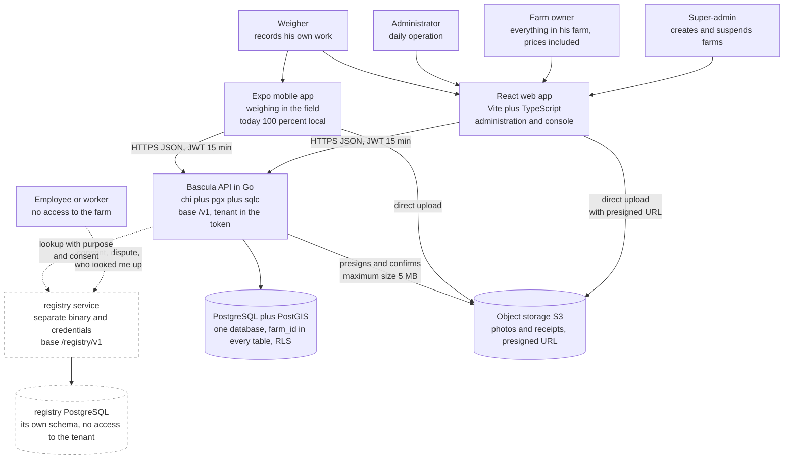
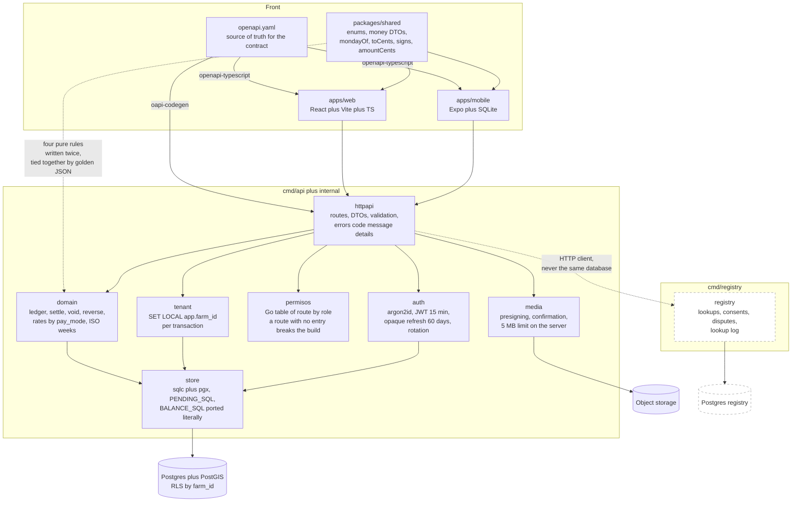
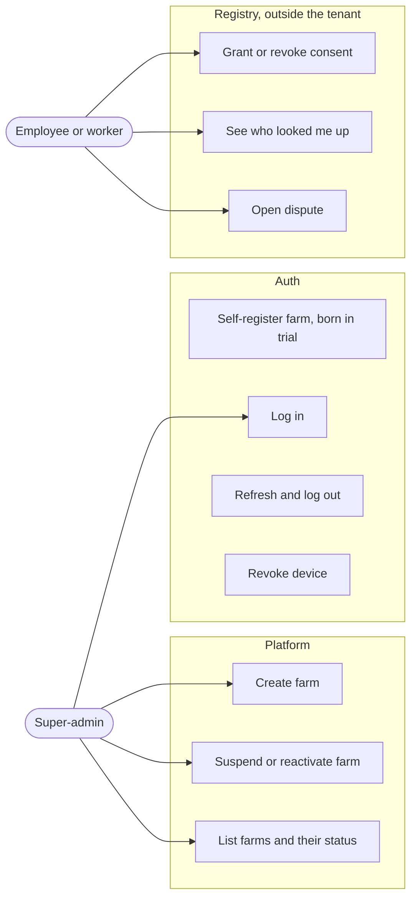
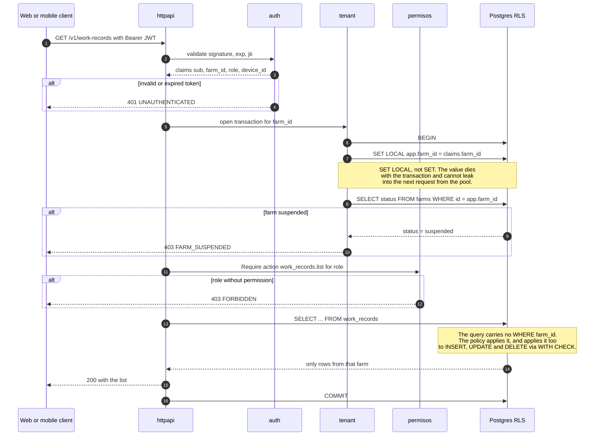
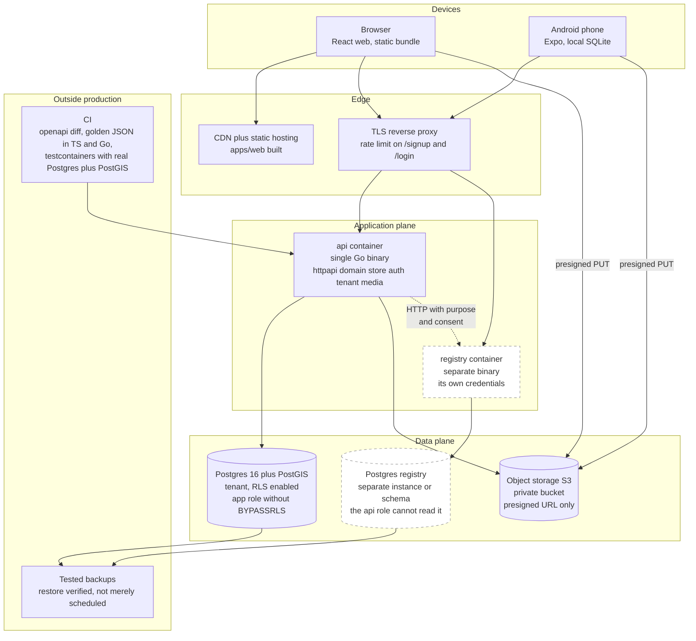

# Báscula — System view

Diagrams of the new system: **Go API** and **React web app**, multitenant, for coffee
farms.

Sources of truth for this document, in this order:

1. `docs/casos-de-uso.md` — scope (RSP-001 … RSP-033), written by the owner.
2. `docs/arquitectura-api.md` — API design, auth, PostGIS, `work_records`, `registry`.
3. `docs/plan-sprint-1.md` — the cut for the first delivery.
4. `docs/sync-and-roles.md` — roles and sync notes.
5. `apps/mobile/src/schema.ts` and `db.ts` — the accounting domain that must be preserved.

The diagrams describe the **target model** (all 33 use cases). What lands in Sprint 1 is
marked; so is what waits. Where the use cases and the design clash, the clash is written
down in §7, not settled by force.

Invariants no diagram may contradict: cents as `int64`; an append-only ledger corrected
with `reverso`; week = **the ISO Monday's date**; business dates in `farms.timezone`;
`UUIDv7` IDs generated on the client; **delete never deletes**
(`deleted_at` / `status='inactive'`).

---

## 1. Context diagram



**How to read the dotted lines.** Everything dotted is **out of Sprint 1**: `registry` is a
different product with its own legal risk (`arquitectura-api.md` §3), and the employee has
no session in any farm — his only relationship with the system is with `registry`, which is
exactly what makes it defensible.

**The employee is not a farm role.** The four roles with a session are super-admin, owner,
administrator and weigher (`sync-and-roles.md`, `arquitectura-api.md` §6). The employee
appears as an actor because RSP-009 gives him three rights that do get built: read who
looked him up, grant or revoke consent, and open a dispute.

---

## 2. Component diagram

Flat layout under `internal/`, exactly as decided: `httpapi`, `domain`, `store`, `auth`,
`tenant`, `media`, `registry`. No microservices: **one binary**, plus `registry`, which is
compilable on its own from day 1.



Three rules the diagram encodes, and they are acceptance criteria on any PR:

- **`httpapi` never talks to `store`.** Everything that decides money goes through
  `domain`, the only package with the `golden/*.json` files on top of it.
- **`registry` shares no connection, credentials or schema with the tenant.** The arrow is
  HTTP, not a function call. The day someone turns it into an `import`, the isolation is
  gone.
- **The middleware order is `Auth → Tenant → Require(action)`.** Inverting it puts a
  permission check before you know which farm the transaction belongs to.

---

## 3. UML use cases

Mermaid has no use case diagram, so this goes as a `graph LR` grouped by module. It is
split across two canvases for legibility: the first is farm operation, the second is the
perimeter actors.

### 3.1 Farm operation

```mermaid
graph LR
    dueno(["Owner"])
    admin(["Administrator"])
    pesador(["Weigher"])

    subgraph M1["Plots"]
        r001["RSP-001 Register plot"]
        r002["RSP-002 Modify plot"]
        r003["RSP-003 Delete plot"]
    end
    subgraph M2["Employees"]
        r004["RSP-004 Register employee"]
        r005["RSP-005 Modify employee"]
        r006["RSP-006 Delete employee"]
        r007["RSP-007 View profile and balance"]
        r008["RSP-008 Pay employee"]
        r009["RSP-009 Query cross-tenant history"]
    end
    subgraph M3["Activities"]
        r010["RSP-010 List activities"]
        r011["RSP-011 Register activity"]
        r012["RSP-012 Modify activity"]
        r013["RSP-013 Delete activity"]
        rpre["Define prices and weekly price"]
    end
    subgraph M4["Work records"]
        r014["RSP-014 List work records"]
        r015["RSP-015 Register work record"]
        r016["RSP-016 Modify work record"]
        r017["RSP-017 Delete work record"]
    end
    subgraph M5["Inventory"]
        r018["RSP-018 List products"]
        r019["RSP-019 Register product"]
        r020["RSP-020 Modify product"]
        r021["RSP-021 Delete product"]
        r025["RSP-025 Register inventory and stickers"]
    end
    subgraph M6["Sales"]
        r026["RSP-026 List sales"]
        r027["RSP-027 Register sale"]
        r028["RSP-028 Modify sale"]
        r029["RSP-029 Delete sale"]
    end
    subgraph M7["Expenses"]
        r030["RSP-030 List expenses"]
        r031["RSP-031 Register expense"]
        r032["RSP-032 Modify expense"]
        r033["RSP-033 Delete expense"]
    end
    subgraph M8["Configuration"]
        c1["Modify farm data"]
        c2["User management"]
    end

    dueno --> r001
    dueno --> r002
    dueno --> r003
    dueno --> r004
    dueno --> r005
    dueno --> r006
    dueno --> r007
    dueno --> r008
    dueno --> r009
    dueno --> r010
    dueno --> r011
    dueno --> r012
    dueno --> r013
    dueno --> rpre
    dueno --> r014
    dueno --> r015
    dueno --> r016
    dueno --> r017
    dueno --> r018
    dueno --> r019
    dueno --> r020
    dueno --> r021
    dueno --> r025
    dueno --> r026
    dueno --> r027
    dueno --> r028
    dueno --> r029
    dueno --> r030
    dueno --> r031
    dueno --> r032
    dueno --> r033
    dueno --> c1
    dueno --> c2

    admin --> r001
    admin --> r002
    admin --> r004
    admin --> r005
    admin --> r007
    admin --> r008
    admin --> r009
    admin --> r010
    admin --> r011
    admin --> r012
    admin --> r014
    admin --> r015
    admin --> r016
    admin --> r018
    admin --> r019
    admin --> r020
    admin --> r025
    admin --> r026
    admin --> r027
    admin --> r028
    admin --> r030
    admin --> r031
    admin --> r032

    pesador --> r015
    pesador --> r014
```



### 3.2 Perimeter: super-admin and employee



### 3.3 What each role can do, with no ambiguity

| Capability | Super-admin | Owner | Administrator | Weigher | Employee |
|---|---|---|---|---|---|
| Create and suspend farms | Yes | No | No | No | No |
| Read a farm's data | **No** | Yes | Yes | Cut down | No |
| Create and modify in the 8 modules | No | Yes | Yes | No | No |
| **Delete** anything, RSP-003/006/013/017/021/029/033 | No | **Yes** | **No** | No | No |
| **Prices**: `default_rate_cents`, `week_prices`, `costPerUnitCents` | No | **Yes** | **No** | **Cannot see them** | No |
| Settle, pay, `anticipo`, `deduccion`, `reverso`, RSP-008 | No | Yes | Yes | No | No |
| Employee profile and balance, RSP-007 | No | Yes | Yes | No | No |
| Register work record, RSP-015 | No | Yes | Yes | `work_unit` only | No |
| List work records, RSP-014 | No | All | All | `created_by = sub` only | No |
| Read employees | No | Full | Full | `id, name, lastName, tag` | No |
| RSP-009 cross-tenant lookup | **No** | Yes | Yes | **403** | Not applicable |
| Farm user management | No | Yes | No | No | No |
| Consent, dispute, lookup log | No | No | No | No | Yes |

Two rows of that table do not come from the use cases but from `sync-and-roles.md`, and it
has to be said out loud: the use cases attribute **everything** to the "Farm Administrator",
deleting and setting prices included. The design takes those away from him and gives them to
the owner. See §7.4.

The defence is not the table, it is the code: permissions live in **a single Go table**, a
contract test walks the routes and asserts `403` for the weigher on every money, people or
registry route, and **a new route with no entry in that table fails the build**.

---

## 4. Target data model

A single Postgres, multitenant by `farm_id` and RLS. Everything that can be taken out of
service carries `deleted_at` or `status`; **no route ever runs `DELETE`**. Money is always
`amount_cents int8`.


Seven decisions the ER freezes, worth reading slowly:

1. **There is no `pickups` table.** A weighing is a `work_record` with
   `pay_mode='work_unit'`, `unit='kg'`, `date_from = date_to`, `quantity = weight`.
   `/v1/pickups` survives as an HTTP façade so the mobile app is left alone; in Postgres it
   does not exist.
2. **The double-payment lock did not change shape, only name.**
   `UNIQUE(payable_id) WHERE voided_at IS NULL` is literally the mobile app's
   `ux_items_pickup_live`. It is the only thing that stops the same work record being paid
   twice, and that is why there is a single payable kind instead of two tables with two
   locks.
3. **`ledger` is untouched.** The same six `kind` values, the same sign `CHECK`, the same
   unique `reverses_id`. `BALANCE_SQL` is ported literally; the `golden/*.json` files force
   Go to return **exactly the same cents** as the phone.
4. **`work_record_plots` is the normalized form of the `plot_ids[]` and `crop_ids[]`** in
   the sketch in `arquitectura-api.md` §1. Same semantics; it is normalized because an array
   cannot be indexed by RLS nor joined against `expenses` by plot.
5. **`stock` and `balance` are not tables.** Stock is derived from `stock_movements` the
   same way the balance is derived from `ledger`. Same discipline, same reason: a stored
   total is a total that lies one day.
6. **`week_prices` hangs off `activity_id`**, not off the farm. The mobile app's
   `cost_overrides` was global because only picking existed; with several activities paid by
   unit, the weekly price of coffee is not the weekly price of an arroba of cassava. The
   migration files the existing rows under the seed activity *Recolección*.
7. **`media` has `confirmed_at`.** An unconfirmed row is an upload that never arrived; no
   other table may reference it.

---

## 5. Multitenant isolation

One database, `farm_id` in every table, and **RLS in Postgres instead of remembering to
write the `WHERE`** — because the day someone forgets, one farm sees another's payroll.

The policy, identical on every tenant table:

```sql
ALTER TABLE work_records ENABLE ROW LEVEL SECURITY;
ALTER TABLE work_records FORCE ROW LEVEL SECURITY;

CREATE POLICY tenant_isolation ON work_records
  USING      (farm_id = current_setting('app.farm_id', true)::uuid)
  WITH CHECK (farm_id = current_setting('app.farm_id', true)::uuid);
```

The application role **does not have `BYPASSRLS`** and does not own the tables — hence the
`FORCE`. Migrations run under a different role.



### What happens if `app.farm_id` is missing

This is the part that has to be written down, because the failure mode is treacherous.

With `current_setting('app.farm_id', true)`, a missing variable returns `NULL`, the
predicate evaluates to `NULL`, the policy is false, and the query returns **zero rows with
no error**. An empty `SELECT` is indistinguishable from a farm with no data, and an `INSERT`
fails with an RLS message nobody connects to the middleware. It is the class of bug you
diagnose on a Friday.

That is why there are three layers, not one:

1. **The `tenant` middleware is mandatory and fails loudly.** If a handler asks for a
   connection without having gone through `tenant`, `store` returns `500 TENANT_NOT_SET`.
   The connection is not handed over "to see what happens".
2. **`store` does not expose `*pgxpool.Pool`.** It only hands out a transaction already
   initialized with `SET LOCAL`. There is no way to get a raw connection from `domain`.
3. **A two-seeded-farms test** walks every table and asserts that farm A sees nothing of
   farm B, neither reading nor writing with someone else's `farm_id` in the body — that is
   where `WITH CHECK` comes in, and it is what stops you *writing* into the neighbour's
   farm.

The super-admin **is not an exception to RLS**. He operates on `farms` and `memberships`
with a different role and a different set of routes (`/v1/admin/farms`); he cannot read
anyone's ledger, and that is a property of the schema, not a promise from the UI.

> **Naming note.** `plan-sprint-1.md` H3 says `app.current_farm` and
> `arquitectura-api.md` §6 says `app.farm_id`. `app.farm_id` wins. H3 needs fixing.

---

## 6. Deployment



- **One binary, not six.** `registry` is the second, and it exists only because it needs
  credentials `api` must not have. It ships alongside until separating it becomes necessary.
- **The web app is static.** There is no render server; the bundle comes from the CDN and
  everything dynamic goes through `/v1`. Switching from MSW to the real API is one
  environment variable.
- **Photos never pass through the binary.** The client uploads straight to S3 with a
  presigned URL, the API confirms and enforces the 5 MB on the server, not just at
  presigning time.
- **Tests run against a real Postgres with PostGIS**, not against a mock. The money SQL is
  the asset of this project, and a mock does not test it.

---

## 7. Clashes between the use cases and the design

They are unresolved on purpose. Resolving them on our own is inventing product.

### 7.1 RSP-009 wants farm names; the design forbids them

RSP-009 says to show *"the farms where he has worked with their periods, and the notes
written about him"*. `arquitectura-api.md` §3 says farm names and free-text notes are
**never** shared, only `farmsWorked: 3`, months, and `disputes: 0`.

This is a head-on clash, and you cannot split the difference. Farm names plus free-text
notes travelling between farms is a labour blacklist: in Colombia that falls under Law 1581
of 2012, with no declared purpose and no right of rectification. **The design's version gets
built and RSP-009 stays partially unmet until the owner decides.** It is decision 1 in
`plan-sprint-1.md` §7.

### 7.2 RSP-004 requires internet and a check that today returns 403

RSP-004 says that **before saving**, the history and the safety alerts are looked up. With
the `registry` design: without a recorded consent from the worker, the `lookup` returns
`403 NO_CONSENT` and nothing else — which will be the case for nearly every new worker. And
the free-text "safety alerts" **are not built**.

On top of that, RSP-004 says that with no internet the system creates "an analysis request
that syncs later", and `arquitectura-api.md` §8 puts **offline sync out of delivery 1**. In
Sprint 1, creating an employee is online and without a lookup.

**Practical effect:** the check step during creation is mocked up and skipped. RSP-004 being
"mandatory before saving" cannot be allowed to block registering a picker.

### 7.3 The "public repository" in RSP-010 and RSP-018 does not exist

Both use cases say *"pull the latest categories and activities / products from the public
repository on the internet"*. In the design, catalogs are **per farm**, idempotent on
`(farm_id, lower(name))`. There is no shared catalog, no endpoint, no one curating it, and
no answer for what happens when a category a farm already uses changes.

That is a whole product with no spec. **Sprint 1 seeds each farm's catalogs at creation**
(coffee, siembra, mantenimiento, cosecha, kg, arroba, canasta, jornal) and the shared
repository stays an open question for the owner.

### 7.4 The use cases give everything to the administrator; the roles do not

`casos-de-uso.md` §Convenciones says the actor for all 33 use cases is the **Farm
Administrator**, including RSP-003/006/013 (delete) and "define prices". `sync-and-roles.md`
says the administrator **does not change prices and does not delete people**.

The roles table applies: deleting and prices belong to the **owner**. It is a harder
restriction than the owner's own document asks for, and it needs confirming — an
administrator who cannot fix a wrong price will phone the owner every week.

### 7.5 RSP-015 asks for a date range; the weekly price demands a single day

RSP-015 requires a *"date range"*. `arquitectura-api.md` §1 requires that a `work_record`
with `rate_source='weekly_price'` be **for a single day**: a `jornal` from Tuesday to
Tuesday has no single week, and deriving a weekly price over a range ends in a miscalculated
payment.

**Resolved inside the design, with nothing asked of the owner:** the form always allows a
range; if the activity uses the weekly price, the range collapses to the day and the UI says
so. With a frozen price the range is legitimate. It is drawn in `web.md` §3.

### 7.6 RSP numbering: two errors the documents carry around

- **`arquitectura-api.md` §5 and §8 call farm self-registration "RSP-033".** RSP-033 is
  *Delete Expense*. Self-registration is in `casos-de-uso.md` §9 *Register farm*, which the
  owner left **pending specification**. In other words: the decision to self-register with
  `status='trial'` **is backed by no written use case**; it is option (c) of decision 2 in
  `plan-sprint-1.md` §7 and is still waiting for an answer.
- **RSP-022, RSP-023 and RSP-024 do not exist.** The document jumps from *Delete Product* to
  *Register inventory*. What is almost certainly missing is warehouses and storage units,
  which RSP-019 and RSP-025 take for granted. Modelled as `warehouses` and `units`, with no
  use case describing them.

### 7.7 "Field inside plot": a hierarchy that does not exist

`plan-sprint-1.md` H4 says *"fields inside the plot"*. RSP-001 calls the plot's name *"the
name of the field"*, and `arquitectura-api.md` models a single level: `plots`.

**One level only.** Field = plot = `plots`; the planting detail is `plot_crops`. H4 is badly
worded. A second level would duplicate the keys of `work_records`, `expenses` and
`stock_movements` for a need nobody has expressed.

### 7.8 RSP-025 says "the system prints the stickers"

The system **does not print**: `POST /v1/labels/print` returns a fixed-size PDF or ZPL that
the user sends to his own printer. No configurable templates and no printer discovery. On
top of that, the whole inventory module is Sprint 3.

### 7.9 RSP-008's "partial payment lower than the current balance" clashes with the `anticipo`

RSP-008 validates that a partial payment is **lower than the current balance**. The ledger
allows a credit balance in the worker's favour, and paying more than what has been earned is
exactly an `anticipo` (an advance).

**Resolved inside the design:** an amount above the balance is not rejected, it is
reclassified. The web app asks, then writes `pago` up to the balance and `anticipo` for the
excess. It is drawn in `web.md` §4. If the owner wants the hard rejection, that is one line,
but he loses the `anticipo`, which during harvest gets used every week.

---

See also: `docs/diagramas/web.md` (web app) and `docs/diagramas/movil.md` (mobile app).
