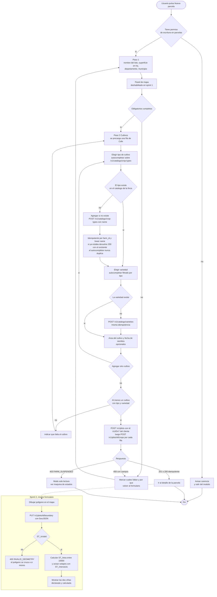
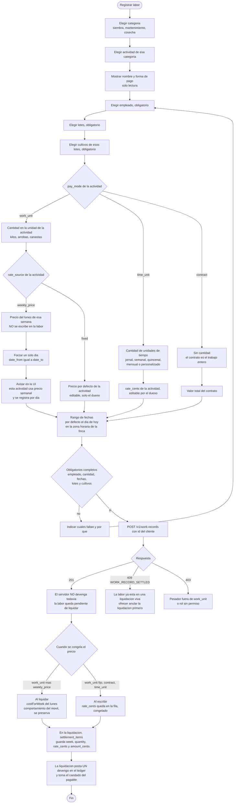
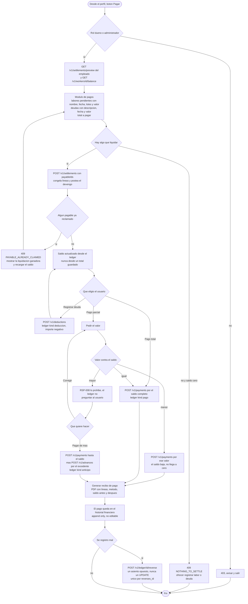
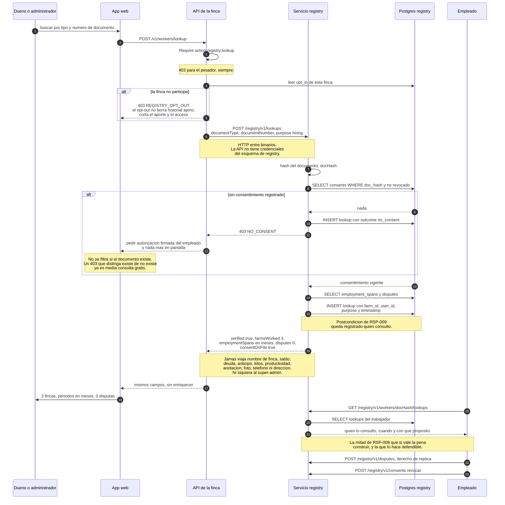
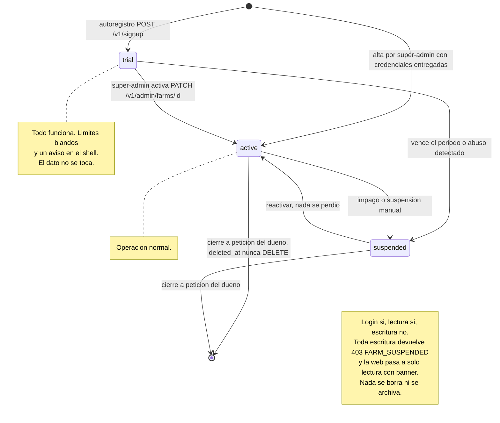

# Báscula — App web

La web es la consola de administración de la finca: **Vite + React + TypeScript**, cliente
HTTP generado desde `openapi.yaml` (cero tipos escritos a mano), MSW con los mismos mocks
para no quedar bloqueada por la API.

Reglas que atraviesan todas las pantallas y que no se repiten en cada diagrama:

- **La navegación oculta lo que el rol no puede**, pero eso no es una autorización: la
  autorización está en el servidor y devuelve `403`. Ocultar un botón no es un permiso.
- **Al entrar a un módulo sin privilegio**, la web muestra el aviso y saca al usuario del
  módulo — es la convención de `casos-de-uso.md`, aplicada sobre el `403` de la API.
- **Al guardar**, si faltan obligatorios se indica **cuáles** y **por qué**, y se vuelve al
  formulario con lo escrito intacto.
- **Eliminar nunca borra**: pide confirmación y hace `PATCH {status:"inactive"}`.
- **Todo `POST` lleva el `id` UUIDv7 generado en el cliente**, así que reintentar tras un
  timeout devuelve `200` con el recurso existente, no un duplicado.
- **Los conflictos de negocio son `409` con código propio** y la web ramifica por `code`:
  `WORK_RECORD_SETTLED`, `PAYABLE_ALREADY_CLAIMED`, `INVALID_GEOMETRY`,
  `PLOT_HAS_ACTIVE_CROPS`, `FARM_SUSPENDED`, `NO_CONSENT`. La traducción vive en el cliente.

Referencias de interfaz que el dueño citó: **cropti.com** y **farmlogs.com**. De ahí salen
tres cosas concretas: barra lateral fija de módulos, lista con buscador y botón primario
arriba a la derecha, y el mapa como panel lateral del detalle de la parcela.

---

## 1. Mapa de navegación

```mermaid
graph TD
    login["Login"]
    signup["Autoregistro de finca<br/>nace en trial"]
    shell["Shell autenticado<br/>barra lateral por rol"]

    login --> shell
    signup --> login

    subgraph SG_admin["Consola de super-admin, fuera del tenant"]
        sa_home["Fincas"]
        sa_new["Crear finca y primer dueno"]
        sa_det["Detalle de finca<br/>estado, plan, ultimo acceso"]
        sa_susp["Suspender o reactivar"]
        sa_home --> sa_new
        sa_home --> sa_det
        sa_det --> sa_susp
    end
    login -.->|"solo is_super_admin"| sa_home

    shell --> tablero["Tablero<br/>saldos pendientes, kilos de la semana,<br/>labores sin liquidar"]

    subgraph SG_parc["Parcelas"]
        p_list["Lista de parcelas"]
        p_new["Alta de parcela<br/>paso 1 identidad y ubicacion<br/>paso 2 cultivos"]
        p_det["Detalle de parcela<br/>cultivos, labores, gastos,<br/>panel de mapa"]
        p_edit["Editar parcela RSP-002"]
        p_del["Dar de baja RSP-003"]
        p_list --> p_new
        p_list --> p_det
        p_det --> p_edit
        p_det --> p_del
    end

    subgraph SG_emp["Empleados"]
        e_list["Lista de empleados"]
        e_new["Alta de empleado RSP-004<br/>foto y documento"]
        e_prof["Perfil RSP-007<br/>saldo, labores, historial,<br/>anotaciones"]
        e_pay["Pagar empleado RSP-008"]
        e_debt["Registrar deuda"]
        e_note["Agregar anotacion"]
        e_rec["Recibo de pago"]
        e_look["Consultar historial RSP-009"]
        e_list --> e_new
        e_list --> e_prof
        e_prof --> e_pay
        e_prof --> e_debt
        e_prof --> e_note
        e_pay --> e_rec
        e_list --> e_look
    end

    subgraph SG_act["Actividades"]
        a_list["Lista por categoria RSP-010"]
        a_new["Alta RSP-011<br/>contrato, tiempo o unidad"]
        a_price["Definir precios<br/>y precio de la semana"]
        a_list --> a_new
        a_list --> a_price
    end

    subgraph SG_lab["Labores"]
        l_list["Lista de labores RSP-014"]
        l_new["Registrar labor RSP-015"]
        l_edit["Modificar RSP-016 y anular RSP-017"]
        l_list --> l_new
        l_list --> l_edit
    end

    subgraph SG_liq["Liquidaciones"]
        s_prev["Previsualizar liquidacion"]
        s_det["Liquidacion<br/>lineas congeladas"]
        s_void["Anular liquidacion"]
        s_prev --> s_det
        s_det --> s_void
    end

    subgraph SG_inv["Inventario"]
        i_prod["Productos RSP-018 a 021"]
        i_stock["Existencias derivadas"]
        i_mov["Movimiento de inventario RSP-025"]
        i_lbl["Stickers en PDF"]
        i_prod --> i_stock
        i_stock --> i_mov
        i_mov --> i_lbl
    end

    subgraph SG_ven["Ventas"]
        v_list["Lista RSP-026"]
        v_new["Registrar venta RSP-027<br/>foto del comprobante"]
        v_list --> v_new
    end

    subgraph SG_gas["Gastos"]
        g_list["Lista RSP-030"]
        g_new["Registrar gasto RSP-031<br/>por actividad o por lote y cultivo"]
        g_list --> g_new
    end

    subgraph SG_cfg["Configuracion"]
        c_farm["Datos de la finca"]
        c_price["Precios de trabajo"]
        c_user["Usuarios e invitaciones"]
        c_dev["Dispositivos y sesiones"]
        c_audit["Bitacora de auditoria"]
    end

    tablero --> p_list
    tablero --> e_list
    tablero --> a_list
    tablero --> l_list
    tablero --> s_prev
    tablero --> i_prod
    tablero --> v_list
    tablero --> g_list
    tablero --> c_farm
    c_farm --> c_price
    c_farm --> c_user
    c_farm --> c_dev
    c_farm --> c_audit

    classDef s1 fill:#eaf7ea,stroke:#3a7d44;
    classDef s2 fill:#fff8e6,stroke:#c08a17;
    classDef s3 fill:#f4f4f4,stroke:#999,stroke-dasharray:5;
    class login,signup,shell,tablero,p_list,p_new,p_det,p_edit,p_del,e_list,e_new,e_prof,e_pay,e_debt,e_rec,a_list,a_new,a_price,l_list,l_new,l_edit,s_prev,s_det,s_void,c_farm,c_price,c_user s1;
    class e_note,v_list,v_new,g_list,g_new,c_audit s2;
    class i_prod,i_stock,i_mov,i_lbl,e_look,c_dev,sa_home,sa_new,sa_det,sa_susp s3;
```



Verde = **Sprint 1**. Ámbar = **Sprint 2** (ventas, gastos, anotaciones, polígono,
auditoría). Gris punteado = **Sprint 3 o sin decidir** (inventario, RSP-009, consola de
super-admin, gestión de dispositivos).

La consola de super-admin cuelga del login, **no del shell de la finca**: es otro conjunto
de rutas, otro rol y ninguna lectura del ledger ajeno. `arquitectura-api.md` §8 dice que
con autoregistro es "casi innecesaria"; queda como pantalla mínima para suspender.

---

## 2. Actividad: alta de parcela — RSP-001

Dos pasos, como cropti: identidad y ubicación primero, cultivos después. El mapa se
maqueta y se deja **deshabilitado** en el Sprint 1 para que el Sprint 2 solo lo rellene.



**Por qué se muestran las dos áreas.** `area_ha` es lo que declara el dueño;
`computedAreaHa` es lo que sale del polígono. Discrepan siempre. Ocultar una de las dos es
decidir por el dueño cuál miente, así que la ficha muestra ambas y la diferencia en
porcentaje. La web no elige.

**La excepción de RSP-001** —"el sistema muestra por defecto un cultivo de café disponible
para seleccionar variedad"— se implementa sembrando el tipo *Café* en el catálogo al crear
la finca y precargando una fila en el paso 2, no con un caso especial en el código.

---

## 3. Actividad: registrar labor — RSP-015

El caso central del negocio y el nudo de dependencias: necesita empleado, actividad y
lote/cultivo. Aquí es donde una pesada de café deja de ser especial y pasa a ser una labor
pagada por unidad de trabajo.



Tres cosas que este flujo decide y que conviene no perder:

- **El devengo no lo crea la labor, lo crea la liquidación.** Igual que en el móvil: la
  labor es el hecho, la liquidación es el documento que congela precios y postea el
  `devengo`. Por eso una labor se puede corregir mientras no esté liquidada.
- **El candado.** `settlement_items` tiene `UNIQUE(payable_id) WHERE voided_at IS NULL`. Si
  dos personas liquidan a la vez, la segunda recibe `409 PAYABLE_ALREADY_CLAIMED` con
  `details.winningSettlement` completo para re-derivar. Nada se pierde en silencio.
- **El rango de fechas con precio semanal se colapsa al día**, no se rechaza. Ver
  `sistema.md` §7.5: es la salida a un choque real entre RSP-015 y el modelo de precios.

**El pesador ve una versión recortada de esta pantalla**: solo actividades `work_unit`, sin
campo de precio, sin `default_rate_cents` en el `GET /v1/activities`, y la lista de
empleados llega con `id, name, lastName, tag` y nada más. No es la misma pantalla con
campos ocultos: es una respuesta distinta del servidor.

---

## 4. Actividad: pagar empleado — RSP-008



- **Pago total deja el saldo en cero** posteando un `pago` por el saldo exacto en el
  momento de la escritura, con el saldo releído dentro de la misma transacción. Leerlo
  antes y postearlo después es cómo se paga de más cuando dos personas cobran a la vez.
- **El excedente es un `anticipo`, no un error.** Ver `sistema.md` §7.9.
- **Nada se edita.** Un pago mal registrado se cancela con `reverso`, y `reverses_id` es
  único: un asiento no se puede reversar dos veces.

---

## 5. Secuencia: login y propagación de tenant


**Cambiar de finca es volver a autenticarse contra la otra membresía**, no un parámetro en
la petición. Un usuario con dos fincas tiene dos tokens; nunca uno que valga para las dos.

---

## 6. Secuencia: consulta cross-tenant — RSP-009

**No es un endpoint más.** Es un producto distinto, con riesgo legal propio, servicio
aparte, credenciales propias y ningún acceso al esquema de las fincas. Está **fuera del
Sprint 1** y es la decisión 1 del dueño en `plan-sprint-1.md` §7.



**Lo que este diagrama no dibuja porque no se construye:** las "alertas de seguridad" de
texto libre de RSP-004. Un texto que diga "este señor es problemático" es difamación
distribuida, no verificable y no contestable. Si el dueño insiste, la única versión
defendible tiene cinco propiedades y ninguna es opcional: hecho estructurado de un catálogo
cerrado, atribuido a una finca identificable, notificado al trabajador, disputable, y con
caducidad automática a 24 meses. Queda detrás de un flag apagado.

**Choque abierto:** RSP-009 pide mostrar los **nombres de las fincas** y las **anotaciones**.
Este diseño no los entrega. Ver `sistema.md` §7.1.

---

## 7. Máquina de estados de una finca



Tres reglas que sostienen la máquina:

- **Suspender no borra ni oculta.** Un dueño que vuelve tres meses después encuentra su
  ledger intacto. El estado gobierna la **escritura**, no la existencia.
- **`FARM_SUSPENDED` se decide en el middleware `tenant`**, junto al `SET LOCAL`, no en
  cada handler. Un handler nuevo no puede olvidarse de comprobarlo.
- **El estado inicial depende de por qué puerta se entró**, y las dos puertas existen
  porque el dueño no ha respondido la decisión 2 de `plan-sprint-1.md` §7. Ojo:
  `arquitectura-api.md` §5 atribuye el autoregistro a "RSP-033", que en realidad es
  *Eliminar Gasto*. Ver `sistema.md` §7.6.

---

## 8. Wireframes

Estilo cropti / farmlogs: barra lateral fija, contenido en tarjeta, un solo botón primario
por pantalla arriba a la derecha, tipografía grande en las cifras de dinero.

### 8.1 Lista de parcelas

```
┌──────────────────────────────────────────────────────────────────────────────────┐
│ BASCULA    La Esperanza  ▾        (Trial - 12 dias)              Oscar J. ▾  ⚙  │
├────────────────┬─────────────────────────────────────────────────────────────────┤
│                │  Parcelas                                                       │
│  ▣ Tablero     │  ─────────────────────────────────────────────────────────────  │
│  ▣ PARCELAS    │  ┌───────────────────────────────┐  ┌────────┐  ┌────────────┐  │
│  ▣ Empleados   │  │ 🔍 Buscar por nombre o municipio│ │Activas▾│  │+ Nueva     │  │
│  ▣ Actividades │  └───────────────────────────────┘  └────────┘  └────────────┘  │
│  ▣ Labores     │                                                                 │
│  ▣ Liquidacion │  NOMBRE          UBICACION            AREA      CULTIVOS     ⋮  │
│  ▣ Ventas      │  ─────────────────────────────────────────────────────────────  │
│  ▣ Gastos      │  El Alto         Caldas · Manizales   4,20 ha   Cafe Castillo⋮  │
│  ▣ Inventario  │                                                 Cafe Colombia   │
│  ─────────────  │  ─────────────────────────────────────────────────────────────  │
│  ▣ Config      │  La Cuchilla     Caldas · Manizales   2,75 ha   Cafe Caturra ⋮  │
│                │  ─────────────────────────────────────────────────────────────  │
│                │  Bajo del Rio    Caldas · Chinchina   6,00 ha   Aguacate Hass⋮  │
│                │                  declarada 6,00 · calculada 5,71  ⚠ difiere 5%  │
│                │  ─────────────────────────────────────────────────────────────  │
│                │  San Jose        Caldas · Chinchina   1,50 ha   Yuca         ⋮  │
│                │                                        [inactiva]               │
│                │  ─────────────────────────────────────────────────────────────  │
│                │  4 parcelas · 14,45 ha declaradas          ‹ 1 ›                │
└────────────────┴─────────────────────────────────────────────────────────────────┘
     ⋮ = Ver detalle · Editar · Dar de baja (solo dueno)
```

Notas: la fila de "difiere 5%" es la doble área de PostGIS, y la web **no elige** cuál es
la buena. La parcela inactiva se muestra apagada y no desaparece — eliminar nunca borra.
El filtro por defecto es `Activas`.

### 8.2 Registro de labor

```
┌──────────────────────────────────────────────────────────────────────────────────┐
│ ‹ Labores                    Registrar labor                                     │
├──────────────────────────────────────────────────────────────────────────────────┤
│                                                                                  │
│  1 · ACTIVIDAD                                                                   │
│  Categoria  [ Cosecha            ▾ ]     Actividad [ Recoleccion de cafe    ▾ ]  │
│  ┌────────────────────────────────────────────────────────────────────────────┐  │
│  │ Recoleccion de cafe · pago por UNIDAD DE TRABAJO · kilo                    │  │
│  │ Precio de la semana del lun 24 ago: $ 800 / kg    (precio semanal)         │  │
│  │ ⓘ Esta actividad usa precio semanal: se registra por dia y el valor se     │  │
│  │   congela al liquidar, no ahora.                                           │  │
│  └────────────────────────────────────────────────────────────────────────────┘  │
│                                                                                  │
│  2 · QUIEN Y DONDE                                                               │
│  Empleado *  [ 🔍 Maria Restrepo · CC 1.0…                                   ▾]  │
│  Lotes    *  [ ✕ El Alto ]  [ + Agregar lote ]                                   │
│  Cultivos *  [ ✕ Cafe Castillo ]  [ ✕ Cafe Colombia ]                            │
│                                                                                  │
│  3 · CUANTO Y CUANDO                                                             │
│  Cantidad *  [    38,5 ] kg          Fecha *  [ 27/08/2026 ]  (un solo dia)      │
│                                       ↑ el rango se colapsa: precio semanal      │
│  Nota        [                                                              ]    │
│                                                                                  │
│  ┌────────────────────────────────────────────────────────────────────────────┐  │
│  │ Valor estimado   38,5 kg × $ 800   =   $ 30.800                            │  │
│  │ Aun no es un devengo: se posteara al liquidar.                             │  │
│  └────────────────────────────────────────────────────────────────────────────┘  │
│                                                                                  │
│                       [ Guardar y registrar otra ]   [ Guardar ]                 │
└──────────────────────────────────────────────────────────────────────────────────┘
```

Notas: el bloque gris de la actividad es **solo lectura**, como pide RSP-015. Si la
actividad fuera *Guadañada* (`time_unit`, jornal) el paso 3 diría "Jornales" y el rango de
fechas quedaría **abierto**, con el precio congelado en la fila. Al pesador esta pantalla
le llega sin el precio de la semana, sin el valor estimado y con el selector de actividad
limitado a las de unidad de trabajo.

### 8.3 Perfil de empleado con saldo

```
┌──────────────────────────────────────────────────────────────────────────────────┐
│ ‹ Empleados                                                                      │
├──────────────────────────────────────────────────────────────────────────────────┤
│  ╭──────╮  Maria Restrepo Ospina                    ┌──────────────────────────┐ │
│  │      │  CC 1.045.882.331 · 320 555 1212          │  SALDO PENDIENTE         │ │
│  │ foto │  Chinchina, Caldas · Colombia             │                          │ │
│  ╰──────╯  Activa desde 12/03/2025                  │     $ 184.500            │ │
│                                                     │  a favor del empleado    │ │
│  [ Pagar empleado ]  [ Registrar deuda ]            │  ult. movimiento 26 ago  │ │
│  [ Agregar anotacion ]                              └──────────────────────────┘ │
│                                                                                  │
│  ┌ LABORES ─────────────────────────────────────────────────────────────────────┐│
│  │ ACTIVIDAD              FECHA        LOTES              CANT.      VALOR      ││
│  │ Recoleccion de cafe    27/08/2026   El Alto            38,5 kg  $  30.800    ││
│  │ Recoleccion de cafe    26/08/2026   El Alto            41,0 kg  $  32.800    ││
│  │ Guadanada              24-25/08/26  La Cuchilla        2 jorn.  $  90.000    ││
│  │                                             pendientes de liquidar: $153.600 ││
│  └──────────────────────────────────────────────────────────────────────────────┘│
│                                                                                  │
│  ┌ HISTORIAL FINANCIERO ────────────────────────────────────────────────────────┐│
│  │ TIPO        CONCEPTO                       FECHA        MONTO                ││
│  │ devengo     Liquidacion 18-23 ago          23/08/2026   + $ 214.500          ││
│  │ pago        Efectivo · recibo #0041        23/08/2026   - $ 200.000  [recibo]││
│  │ deduccion   Mercado adelantado             20/08/2026   -  $ 45.000          ││
│  │ anticipo    Efectivo                       19/08/2026   -  $ 50.000          ││
│  │ reverso     Corrige pago #0038             18/08/2026   + $  12.000          ││
│  │                                                    ‹ 1 2 3 ›                 ││
│  │ ⓘ Nada se edita. Un error se corrige con un reverso.                        ││
│  └──────────────────────────────────────────────────────────────────────────────┘│
│                                                                                  │
│  ┌ ANOTACIONES ─────────────────────────────────────────────────────────────────┐│
│  │ 21/08/2026  Pidio adelanto para transporte. Autorizado.                      ││
│  │ 03/07/2026  Excelente en lote El Alto.                                       ││
│  │ ⓘ Las anotaciones no salen de esta finca. Nunca viajan al registro nacional. ││
│  └──────────────────────────────────────────────────────────────────────────────┘│
└──────────────────────────────────────────────────────────────────────────────────┘
```

Notas: el saldo es **derivado del ledger** en cada carga, nunca un total guardado — misma
disciplina que las existencias. "Pendientes de liquidar" y "saldo" son cifras distintas y
se muestran separadas: lo pendiente todavía no es un devengo. El botón *Agregar anotación*
existe desde el Sprint 1 pero la sección se habilita en el Sprint 2. La nota al pie de
anotaciones no es decorativa: es la promesa que hace defendible todo el módulo cross-tenant.

---

Ver también: `docs/diagramas/sistema.md` (contexto, componentes, ER, RLS, despliegue y la
lista completa de choques abiertos) y `docs/diagramas/movil.md` (app móvil).
