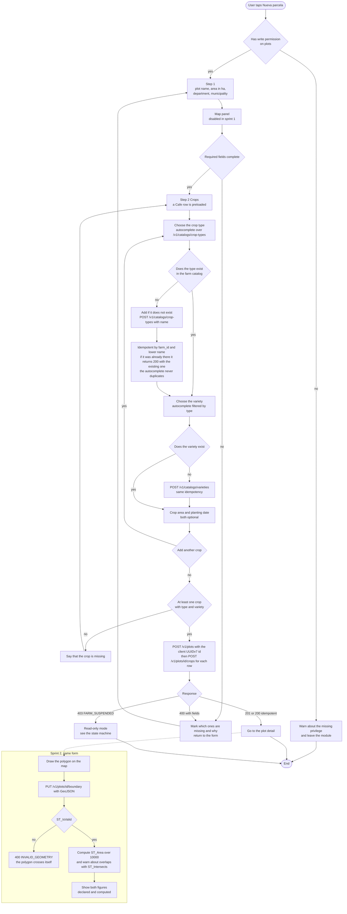
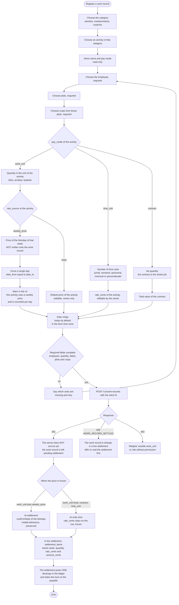
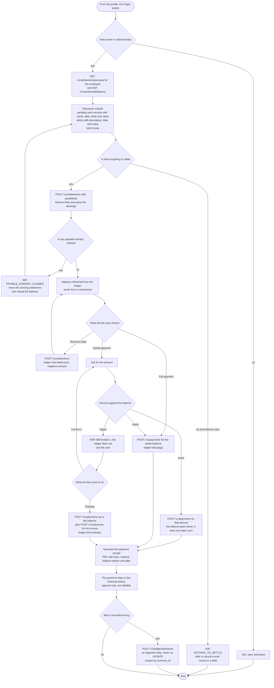
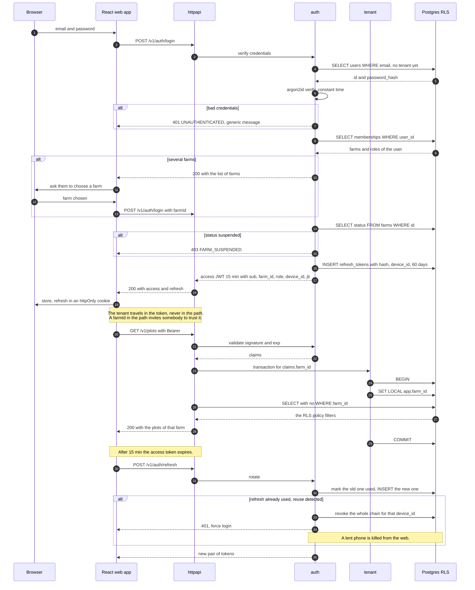
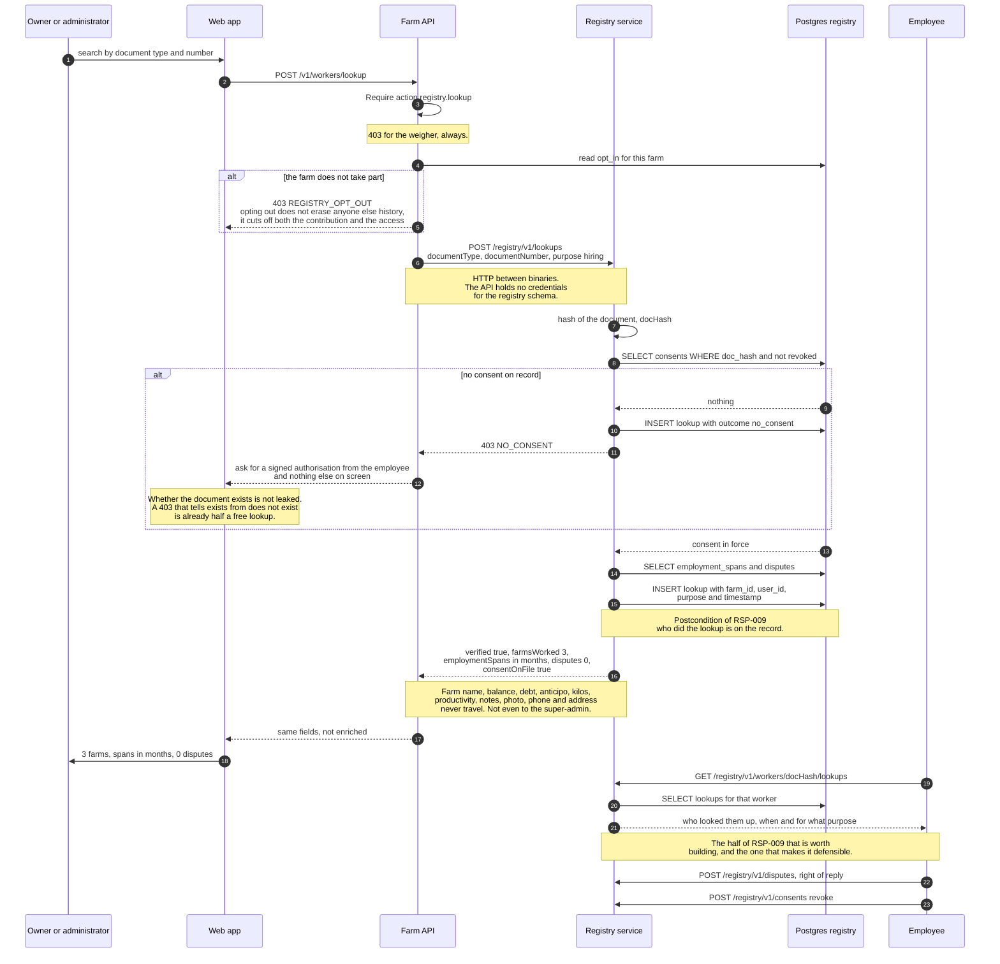
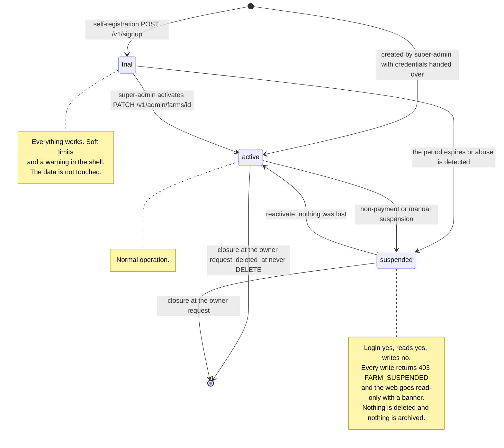

# Báscula — Web app

The web app is the farm's administration console: **Vite + React + TypeScript**, an HTTP
client generated from `openapi.yaml` (zero hand-written types), MSW with the same mocks so
it is never blocked waiting on the API.

Rules that cut across every screen and that are not repeated in each diagram:

- **Navigation hides what the role cannot do**, but that is not authorisation: the
  authorisation is on the server and it returns `403`. Hiding a button is not a permission.
- **On entering a module without the privilege**, the web app shows the warning and takes
  the user out of the module — that is the convention from `casos-de-uso.md`, applied on top
  of the API's `403`.
- **On save**, if required fields are missing it says **which ones** and **why**, and it
  returns to the form with what was typed intact.
- **Delete never deletes**: it asks for confirmation and does `PATCH {status:"inactive"}`.
- **Every `POST` carries the UUIDv7 `id` generated on the client**, so retrying after a
  timeout returns `200` with the existing resource, not a duplicate.
- **Business conflicts are `409` with a code of their own** and the web app branches on
  `code`: `WORK_RECORD_SETTLED`, `PAYABLE_ALREADY_CLAIMED`, `INVALID_GEOMETRY`,
  `PLOT_HAS_ACTIVE_CROPS`, `FARM_SUSPENDED`, `NO_CONSENT`. The translation lives in the
  client.

Interface references the owner cited: **cropti.com** and **farmlogs.com**. Three concrete
things come out of those: a fixed sidebar of modules, a list with a search box and a primary
button top right, and the map as a side panel on the plot (*Parcela*) detail.

---

## 1. Navigation map

```mermaid
graph TD
    login["Login"]
    signup["Farm self-registration<br/>born in trial"]
    shell["Authenticated shell<br/>sidebar by role"]

    login --> shell
    signup --> login

    subgraph SG_admin["Super-admin console, outside the tenant"]
        sa_home["Farms"]
        sa_new["Create farm and first owner"]
        sa_det["Farm detail<br/>status, plan, last access"]
        sa_susp["Suspend or reactivate"]
        sa_home --> sa_new
        sa_home --> sa_det
        sa_det --> sa_susp
    end
    login -.->|"is_super_admin only"| sa_home

    shell --> tablero["Dashboard<br/>pending balances, kilos of the week,<br/>unsettled work records"]

    subgraph SG_parc["Plots"]
        p_list["Plot list"]
        p_new["New plot<br/>step 1 identity and location<br/>step 2 crops"]
        p_det["Plot detail<br/>crops, work records, expenses,<br/>map panel"]
        p_edit["Edit plot RSP-002"]
        p_del["Deactivate RSP-003"]
        p_list --> p_new
        p_list --> p_det
        p_det --> p_edit
        p_det --> p_del
    end

    subgraph SG_emp["Employees"]
        e_list["Employee list"]
        e_new["New employee RSP-004<br/>photo and ID document"]
        e_prof["Profile RSP-007<br/>balance, work records, history,<br/>notes"]
        e_pay["Pay employee RSP-008"]
        e_debt["Record a debt"]
        e_note["Add a note"]
        e_rec["Payment receipt"]
        e_look["Look up history RSP-009"]
        e_list --> e_new
        e_list --> e_prof
        e_prof --> e_pay
        e_prof --> e_debt
        e_prof --> e_note
        e_pay --> e_rec
        e_list --> e_look
    end

    subgraph SG_act["Activities"]
        a_list["List by category RSP-010"]
        a_new["New RSP-011<br/>contrato, tiempo or unidad"]
        a_price["Set prices<br/>and the price of the week"]
        a_list --> a_new
        a_list --> a_price
    end

    subgraph SG_lab["Work records"]
        l_list["Work record list RSP-014"]
        l_new["Register a work record RSP-015"]
        l_edit["Modify RSP-016 and void RSP-017"]
        l_list --> l_new
        l_list --> l_edit
    end

    subgraph SG_liq["Settlements"]
        s_prev["Preview settlement"]
        s_det["Settlement<br/>frozen lines"]
        s_void["Void settlement"]
        s_prev --> s_det
        s_det --> s_void
    end

    subgraph SG_inv["Inventory"]
        i_prod["Products RSP-018 to 021"]
        i_stock["Derived stock"]
        i_mov["Stock movement RSP-025"]
        i_lbl["Stickers as PDF"]
        i_prod --> i_stock
        i_stock --> i_mov
        i_mov --> i_lbl
    end

    subgraph SG_ven["Sales"]
        v_list["List RSP-026"]
        v_new["Record a sale RSP-027<br/>photo of the proof of sale"]
        v_list --> v_new
    end

    subgraph SG_gas["Expenses"]
        g_list["List RSP-030"]
        g_new["Record an expense RSP-031<br/>by activity or by plot and crop"]
        g_list --> g_new
    end

    subgraph SG_cfg["Configuration"]
        c_farm["Farm details"]
        c_price["Work prices"]
        c_user["Users and invitations"]
        c_dev["Devices and sessions"]
        c_audit["Audit log"]
    end

    tablero --> p_list
    tablero --> e_list
    tablero --> a_list
    tablero --> l_list
    tablero --> s_prev
    tablero --> i_prod
    tablero --> v_list
    tablero --> g_list
    tablero --> c_farm
    c_farm --> c_price
    c_farm --> c_user
    c_farm --> c_dev
    c_farm --> c_audit

    classDef s1 fill:#eaf7ea,stroke:#3a7d44;
    classDef s2 fill:#fff8e6,stroke:#c08a17;
    classDef s3 fill:#f4f4f4,stroke:#999,stroke-dasharray:5;
    class login,signup,shell,tablero,p_list,p_new,p_det,p_edit,p_del,e_list,e_new,e_prof,e_pay,e_debt,e_rec,a_list,a_new,a_price,l_list,l_new,l_edit,s_prev,s_det,s_void,c_farm,c_price,c_user s1;
    class e_note,v_list,v_new,g_list,g_new,c_audit s2;
    class i_prod,i_stock,i_mov,i_lbl,e_look,c_dev,sa_home,sa_new,sa_det,sa_susp s3;
```



Green = **Sprint 1**. Amber = **Sprint 2** (sales, expenses, notes, polygon, audit). Dotted
grey = **Sprint 3 or undecided** (inventory, RSP-009, super-admin console, device
management).

The super-admin console hangs off the login, **not off the farm shell**: it is a different
set of routes, a different role and no reads of anyone else's ledger. `arquitectura-api.md`
§8 says that with self-registration it is "almost unnecessary"; it stays as a minimal screen
for suspending.

---

## 2. Activity: new plot — RSP-001

Two steps, like cropti: identity and location first, crops afterwards. The map is mocked up
and left **disabled** in Sprint 1 so that Sprint 2 only has to fill it in.



**Why both areas are shown.** `area_ha` is what the owner declares; `computedAreaHa` is what
comes out of the polygon. They always disagree. Hiding one of the two is deciding on the
owner's behalf which one is lying, so the record shows both and the difference as a
percentage. The web app does not choose.

**The RSP-001 exception** — "the system shows by default an available coffee crop so a
variety can be selected" — is implemented by seeding the type *Café* into the catalog when
the farm is created and preloading one row in step 2, not with a special case in the code.

---

## 3. Activity: register a work record — RSP-015

The central case of the business and the knot of dependencies: it needs an employee, an
activity and a plot/crop. This is where a coffee weighing stops being special and becomes a
work record (*Labor*) paid by work unit.



Three things this flow decides that are worth not losing:

- **The `devengo` is not created by the work record, it is created by the settlement.** Just
  like on mobile: the work record is the fact, the settlement is the document that freezes
  prices and posts the `devengo`. That is why a work record can be corrected as long as it
  has not been settled.
- **The lock.** `settlement_items` has `UNIQUE(payable_id) WHERE voided_at IS NULL`. If two
  people settle at the same time, the second one gets `409 PAYABLE_ALREADY_CLAIMED` with a
  complete `details.winningSettlement` to re-derive from. Nothing is lost silently.
- **A date range with a weekly price collapses to a single day**, it is not rejected. See
  `sistema.md` §7.5: it is the way out of a real clash between RSP-015 and the price model.

**The weigher sees a cut-down version of this screen**: only `work_unit` activities, no
price field, no `default_rate_cents` in the `GET /v1/activities`, and the employee list
arrives with `id, name, lastName, tag` and nothing else. It is not the same screen with
fields hidden: it is a different response from the server.

---

## 4. Activity: pay an employee — RSP-008



- **A full payment leaves the balance at zero** by posting a `pago` for the exact balance at
  the moment of the write, with the balance re-read inside the same transaction. Reading it
  before and posting it afterwards is how you overpay when two people collect at once.
- **The excess is an `anticipo`, not an error.** See `sistema.md` §7.9.
- **Nothing is edited.** A payment recorded wrong is cancelled with a `reverso`, and
  `reverses_id` is unique: an entry cannot be reversed twice.

---

## 5. Sequence: login and tenant propagation



**Switching farms means authenticating again against the other membership**, not passing a
parameter on the request. A user with two farms has two tokens; never one that is good for
both.

---

## 6. Sequence: cross-tenant lookup — RSP-009

**This is not just one more endpoint.** It is a different product, with legal risk of its
own, a separate service, its own credentials and no access to the farms schema. It is
**outside Sprint 1** and it is decision 1 for the owner in `plan-sprint-1.md` §7.



**What this diagram does not draw because it is not being built:** the free-text "security
alerts" of RSP-004. A text saying «este señor es problemático» (*this guy is trouble*) is
distributed defamation, not verifiable and not answerable. If the owner insists, the only
defensible version has five properties and none of them is optional: a structured fact from
a closed catalog, attributed to an identifiable farm, notified to the worker, disputable,
and expiring automatically after 24 months. It sits behind a flag that is switched off.

**Open clash:** RSP-009 asks to show the **farm names** and the **notes**. This design does
not deliver them. See `sistema.md` §7.1.

---

## 7. State machine of a farm



Three rules that hold the machine up:

- **Suspending does not delete and does not hide.** An owner who comes back three months
  later finds their ledger intact. The state governs **writing**, not existence.
- **`FARM_SUSPENDED` is decided in the `tenant` middleware**, next to the `SET LOCAL`, not in
  each handler. A new handler cannot forget to check it.
- **The initial state depends on which door you came in through**, and both doors exist
  because the owner has not answered decision 2 in `plan-sprint-1.md` §7. Careful:
  `arquitectura-api.md` §5 attributes self-registration to "RSP-033", which is actually
  *Eliminar Gasto* (*Delete Expense*). See `sistema.md` §7.6.

---

## 8. Wireframes

cropti / farmlogs style: fixed sidebar, content in a card, a single primary button per
screen at the top right, large type on the money figures.

The wireframes below are the real Spanish interface, left exactly as the screen shows it.

### 8.1 Plot list

```
┌──────────────────────────────────────────────────────────────────────────────────┐
│ BASCULA    La Esperanza  ▾        (Trial - 12 dias)              Oscar J. ▾  ⚙  │
├────────────────┬─────────────────────────────────────────────────────────────────┤
│                │  Parcelas                                                       │
│  ▣ Tablero     │  ─────────────────────────────────────────────────────────────  │
│  ▣ PARCELAS    │  ┌───────────────────────────────┐  ┌────────┐  ┌────────────┐  │
│  ▣ Empleados   │  │ 🔍 Buscar por nombre o municipio│ │Activas▾│  │+ Nueva     │  │
│  ▣ Actividades │  └───────────────────────────────┘  └────────┘  └────────────┘  │
│  ▣ Labores     │                                                                 │
│  ▣ Liquidacion │  NOMBRE          UBICACION            AREA      CULTIVOS     ⋮  │
│  ▣ Ventas      │  ─────────────────────────────────────────────────────────────  │
│  ▣ Gastos      │  El Alto         Caldas · Manizales   4,20 ha   Cafe Castillo⋮  │
│  ▣ Inventario  │                                                 Cafe Colombia   │
│  ─────────────  │  ─────────────────────────────────────────────────────────────  │
│  ▣ Config      │  La Cuchilla     Caldas · Manizales   2,75 ha   Cafe Caturra ⋮  │
│                │  ─────────────────────────────────────────────────────────────  │
│                │  Bajo del Rio    Caldas · Chinchina   6,00 ha   Aguacate Hass⋮  │
│                │                  declarada 6,00 · calculada 5,71  ⚠ difiere 5%  │
│                │  ─────────────────────────────────────────────────────────────  │
│                │  San Jose        Caldas · Chinchina   1,50 ha   Yuca         ⋮  │
│                │                                        [inactiva]               │
│                │  ─────────────────────────────────────────────────────────────  │
│                │  4 parcelas · 14,45 ha declaradas          ‹ 1 ›                │
└────────────────┴─────────────────────────────────────────────────────────────────┘
     ⋮ = Ver detalle · Editar · Dar de baja (solo dueno)
```

*Screen labels:* Tablero = Dashboard, Parcelas = Plots, Empleados = Employees,
Actividades = Activities, Labores = Work records, Liquidacion = Settlement, Ventas = Sales,
Gastos = Expenses, Inventario = Inventory, Config = Settings; Buscar por nombre o municipio
= Search by name or municipality, Activas = Active, + Nueva = + New; NOMBRE / UBICACION /
AREA / CULTIVOS = NAME / LOCATION / AREA / CROPS; declarada = declared, calculada =
computed, difiere 5% = differs by 5%, inactiva = inactive, 4 parcelas · 14,45 ha declaradas
= 4 plots · 14.45 ha declared; Ver detalle · Editar · Dar de baja (solo dueno) = View detail
· Edit · Deactivate (owner only).

Notes: the "difiere 5%" row is the double area from PostGIS, and the web app **does not
choose** which one is the right one. The inactive plot is shown greyed out and does not
disappear — delete never deletes. The default filter is «Activas» (*Active*).

### 8.2 Work record entry

```
┌──────────────────────────────────────────────────────────────────────────────────┐
│ ‹ Labores                    Registrar labor                                     │
├──────────────────────────────────────────────────────────────────────────────────┤
│                                                                                  │
│  1 · ACTIVIDAD                                                                   │
│  Categoria  [ Cosecha            ▾ ]     Actividad [ Recoleccion de cafe    ▾ ]  │
│  ┌────────────────────────────────────────────────────────────────────────────┐  │
│  │ Recoleccion de cafe · pago por UNIDAD DE TRABAJO · kilo                    │  │
│  │ Precio de la semana del lun 24 ago: $ 800 / kg    (precio semanal)         │  │
│  │ ⓘ Esta actividad usa precio semanal: se registra por dia y el valor se     │  │
│  │   congela al liquidar, no ahora.                                           │  │
│  └────────────────────────────────────────────────────────────────────────────┘  │
│                                                                                  │
│  2 · QUIEN Y DONDE                                                               │
│  Empleado *  [ 🔍 Maria Restrepo · CC 1.0…                                   ▾]  │
│  Lotes    *  [ ✕ El Alto ]  [ + Agregar lote ]                                   │
│  Cultivos *  [ ✕ Cafe Castillo ]  [ ✕ Cafe Colombia ]                            │
│                                                                                  │
│  3 · CUANTO Y CUANDO                                                             │
│  Cantidad *  [    38,5 ] kg          Fecha *  [ 27/08/2026 ]  (un solo dia)      │
│                                       ↑ el rango se colapsa: precio semanal      │
│  Nota        [                                                              ]    │
│                                                                                  │
│  ┌────────────────────────────────────────────────────────────────────────────┐  │
│  │ Valor estimado   38,5 kg × $ 800   =   $ 30.800                            │  │
│  │ Aun no es un devengo: se posteara al liquidar.                             │  │
│  └────────────────────────────────────────────────────────────────────────────┘  │
│                                                                                  │
│                       [ Guardar y registrar otra ]   [ Guardar ]                 │
└──────────────────────────────────────────────────────────────────────────────────┘
```

*Screen labels:* Registrar labor = Record work; ACTIVIDAD = ACTIVITY, Categoria = Category,
Cosecha = Harvest, Recoleccion de cafe = Coffee picking, pago por UNIDAD DE TRABAJO = paid
by WORK UNIT, Precio de la semana del lun 24 ago = Price for the week of Mon 24 Aug, precio
semanal = weekly price, and the ⓘ line reads "this activity uses a weekly price: it is
recorded per day and the value is frozen at settlement, not now"; QUIEN Y DONDE = WHO AND
WHERE, Empleado = Employee, Lotes = Plots, Agregar lote = Add plot, Cultivos = Crops;
CUANTO Y CUANDO = HOW MUCH AND WHEN, Cantidad = Quantity, Fecha = Date, un solo dia = a
single day, "el rango se colapsa" = "the range collapses", Nota = Note; Valor estimado =
Estimated value, "Aun no es un devengo: se posteara al liquidar" = "not a `devengo` yet: it
will be posted at settlement"; Guardar y registrar otra = Save and record another, Guardar =
Save.

Notes: the grey activity block is **read only**, as RSP-015 requires. If the activity were
*Guadañada* (brush cutting, `time_unit`, `jornal`) step 3 would say «Jornales» (*day rates*)
and the date range would stay **open**, with the price frozen on the row. The weigher gets
this screen without the price of the week, without the estimated value and with the activity
selector limited to work-unit ones.

### 8.3 Employee profile with balance

```
┌──────────────────────────────────────────────────────────────────────────────────┐
│ ‹ Empleados                                                                      │
├──────────────────────────────────────────────────────────────────────────────────┤
│  ╭──────╮  Maria Restrepo Ospina                    ┌──────────────────────────┐ │
│  │      │  CC 1.045.882.331 · 320 555 1212          │  SALDO PENDIENTE         │ │
│  │ foto │  Chinchina, Caldas · Colombia             │                          │ │
│  ╰──────╯  Activa desde 12/03/2025                  │     $ 184.500            │ │
│                                                     │  a favor del empleado    │ │
│  [ Pagar empleado ]  [ Registrar deuda ]            │  ult. movimiento 26 ago  │ │
│  [ Agregar anotacion ]                              └──────────────────────────┘ │
│                                                                                  │
│  ┌ LABORES ─────────────────────────────────────────────────────────────────────┐│
│  │ ACTIVIDAD              FECHA        LOTES              CANT.      VALOR      ││
│  │ Recoleccion de cafe    27/08/2026   El Alto            38,5 kg  $  30.800    ││
│  │ Recoleccion de cafe    26/08/2026   El Alto            41,0 kg  $  32.800    ││
│  │ Guadanada              24-25/08/26  La Cuchilla        2 jorn.  $  90.000    ││
│  │                                             pendientes de liquidar: $153.600 ││
│  └──────────────────────────────────────────────────────────────────────────────┘│
│                                                                                  │
│  ┌ HISTORIAL FINANCIERO ────────────────────────────────────────────────────────┐│
│  │ TIPO        CONCEPTO                       FECHA        MONTO                ││
│  │ devengo     Liquidacion 18-23 ago          23/08/2026   + $ 214.500          ││
│  │ pago        Efectivo · recibo #0041        23/08/2026   - $ 200.000  [recibo]││
│  │ deduccion   Mercado adelantado             20/08/2026   -  $ 45.000          ││
│  │ anticipo    Efectivo                       19/08/2026   -  $ 50.000          ││
│  │ reverso     Corrige pago #0038             18/08/2026   + $  12.000          ││
│  │                                                    ‹ 1 2 3 ›                 ││
│  │ ⓘ Nada se edita. Un error se corrige con un reverso.                        ││
│  └──────────────────────────────────────────────────────────────────────────────┘│
│                                                                                  │
│  ┌ ANOTACIONES ─────────────────────────────────────────────────────────────────┐│
│  │ 21/08/2026  Pidio adelanto para transporte. Autorizado.                      ││
│  │ 03/07/2026  Excelente en lote El Alto.                                       ││
│  │ ⓘ Las anotaciones no salen de esta finca. Nunca viajan al registro nacional. ││
│  └──────────────────────────────────────────────────────────────────────────────┘│
└──────────────────────────────────────────────────────────────────────────────────┘
```

*Screen labels:* foto = photo, CC = *cédula* number, Activa desde = Active since, Pagar
empleado = Pay employee, Registrar deuda = Record debt, Agregar anotacion = Add note; SALDO
PENDIENTE = OUTSTANDING BALANCE, a favor del empleado = in the employee's favour, ult.
movimiento = last entry; LABORES = WORK RECORDS with ACTIVIDAD / FECHA / LOTES / CANT. /
VALOR = ACTIVITY / DATE / PLOTS / QTY / VALUE, Guadanada = brush cutting, jorn. = `jornal`
day rates, pendientes de liquidar = pending settlement; HISTORIAL FINANCIERO = FINANCIAL
HISTORY with TIPO / CONCEPTO / FECHA / MONTO = KIND / DESCRIPTION / DATE / AMOUNT,
Liquidacion 18-23 ago = Settlement 18-23 Aug, Efectivo = cash, recibo = receipt, Mercado
adelantado = groceries advanced, Corrige pago #0038 = corrects payment #0038, and the ⓘ line
reads "nothing is edited, a mistake is corrected with a `reverso`"; ANOTACIONES = NOTES,
"Pidio adelanto para transporte. Autorizado." = "asked for an advance for transport,
authorised", "Excelente en lote El Alto." = "excellent on plot El Alto", and the ⓘ line
reads "notes never leave this farm, they never travel to the national registry".

Notes: the balance is **derived from the ledger** on every load, never a stored total — the
same discipline as stock. «Pendientes de liquidar» (*pending settlement*) and «saldo»
(*balance*) are different figures and are shown separately: what is pending is not a
`devengo` yet. The *Agregar anotación* (*Add note*) button exists from Sprint 1 but the
section is enabled in Sprint 2. The footnote on notes is not decorative: it is the promise
that makes the whole cross-tenant module defensible.

---

See also: `docs/diagramas/sistema.md` (context, components, ER, RLS, deployment and the full
list of open clashes) and `docs/diagramas/movil.md` (the mobile app).
