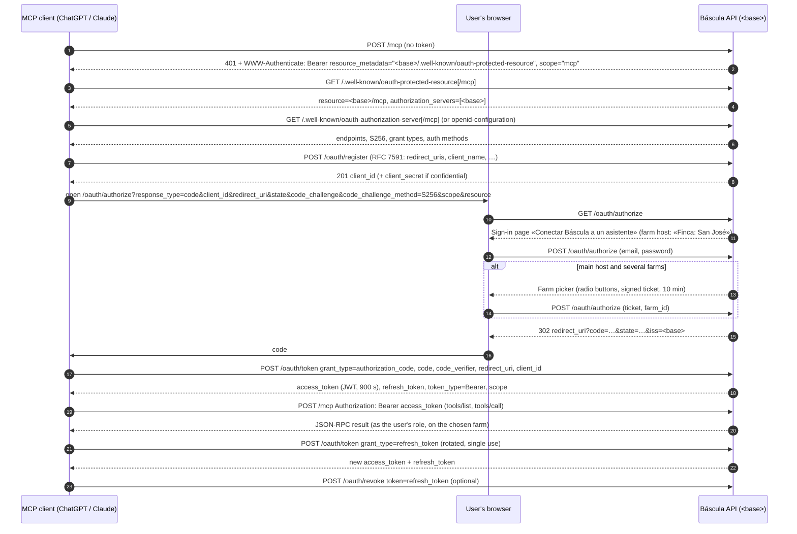

# OAuth 2.1 for the MCP server — developer reference

ChatGPT's connector UI will not take a pasted bearer token, and Claude's
custom connectors use OAuth too. So Báscula runs a small OAuth 2.1
authorization server on every host. The access token it issues is the **same
JWT** `POST /v1/auth/login` issues: one user, one farm, one role, HS256,
15 minutes. Code: `services/api/internal/httpapi/handlers_oauth.go`; tests:
`internal/apitest/oauth_test.go`, `oauth_dcr_test.go`,
`oauth_chatgpt_test.go`, `oauth_farm_pick_test.go`.

`<base>` below is the host the client talks to (`https://bascula.engp.io` or
`https://<slug>.bascula.engp.io`), or `PUBLIC_BASE_URL` when configured. It
is both the issuer and the prefix of every endpoint.

## Flow



## Discovery

| URL | Document |
|---|---|
| `<base>/.well-known/oauth-protected-resource` and `…/oauth-protected-resource/mcp` | RFC 9728 protected-resource metadata |
| `<base>/.well-known/oauth-authorization-server` and `…/oauth-authorization-server/mcp` | RFC 8414 metadata |
| `<base>/.well-known/openid-configuration` and `…/openid-configuration/mcp` | The same RFC 8414 document (clients probe both; path-suffixed variants exist for issuers with a path) |
| `<base>/.well-known/jwks.json` | `{"keys":[]}` — tokens are HMAC-signed and only verified by Báscula; the empty set satisfies strict OIDC parsers |

Protected-resource metadata: `resource` = `<base>/mcp`,
`authorization_servers` = `[<base>]`, `scopes_supported` = `["mcp"]`,
`bearer_methods_supported` = `["header"]`, `resource_name` = `Báscula`.

Authorization-server metadata (abridged):

```json
{
  "issuer": "<base>",
  "authorization_endpoint": "<base>/oauth/authorize",
  "token_endpoint": "<base>/oauth/token",
  "registration_endpoint": "<base>/oauth/register",
  "revocation_endpoint": "<base>/oauth/revoke",
  "jwks_uri": "<base>/.well-known/jwks.json",
  "response_types_supported": ["code"],
  "response_modes_supported": ["query"],
  "grant_types_supported": ["authorization_code", "refresh_token"],
  "code_challenge_methods_supported": ["S256"],
  "token_endpoint_auth_methods_supported": ["none", "client_secret_post", "client_secret_basic"],
  "revocation_endpoint_auth_methods_supported": ["none", "client_secret_post", "client_secret_basic"],
  "scopes_supported": ["mcp", "offline_access"],
  "authorization_response_iss_parameter_supported": true,
  "subject_types_supported": ["public"],
  "id_token_signing_alg_values_supported": ["RS256"]
}
```

`openid` is not offered and no ID token is ever issued; the OIDC-only fields
exist so strict discovery parsers accept the document. All discovery and OAuth
endpoints send permissive CORS headers and answer `OPTIONS` preflights.

## Dynamic client registration — `POST /oauth/register`

RFC 7591. The JSON body is decoded **leniently** and unknown metadata is
ignored (a strict decoder once rejected ChatGPT's registration).

- `redirect_uris` (required): each must be `https`, or `http` only on
  `localhost` / `127.0.0.1` / `::1`. Otherwise `400 invalid_redirect_uri`.
- `response_types`: only `code` (else `400 invalid_client_metadata`).
- `token_endpoint_auth_method`: `none` (default; public client + PKCE),
  `client_secret_post` or `client_secret_basic`. Anything else
  (`private_key_jwt`, …) is registered as `none`.
- `grant_types`: normalized to `authorization_code` + `refresh_token`.
- `scope`: echoed; defaults to `mcp offline_access`.
- `client_name`: shown later in «Conexiones»; defaults to `mcp-client`.

Answer: `201` with `client_id`, `client_id_issued_at`, the registered
metadata, and — for the two secret methods — `client_secret` with
`client_secret_expires_at: 0` (never expires). Other client fields are echoed
back verbatim, except secret-shaped ones.

## Authorization — `GET/POST /oauth/authorize`

Query (GET) or form (POST): `response_type=code`, `client_id`,
`redirect_uri`, `state`, `code_challenge`, `code_challenge_method`,
`scope`, `resource`.

- `client_id` and `redirect_uri` are required; `redirect_uri` must exactly
  match one registered for the client. Failures render the page with a Spanish
  message (e.g. «Cliente OAuth desconocido. Vuelva a registrar el conector.»
  — unknown OAuth client, register the connector again).
- **PKCE S256 is mandatory.** A missing `code_challenge` or a method other
  than `S256` (the method defaults to `S256` when omitted) redirects to the
  client with `error=invalid_request`, `error_description=PKCE S256 is required`,
  `state` and `iss`.
- `GET` renders the sign-in page (Spanish, phone-friendly): «Correo» (email),
  «Contraseña» (password), «Autorizar» (authorize).
- `POST` checks the password (constant work for unknown emails), requires a
  **verified email**, resolves the farm (below), and redirects to
  `redirect_uri?code=…&state=…&iss=<base>` (RFC 9207 `iss` on every
  response). The code is single-use and valid **10 minutes**.

### Farm selection

A token is always for one farm. The farm is resolved at sign-in:

1. **Farm host** (`<slug>.bascula.engp.io`): the host names the farm. The
   page shows «Finca: <display name>» and never asks. A membership in that farm
   is used; a suspended one fails with «Esa finca está suspendida.» (that farm
   is suspended); no membership fails with «Esa cuenta no pertenece a esta
   finca.» (that account does not belong to this farm). A dedicated farm stack
   whose account has exactly one active membership uses it.
2. **Main host**, with `farm_id` in the form: that membership, if active.
3. **Main host**, one active membership: that farm.
4. **Main host**, several: a second page «Su cuenta tiene varias fincas. Elija
   cuál va a usar el asistente.» (your account has several farms; choose which
   one the assistant will use) with one radio button per farm (`farm_id`) and a
   signed `ticket` proving the password was checked (valid 10 minutes, so the
   password is not re-sent). The user never types a farm UUID.

The role in the token is the user's role on that farm.

## Token — `POST /oauth/token`

Form-encoded. Client authentication: HTTP Basic (`client_secret_basic`, both
halves form-urlencoded) or `client_id` + `client_secret` in the form
(`client_secret_post`), or just `client_id` for a public client. A client
registered with a secret must present it; a wrong secret is always refused
(`401 invalid_client`, with a `Basic` challenge if Basic was tried).

**`grant_type=authorization_code`**: `code`, `code_verifier`,
`redirect_uri`, `client_id` (all required). The code is deleted on first use
**even if PKCE then fails**. `code`/`client_id`/`redirect_uri` must match the
authorization; `SHA256(code_verifier)` must equal the challenge. The
membership is re-checked (suspended or removed → `invalid_grant`). Answer:

```json
{ "access_token": "<JWT>", "refresh_token": "<opaque>", "token_type": "Bearer",
  "expires_in": 900, "scope": "mcp offline_access" }
```

The session is recorded with the client's id, which is what makes it appear in
«Conexiones» (`GET /v1/mcp/connections`).

**`grant_type=refresh_token`**: `refresh_token` (+ client auth if a
`client_id` is sent). Refresh tokens are **rotated and single-use**, with the
same family rules as the mobile app: replaying a used refresh token revokes the
whole family. Refresh tokens live 60 days. `scope` is omitted from the answer
(RFC 6749 §5.1: unchanged). A bad token → `400 invalid_grant`.

Errors follow RFC 6749 §5.2: `{"error": "...", "error_description": "..."}`.

## Revocation — `POST /oauth/revoke`

RFC 7009. Form: `token`, optional `token_type_hint`, optional client auth.
A refresh token revokes its whole family (the connection disappears from
«Conexiones»). An access token is stateless and simply lapses within
15 minutes. Always `200`, including for unknown tokens.

Users can also revoke from the app: «Configuración» → «Conexiones» →
«Administrar» → «Revocar conexión» (`DELETE /v1/mcp/connections/{id}`).

## Scopes

`mcp` is the only real scope; `offline_access` is advertised because clients
ask for it to get a refresh token (which is issued regardless). Any requested
scope is accepted and echoed, and **grants nothing extra**: what a token can do
is decided by the user's role on the farm, through `auth.Matrix`, on every
tool call.

## Using the token

`POST <base>/mcp` with `Authorization: Bearer <access_token>`. An expired or
invalid token gets `401` with
`WWW-Authenticate: Bearer realm="bascula", resource_metadata="…", scope="mcp", error="invalid_token", …`
so the client knows to refresh or sign in again.

## Service worker rule

The web app is a PWA on the same hosts. Its Workbox service worker answers
navigations with the app shell (`navigateFallback`) — which once swallowed
`/oauth/authorize`: in a browser that had opened the app, the sign-in page
never reached the API and the connector hung (fixed in PR #86). The rule, in
`apps/web/src/pwa/navigateFallbackDenylist.ts`, is that the worker must never
answer these with the shell:

```
/v1/   /health   /landing/   /oauth/   /mcp  (/mcp, /mcp/…, /mcp?…)   /.well-known/
```

`/mcp/docs` and `/mcp/tools.json` are covered by the `/mcp` rule and tested in
`navigateFallbackDenylist.test.ts`. Any new API-served page must be added
there, and links to it from the app must be plain `<a href>` (not router
links).

## Caching

The API marks `/v1/`, `/health`, `/oauth/`, `/mcp…` and `/.well-known/`
answers `Cache-Control: no-store`. The browser help page at `GET /mcp` is
served as a `401` on purpose, because Cloudflare keys its cache on the URL and
does not cache a `401`.
