# Employees — use cases and activity diagrams

> Document for Oscar's review, before any screen is designed. It covers three
> requests for the Employees module («Empleados»): **archive** people without
> deleting them, see **everything that happened between the farm and one
> person** (work records and an account statement), and **contact** them over
> WhatsApp. Every case is compared with the current system (`master`,
> September 2026) and marked **Existing**, **Partial** or **New**.
>
> Conventions follow [`harvest-registration.md`](harvest-registration.md):
> domain concepts in English; tables, routes, fields and exact Spanish UI labels
> as they appear in the code. Spanish labels are quoted «like this» with an
> English gloss. Labels marked *(proposed)* do not exist yet and are only a
> suggestion for the design phase.
>
> Related: [`docs/use-cases.md`](../use-cases.md) (RSP-004…RSP-009, the owner's
> original employee cases), [`docs/data-model.md`](../data-model.md),
> [`docs/database.md`](../database.md), [`docs/decisions.md`](../decisions.md)
> (decisions 5, 7 and 8), [`harvest-registration.md`](harvest-registration.md).

## Index

1. [Scope](#1-scope)
2. [Actors and roles](#2-actors-and-roles)
3. [What exists today](#3-what-exists-today)
4. [Use-case diagram](#4-use-case-diagram)
5. [Common business rules](#5-common-business-rules)
6. [Non-functional requirements](#6-non-functional-requirements)
7. [Use cases](#7-use-cases)
8. [Employee life cycle](#8-employee-life-cycle)
9. [Gaps: existing vs new](#9-gaps-existing-vs-new)
10. [Summary matrix](#10-summary-matrix)
11. [Open questions / decisions for Oscar](#11-open-questions--decisions-for-oscar)

---

## 1. Scope

In scope, as Oscar asked for it (translated from Spanish):

1. **Archive employees without deleting them**, the way other platforms
   archive things: hidden from daily lists and forms, and restorable.
2. **Inside an employee**: their work records («Labores») and their
   **financial history** — every settlement («liquidación») and an **account
   statement** with the balance of all transactions in both directions:
   payments to the person and debts of the person (advances, loans,
   deductions).
3. **Contact employees**: open `wa.me` with their phone number to write to them
   on WhatsApp.

Out of scope here (already specified elsewhere or later work): registering an
employee (RSP-004), paying (RSP-008), registering a debt (the existing
«Registrar deuda» — Register debt — dialog), notes, the cross-farm history
lookup (RSP-009, decision 1), special kilo prices, screens and code.

## 2. Actors and roles

| Actor | Who they are | Báscula role (`domain.Role`) |
|---|---|---|
| **Owner** («Dueño») | Owns the farm, decides who works there, settles and pays. | `owner` |
| **Administrator** («Administrador») | Trusted manager; runs payroll day to day. | `admin` |
| **Weigher** («Pesador») | Operates the scale. Never sees money, documents or phones. | `weigher` |
| **Employee** («Empleado») | Picker or day worker. **Does not use Báscula**; subject of the records and the recipient of WhatsApp messages. | — (row in `employees`) |
| **System** | Báscula API + Postgres (RLS, triggers). | — |
| **Offline device** | A phone running the web PWA with cached lists and an IndexedDB weighing queue; also the sync protocol (`sync_log`) for handsets. | any role's session |
| **WhatsApp** | External app opened through a `wa.me` link. Báscula never sends messages itself. | external |

### Permissions — today and proposed

Server source: `services/api/internal/auth/perm.go`; web source:
`apps/web/src/auth/permissions.ts`.

| Capability | Server today | Web today | Proposed |
|---|---|---|---|
| List/search employees (`GET /v1/workers`) | all roles; weigher gets `id, name, lastName, tag` only | all | unchanged |
| Archive / restore (`PATCH /v1/workers/{id}` `status`, `DELETE /v1/workers/{id}`) | `owner`, `admin` (`workers.write`) | **`owner` only** (`workers.delete`) | **decide** — see Q1 |
| See archived list | same as list | same | `owner`, `admin` |
| Profile, work-record values, notes (`/profile`) | `owner`, `admin` (Money) | `workers.profile` | unchanged |
| Account statement, settlements, balance (`/ledger`, `/balance`, `/v1/settlements`) | `owner`, `admin` (Money) | `money.read` | unchanged |
| See phone number | `owner`, `admin` (projection drops `phone` for weigher) | same | unchanged |
| Contact via WhatsApp | — | only from the payment receipt | `owner`, `admin` — see Q7 |
| Edit phone | `owner`, `admin` | `workers.write` | unchanged |

The server/web mismatch on archiving is real: an `admin` can archive through
the API (and MCP) but the web hides the button. It must be settled one way or
the other (Q1).

## 3. What exists today

### Data

| Table | Relevant columns / rules | Migration |
|---|---|---|
| `employees` | `name`, `last_name`, `document_type`, `doc_id`, `tag`, `phone` (free text), `address`, `city`, `country` (`'CO'`), `photo_id`, `created_at`, **`deleted_at`**, **`deleted_by`**. "Deleting" sets `deleted_at`; no physical `DELETE` exists anywhere. | 00003, 00014 |
| `employee_reactivations` | Audit row every time an arriving work record automatically reactivates an inactive employee (decision 8): `work_record_id`, `device_id`, `source` (`sync`/`web`), `deactivated_at/by`, `reactivated_by`. Readable by `owner`/`admin` only. | 00014 |
| `employee_notes` | Private notes, never leave the farm. | 00003 |
| `work_records` | The «Labores». `settled` flag, `deleted_at` for cancellation, `week_start`. | 00005 |
| `settlements` | One per employee and period: `period_start/end`, `gross_minor`, `status` (`open`/`void` only), `voided_at`. | 00006, 00019 |
| `settlement_items` | One line per work record settled: `quantity`, **frozen** `price_minor`, `amount_minor`. Partial unique index `ux_items_payable_live` forbids paying one work record twice. | 00006 |
| `settlement_releases` | Append-only record of freeing work records stuck under a void settlement (owner only). | 00016 |
| `ledger` | **Append-only** money trail per employee. `kind`: `devengo` (earning, +, always from a settlement), `pago` (payment, −), `anticipo` (advance, −), `deduccion` (deduction, −), `ajuste` (adjustment, ±), `reverso` (reversal, cancels exactly one entry). Triggers `t_ledger_append_only` (blocks `UPDATE`/`DELETE`) and `t_ledger_reverso`; `UPDATE`/`DELETE` also revoked from `bascula_app`. | 00006 |
| `employee_prices`, `plot_prices`, `week_prices`, `farm_prices` | Effective-dated kilo prices from a Monday; `kilo_price()` resolves person > plot > week > farm. | 00022, 00030, 00034 |
| `sync_log` | Append-only change feed; an employee travels with `deletedAt`. | 00013 |

**Balance convention.** `balance = Σ ledger.amount_minor`. Positive: the farm
owes the employee. Negative: the employee owes the farm (e.g. an advance larger
than what has been settled). Work done but **not yet settled** is not in the
ledger; the web shows it apart as «Pendiente de liquidar» (Pending
settlement), and the total «Lo que se le debe hoy» (What is owed today) is the
sum of both (`apps/web/src/features/workers/owed.ts`).

### API

| Route | Use |
|---|---|
| `GET /v1/workers?status=active\|inactive\|all&q=` | List/search (name, document, tag). |
| `PATCH /v1/workers/{id}` with `status: "inactive"\|"active"` | Deactivate / restore (plus field edits). `DELETE /v1/workers/{id}` = deactivate. |
| `GET /v1/workers/{id}/profile` | Person + balance + last N ledger entries (max 500) + work records + notes + reactivations. |
| `GET /v1/workers/{id}/balance`, `/ledger?limit=`, `/payables?from&to` | Balance, ledger newest first (no date filter, no running balance), unsettled work. |
| `GET /v1/workers/{id}/performance?weeks=` | «Rendimiento» (kg per week vs farm average). |
| `GET /v1/settlements?workerId=`, `GET /v1/settlements/{id}`, `POST …/void`, `POST …/release` | Settlement list, detail, void, release. |
| `POST /v1/payments`, `/v1/advances`, `/v1/deductions`, `/v1/ledger/{id}/reverse`, `GET /v1/payments/{id}` | Money movements and the payment receipt. |
| MCP: `list_workers`, `get_worker`, `worker_balance`, `worker_ledger`, `worker_payables`, `worker_performance` | Same data for assistants. |

### Web

- `/empleados` (`WorkersPage`): filter «Activas / Inactivas / Todos» (Active /
  Inactive / All), row menu «Dar de baja» (Deactivate) and «Reactivar»
  (Reactivate) with a confirmation that already says *nothing is deleted*.
  Footer: «La finca les debe» (The farm owes them).
- `/empleados/:id` (`WorkerProfilePage`): header with «Inactivo» chip, phone as
  plain text, buttons «Pagar empleado» (Pay employee), «Registrar deuda»
  (Register debt); card «Lo que se le debe hoy» with «Ya liquidado (saldo del
  libro)» (Already settled — ledger balance) and «Pendiente de liquidar»;
  sections «Rendimiento» (Performance), «Labores» (Work records, all of them,
  no filter), «Historial financiero» (Financial history — newest first, tap
  opens the receipt with «Descargar PDF» — Download PDF), «Anotaciones»
  (Notes).
- `/liquidaciones`, `/liquidaciones/:id`: farm-wide settlements and detail.
- `lib/share.ts`: `whatsappNumber()` (10 digits starting with 3 → `57…`) and
  `shareByWhatsApp()` (share sheet on phones, `wa.me` on desktop). Used only by
  «Enviar por WhatsApp» (Send by WhatsApp) on the payment receipt.
- Offline: the weighing screen caches `listWorkers({status: "active"})`; queued
  weighings live in IndexedDB.

## 4. Use-case diagram

Mermaid has no UML use-case diagram, so actors are drawn as circles and use
cases as rounded nodes; dotted arrows are «include»/«extend».

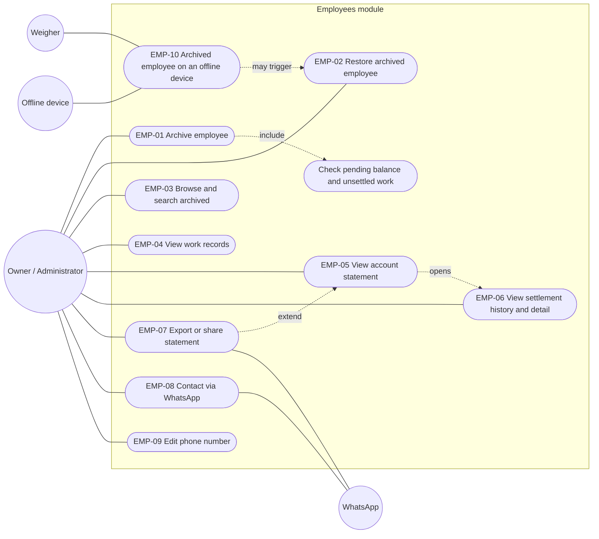

*Owner and administrator are drawn as one actor because they reach the same
cases; the administrator's access to EMP-01/EMP-02 depends on Q1. The weigher only meets this
module through EMP-10: he never sees archived people, money or phones.*

## 5. Common business rules

| ID | Rule | Today |
|---|---|---|
| BR-01 | **Archiving never deletes.** It sets `employees.deleted_at` and `deleted_by`; the employee, work records, settlements, ledger and notes stay intact and readable. | ✅ `SoftDeleteEmployee` |
| BR-02 | Archived employees disappear from daily lists and pickers (weighing, bulk registration, payroll lists) but remain reachable through the archived filter, search and direct links. | ✅ lists default to `active` |
| BR-03 | **The ledger is append-only.** Nothing in the statement is ever edited or deleted; an error is corrected with a `reverso` (reversal) or `ajuste` (adjustment), and both rows stay visible. | ✅ trigger + revoke |
| BR-04 | The balance is **derived**, never stored: `Σ ledger.amount_minor`. Positive = farm owes the employee; negative = employee owes the farm. | ✅ |
| BR-05 | Unsettled work is **not** balance. It is shown apart as «Pendiente de liquidar», valued provisionally; the statement may display it as a memo line, never as a ledger row. | ✅ profile |
| BR-06 | **Kilo price priority** for valuing work: corrected record at settlement *(phase 3, not built)* > employee price > plot price > week price > farm base price. Prices are effective-dated from a Monday. **Settled lines never change**: `settlement_items.price_minor` is frozen. | ✅ except the corrected record |
| BR-07 | A work record belongs to at most one live settlement (`ux_items_payable_live`). Voiding a settlement reverses its `devengo` and frees its work records; nothing is deleted. | ✅ |
| BR-08 | **Automatic reactivation** (decision 8): new work recorded for an archived employee, dated after the archive, restores them and writes `employee_reactivations`. A later human archive wins over an automatic reactivation. | ✅ |
| BR-09 | Money is visible to `owner` and `admin` only. The weigher never receives balances, prices, documents or phone numbers, through any route or the sync feed. | ✅ `Money` flag + projections |
| BR-10 | WhatsApp numbers are built in international form, digits only. A 10-digit Colombian mobile starting with 3 gets `57`. Anything unusable opens no chat and says why. | ⚠️ util exists; no user-facing error |
| BR-11 | Amounts are integer minor units (`*_minor`, COP cents); days are farm-local (`local_day`, farm time zone). | ✅ |
| BR-12 | Every write is idempotent by client-minted id (retries never duplicate). | ✅ |

## 6. Non-functional requirements

- **Users are farm people around 50 years old.** Plain Spanish, no jargon
  ("saldo del libro" is already borderline), big text (≥ 17 px body, as in
  «Historial financiero»), big touch targets, **one main action per screen**,
  confirmations that state the consequence in one sentence.
- **Phone first, desktop too.** Every case must work one-handed on a phone
  in the field and comfortably on a desktop. Tables become stacked rows on
  phones.
- **Unknown is never zero.** A figure that failed to load shows «—» with a
  reason, never `$0` (the existing rule in the profile).
- **Provisional is visibly provisional.** Values that can still move (unsettled
  work priced by the week) are marked as estimates.
- **Performance.** A statement for a full season (≈ 500–1,000 ledger rows)
  loads in under 2 s on 3G; the server paginates or aggregates rather than the
  500-row ceiling silently truncating.
- **Privacy.** Phone numbers and money stay inside the farm; WhatsApp is opened
  on the user's own device and Báscula stores nothing about the conversation.
- **Auditability.** Archive, restore and automatic reactivation record who and
  when.
- **Offline.** Reading the statement requires a connection; recording work for
  anyone the device knows keeps working offline (EMP-10).

## 7. Use cases

Activity diagrams are Mermaid flowcharts: rounded nodes start or end a flow,
diamonds are decisions, and the prefix of a node (*Actor:*, *System:*,
*Device:*, *Server:*) names its swimlane. Subgraph swimlanes were tried and
dropped: Mermaid's layout reorders them and the flow becomes harder to read.

Legend for **Status**: **Existing** — behaves as described; **Partial** — exists
but lacks parts described here; **New** — does not exist.

---

### EMP-01: Archive an employee

| | |
|---|---|
| **Status** | **Partial.** «Dar de baja» exists (list row menu) and is logical. Missing: the term «Archivar», the pending-money check, an optional reason, the action from the profile. |
| **Goal** | Take someone who no longer works at the farm out of daily lists without losing their history. |
| **Actors** | Owner; Administrator if Q1 allows. |
| **Preconditions** | Signed in with archive permission; employee is active; online (archiving is not queued offline — Q9). |
| **Trigger** | «Archivar» *(proposed; today «Dar de baja»)* on the list row menu or the profile. |

**Main flow**

1. The actor opens the employee (list or profile) and chooses «Archivar».
2. The system reads the employee's **ledger balance** and **unsettled work**
   (`/balance`, `/payables`).
3. Both are zero: the system asks «¿Archivar a «Nombre»? Deja de aparecer en
   las listas. No se borra nada y puede recuperarlo cuando quiera.» (Archive
   «Name»? They stop appearing in lists. Nothing is deleted and you can
   restore them any time.)
4. The actor confirms «Sí, archivar» (Yes, archive).
5. The system sets `deleted_at = now()`, `deleted_by = actor` (and the optional
   reason — Q3), returns to the list, and shows «Archivado. Deshacer» (Archived.
   Undo) for a few seconds.

**Alternative and exception flows**

- **A1 — The farm still owes money** (balance > 0 and/or unsettled work > 0):
  the confirmation shows the amounts — «Todavía se le deben $X (Y sin
  liquidar)» (They are still owed $X, Y unsettled) — and offers «Pagar
  primero» (Pay first → RSP-008 pay screen) as the main button and «Archivar
  de todos modos» (Archive anyway) as the secondary one. *Recommended default:
  warn, do not block* (Q2).
- **A2 — The employee owes the farm** (balance < 0, e.g. an unrecovered
  advance): same warning — «Le debe a la finca $X» (Owes the farm $X). Archiving
  keeps the debt on the books; it reappears if the person is restored.
- **A3 — Undo**: «Deshacer» within the snackbar runs EMP-02 immediately.
- **A4 — Already archived** (another user did it): the system shows the
  current state; no error, no second audit entry.
- **A5 — No permission**: the action is not shown; the API answers 403.
- **A6 — No connection**: «Sin conexión. Para archivar se necesita señal.» (No
  connection. Archiving needs a signal.) Nothing changes.
- **A7 — Settled but not fully paid**: a live settlement whose `devengo` has
  not been matched by payments is simply a positive balance → A1.

**Postconditions**: employee inactive; hidden from active lists, weighing
pickers and bulk sheets (after the next refresh on each device); all history
intact; `deleted_by` records the decision; sync feed carries `deletedAt`.

**Business rules**: BR-01, BR-02, BR-04, BR-05, BR-08.

**Data touched**: `employees.deleted_at`, `employees.deleted_by` (write);
`ledger`, `work_records`, `settlements` (read); `sync_log` (append).
*New*: optional `employees.archive_reason` or an `employee_archives` history
table (Q3).

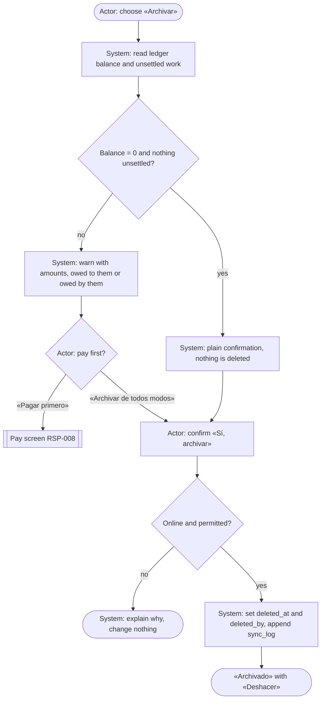

The check in `B` is the one new piece of logic. It reads the same two figures
the profile already adds up (`owed.ts`), so the warning and the profile can
never disagree. The decision `E` is the user's: the recommended design warns
but does not block, because a person who left owing an advance must still be
archivable, and blocking would push the owner to invent a fake payment.

---

### EMP-02: Restore an archived employee

| | |
|---|---|
| **Status** | **Existing** (manual: «Reactivar» in the row menu; automatic: decision 8). Missing: button on the archived profile, «Recuperar» wording, a history of past archives. |
| **Goal** | Bring back someone who returns (e.g. next harvest) under the same record, with their history and balance. |
| **Actors** | Owner; Administrator if Q1 allows. System (automatic path). |
| **Preconditions** | Employee archived. |
| **Trigger** | «Recuperar» *(proposed; today «Reactivar»)* on the archived list or profile; or new work arrives for the person (EMP-10). |

**Main flow (manual)**

1. The actor finds the person in the archived list (EMP-03) and opens them.
2. The profile shows the banner «Archivado el 12 mar 2026 por Oscar»
   (Archived on … by …) and the button «Recuperar».
3. The system asks «¿Recuperar a «Nombre»? Vuelve a aparecer en las listas y
   en la báscula.» (Restore «Name»? They appear again in lists and at the
   scale.)
4. The actor confirms; the system clears `deleted_at`/`deleted_by`.
5. The profile shows the balance carried over from before archiving.

**Alternative and exception flows**

- **A1 — Automatic**: work dated after the archive is recorded for the person
  → the system restores them and writes `employee_reactivations` (decision 8).
  The owner sees it in the profile and the farm-wide reactivation audit.
- **A2 — Duplicate registration attempt**: someone registers a "new" employee
  with the document of an archived one. **Today this succeeds** —
  `ux_employees_doc` and `ux_employees_tag` only cover rows with
  `deleted_at IS NULL` — and the person ends up with two records and two
  separate statements. The form should look up archived people by document and
  offer «Ya existe, archivado. ¿Recuperarlo?» (Already exists, archived.
  Restore?) *(New)*.
- **A4 — Restore collides**: an active employee already holds the same
  document or tag (the duplicate from A2) → the unique index rejects the
  restore; the system must explain «Ya hay un empleado activo con ese
  documento: «Nombre»» (There is already an active employee with that
  document) instead of a generic error *(New)*. Merging the two records is out
  of scope (Q13).
- **A3 — Already active**: nothing happens; no error.

**Postconditions**: employee active; same `id`, history, balance and special
prices (`employee_prices` are effective-dated and untouched).

**Business rules**: BR-01, BR-04, BR-06, BR-08.

**Data touched**: `employees.deleted_at/deleted_by` (write);
`employee_reactivations` (write, automatic path); `sync_log` (append). Today
restoring **erases** `deleted_by`, so the previous archive is only recoverable
for automatic reactivations — Q3.

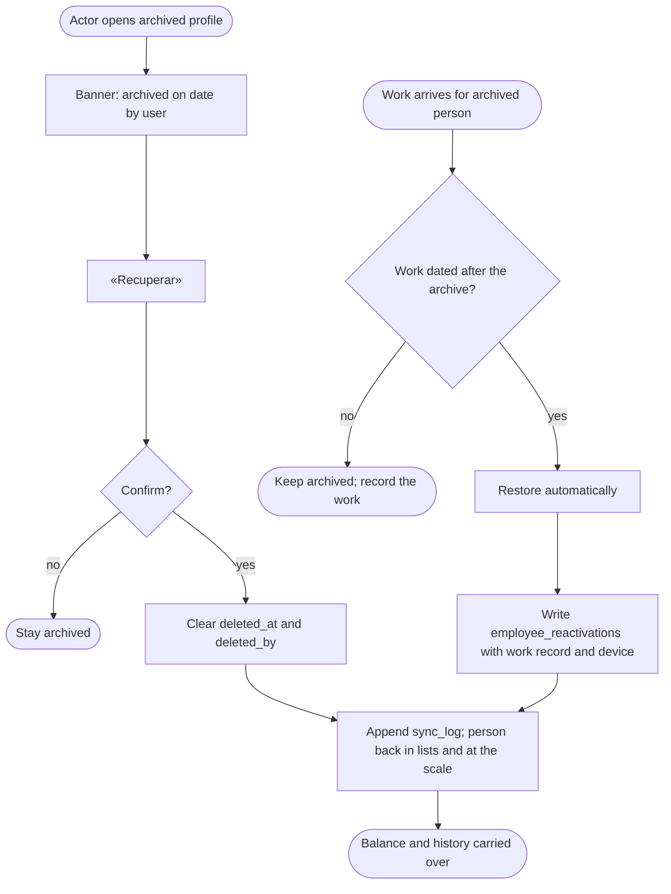

Two entry points converge on the same state. The automatic path is the owner's
decision 8 and already runs; what it needs from this module is only
visibility — the banner and the audit row must be easy to find on the profile.

---

### EMP-03: Browse and search archived employees

| | |
|---|---|
| **Status** | **Partial.** The «Inactivas» filter and search exist. Missing: archived date/by column, balance on archived rows, the word «Archivados». |
| **Goal** | Find someone who left, to check their history, settle a leftover balance or restore them. |
| **Actors** | Owner, Administrator. |
| **Preconditions** | Signed in with `workers.read` and full projection. |
| **Trigger** | Filter «Archivados» *(proposed; today «Inactivas»)* on `/empleados`, or search. |

**Main flow**

1. The actor selects «Archivados».
2. The system lists archived employees (`GET /v1/workers?status=inactive`),
   newest archive first *(proposed; today alphabetical)*, each with name,
   document, archive date and «Se le debe» (Owed) if not zero.
3. The actor searches by name, document or tag; the list narrows.
4. The actor taps a row → profile (read-only banner; EMP-02 available).

**Alternatives**: no archived people → «No hay empleados archivados.» (No
archived employees.); search in «Activos» that matches only archived people →
«Hay 1 archivado con ese nombre. Ver» (1 archived match. See) *(New)*;
archived people with non-zero balance are highlighted, since that money is
still real.

**Postconditions**: none (read only).

**Data touched**: `employees` (read), `ledger` aggregate (read).

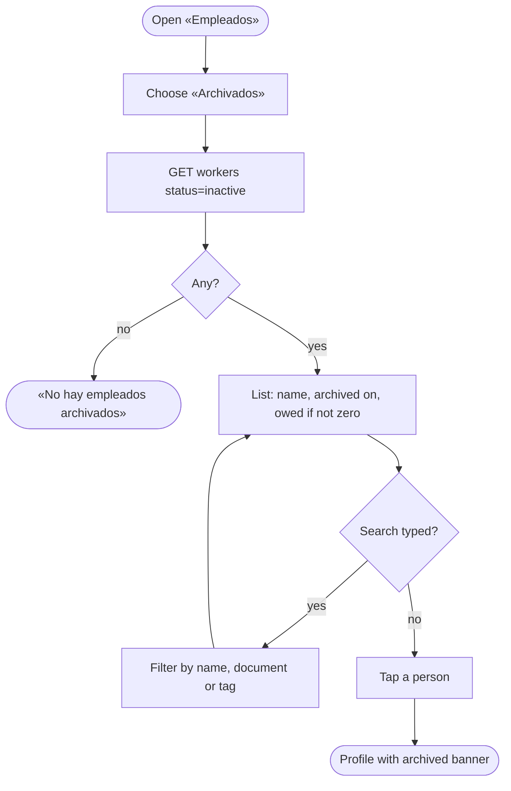

---

### EMP-04: View an employee's work records («Labores»)

| | |
|---|---|
| **Status** | **Partial.** The profile's «Labores» table lists **all** records (activity, date, plots, quantity, value, «liquidada»/«pendiente»). Missing: date filter, grouping by week, cancelled records, link to the settlement that paid each record, paging for long histories. |
| **Goal** | See what the person did, when, where, and whether it is paid. |
| **Actors** | Owner, Administrator (values); weigher never reaches the profile. |
| **Preconditions** | Profile permission; works for archived employees too. |
| **Trigger** | Profile → «Labores». |

**Main flow**

1. The system shows the current week by default *(proposed)*, grouped by
   week: per row activity, day, plot(s), quantity + unit, value, status.
2. Values: **settled** rows show the frozen `settlement_items` amount;
   **unsettled** rows show the provisional value from `kilo_price()` (BR-06)
   and are marked as estimates.
3. Each week shows its total kg and value; the footer shows «Pendiente de
   liquidar».
4. The actor changes the range («Esta semana», «Mes», «Temporada», «Elegir
   fechas» — This week, Month, Season, Pick dates).
5. Tapping a settled row opens its settlement (EMP-06).

**Alternatives**: no records → «Este empleado no tiene labores registradas.»
(existing text); cancelled records hidden by default, «Ver anuladas» (Show
cancelled) *(New)*; price unknown → «—» with reason, never `$0`.

**Postconditions**: none.

**Data touched**: `work_records`, `work_record_plots`, `settlement_items`,
`employee_prices`/`plot_prices`/`week_prices`/`farm_prices` (read). *New API*:
`GET /v1/work-records?workerId=&from=&to=` with paging (the profile currently
returns the whole list).

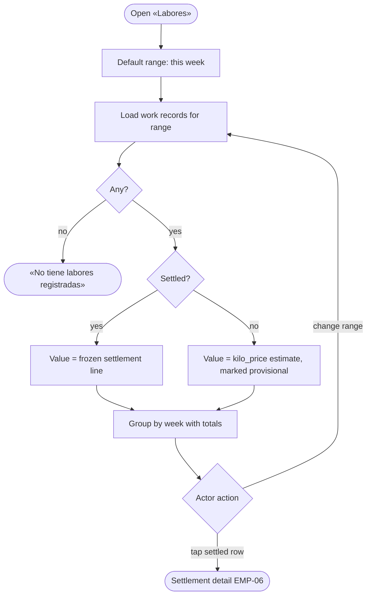

---

### EMP-05: View the account statement

| | |
|---|---|
| **Status** | **Partial.** «Historial financiero» lists ledger rows newest first (Pago, Liquidación, Anticipo, Descuento, Ajuste; «Anulado» chip), each opening its receipt. Missing: **running balance**, opening balance, date range, totals by kind and direction, pending work as a memo, and a server route without the 500-row ceiling. |
| **Goal** | Answer "who owes whom, how much, and why" with every transaction between farm and person, like a bank statement. |
| **Actors** | Owner, Administrator. |
| **Preconditions** | `money.read`; online. Works for archived employees. |
| **Trigger** | Profile → «Estado de cuenta» *(proposed; today «Historial financiero»)*. |

**Main flow**

1. The system proposes a range (default: current season, or all — Q5).
2. It loads the statement: **opening balance** (Σ before `from`), then every
   ledger row in the range in **chronological** order (`local_day`,
   `created_at`), each with date, type, concept, amount signed from the
   employee's point of view — «A su favor» (In their favour, `devengo`, positive
   `ajuste`) / «En contra» (Against them: `pago`, `anticipo`, `deduccion`,
   negative `ajuste`) — and the **running balance** after it.
3. Header totals for the range: «Ganado» (Earned, Σ `devengo`), «Pagado»
   (Paid, Σ `pago`), «Anticipos y préstamos» (Advances and loans, Σ
   `anticipo`), «Descuentos» (Deductions, Σ `deduccion`), «Ajustes»
   (Adjustments), and **closing balance** stated in words: «La finca le debe
   $X» (The farm owes them $X) or «Le debe a la finca $X» (They owe the farm
   $X) or «Están a paz y salvo» (All square).
4. Below the closing balance, a memo line (not a row): «Además, trabajo sin
   liquidar: ~$Y» (Also, unsettled work: ~$Y) and the total «Lo que se le
   debe hoy».
5. Tapping a row opens its receipt or settlement (EMP-06).

**Alternative and exception flows**

- **A1 — Reversed rows**: the original and its `reverso` both appear, linked
  («Anulado» / «Anula el pago del 3 mar» — Voids the payment of 3 Mar); they
  net to zero in the running balance. A voided settlement shows its `devengo`
  and the reversal.
- **A2 — Negative balance**: shown in red with the words «Le debe a la
  finca».
- **A3 — Empty range**: opening = closing balance, «Sin movimientos en estas
  fechas» (No movements in these dates).
- **A4 — Load failure**: «—» everywhere with a reason; never a zero balance.
- **A5 — Phone view**: one row per movement (date + type chip, concept, amount,
  running balance underneath), no horizontal scrolling.

**Postconditions**: none (read only; nothing in a statement is editable).

**Business rules**: BR-03, BR-04, BR-05, BR-07, BR-09, BR-11.

**Data touched**: `ledger`, `settlements` (read). *New API*:
`GET /v1/workers/{id}/statement?from=&to=` returning `openingMinor`, rows with
`runningMinor`, totals by kind, `closingMinor`, and `pendingMinor` (with
estimate flag), paged by cursor instead of `limit ≤ 500`. MCP
`worker_statement` could reuse it.

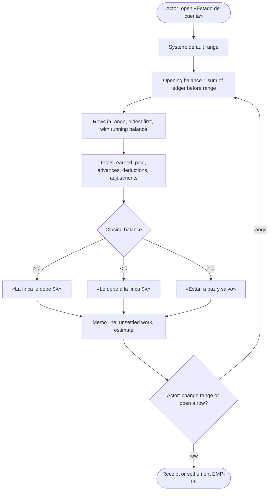

The statement is a **view** over the append-only ledger, so it cannot drift from
the balance: the closing figure is by construction the same `Σ amount_minor`
that `/balance` returns for the same date. Keeping unsettled work as a memo and
not a row preserves the existing distinction between «Ya liquidado» and
«Pendiente de liquidar»; merging them would show money as owed before the
settlement that owes it exists.

---

### EMP-06: View settlement history and detail

| | |
|---|---|
| **Status** | **Partial.** Farm-wide `/liquidaciones` and `/liquidaciones/:id` exist, `GET /v1/settlements?workerId=` filters by person, and each ledger row opens its receipt. Missing: a per-employee list of settlements on the profile. |
| **Goal** | See each time the person was settled: period, what work, at what price, what was deducted and paid. |
| **Actors** | Owner, Administrator. |
| **Preconditions** | `money.read`. |
| **Trigger** | Profile → «Liquidaciones» *(proposed tab)*, or a `devengo` row in EMP-05. |

**Main flow**

1. The system lists the person's settlements newest first: period
   (`period_start`–`period_end`), gross, and state. The table only knows
   `open` and `void`; «Pagada» / «Pendiente de pago» (Paid / Awaiting payment)
   would be **derived** from the ledger payments after it *(New)*, «Anulada»
   (Voided) is `void`.
2. The actor opens one: lines (day, activity, plot, quantity, **frozen**
   price, amount), gross, advances/deductions applied, paid, remaining.
3. «Descargar PDF» / «Enviar por WhatsApp» reuse the existing receipt.

**Alternatives**: voided settlement shown struck through with who voided it
and when, plus any `settlement_releases`; none yet → «Todavía no se le ha
liquidado.» (Not settled yet.).

**Postconditions**: none. Voiding and releasing are **not** part of this case
(existing, owner/admin flows in Payroll).

**Data touched**: `settlements`, `settlement_items`, `settlement_releases`,
`ledger` (read).

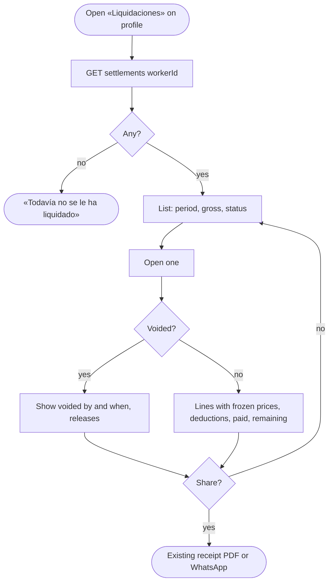

---

### EMP-07: Export or share the statement (optional)

| | |
|---|---|
| **Status** | **New** for the statement; **Existing** for a single payment receipt (PDF + WhatsApp text). |
| **Goal** | Give the employee (or keep) a copy of their account. |
| **Actors** | Owner, Administrator; WhatsApp. |
| **Preconditions** | EMP-05 loaded. |
| **Trigger** | «Compartir» (Share) on the statement. |

**Main flow**: the actor chooses «PDF» or «WhatsApp»; the system builds the
document for the selected range (farm name, person, range, opening, rows,
totals, closing balance in words, generation date, "provisional" note for the
memo line); PDF → download/share sheet; WhatsApp → a **short text summary**
(closing balance + last 5 movements), not the full table, via
`shareByWhatsApp()` (share sheet on phones, `wa.me` on desktop).

**Alternatives**: no phone or invalid phone → WhatsApp opens without a
recipient so the actor picks the chat (existing util behaviour) and the screen
says why; pop-up blocked → «No se pudo abrir WhatsApp…» (existing message).

**Data touched**: read only; nothing stored about what was sent (Q8).

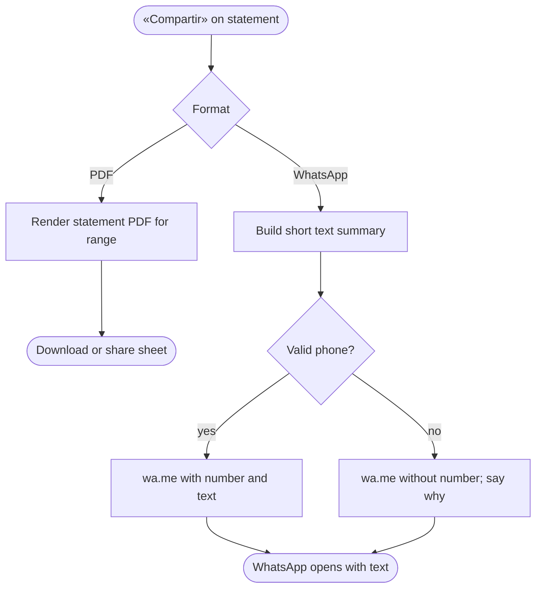

---

### EMP-08: Contact the employee via WhatsApp

| | |
|---|---|
| **Status** | **New** as a contact action (only the payment receipt opens WhatsApp today). `whatsappNumber()` exists. |
| **Goal** | Write to the person on WhatsApp in one tap. |
| **Actors** | Owner, Administrator (Q7 for weigher); WhatsApp. |
| **Preconditions** | Employee has a phone; actor sees phones (full projection). |
| **Trigger** | «Escribir por WhatsApp» *(proposed)* on the profile header (and optionally the list row menu). |

**Main flow**

1. The system normalises `employees.phone` with BR-10.
2. Valid → the actor optionally picks a message: «Mensaje en blanco» (Empty
   message), «Saldo» (balance summary — «Hola Ana, su saldo en Finca X hoy es
   $120.000 a su favor.»), «Recordatorio de pago» (payment day) *(templates —
   Q6)*.
3. The system opens `https://wa.me/57XXXXXXXXXX?text=…` (new tab on desktop,
   WhatsApp app on phone).
4. The actor sends the message inside WhatsApp; Báscula records nothing
   (Q8).

**Alternative and exception flows**

- **A1 — No phone**: button shown disabled with «No tiene teléfono.
  Agregarlo» (No phone. Add it) → EMP-09.
- **A2 — Phone not usable** (landline, too short, typo): «Este número no
  sirve para WhatsApp: 604 123. Corregirlo» (This number does not work for
  WhatsApp. Fix it) → EMP-09.
- **A3 — Foreign number** (Venezuelan pickers are common: `+58…`): accepted
  when entered with its country code (≥ 11 digits).
- **A4 — Balance template while money is unreadable**: template hidden; never
  send a `$0` that is really "unknown".
- **A5 — Archived employee**: allowed (e.g. to settle a leftover balance),
  with the archived banner visible.
- **A6 — Pop-up blocked**: existing message «No se pudo abrir WhatsApp.
  Revise que el navegador permita ventanas nuevas.»

**Postconditions**: WhatsApp open with the chat; no data change.

**Business rules**: BR-09, BR-10.

**Data touched**: `employees.phone` (read), `ledger` (read, balance template).

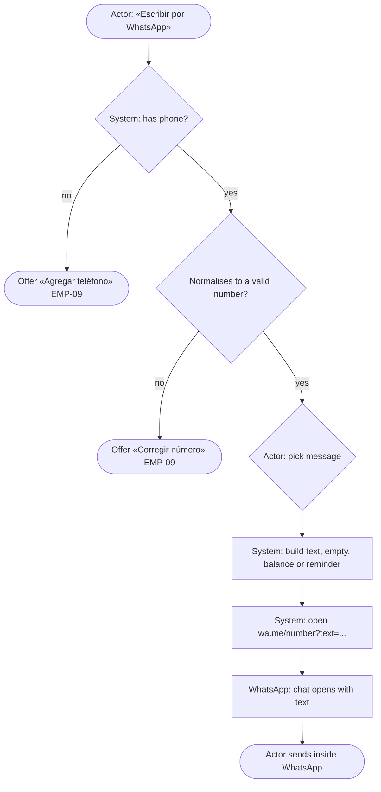

`wa.me` is a link, not an integration: no WhatsApp Business account, API key or
message log is needed, and nothing leaves Báscula except the text the actor
chooses to send from their own phone.

---

### EMP-09: Edit the phone number

| | |
|---|---|
| **Status** | **Partial.** Editable in «Editar» (`WorkerFormPage`), required, validated only as 7–30 characters of digits, spaces, `+()-`. Missing: WhatsApp-aware validation and a normalised storage format. |
| **Goal** | Keep a phone that WhatsApp can use. |
| **Actors** | Owner, Administrator. |
| **Preconditions** | `workers.write`; online. |
| **Trigger** | «Editar» on the profile, or «Agregar teléfono» / «Corregir número» from EMP-08. |

**Main flow**

1. The form shows «Celular (WhatsApp)» *(proposed label; today «Teléfono»)*
   with a fixed `+57` prefix that can be changed for other countries.
2. The actor types the number; the system validates as they type: Colombian
   mobile = 10 digits starting with 3.
3. On save, the system stores it normalised (E.164, `+573001234567`) and
   shows it formatted («300 123 4567»).
4. If the actor came from EMP-08, the system returns and opens WhatsApp.

**Alternatives**: landline or unusual number → warning «Parece un fijo: no
sirve para WhatsApp. ¿Guardarlo igual?» (Looks like a landline… Save anyway?);
same phone as another employee → warning, not block (families share phones —
Q10); existing free-text phones are normalised by a one-off migration that
leaves unparseable ones untouched and flagged.

**Postconditions**: `employees.phone` updated; sync feed appended (handsets do
not receive phones — BR-09).

**Data touched**: `employees.phone` (write), `sync_log` (append).

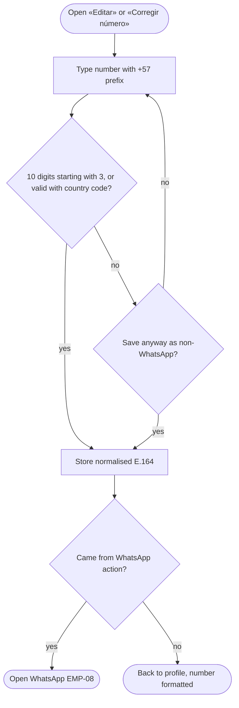

---

### EMP-10: Archived employee on an offline device

| | |
|---|---|
| **Status** | **Existing** behaviour (decision 8 + cached lists); **New**: explicit messaging on the device. |
| **Goal** | Never lose a weighing because of an archive that the phone has not heard about yet, and never silently undo a human decision. |
| **Actors** | Weigher (or anyone weighing), Offline device, System. |
| **Preconditions** | A device cached the active list before the person was archived elsewhere. |
| **Trigger** | The device records work for that person without signal, then syncs. |

**Main flow**

1. Offline, the person still appears in the device's cached list; the weigher
   records a weighing (queued with its UUID).
2. Signal returns; the queue uploads `POST /v1/work-records` (or sync push).
3. The server sees the employee archived and the work dated **after** the
   archive → restores them and writes `employee_reactivations` (BR-08).
4. The owner sees «Recuperado automáticamente por una pesada del 14 mar
   (celular de Juan)» (Restored automatically by a weighing of 14 Mar —
   Juan's phone) on the profile and in the reactivation audit.
5. The device refreshes its cached list.

**Alternative and exception flows**

- **A1 — Work dated before the archive** (a late upload of old work): the
  work is saved, the person stays archived; the unsettled work shows up on the
  archived person's profile and in EMP-01's warning if someone looks.
- **A2 — Archived again after an automatic restore**: the human decision wins
  (decisions log, "reactivated worker whom the web deletes again"); the work
  stays; the device shows a conflict for review.
- **A3 — Device refreshes before recording**: the archived person is not in
  the picker; if the weigher needs them he must ask an owner/admin to restore
  them (the weigher cannot see archived people).

**Postconditions**: no weighing lost; every reactivation traceable.

**Data touched**: `work_records`, `employees`, `employee_reactivations`,
`sync_log`; device IndexedDB `pesadas` and `cache` stores.

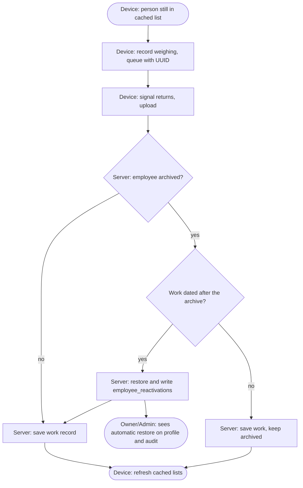

## 8. Employee life cycle

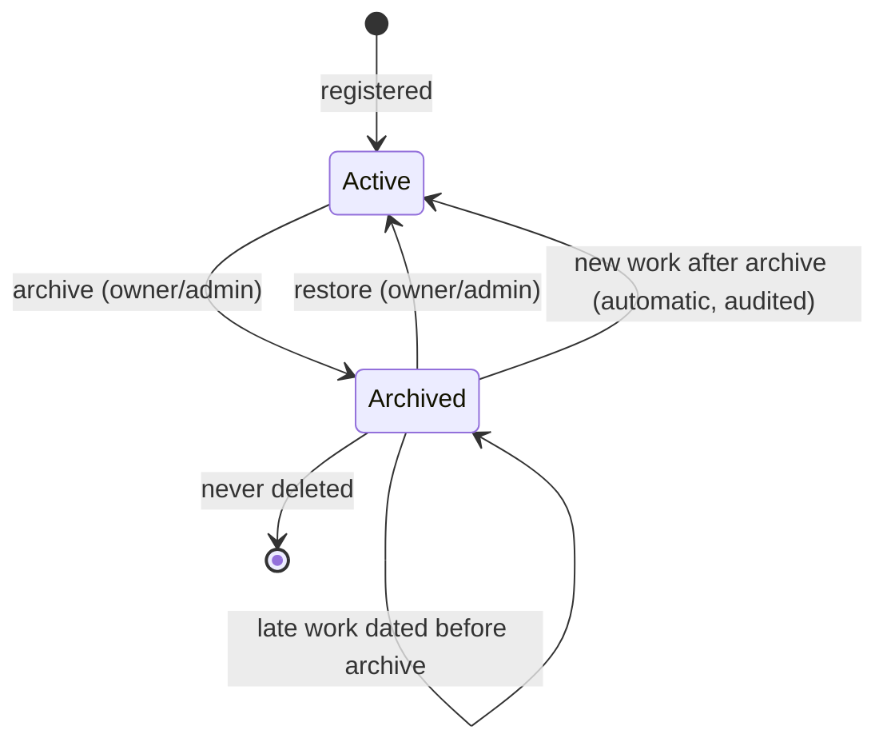

- **Active**: in every list and picker; can be weighed, settled and paid.
- **Archived**: hidden from daily lists; history, balance and statement fully
  readable; can still be paid or charged by an owner/admin (Q4).
- There is no terminal "deleted" state: the money trail must outlive the
  person's time at the farm (ledger and settlements reference the employee).

## 9. Gaps: existing vs new

| ID | Gap | Case |
|---|---|---|
| G-01 | Web restricts archive to `owner`, server allows `admin`. | EMP-01/02 |
| G-02 | No pending-money check before archiving. | EMP-01 |
| G-03 | No archive reason; restore erases `deleted_by`, so manual archive history is lost. | EMP-01/02 |
| G-04 | No archive action or archived banner on the profile. | EMP-01/02 |
| G-05 | Archived list lacks archive date and balance; alphabetical only. | EMP-03 |
| G-06 | Registering the document of an archived person creates a duplicate record (unique indexes skip archived rows); restoring then collides. | EMP-02 |
| G-07 | «Labores» has no date range, week grouping, cancelled toggle or paging. | EMP-04 |
| G-08 | Ledger route has no date range, opening/running balance or totals; 500-row ceiling. | EMP-05 |
| G-09 | No per-employee settlements list on the profile. | EMP-06 |
| G-10 | No statement PDF / WhatsApp summary. | EMP-07 |
| G-11 | No WhatsApp contact button; phone shown as plain text. | EMP-08 |
| G-12 | Phone stored as free text; validation not WhatsApp-aware. | EMP-09 |
| G-13 | Devices get no visible message when a queued weighing restores an archived person. | EMP-10 |
| G-14 | Corrected-record price at settlement (top of BR-06) is not built yet. | EMP-04 |

## 10. Summary matrix

| Case | Status | Who | Offline | Writes |
|---|---|---|:-:|---|
| EMP-01 Archive | Partial | owner (+admin?) | ❌ | `employees.deleted_at/by` |
| EMP-02 Restore | Existing (+UI) | owner (+admin?), system | auto path ✅ | `employees`, `employee_reactivations` |
| EMP-03 Archived list | Partial | owner, admin | ❌ | — |
| EMP-04 Work records | Partial | owner, admin | ❌ | — |
| EMP-05 Account statement | Partial | owner, admin | ❌ | — |
| EMP-06 Settlements | Partial | owner, admin | ❌ | — |
| EMP-07 Export/share | New (optional) | owner, admin | ❌ | — |
| EMP-08 WhatsApp contact | New | owner, admin | needs WhatsApp | — |
| EMP-09 Edit phone | Partial | owner, admin | ❌ | `employees.phone` |
| EMP-10 Offline archived | Existing (+message) | any weighing role | ✅ | `work_records`, `employee_reactivations` |

## 11. Open questions / decisions for Oscar

1. **Who archives?** Owner only (today's web) or owner + administrator
   (today's server)?
2. **Pending money when archiving:** warn and allow (recommended), or block
   until the balance and unsettled work are zero?
3. **Reason and history:** ask for an optional reason («Terminó la cosecha»,
   «Renunció», «Otro») and keep a history of every archive/restore?
4. **Archived people and money:** may an archived person still be paid or
   charged (to clear a leftover balance) without restoring them?
5. **Statement default range:** current season, last 3 months, or everything?
6. **WhatsApp messages:** empty chat only, or also templates (balance
   summary, payment-day reminder)? Which wording?
7. **Weigher and WhatsApp:** should a weigher be able to contact workers
   (would require showing phones to the weigher, which is hidden today)?
8. **Log contacts?** Record "WhatsApp opened by X on date" on the profile, or
   keep nothing (recommended)?
9. **Offline archiving:** is "archiving needs a signal" acceptable?
10. **Shared phones:** allow the same number on several employees (families)?
11. **Wording:** «Archivar / Archivados / Recuperar» instead of today's «Dar
    de baja / Inactivas / Reactivar»?
12. **Statement vocabulary:** «Estado de cuenta», «A su favor / En contra»,
    «Anticipos y préstamos» — clear for the workers, or other words?
13. **Duplicates of archived people:** when someone is re-registered instead
    of restored, do we need a "merge two records" tool, or is preventing it at
    registration enough?
