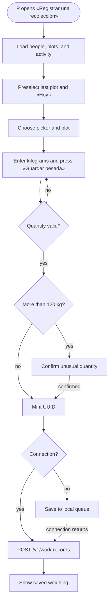
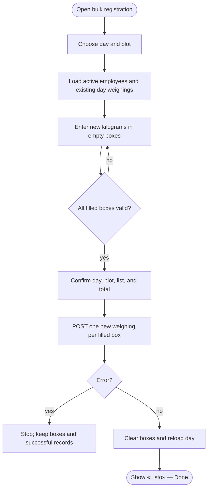

# Harvest registration — use cases and activity diagrams

> Document for Oscar's review. It describes how coffee harvest is registered in
> Báscula, case by case, and compares the intended behavior with the current
> system (the `master` codebase, September 2026). Domain concepts are translated
> into English; database tables, routes, fields, and exact Spanish UI labels stay
> as they appear in the code.
>
> Related: [`docs/use-cases.md`](../use-cases.md) (RSP-014…017, work records),
> [`docs/data-model.md`](../data-model.md), [`docs/api-architecture.md`](../api-architecture.md),
> [`docs/decisions.md`](../decisions.md).

## Index

1. [Domain context](#1-domain-context)
2. [Actors and roles](#2-actors-and-roles)
3. [Current model: what a weighing is](#3-current-model-what-a-weighing-is)
4. [Common business rules](#4-common-business-rules)
5. [Use cases](#5-use-cases)
6. [Weighing life cycle](#6-weighing-life-cycle)
7. [Effect on weekly payroll and settlement](#7-effect-on-weekly-payroll-and-settlement)
8. [Gaps in the current implementation](#8-gaps-in-the-current-implementation)
9. [Summary matrix](#9-summary-matrix)

---

## 1. Domain context

A normal harvest day, Monday through Saturday, works like this:

1. Pickers leave early for an assigned plot and pick cherry coffee.
2. They have lunch at noon.
3. They bring the coffee to the collection center (or the farmhouse). It is
   weighed and recorded there: person + plot + kilograms. That is a weighing.
4. In the afternoon they may pick again in another plot—or the same plot—and be
   weighed again at the end of the day. One picker can have several weighings on
   the same day, in one or more plots.
5. Usually the whole crew is weighed together (bulk registration). Sometimes one
   person arrives late, leaves early, or only one plot's crew is present.
6. Pickers are paid per kilogram at the week's price. On Saturday, or whenever
   the farm chooses, payroll settles the week, deducts advances, and pays cash.

The paper harvest sheet used by many farms is a people × days table containing
kilograms, normally separated by plot.

## 2. Actors and roles

| Domain actor | Who they are | Báscula role (`domain.Role`) |
|---|---|---|
| **Picker** | Picks the coffee and is weighed. **Does not use the system**; the picker is the subject of the record. Stored as `employees` (UI: «Empleados» — Employees). | — (no user) |
| **Weigher** | Operates the scale and records the weighing. May be an administrator or a trusted attendant. | `admin` or `weigher` |
| **Owner** | Reviews harvest, sets the week's price, settles payroll, and pays. May also weigh. | `owner` |

There is no separate `encargado` role. A trusted attendant is created as
`admin`; someone who only weighs is created as `weigher`. See gap **B-12**.

### Current server permissions

Source: `services/api/internal/auth/perm.go` and the RLS policy in
`services/api/migrations/00008_rls.sql`.

| Action | Route | `owner` | `admin` | `weigher` |
|---|---|:-:|:-:|:-:|
| Register a weighing | `POST /v1/work-records` (`work_records.write`) | ✅ | ✅ | ✅ weekly-price activities only; no own rate |
| Read weighings | `GET /v1/work-records` (`work_records.read`) | ✅ all | ✅ all | ⚠️ only records created by that user |
| Correct kilograms/note, cancel, or restore | `PATCH /v1/work-records/{id}` (`work_records.admin`) | ✅ | ✅ | ❌ 403 |
| Logical delete | `DELETE /v1/work-records/{id}` (`work_records.admin`) | ✅ | ✅ | ❌ 403 |
| See money (value/rate) | response projection | ✅ | ✅ | ❌ money fields are omitted |
| Settle/pay | `/v1/settlements…`, payments | ✅ | ✅ | ❌ |

## 3. Current model: what a weighing is

There is no `pesadas` table. A weighing is a `work_record` for the harvest
activity, paid per unit of work (kilogram) at the week's price. Two trips to the
scale create two records.

Relevant `work_records` fields (`migrations/00005_work_records.sql`):

| Field | Meaning | Set by |
|---|---|---|
| `id` | UUID minted on the device before sending; retrying it is idempotent. | Client |
| `farm_id` | Multi-tenant farm, protected by RLS. | Server/token |
| `employee_id` | Picker being weighed. | Weigher |
| `activity_id` | Harvest activity with `rate_source = weekly_price`. | Client, automatically |
| `pay_scheme` | `unidad_trabajo` (per kilogram). | Server, from activity |
| `rate_source` | `weekly_price`; the price is taken at settlement, not frozen at weighing time. | Server |
| `started_at` → `local_day` | Farm-local day; there is no business weighing time. | Client sends `dateFrom = dateTo = day` |
| `week_start` | Generated Monday and the key for weekly payroll. | Database |
| `quantity` | Kilograms, greater than zero, up to three decimals. | Weigher |
| `work_record_plots` | The plot. Harvest registration always sends one plot. | Weigher |
| `work_record_plot_crops` | Plot crops, for crop reports. | Client, from plot |
| `note` | Optional free-text note. | Optional |
| `device_id`, `created_by`, `created_at` | Origin device and audit information. | Client/server |
| `deleted_at` | Logical cancellation (`null` means active). | Server |
| `settled` | Whether the record belongs to a current settlement. | Server |

Current screens that write weighings:

| Screen | Route | Behavior | Offline |
|---|---|---|---|
| «Registrar una recolección» (Register a harvest) / `WeighingForm` | `/cosecha/recoleccion` | One picker, one plot, one day, kilograms. Offers «Deshacer» (Undo). | ✅ IndexedDB queue |
| «Registro de recolección masivo» (Bulk harvest registration) / `RegistroMasivoPage` | `/cosecha/registro-masivo` | One day and all active employees; each filled box adds one new weighing. | ❌ connection required |
| Day/week sheet / `PlanillaPage` | `/labores/planilla?modo=dia|semana` | Legacy sheet; writing a value replaces the single weighing in that cell. | ❌ |
| Work records / `WorkRecordsPage` | `/labores` | Lists records and supports cancellation. | ❌ |

The simple Harvest dashboard replaced the old «Registrar la semana» (Register
the week) people × days sheet. The old route redirects to bulk registration.

## 4. Common business rules

| ID | Rule | Current enforcement |
|---|---|---|
| RN-01 | A weighing is one person, one plot, one day, and a positive quantity. | Client sends one plot; server does not enforce the one-plot rule (B-13). |
| RN-02 | Quantity is positive and has at most three decimals; never silently round it. | Server `CHECK quantity > 0` and `domain.CheckNumeric`. |
| RN-03 | More than 120 kg requires confirmation, e.g. «¿420 kg en una sola pesada?» (420 kg in one weighing?). | Individual form only (`MAX_PLAUSIBLE_KG`); not sheets or server (B-09). |
| RN-04 | A picker can have several weighings on the same day and plot. Each is a record. | No uniqueness constraint; sheet cells with several records show the sum and become read-only. |
| RN-05 | The day is in the farm's time zone, not the browser's. | `set_work_record_local_day`. |
| RN-06 | Future days cannot be recorded. | Client only (B-08). |
| RN-07 | Harvest normally runs Monday–Saturday; Sunday is exceptional. | Sunday is currently accepted (B-16). |
| RN-08 | Provisional value is kilograms × week's price (or farm base price) until settlement. | Reports expose `valueIsEstimate`; settlement freezes it. |
| RN-09 | A settled weighing cannot be edited or cancelled until the settlement is cancelled. | Server returns `409 WORK_RECORD_SETTLED`. |
| RN-10 | Person, activity, day, price, and plot are not edited in place. Cancel the wrong record and create the correct one. | `PATCH` rejects immutable fields; plot editing is gap B-02. |
| RN-11 | Cancellation is logical (`deleted_at`), never physical; an API caller may restore it. | No restore button in the UI (B-02). |
| RN-14 | Recording work for an inactive picker reactivates the picker. | `store.ReactivateForWork`, decision 8. |

## 5. Use cases

The actor `P` is the person operating Báscula. `R` is a picker.

### CU-01: Individual registration

**Goal:** record one new weighing for one picker, plot, day, and quantity.

**Screens:** «Registrar una recolección» (`/cosecha/recoleccion`,
`WeighingForm`). Data captured: picker, plot, day («Hoy» — Today, «Ayer» —
Yesterday, or «Otro día» — Another day), and kilograms. Activity, crop IDs,
UUID, user, and registration time are automatic.

**Main flow**

1. P opens «Registrar una recolección».
2. The system loads people, plots, and the harvest activity into the device and
   preselects the last-used plot.
3. P selects R and confirms or changes the plot.
4. The system proposes «Hoy» and rejects future dates.
5. P enters kilograms and presses «Guardar pesada» (Save weighing).
6. The system validates picker, plot, and quantity, mints the UUID, and sends
   `POST /v1/work-records`.
7. On `201`, it shows «Guardado: R, N kg» (Saved: R, N kg), clears picker and
   quantity, and keeps plot and day ready for the next entry.

**Alternatives and exceptions**

- Over 120 kg: ask «¿N kg en una sola pesada?»; «Corregir» (Correct) returns
  to the form and «Sí, guardar» (Yes, save) confirms it.
- No signal: save the record and its UUID in the local queue; display
  «Pesadas por subir» (Weighings to upload), then retry when connected.
- «Deshacer» (Undo) cancels the last local record, or sends `PATCH status=inactive`
  for a record already on the server. A `weigher` receives 403 for the latter.
- Without a cached list, show «Abra esta pantalla una vez con internet…»
  (Open this screen once with internet…).
- Without a harvest activity, show «La finca no tiene una actividad de recolección.
  Pídale al administrador que la cree.» (This farm has no harvest activity. Ask
  an administrator to create it.)
- A lost response is retried with the same UUID; the server does not duplicate it.

**Postconditions:** an active `work_record` (or a queued record that will become
one) contributes provisional kilograms to R's `week_start`. Audit fields are
`created_by`, `created_at`, and `device_id`.

### CU-02: Bulk registration

**Goal:** record one new weighing for every picker who arrived together. The same
picker may be entered again later; each round is a new record.

**Screens:** «Registro de recolección masivo» (`/cosecha/registro-masivo?...`)
and the legacy day sheet. Bulk registration requires a connection. The screen
lists active employees, the chosen day and plot, existing totals for that day,
and one empty input per employee.

**Main flow**

1. P opens the bulk screen from Harvest. It proposes today and the last-used plot.
2. P chooses a day with the week buttons or «Ir a hoy» (Go to today); future days
   are not allowed.
3. The system loads all active employees and all weighings already recorded that
   day, across plots, showing «Ya tiene: N pesadas · 38 kg» (Already has: N
   weighings · 38 kg).
4. P enters kilograms only for people who were weighed. Empty boxes mean nothing
   to add. The system displays «N pesadas nuevas sin guardar» (N new unsaved
   weighings).
5. P presses «Guardar» (Save). Each filled box is validated before any write.
6. The confirmation shows day, plot, count, total, and picker → kilograms; it
   warns above 120 kg. P confirms «Sí, guardar» (Yes, save).
7. The system creates one `POST` per filled box, with a stable UUID per intent.
8. It clears the boxes, reloads the day, and shows «Listo. Se agregaron N
   pesadas nuevas» (Done. N new weighings were added).

A second visit to the scale repeats the flow and creates another record. Changing
plots does not change earlier records. A partially filled sheet writes only the
filled boxes. A failure halfway through is not atomic, but retrying the same
intent reuses UUIDs and does not duplicate successful writes.

A settled week rejects a new weighing. A `weigher` cannot see another weigher's
records under RLS. Without a connection, show «Sin conexión. Para guardar el
registro masivo se necesita señal…» (No connection. Bulk registration needs a
signal…) and do not save.

### CU-03: One plot with several pickers

**Goal:** record the crew that worked one specific plot. P chooses the day and
plot, fills only the boxes for the people who worked there, and saves using
CU-02. The alternative is to repeat CU-01 with the plot fixed. The result is one
weighing per picker, all with the same plot and day. The sheet currently lists
all active employees rather than only a plot's assigned crew (B-15).

### CU-04: Several plots in one day

**Goal:** record a picker who worked in several plots, such as plot A in the
morning and plot B in the afternoon.

With CU-01, P changes the preselected plot to B, selects R, and enters the second
quantity. The system creates a second `work_record`; it never replaces the first.
A bulk sheet for plot B works the same way. If a second weighing is made in the
same plot and day, the individual flow must be used: writing over an existing
sheet cell replaces its single record rather than adding another.

If P leaves the preselected plot unchanged, the correction is to cancel the
wrong record and register it again (CU-08); the plot is not editable in place.
The postcondition is two or more records with the same `local_day`, one plot per
record. Day totals sum them, while plot and crop reports keep them separate.

### CU-05: Consult the day's harvest

**Goal:** reconcile today's weighings with the scale or paper sheet before the
day closes.

Harvest shows weekly kilograms and kilograms per day. The week detail shows
kilograms by picker and day; Work records lists individual records with search
and status filters. A `weigher` sees only their own records. Queued records appear
as «Pesadas por subir» (Weighings to upload) on the device and do not affect
server totals until uploaded. Unknown values show «—» with a reason, never zero.

The current gap is a dedicated “today” view containing each weighing, time,
operator, plot, and a “close/reconcile day” action (B-14). `created_at` exists
but is not shown.

### CU-06: Edit a weighing

**Goal:** correct kilograms or a note on an active, unsettled weighing—for
example, 83 entered instead of 38.

Only `owner` and `admin` may edit. In a sheet, a cell with exactly one weighing
can be replaced; there is no individual edit screen. P changes the quantity,
the client sends `PATCH /v1/work-records/{id}`, and the server validates the
quantity and recalculates provisional totals. The API also accepts `note`, but
no current screen exposes it.

A settled record returns `409 WORK_RECORD_SETTLED` and must wait for the
settlement to be voided. A cell containing several records is read-only; cancel
the wrong record and create the correct one (CU-07 and CU-01). The current data
model does not retain the old value, editor, or reason (B-04).

### CU-07: Delete or cancel a weighing

**Goal:** remove a duplicate or otherwise incorrect weighing without destroying
its audit row.

«Deshacer» (Undo) cancels the last weighing in the individual screen;
«Borrar» (Delete) removes an item still in the local queue; Work records and a
single-record sheet cell use logical cancellation (`PATCH status=inactive`, or
`DELETE` as the equivalent API). The server sets `deleted_at`; reports and
payroll stop counting the record, but it remains available for audit and API
restoration.

A settled weighing requires voiding its settlement first. A `weigher` gets 403
for a server-side cancellation. The cancellation has no reason, author, or
replacement link today (B-04).

### CU-08: Update immutable weighing data

**Goal:** correct the picker, day, or plot of an existing weighing. These values
must not be edited in place because they move money between people or weeks.

P cancels the incorrect record (CU-07), registers a new one with the correct
person/day/plot and the same kilograms (CU-01), and verifies the reports. If the
catalog data itself is wrong—such as a picker or plot name—fix it in Employees
or Plots; records keep the IDs and then display the corrected catalog name.

The two actions are separate and there is no atomic “replace” operation. If the
new record is never created, the kilograms disappear from the provisional week.
The relationship between old and replacement records is not currently stored.

## 6. Weighing life cycle

```mermaid
stateDiagram-v2
  [*] --> Queued: registered without signal
  [*] --> Active: registered online
  Queued --> Active: upload with the same UUID
  Active --> Cancelled: logical cancel
  Cancelled --> Active: API restore
  Active --> Settled: included in a settlement
  Settled --> Active: settlement voided
  Settled --> [*]: paid; retained forever
```

- **Active, unsettled:** counts in reports at the provisional kilograms × week
  price value.
- **Settled:** price is frozen in the settlement; the weighing cannot be edited
  or cancelled until that settlement is voided.
- **Cancelled:** excluded from totals but retained for audit and possible API
  restoration.

## 7. Effect on weekly payroll and settlement

Every active weighing belongs to the Monday `week_start` of its farm-local day.
The Harvest dashboard and payroll sum quantities by picker and week. Settlement
reads those active records, freezes the rate and creates settlement items; a
payment then clears the resulting balance. A late weighing belongs to its own
week and is picked up by the next settlement when the prior week is already
closed. Advances are ledger entries and are deducted when the settlement posts.

## 8. Gaps in the current implementation

- **B-01:** a weigher cannot correct or cancel a record already on the server,
  although the UI offers «Deshacer» (Undo).
- **B-02:** picker, day, plot, and cancellation restoration lack a safe UI flow.
- **B-03:** there is no individual weighing editor; a sheet cell can replace, not
  append, a second weighing.
- **B-04:** no event history records the previous value, author, cancellation
  reason, or replacement relationship.
- **B-05:** weighing time (`created_at`) is not displayed.
- **B-06:** bulk registration is not atomic; retries depend on stable UUIDs.
- **B-07:** bulk registration cannot use the offline queue.
- **B-08:** the client, not the server, prevents future days.
- **B-09:** the 120 kg warning exists only on the individual form.
- **B-10:** duplicate weighings are not detected or flagged.
- **B-11:** RLS intentionally hides other weighers' records.
- **B-12:** there is no distinct attendant role.
- **B-14:** there is no day-reconciliation view or reviewed-day marker.
- **B-15:** plots have no assigned crews; a small plot can show every active
  employee.
- **B-16:** Sunday is accepted even though the normal harvest week ends Saturday.

## 9. Summary matrix

| Case | Main screen | Offline | Result | Audit |
|---|---|:-:|---|---|
| CU-01 individual | `/cosecha/recoleccion` | ✅ | One new weighing; provisional value | creator/time/device |
| CU-02 bulk | `/cosecha/registro-masivo`, `/labores/planilla` | ❌ | One new weighing per filled box | creator/time |
| CU-03 one plot/crew | bulk sheet or repeated individual | individual only | Same plot and day per crew member | standard fields |
| CU-04 several plots | individual or one sheet per plot | individual only | One record per plot and visit | standard fields |
| CU-05 consult | Harvest, week detail, Work records | queued locally | Read/reconcile; no writes | — |
| CU-06 edit quantity/note | sheet/API | ❌ | Existing active record updated | incomplete history (B-04) |
| CU-07 cancel | Work records, «Deshacer» | local queue only | `deleted_at`; excluded from totals | incomplete reason/author |
| CU-08 change person/day/plot | cancel then register | individual may queue | Old cancelled, new active | no replacement link |
