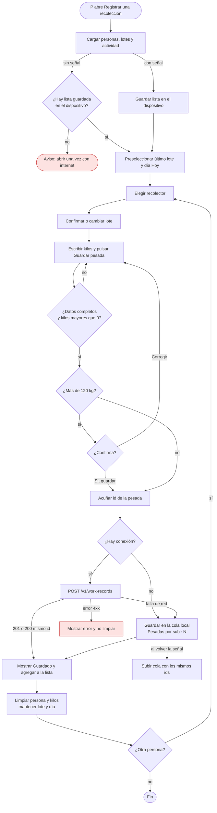
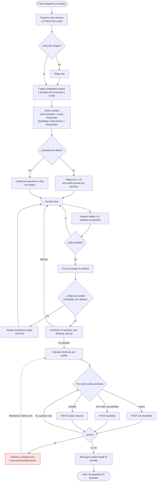
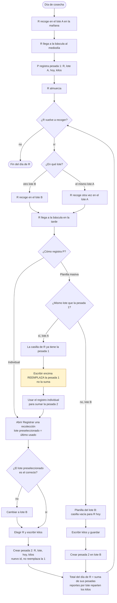
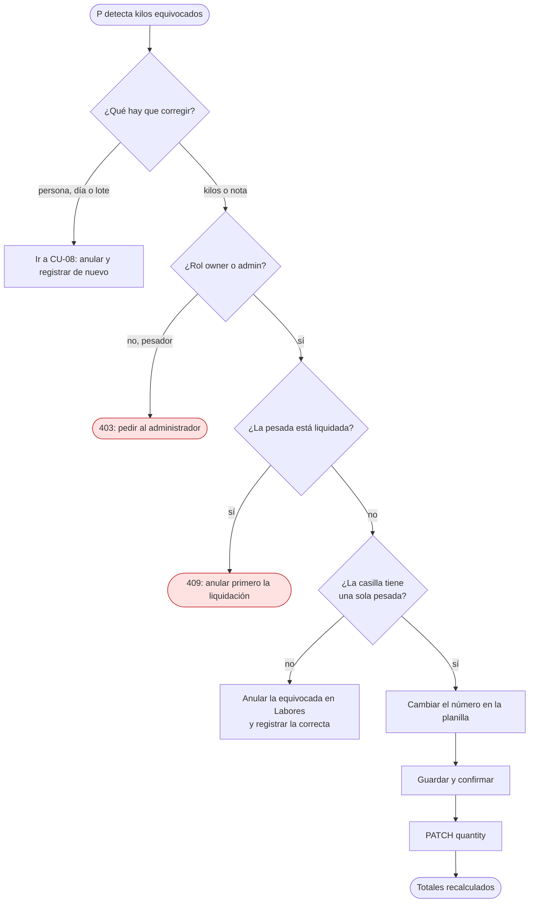
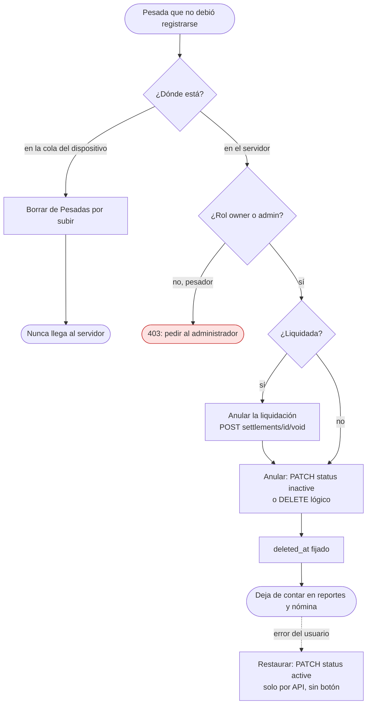
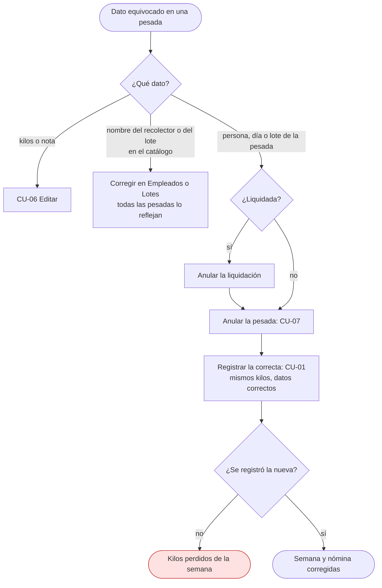
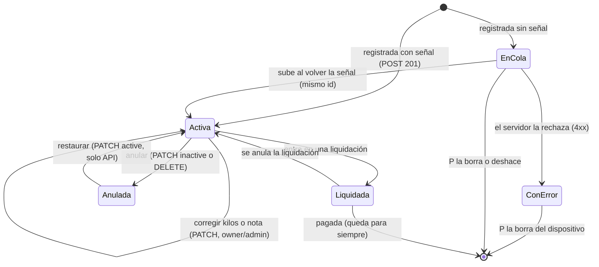

# Registro de recolección — casos de uso y diagramas de actividad

> Documento para revisión de Oscar. Describe **cómo se registra la recolección de
> café en Báscula**, caso por caso, y lo contrasta con lo que el sistema hace hoy
> (código en `master`, septiembre de 2026). Los términos del dominio van en
> español; los nombres de tablas, rutas y campos van tal como están en el código.
>
> Relacionados: [`docs/casos-de-uso.md`](../casos-de-uso.md) (RSP-014…017,
> labores), [`docs/modelo-datos.md`](../modelo-datos.md),
> [`docs/arquitectura-api.md`](../arquitectura-api.md),
> [`docs/decisiones.md`](../decisiones.md).

## Índice

1. [Contexto del dominio](#1-contexto-del-dominio)
2. [Actores y roles](#2-actores-y-roles)
3. [Modelo actual: qué es una pesada en Báscula](#3-modelo-actual-qué-es-una-pesada-en-báscula)
4. [Reglas de negocio comunes](#4-reglas-de-negocio-comunes)
5. [Casos de uso](#5-casos-de-uso)
   - [CU-01 Registro individual](#cu-01-registro-individual)
   - [CU-02 Registro masivo](#cu-02-registro-masivo)
   - [CU-03 Registro de un solo lote con varios recolectores](#cu-03-registro-de-un-solo-lote-con-varios-recolectores)
   - [CU-04 Múltiples lotes en un día por recolector](#cu-04-múltiples-lotes-en-un-día-por-recolector)
   - [CU-05 Consultar recolecciones del día](#cu-05-consultar-recolecciones-del-día)
   - [CU-06 Editar una recolección](#cu-06-editar-una-recolección)
   - [CU-07 Borrar / anular una recolección](#cu-07-borrar--anular-una-recolección)
   - [CU-08 Actualizar datos de una recolección](#cu-08-actualizar-datos-de-una-recolección)
6. [Ciclo de vida de una pesada](#6-ciclo-de-vida-de-una-pesada)
7. [Efecto en la nómina semanal y la liquidación](#7-efecto-en-la-nómina-semanal-y-la-liquidación)
8. [Brechas frente a la implementación actual](#8-brechas-frente-a-la-implementación-actual)
9. [Matriz resumen](#9-matriz-resumen)

---

## 1. Contexto del dominio

Un día normal de cosecha, de **lunes a sábado**:

1. Los **recolectores** salen temprano a un **lote** asignado y recogen café cereza.
2. A mediodía **almuerzan**.
3. Traen el café al **centro de acopio** (o a la casa de la finca). Ahí se **pesa**
   y se **registra**: persona + lote + kilos. Eso es una **pesada**.
4. Por la tarde pueden **volver a recoger en otro lote** (o en el mismo), y al
   final del día se vuelven a pesar. Un recolector puede tener **varias pesadas
   el mismo día**, en uno o varios lotes.
5. Casi siempre **se pesa a todos a la vez** (llegan juntos): registro masivo. A
   veces se pesa a **una sola persona** (llega tarde, o se va temprano) o a los de
   **un solo lote**.
6. A cada recolector se le paga **por kilo**, al **precio de la semana**. El sábado
   (o cuando la finca decida) se hace la **nómina**: se liquida la semana, se
   descuentan anticipos y se entrega el dinero.

La **planilla de recolección** en papel que muchas fincas ya llevan es una tabla
de personas × días, con los kilos de cada uno, normalmente por lote.

## 2. Actores y roles

| Actor del dominio | Quién es | Rol en Báscula (`domain.Role`) |
|---|---|---|
| **Recolector** | Quien recoge el café y es pesado. **No usa el sistema**: es el sujeto del registro. Se modela como `employees` (en la UI, «Empleados» / «recolectores»). | — (no tiene usuario) |
| **Persona que pesa** | Quien opera la báscula y registra. Puede ser el **administrador** o un **encargado / pesador**. | `admin` o `weigher` |
| **Dueño** | Revisa la cosecha, fija el precio de la semana, liquida y paga. También puede pesar. | `owner` |

> No existe un rol «encargado» separado. Un encargado de confianza se crea como
> `admin`; uno que solo pesa, como `weigher` (pesador). Ver brecha **B-12**.

### Permisos actuales (servidor)

Fuente: `services/api/internal/auth/perm.go` y la política RLS de
`services/api/migrations/00008_rls.sql`.

| Acción | Ruta | `owner` | `admin` | `weigher` |
|---|---|:-:|:-:|:-:|
| Registrar una pesada | `POST /v1/work-records` (`work_records.write`) | ✅ | ✅ | ✅ solo actividades con precio semanal, sin tarifa propia |
| Consultar pesadas | `GET /v1/work-records` (`work_records.read`) | ✅ todas | ✅ todas | ⚠️ **solo las que él registró** (RLS `created_by = current_user_id()`) |
| Corregir kilos / nota, anular o restaurar | `PATCH /v1/work-records/{id}` (`work_records.admin`) | ✅ | ✅ | ❌ 403 |
| Borrar (lógico) | `DELETE /v1/work-records/{id}` (`work_records.admin`) | ✅ | ✅ | ❌ 403 |
| Ver dinero (valor, tarifa) | proyección de la respuesta | ✅ | ✅ | ❌ los campos de dinero no llegan |
| Liquidar / pagar | `/v1/settlements…`, pagos | ✅ | ✅ | ❌ |

## 3. Modelo actual: qué es una pesada en Báscula

No hay una tabla `pesadas`. **Una pesada es un `work_record`** (una «labor») de la
actividad de recolección, que se paga por unidad de trabajo (kilo) al precio de la
semana. Una pesada es un registro; dos viajes a la báscula son dos registros.

Tabla `work_records` (`migrations/00005_work_records.sql`) — campos relevantes
para la recolección:

| Campo | Significado en la recolección | Quién lo pone |
|---|---|---|
| `id` (uuid) | Identificador **acuñado en el dispositivo** antes de enviar. Reenviar el mismo id no duplica: el servidor devuelve el registro existente (`200`). | Cliente |
| `farm_id` | Finca (multi-tenant, RLS). | Servidor (token) |
| `employee_id` | El recolector. | Persona que pesa |
| `activity_id` | La actividad de recolección (la que tiene `rate_source = weekly_price`; el cliente la elige con `pickHarvestActivity`). | Cliente, automático |
| `pay_scheme` | `unidad_trabajo` (por kilo). | Servidor, desde la actividad |
| `rate_source` | `weekly_price`: el precio **no se congela al pesar**; se toma al liquidar. | Servidor |
| `started_at` → `local_day` | El **día** de la pesada, en la zona horaria de la finca (trigger). No hay hora de pesada propia. | Cliente envía `dateFrom = dateTo = día` |
| `week_start` | Lunes de la semana (columna generada). Es la llave de la nómina semanal. | Base de datos |
| `quantity` numeric(12,3) | **Kilos**, > 0, hasta 3 decimales. | Persona que pesa |
| `unit_id` | La unidad (kilo) de la actividad. | Servidor |
| `work_record_plots` | El **lote**. La API acepta una lista; la recolección siempre manda **uno**. | Persona que pesa |
| `work_record_plot_crops` | Los cultivos del lote (para reportes por cultivo). | Cliente, desde el lote |
| `note` | Observación libre. | Opcional |
| `device_id` | Dispositivo de origen (si se conoce). | Cliente / token |
| `created_by`, `created_at` | Quién y cuándo se registró. | Servidor |
| `deleted_at` | Anulación lógica (null = activa). | Servidor |
| `settled` (derivado) | Si ya está dentro de una liquidación vigente. | Servidor |

Pantallas actuales que escriben pesadas:

| Pantalla | Ruta | Qué hace | Sin señal |
|---|---|---|---|
| Registrar una recolección (`WeighingForm`) | `/cosecha/recoleccion` | Una persona, un lote, un día, kilos. Lista de lo guardado con «Deshacer». | ✅ Cola local (IndexedDB) |
| Registrar la semana (`SemanaRegistroPage`) | `/cosecha/registrar-semana` | Planilla personas × días de **un lote**; confirma antes de guardar. | ❌ Necesita conexión |
| Planilla del día / de la semana (`PlanillaPage`) | `/labores/planilla?modo=dia|semana` | Planilla anterior; mismo guardado. | ❌ |
| Labores (`WorkRecordsPage`) | `/labores` | Lista; permite **anular**. | ❌ |

> Las pantallas «Registrar la semana» y el tablero simple de Cosecha llegaron a
> `master` en los PR #50 y #51 (sin desplegar a producción). Este documento las
> describe porque están en el código; ver el estado en la sección 8.

## 4. Reglas de negocio comunes

| # | Regla | Dónde se cumple hoy |
|---|---|---|
| RN-01 | Una pesada = **una persona, un lote, un día, unos kilos**. | Cliente (manda un lote); servidor no lo obliga (B-13). |
| RN-02 | Kilos **> 0**, hasta 3 decimales. Nunca se redondea en silencio. | Servidor (`CHECK quantity > 0`, `domain.CheckNumeric`). |
| RN-03 | Una pesada de más de **120 kg** pide confirmación («¿420 kg en una sola pesada?»): el cero de más es el error típico. | Solo en el formulario individual (`MAX_PLAUSIBLE_KG`). No en planillas ni en el servidor (B-09). |
| RN-04 | Un recolector puede tener **varias pesadas el mismo día**, en el mismo lote o en otros. Cada una es un registro. | Servidor: no hay unicidad por persona/día/lote. Planillas: una casilla con varias pesadas muestra la **suma** y queda de solo lectura. |
| RN-05 | El **día** es el día de la finca (zona horaria de la finca), no el del navegador. | Trigger `set_work_record_local_day`. |
| RN-06 | No se registran kilos en **días futuros**. | Solo cliente (B-08). |
| RN-07 | La cosecha va de **lunes a sábado**; el domingo es excepcional. | No modelado: el domingo se acepta (B-16). |
| RN-08 | El valor de una pesada es **kilos × precio de la semana** (o el precio base de la finca). Es **provisional** hasta liquidar. | Reportes (`valueIsEstimate`), liquidación congela. |
| RN-09 | Una pesada **liquidada no se edita ni se anula**: primero se anula la liquidación. | Servidor: `409 WORK_RECORD_SETTLED`. |
| RN-10 | Persona, actividad, día y precio **no se cambian** en una pesada existente: se anula y se registra la correcta. | Servidor: `PATCH` los rechaza con `400` y lo explica. El **lote** tampoco es editable (B-02). |
| RN-11 | Anular es **lógico** (`deleted_at`), nunca borrado físico; se puede restaurar. | Servidor (`PATCH status=active` restaura). Sin UI de restauración (B-02). |
| RN-12 | **Idempotencia**: cada pesada lleva un id acuñado en el dispositivo; reenviarla no la duplica. | Servidor + `useWriteOnce` + cola offline. |
| RN-13 | El pesador **no ve dinero** y solo registra recolección. | Servidor (proyección + regla en `createWorkRecordFrom`). |
| RN-14 | Registrar trabajo de un recolector **inactivo** lo reactiva (decisión 8). | `store.ReactivateForWork`. |

## 5. Casos de uso

Convenciones: **P** = persona que pesa (`owner`, `admin` o `weigher`). **R** =
recolector. «Guardar» en el servidor significa `POST /v1/work-records` con
`{id, activityId, workerId, quantity, dateFrom=dateTo=día, plotIds:[lote], plotCropIds}`.

---

### CU-01 Registro individual

**Objetivo:** registrar la pesada de **una** persona que llega a la báscula.
**Actor principal:** P. **Actor secundario:** R (presente en la báscula).
**Frecuencia:** varias veces al día (quien llega tarde, quien se va temprano, correcciones).
**Pantalla:** Cosecha → «Registrar una recolección» (`/cosecha/recoleccion`, `WeighingForm`).

**Precondiciones**
- P tiene sesión y rol con `workRecords.write` (los tres roles).
- Existe la actividad de recolección con precio semanal.
- R existe como empleado (activo o inactivo; inactivo se reactiva, RN-14).
- El lote existe y está activo.
- Si no hay señal: la lista de personas y lotes se guardó en el dispositivo en una visita anterior con conexión.

**Datos capturados:** persona, lote, día («Hoy» / «Ayer» / «Otro día», nunca futuro), kilos. Automáticos: actividad, cultivos del lote, id, usuario, hora de registro.

**Flujo principal**
1. P abre «Registrar una recolección».
2. El sistema carga personas, lotes y actividades; las guarda en el dispositivo. Preselecciona el **último lote usado en este dispositivo** (o el único lote).
3. P elige a R (escribe unas letras del nombre).
4. P confirma o cambia el lote (botones grandes si hay ≤ 6 lotes).
5. El día queda en «Hoy».
6. P escribe los kilos (teclado numérico) y pulsa «Guardar pesada».
7. El sistema valida (persona, lote, kilos > 0) y acuña un id.
8. El sistema envía la pesada; el servidor responde `201`.
9. El sistema muestra «Guardado: R, N kg», la agrega a la lista de lo guardado en esta pantalla, **limpia persona y kilos, y deja lote y día** listos para la siguiente persona.

**Flujos alternos**
- **A1 · Peso inusual (> 120 kg).** En 6, el sistema pregunta «¿N kg en una sola pesada?». «Corregir» vuelve a 6 sin guardar; «Sí, guardar» sigue en 7.
- **A2 · Sin señal.** En 8, si el dispositivo está sin conexión (o la petición falla por red), la pesada se guarda en la **cola local** con su id y aparece en «Pesadas por subir (N)». Se sube sola al volver la conexión, al volver a la pestaña o cada cierto tiempo. Continúa en 9.
- **A3 · Deshacer.** Después de 9, P pulsa «Deshacer» sobre la última pesada: si está en la cola local, se borra del dispositivo; si ya está en el servidor, se anula (`PATCH status=inactive`). ⚠️ Para `weigher` el servidor responde 403 (B-01).
- **A4 · Otro día.** En 5, P elige «Ayer» u «Otro día» (fecha ≤ hoy).
- **A5 · La misma persona otra vez.** R vuelve a pesarse más tarde (otro viaje u otro lote): se repite el flujo; se crea **otra** pesada (CU-04).

**Flujos de excepción**
- **E1 · Sin lista guardada y sin señal.** El sistema avisa: «Abra esta pantalla una vez con internet…». No se puede registrar.
- **E2 · Error no recuperable al subir desde la cola** (p. ej. 400/403/409). La pesada queda en la cola marcada con el error; P puede **Borrar** esa pesada local. No se reintenta sola.
- **E3 · Sin actividad de recolección.** «La finca no tiene una actividad de recolección. Pídale al administrador que la cree.»
- **E4 · Reintento tras respuesta perdida.** Si la respuesta del servidor no llega, el reenvío usa el mismo id; el servidor devuelve la pesada existente (sin duplicar).

**Postcondiciones**
- Existe un `work_record` activo (o una pesada en la cola local que se convertirá en uno).
- La pesada cuenta en los kilos de la semana del recolector y en los reportes; su valor es provisional.

**Auditoría:** `created_by`, `created_at`, `device_id`. **Efecto en nómina:** suma kilos a la semana `week_start` de R, pendiente de liquidar.

---

### CU-02 Registro masivo

**Objetivo:** registrar en una sola operación las pesadas de **todos** los recolectores
que llegaron juntos a la báscula (el caso más frecuente), o pasar la planilla de papel
de la semana.
**Actor principal:** P. **Actores secundarios:** los R de la cuadrilla.
**Pantallas actuales:**
- Un día, un lote, toda la cuadrilla: `/labores/planilla?modo=dia` (casillas por persona).
- Una semana, un lote, toda la cuadrilla: «Registrar la semana» (`/cosecha/registrar-semana`): cuadrícula personas × días en computador; un día a la vez con casillas grandes en celular.

**Precondiciones**
- Como CU-01, más: **hay conexión** (el guardado masivo no usa la cola offline, B-07).
- Los recolectores están creados y **activos** (la planilla lista solo empleados activos).
- Se conoce el lote de la planilla (una planilla = un lote).

**Datos capturados:** lote, semana o día, y por cada casilla (persona × día) los kilos. Casilla vacía = no trabajó en ese lote ese día.

**Flujo principal (Registrar la semana)**
1. P abre «Registrar la semana». El sistema propone **esta semana** y el **último lote usado en el dispositivo** (o el único).
2. El sistema carga los empleados activos y las pesadas ya registradas de esa semana y lote, y llena las casillas (RN-04: varias pesadas en una casilla se muestran sumadas y bloqueadas).
3. P escribe los kilos de cada persona para cada día (en celular: elige el día con los botones L…D y llena una casilla por persona).
4. El sistema muestra totales por persona, por día y de la semana, y «N cambios sin guardar».
5. P pulsa «Guardar la semana».
6. El sistema valida cada casilla cambiada (número > 0). Si hay error, lo muestra y no guarda nada.
7. El sistema pide confirmación: «Se van a guardar N cambios en *lote*, semana *x*. Total de la semana: *k* kg».
8. P confirma («Sí, guardar»).
9. El sistema calcula las escrituras: casilla nueva → `POST`; casilla con una pesada y otro valor → `PATCH quantity`; casilla vaciada → `PATCH status=inactive`. Las ejecuta **una por una**, cada creación con id estable (`wr|persona|día`) dentro de la intención.
10. El sistema recarga las casillas desde el servidor y muestra «Listo. Se guardaron N pesadas.»

**Flujos alternos**
- **A1 · Un día de la cuadrilla** (`modo=dia`): igual, con una sola columna (el día).
- **A2 · Cambiar de semana** con las flechas (no se puede pasar a semanas futuras). Los cambios sin guardar se pierden (no hay aviso, B-17).
- **A3 · Revisar antes de guardar**: en 8 P pulsa «Revisar» y vuelve a 3.
- **A4 · Nada que guardar**: «No hay cambios que guardar.»
- **A5 · Solo algunos**: P llena solo las casillas de quienes vinieron; las vacías no generan escrituras.

**Flujos de excepción**
- **E1 · Falla a mitad del guardado.** Las escrituras ya hechas quedan hechas (no es atómico, B-06). El sistema muestra el error. Al reintentar, la misma intención reutiliza los ids ya acuñados: las creaciones que sí llegaron no se duplican. Si P recarga la página, las casillas se leen del servidor y solo faltan las que no llegaron.
- **E2 · Casilla liquidada.** Se muestra bloqueada (gris); no se puede cambiar (RN-09).
- **E3 · El pesador corrige o vacía una casilla existente.** El servidor responde 403 (B-01).
- **E4 · El pesador no ve lo que registró otro.** Por RLS, a un `weigher` las casillas registradas por otra persona le aparecen **vacías** y podría registrarlas de nuevo (B-11).
- **E5 · Sin conexión.** Aviso «Sin conexión. Para guardar la semana se necesita señal…»; el guardado falla.

**Postcondiciones**
- Por cada casilla nueva existe un `work_record` activo; las corregidas tienen la nueva cantidad; las vaciadas quedan anuladas.
- Los totales de la semana en Cosecha y en la nómina reflejan la planilla.

**Auditoría:** cada pesada creada lleva `created_by`/`created_at`. Las correcciones y anulaciones **no dejan rastro de quién ni cuándo** (B-04).

---

### CU-03 Registro de un solo lote con varios recolectores

**Objetivo:** registrar las pesadas de la gente que trabajó en **un lote** concreto
(p. ej. solo llegó la cuadrilla de El Alto).
**Actor principal:** P. **Pantallas:** las del CU-02 (una planilla siempre es de un lote) o
el CU-01 repetido con el lote fijo.

**Precondiciones:** las de CU-02 (masivo) o CU-01 (individual repetido).

**Flujo principal (planilla del día de un lote)**
1. P abre la planilla del día (`/labores/planilla?modo=dia`) o «Registrar la semana».
2. P elige el **lote** y el día (o la semana).
3. El sistema lista **todos** los empleados activos, con lo ya registrado en ese lote.
4. P llena solo las casillas de quienes trabajaron en ese lote; deja vacías las demás.
5. Guarda (pasos 5–10 del CU-02).

**Flujo alterno — A1 · Individual repetido (con o sin señal).** P abre «Registrar una recolección»; el lote queda fijo entre pesadas (paso 9 del CU-01), así que para cada recolector solo elige la persona y escribe los kilos. Es la vía que funciona **sin señal**.

**Flujos de excepción:** los del CU-02 (E1–E5) o CU-01 (E1–E4).

**Postcondiciones:** una pesada por persona que trabajó, todas con el mismo lote y día.

**Reglas específicas:** la planilla muestra **todos** los activos, no solo los asignados al lote (no hay asignación de cuadrilla a lote, B-15). Con muchos empleados y un lote pequeño, P tiene que recorrer una lista larga.

---

### CU-04 Múltiples lotes en un día por recolector

**Objetivo:** registrar que un recolector trabajó en **varios lotes el mismo día**
(mañana en un lote, tarde en otro), con una pesada por cada vuelta.
**Actor principal:** P. **Pantallas:** CU-01 (una pesada por vuelta) o una planilla **por lote**.

**Precondiciones:** las de CU-01 / CU-02. Los lotes existen.

**Flujo principal (en la báscula, individual)**
1. Mediodía: R llega del lote A. P registra la pesada de R en el lote A (CU-01).
2. R almuerza y sale al lote B.
3. Tarde: R llega del lote B. P abre «Registrar una recolección»; el lote preseleccionado es el último usado (A): **P cambia al lote B**, elige a R y escribe los kilos.
4. El sistema crea una **segunda pesada** para R el mismo día, en el lote B.
5. Si R vuelve dos veces del mismo lote, también son dos pesadas del mismo lote y día; ambas cuentan.

**Flujo alterno — A1 · Masivo por lote.** Al final del día (o de la semana), P llena la planilla del lote A con las vueltas de la mañana y la planilla del lote B con las de la tarde. Una persona aparece en ambas planillas el mismo día.

**Flujo alterno — A2 · Pesaje de todos al mediodía y otra vez en la tarde.** Dos rondas de registro masivo del mismo día: la primera ronda en el lote A y la segunda en el lote B. Si la segunda ronda es en el **mismo** lote y se usa la planilla, la casilla ya tiene la primera pesada: escribir encima **reemplaza** esa pesada (no suma otra). Para sumar una segunda pesada del mismo lote y día hay que usar el registro individual (B-03).

**Flujos de excepción**
- **E1 · Lote equivocado por el preseleccionado.** P no cambió el lote en el paso 3 y quedó en A. Corrección: anular y registrar de nuevo (CU-08); no se puede editar el lote (B-02).
- **E2 · Casilla bloqueada.** En la planilla, una casilla con dos pesadas del mismo lote y día queda sumada y de solo lectura; para corregir una de ellas se anula en Labores (CU-07) y se registra la correcta.

**Postcondiciones:** R tiene dos (o más) `work_records` el mismo `local_day`, cada uno con su lote. Los reportes por lote y por cultivo reparten los kilos correctamente; el total del día de R es la suma.

**Reglas específicas:** RN-01 y RN-04. No hay hora ni número de vuelta en la pesada: dos vueltas del mismo lote y día solo se distinguen por `created_at` (B-05).

---

### CU-05 Consultar recolecciones del día

**Objetivo:** ver lo pesado hoy (o un día dado): quién, en qué lote, cuántos kilos, y
los totales, para cuadrar con la báscula o la planilla de papel antes de cerrar el día.
**Actores:** P (y el dueño). **Pantallas actuales:**
- Cosecha (`/cosecha`): kilos de la semana y **kilos por día** (tablero simple, #50).
- Detalle de la semana (`/cosecha/semana/:lunes`): kilos por recolector y día, y por cultivo.
- Labores (`/labores`): lista de pesadas con búsqueda y filtro de estado.
- Registrar una recolección: la lista «Guardadas en esta pantalla» (solo lo de esa sesión) y «Pesadas por subir».

**Precondiciones:** sesión; `harvest.read` para Cosecha (dueño y administrador); `workRecords.read` para Labores (todos).

**Flujo principal**
1. P abre Cosecha y ve los kilos de hoy en «Kilos por día».
2. P abre «Ver más detalles» → la semana → ve la cuadrícula recolector × día con el total de hoy por persona.
3. Para el detalle pesada por pesada, P abre Labores y busca por fecha, persona o lote.

**Flujos alternos**
- **A1 · Pesador.** No tiene acceso a Cosecha (`harvest.read`); en Labores ve **solo las pesadas que él registró** (RLS). No puede ver el total del día de la finca si pesan dos personas (B-11).
- **A2 · Pesadas en el dispositivo.** Lo que está en la cola local aparece en «Pesadas por subir» del dispositivo que las registró; **no cuenta** en los totales del servidor hasta subir.

**Flujos de excepción:** una cifra que el servidor no pudo establecer (p. ej. unidad que no convierte a kilos) se muestra como «—» con la razón, nunca como 0.

**Postcondiciones:** ninguna (solo lectura).

**Brechas:** no hay una vista «hoy» dedicada con la lista de pesadas del día, la hora y quién pesó, ni un «cerrar/cuadrar el día» (B-14). La hora de registro existe (`created_at`) pero no se muestra (B-05).

---

### CU-06 Editar una recolección

**Objetivo:** corregir los **kilos** (o la nota) de una pesada ya registrada, p. ej. se
escribió 83 en vez de 38.
**Actor principal:** P con rol `owner` o `admin`.
**Pantallas actuales:** planillas (CU-02): cambiar el número de una casilla que tiene **una sola** pesada. No hay pantalla para editar una pesada individual (B-03).

**Precondiciones**
- Rol `owner`/`admin` (`work_records.admin`).
- La pesada está **activa** y **no liquidada**.
- En la planilla: la casilla contiene exactamente una pesada.

**Flujo principal**
1. P abre la planilla del lote y la semana (o el día) de la pesada.
2. P cambia el número de la casilla.
3. P guarda y confirma (CU-02, pasos 5–8).
4. El sistema envía `PATCH /v1/work-records/{id}` con `quantity`.
5. El servidor valida (> 0, 3 decimales) y actualiza; responde con la pesada.
6. La planilla se recarga y los totales cambian.

**Flujos alternos**
- **A1 · Nota.** La API permite cambiar `note`; ninguna pantalla lo ofrece hoy.
- **A2 · Lo que no es kilos o nota** (persona, día, lote, actividad, precio): ver CU-08.

**Flujos de excepción**
- **E1 · Liquidada.** `409 WORK_RECORD_SETTLED`: «primero anule la liquidación». La casilla ya aparece bloqueada.
- **E2 · Pesador.** 403 (B-01).
- **E3 · Casilla con varias pesadas.** Bloqueada: se corrige anulando la equivocada (CU-07) y registrando la correcta (CU-01).
- **E4 · Valor inválido.** El cliente muestra «la cantidad no es un número»; el servidor responde 400 si llega.

**Postcondiciones:** la pesada tiene la cantidad nueva; el valor provisional de la semana se recalcula en los reportes. **No queda registro del valor anterior ni de quién lo cambió** (B-04).

---

### CU-07 Borrar / anular una recolección

**Objetivo:** quitar una pesada que no debió registrarse (duplicada, persona
equivocada, prueba).
**Actor principal:** P con rol `owner` o `admin`.
**Pantallas actuales:**
- «Deshacer» en «Registrar una recolección» (la última pesada de esa sesión).
- «Borrar» en «Pesadas por subir» (solo pesadas que aún están en el dispositivo).
- Labores (`/labores`): acción de anular sobre una fila.
- Planillas: vaciar una casilla que tiene una sola pesada.

**Precondiciones:** pesada activa y no liquidada; rol `owner`/`admin` para las que ya están en el servidor. Las pesadas de la cola local las puede borrar cualquier rol desde su dispositivo.

**Flujo principal (Labores)**
1. P abre Labores, busca la pesada (persona, lote, fecha).
2. P elige «anular» y confirma.
3. El sistema envía `PATCH /v1/work-records/{id}` con `status: "inactive"` (equivalente a `DELETE`, borrado lógico).
4. El servidor marca `deleted_at`; la pesada deja de contar en reportes y nómina.
5. La lista la muestra como inactiva (con el filtro de estado).

**Flujos alternos**
- **A1 · Deshacer inmediato** (CU-01 A3).
- **A2 · Pesada aún en el dispositivo:** se borra de la cola local; nunca llega al servidor.
- **A3 · Restaurar** una anulada: la API lo permite (`PATCH status=active`, `store.RestoreWorkRecord`); **no hay botón** (B-02).

**Flujos de excepción**
- **E1 · Liquidada:** 409; hay que anular la liquidación (`POST /v1/settlements/{id}/void`), lo que libera sus pesadas, y luego anular la pesada.
- **E2 · Pesador:** 403 al anular algo que ya está en el servidor, aunque la pantalla le ofrezca «Deshacer» y «anular» (B-01).

**Postcondiciones:** `deleted_at` fijado; la pesada no cuenta en la semana ni en la nómina; sigue existiendo para consulta y restauración. **Sin motivo ni autor de la anulación** (B-04).

---

### CU-08 Actualizar datos de una recolección

**Objetivo:** cambiar un dato de una pesada que **no se puede editar en el sitio**:
la **persona**, el **día** o el **lote** (y, por diseño, la actividad o el precio).
**Actor principal:** P con rol `owner` o `admin`.

**Por qué no es una edición:** la persona, el día y el precio deciden **cuánto se le paga
a quién y en qué semana**. Cambiarlos en el sitio movería dinero entre personas o
semanas sin dejar rastro. El servidor lo rechaza con un mensaje explícito («anule este
registro y escriba el correcto, en ese orden»). El lote no decide dinero pero tampoco es
editable hoy (B-02).

**Precondiciones:** pesada activa y no liquidada; rol `owner`/`admin`.

**Flujo principal**
1. P identifica la pesada equivocada (Labores o detalle de la semana).
2. P la **anula** (CU-07).
3. P **registra la correcta** (CU-01) con la persona, el día y el lote correctos y los mismos kilos.
4. Los reportes y la nómina reflejan el cambio (la semana de la pesada anulada baja; la de la nueva sube).

**Flujos alternos**
- **A1 · Cambiar solo kilos o nota:** CU-06.
- **A2 · Datos maestros**: si el error es del **catálogo** (nombre del recolector mal escrito, lote con nombre equivocado), se corrige en Empleados o Lotes; todas las pesadas lo muestran corregido, porque guardan el id, no el nombre.

**Flujos de excepción**
- **E1 · Liquidada:** anular primero la liquidación (CU-07 E1).
- **E2 · Paso 3 no se completa** (se anula pero no se registra la nueva): los kilos desaparecen de la semana. Hoy son dos acciones separadas en dos pantallas; no hay un «reemplazar» atómico (B-02).
- **E3 · Pesador:** no puede anular (403); solo puede registrar.

**Postcondiciones:** la pesada original anulada (`deleted_at`) y una nueva activa con los datos correctos. La relación entre ambas **no queda registrada** (B-04).

## 6. Ciclo de vida de una pesada

- **Activa, no liquidada:** cuenta en reportes con valor **provisional** (kilos × precio de la semana).
- **Liquidada:** su precio quedó congelado en la liquidación; no se edita ni se anula (409).
- **Anulada:** no cuenta en nada; se conserva.

## 7. Efecto en la nómina semanal y la liquidación

1. Cada pesada activa pertenece a la semana `week_start` (lunes) de su `local_day`.
2. Mientras la semana no se liquida, su valor es **kilos × precio de la semana**
   (`PUT /v1/prices/weeks/{lunes}`, o el precio base de la finca si no se fijó). Se
   muestra como «provisional».
3. La **nómina** (`/nomina`, cuadrilla) y «Pagar» (`/empleados/:id/pagar`) toman las
   pesadas **no liquidadas** de cada persona, calculan el valor, descuentan anticipos y
   descuentos, y al confirmar crean la **liquidación**, que **congela el precio**.
4. Después de liquidar, cualquier corrección requiere **anular la liquidación** primero
   (que libera las pesadas), corregir (CU-06/07/08) y volver a liquidar.
5. Registrar, editar o anular una pesada de una semana **ya pagada** en parte cambia lo
   pendiente de esa persona; el saldo lo refleja en el libro (ledger).
6. Una pesada que sigue en la cola del dispositivo **no está en el servidor** y por lo
   tanto **no se paga**. Antes de liquidar hay que asegurarse de que no queden «Pesadas
   por subir» en ningún celular (la landing y la pantalla lo recuerdan; no hay control
   del lado del servidor, B-18).

## 8. Brechas frente a la implementación actual

Ordenadas por impacto en la operación diaria.

| # | Brecha | Impacto | Sugerencia |
|---|---|---|---|
| **B-01** | El **pesador no puede corregir ni anular** nada que ya esté en el servidor (`PATCH`/`DELETE` son `work_records.admin` y la RLS de UPDATE es solo owner/admin), pero la UI le ofrece «Deshacer», «anular» en Labores y edición de casillas en la planilla → 403. | Alto: el error típico en la báscula (persona o kilos equivocados) solo lo puede arreglar el administrador. | Permitir al pesador anular/corregir **sus propias** pesadas no liquidadas durante una ventana (p. ej. el mismo día), con auditoría; y ocultar las acciones que su rol no puede hacer. |
| **B-02** | **Lote, persona y día no son editables**; corregirlos es «anular + registrar» en dos pantallas separadas, sin un «reemplazar» atómico. **No hay botón para restaurar** una anulada (la API sí lo permite). | Alto: se pierden kilos si se anula y no se vuelve a registrar. | Acción «Corregir pesada» que haga anular + crear en una transacción (endpoint o `PATCH` con reemplazo), y botón «Restaurar». Permitir editar el lote (no decide dinero). |
| **B-03** | **No hay pantalla para editar una pesada individual.** Solo se editan kilos desde la planilla, y solo si la casilla tiene una pesada. En la planilla, escribir sobre una casilla existente **reemplaza** (no suma) una segunda vuelta del mismo lote y día. | Medio. | Vista de detalle de la pesada (kilos, nota, lote) y, en la planilla, una forma explícita de «agregar otra pesada» a una casilla. |
| **B-04** | **Auditoría incompleta:** `work_records` guarda `created_by/created_at/deleted_at`, pero **no** `updated_by/updated_at/deleted_by`, ni el valor anterior, ni el motivo de anulación, ni el vínculo «esta pesada reemplaza a aquella». | Alto para confianza y disputas con recolectores. | Tabla de historial append-only (`work_record_events`: quién, cuándo, qué cambió, motivo), como ya existe para liquidaciones. |
| **B-05** | **Sin hora de pesada ni número de vuelta.** El día es lo único; dos vueltas del mismo lote y día se distinguen solo por `created_at`, que existe en la API pero **no se muestra**. | Medio: dificulta cuadrar con la báscula y revisar la «vuelta de la tarde». | Mostrar la hora de registro; opcionalmente campo `vuelta` o `weighed_at`. |
| **B-06** | **El guardado masivo no es atómico:** N peticiones en serie. Si falla a mitad, queda guardado a medias (el reintento no duplica gracias a los ids). | Medio. | Endpoint por lotes (`POST /v1/work-records:batch`) transaccional, o resumen claro de «guardadas X de N». |
| **B-07** | **El registro masivo no funciona sin señal**; la cola offline solo cubre el registro individual. | Alto en fincas sin señal en el acopio, que es justo donde se pesa a todos. | Encolar las creaciones de la planilla con sus ids (las correcciones/anulaciones pueden seguir exigiendo conexión). |
| **B-08** | El servidor **acepta fechas futuras**; solo el cliente lo impide. | Bajo. | Validar `dateFrom ≤ hoy de la finca` en el servidor. |
| **B-09** | El límite de **120 kg** solo existe en el formulario individual; ni la planilla ni el servidor avisan. | Medio (cero de más en la planilla). | Misma confirmación en planillas; «Revisión de pesadas» ya las marca después. |
| **B-10** | **Sin detección de duplicados** (misma persona, lote, día y kilos a los pocos minutos, p. ej. doble toque en dos celulares). | Medio. | Aviso suave en cliente y marca en «Revisión de pesadas». |
| **B-11** | **El pesador solo ve lo que él registró** (RLS). Con dos pesadores, ninguno ve el día completo, y en la planilla las casillas registradas por el otro le aparecen **vacías** → riesgo de registrar dos veces. | Alto con más de un pesador. | Dejar al pesador leer (sin dinero) las pesadas de la finca del día/semana, o al menos que la planilla indique «registrado por otra persona». |
| **B-12** | **No hay rol «encargado».** Se usa `admin` (ve dinero y todo) o `weigher` (no puede corregir). | Medio. | Rol intermedio: registra, corrige y anula recolección, sin dinero. |
| **B-13** | La API acepta **varios lotes** en una pesada (`plotIds[]`); la recolección siempre manda uno, pero el servidor no lo exige. | Bajo. | Exigir exactamente un lote para actividades de recolección. |
| **B-14** | **Sin vista «hoy» ni cierre del día**: no hay una lista de las pesadas del día con totales por lote para cuadrar con la báscula, ni una marca de «día revisado». | Medio. | Pantalla «Hoy» (pesadas, totales por lote y por persona, quién pesó) y acción «Día revisado». |
| **B-15** | **Sin asignación de cuadrilla a lote**: la planilla de un lote lista a todos los empleados activos. | Bajo/medio con muchas personas. | Filtro «solo quienes han trabajado en este lote» o cuadrillas. |
| **B-16** | **Lunes a sábado no está modelado:** el domingo se acepta como cualquier día. | Bajo. | Configurable por finca; aviso al registrar en domingo. |
| **B-17** | Cambiar de semana o de lote en la planilla **descarta cambios sin guardar** sin aviso. | Bajo/medio. | Preguntar antes de descartar. |
| **B-18** | **Nada impide liquidar con pesadas aún en la cola de un celular.** | Medio. | Mostrar en la nómina la última sincronización de cada dispositivo, o que el dispositivo informe su cola pendiente. |

### Estado del trabajo de interfaz relacionado

Los PR **#50** (tablero simple de Cosecha, «Registrar la semana», imagen principal de la
landing, sección de asistentes de IA) y **#51** (último lote recordado, suma de varias
pesadas en la planilla) **ya están en `master`**, pero **no se han desplegado a
producción**, que sigue en v0.2.19. Los casos de uso de arriba describen ese código.

## 9. Matriz resumen

| Caso | Pantalla actual | Sin señal | owner | admin | weigher | Afecta nómina | Auditoría hoy |
|---|---|:-:|:-:|:-:|:-:|---|---|
| CU-01 Individual | `/cosecha/recoleccion` | ✅ | ✅ | ✅ | ✅ | Suma kilos, provisional | creado por / cuándo |
| CU-02 Masivo | `/cosecha/registrar-semana`, `/labores/planilla` | ❌ | ✅ | ✅ | ⚠️ solo crear | Suma kilos, provisional | creado por / cuándo |
| CU-03 Un lote | Planilla o individual repetido | Solo individual | ✅ | ✅ | ⚠️ solo crear | Igual | Igual |
| CU-04 Varios lotes | Individual o planilla por lote | Solo individual | ✅ | ✅ | ✅ | Suma cada vuelta | Igual; sin hora visible |
| CU-05 Consultar | Cosecha, semana, Labores | Parcial (cola local) | ✅ | ✅ | ⚠️ solo lo suyo, sin Cosecha | — | — |
| CU-06 Editar | Planilla (casilla con una pesada) | ❌ | ✅ | ✅ | ❌ | Recalcula provisional; 409 si liquidada | **Ninguna** |
| CU-07 Anular | Labores, Deshacer, planilla | Solo cola local | ✅ | ✅ | ❌ (solo su cola local) | Deja de contar; 409 si liquidada | Solo `deleted_at` |
| CU-08 Actualizar datos | Anular + registrar | ❌ | ✅ | ✅ | ❌ | Mueve kilos entre personas/semanas | **Sin vínculo** |
